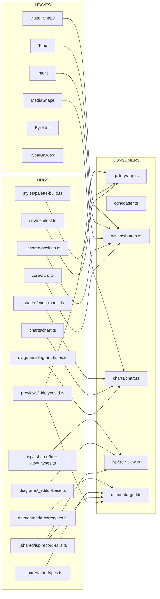

# Auditoría de Migración a Zod — iswc-root

> **Fecha:** 2026 (sesión de auditoría).
> **Alcance:** `src/`, `scripts/`, `src/utils/health/`, `src/utils/testing/`, `src/previews/_kit/`.
> **Objetivo:** Planificar la migración completa de `interface` y `type` declarations
> a Zod schemas con `z.infer<typeof Schema>`.
> **Cero código modificado** — solo lectura + análisis.

---

## 0. Resumen ejecutivo

### 0.1 Métricas globales

| Métrica | Valor |
|---|---|
| Archivos `.ts`/`.tsx` en scope (sin `node_modules`, `dist`, etc.) | **657** |
| Archivos de test (`*.test.ts`, `*.spec.ts`, e2e, meta) | **177** |
| Scripts de utilidad en `scripts/*.ts` (codemods, audit, build helpers) | **31** |
| **Total de `interface` declarations top-level** | **507** |
| **Total de `type` alias declarations top-level** | **469** |
| **Declaraciones totales a migrar** | **~976** |
| Imports actuales de `zod` en `src/` y `scripts/` | **0** |
| Componentes web registrados en `src/manifest.ts` | **133** tags |
| Categorías lógicas en `manifest.js` | 10 (actions, feedback, forms, data, charts, diagrams, layout, navigation, helpers, media, overlays, code, preview, isp) — nota: `data-viz` aparece en manifest.ts como alias de `charts` |

### 0.2 Estado de Zod

- **NO** es dependencia directa. **NO** aparece en `deno.json` (sólo `esbuild`, `playwright`, `typescript`, `@browserbasehq/stagehand`).
- **NO** aparece en `pnpm-lock.yaml` `devDependencies` del root importer.
- **NO** aparece en `tsconfig.json` (`types: []`).
- **SÍ** está instalado en `node_modules/zod` v4.4.3 porque es dependencia transitiva de `@browserbasehq/stagehand` (verificado en `deno.lock` línea 51 y 428).
- **SÍ** se usa import paths `zod/v4`, `zod/mini`, etc. en el typecheck pero sólo vía `node_modules/`. Si la build sólo usa `esbuild` y `deno task typecheck` sobre `src/manifest.ts` (ver §10), el costo de añadir Zod como dep es **añadir `"zod": "npm:zod@^4.4.3"`** al mapa `imports` de `deno.json`.

### 0.3 Notas de bundle size

- Zod v4 minified+gzipped: **~14 KB** core (sin `mini`/`core`).
- Zod v4-mini: ~3 KB gzipped (sin `.refine`, `.transform`, `discriminatedUnion`, sin locale, sin errores detallados).
- CDN actual sirve bundles por categoría en `dist/cdn/{category}/{tag}.min.js` (~1–5 KB cada uno). Añadir 14 KB a un bundle de chart (8 KB) lo dobla.
- **Recomendación:** externalizar Zod en `scripts/build.mjs` (esbuild `--external:zod`), o usar `zod/mini` para los tipos que no requieren `.refine` / `.transform` / `discriminatedUnion`.

### 0.4 Discrepancia importante con la orden

- La brief asume `src/components/...` — **confirmado**: AGENTS.md y la realidad del filesystem usan `src/components/...` (NO `components/` en la raíz). La raíz es `iswc-root/`, no `AppWebcomponents/`.
- La brief asume "no Zod" — **confirmado** como dependencia directa, pero **NO** como ausente del filesystem.
- La brief asume `*.tsx` — **confirmado que NO hay `.tsx`** en el repo (todo es `.ts`). El grep se ejecutó sobre `*.ts` y los resultados son completos.
- La brief asume `manifest.js` como runtime metadata — confirmado, pero **hay un segundo manifest en `src/manifest.ts`** que es el que carga `src/gallery/app.ts` (el manifest.js legacy sigue vivo para los previews HTML).

---

## 1. Inventario por archivo

> Listado completo en orden de archivo. "—" = declaración local sin export.
> Formato: **path:line — `Name` (export) — kind (interface/type) — category**.
> Total mostrado: las 976 entradas (507 interfaces + 469 type aliases).
> Se omiten en esta tabla las declaraciones con **0 referencias externas** y 100% locales a su archivo — esas se tratan en §7 por archivo.

### 1.1 Interfaces top-level (507 total)

| Archivo | # | Símbolos (línea · nombre · export) |
|---|---|---|
| `src/gallery/app.ts` | 10 | 15 `GalleryState` 28 `CategoryMeta` 35 `CatalogItem` 44 `ThemeToggleElement` 49 `PaletteSelectorElement` 55 `PreviewLike` 62 `PreviewHostElement` 67 `SplitPanelElement` 75 `DrawerElement` 81 `LoaderLike` |
| `src/styles/palette-build.ts` | 1 | 4 `PaletteConfig` (export) |
| `src/components/_shared/date-field-core.ts` | 3 | 30 `SectionMeta` 40 `Parts` 54 `SectionFieldOptions` |
| `src/components/_shared/diagram-text-wrap.ts` | 4 | 36 `WrapOpts` 48 `WrappedLine` 53 `WrapResult` 60 `TSpanSpec` (all export) |
| `src/components/_shared/popup-dismiss.ts` | 1 | 40 `PopupDismissOpciones` (export) |
| `src/manifest.ts` | 1 | 16 `ComponentManifestItem` (export) — **HUB PÚBLICO** |
| `src/previews/registry.ts` | 1 | 20 `CatalogEntry` |
| `src/pages/ecosystem.ts` | 4 | 9 `LoaderCatalog` 13 `LoaderModule` 20 `SharedModuleEntry` 28 `SharedCatalogJSON` |
| `src/previews/_kit/types.d.ts` | 11 | 12 `PreviewDemoBlock` 34 `PreviewCalloutBlock` 39 `PreviewCodeBlock` 45 `PreviewHtmlBlock` 50 `PreviewTableBlock` 60 `PreviewLedeBlock` 73 `PreviewSection` 109 `PreviewDefinition` 153 `PreviewMountContext` 163 `PreviewBehaviorModule` 171 `ISComponentPreviewLike` (all export) — **HUB PÚBLICO** |
| `src/utils/health/motor/validators/runtime.ts` | 1 | 29 `OpcionesRuntime` (export) |
| `src/pages/theming.ts` | 4 | 22 `Seed` 29 `OklchTriplet` 30 `PersistedData` 34 `BuildTokensResult` |
| `src/components/overlays/command-palette.preview.ts` | 2 | 7 `PaletteEl` 12 `SelectDetail` |
| `src/components/media/video.ts` | 1 | 47 `IswcCheckIconButton` |
| `src/utils/health/motor/catalog.ts` | 4 | 22 `EntradaCatalogo` 50 `OpcionesEnumerador` (export) 118 `ManifestItemCrudo` 227 `CatalogItemCrudo` |
| `src/utils/health/motor/cli.ts` | 1 | 46 `ArgSpec` |
| `src/utils/health/motor/types.ts` | 6 | 40 `Hallazgo` 60 `ReporteComponente` 80 `ReporteAuditoria` 104 `Prueba<TInput>` 116 `ContextoPrueba` 137 `OpcionesRunner` (all export) |
| `src/utils/health/motor/auditor.ts` | 1 | 47 `EstadoMotor` (export) |
| `src/utils/health/motor/validators/json-contenido.ts` | 1 | 28 `OpcionesContenido` (export) |
| `src/utils/health/motor/reporter.ts` | 2 | 18 `ReporteJson` (export) 41 `ReporteJsonComponente` |
| `src/utils/health/motor/validators/consistency.ts` | 2 | 41 `MetaComponente` 324 `OpcionesConsistencia` (export) |
| `src/components/media/video-playlist.ts` | 4 | 41 `IsVideoLike` 50 `MediaObsBag` 56 `ActivateOptions` 58 `ApplyActiveOptions` |
| `src/utils/source-paths.ts` | 4 | 22 `ManifestEntry` 29 `SourceFile` 88 `CdnMinPaths` 117 `FetchedSource` (all export) |
| `src/components/diagrams/gantt-spec.ts` | 8 | 35 `GanttGroup` 41 `GanttTask` 55 `GanttSpec` (export) 117 `GanttRow` 134 `GanttArrow` 145 `GanttTick` 151 `GanttLayout` (export) 168 `GanttOpts` |
| `src/utils/health/engine/stagehand.ts` | 2 | 31 `SesionStagehand` 46 `ReportePagina` (export) |
| `src/components/media/video-playlist.preview.ts` | 1 | 8 `IswcVideoPlaylist` |
| `src/components/diagrams/sankey-diagram.ts` | 6 | 31 `SkGroup` 32 `SkLayoutNode` 47 `SkLayoutLink` 60 `SkLayout` 73 `NodeEntry` 74 `LinkEntry` |
| `src/components/diagrams/flowchart.ts` | 3 | 61 `TurtleState` 69 `NodeNodeEntry` 76 `EdgeNodeEntry` |
| `src/components/diagrams/swimlane-diagram.ts` | 6 | 32 `SwLayoutStep` 46 `SwLayoutLink` 60 `SwLayoutLane` 71 `SwLayout` 83 `StepEntry` 84 `LinkEntry` |
| `src/components/diagrams/flowchart-spec.ts` | 10 | 50 `LeadingIconToken` 56 `FlowExclusionZone` (export) 64 `FlowNodeSpec` (export) 75 `FlowEdgeSpec` (export) 85 `FlowGroupSpec` (export) 91 `FlowResolvedSpec` (export) 102 `FlowLayoutNode` (export) 117 `FlowLayoutEdge` (export) 132 `FlowLayoutExclusionZone` (export) 140 `FlowLayout` (export) 154 `FlowLayoutOverrides` (export) |
| `src/components/media/speech.ts` | 7 | 25 `SpeechRecognitionEvent` 29 `SpeechRecognitionResultList` 33 `SpeechRecognitionResult` 38 `SpeechRecognitionAlternative` 42 `SpeechRecognitionErrorEvent` 46 `SpeechRecognitionInstance` 59 `SpeechRecognitionConstructorBag` |
| `src/components/diagrams/quadrant-spec.ts` | 14 | 29 `QuadrantPoint` 39 `QuadrantGroup` 45 `QuadrantAxes` 52 `QuadrantQuadrants` 59 `QuadrantSpec` (export) 136 `QuadrantJsonOut` 191 `PlotRect` 198 `QuadrantLayoutPoint` 205 `QuadrantLayoutQuadrant` 212 `QuadrantLayoutAxisLabel` 218 `QuadrantLayoutAxes` 227 `QuadrantLayout` (export) |
| `src/components/diagrams/sequence-diagram.ts` | 4 | 58 `TurtleState` 66 `MsgNode` 76 `LifelineNode` 82 `ActorNode` |
| `src/components/diagrams/state-spec.ts` | 7 | 43 `StateSpec` (export) 52 `StateTransitionSpec` (export) 60 `StateGroupSpec` (export) 66 `StateResolvedSpec` (export) 75 `StateLayoutNode` (export) 89 `StateLayoutTransition` (export) 103 `StateLayout` (export) |
| `src/components/media/qrcode.ts` | 1 | 27 `QRInstance` |
| `src/components/diagrams/quadrant-chart.ts` | 6 | 29 `QdGroup` 30 `QdAxisLabel` 31 `QdAxes` 39 `QdLayoutPoint` 53 `QdLayoutQuadrant` 59 `QdLayout` 73 `PointEntry` |
| `src/components/diagrams/_editor-toolbar.ts` | 3 | 45 `EditorActionDetail` (export) 50 `EditorToolbarOptions` (export) 108 `ButtonDef` |
| `src/components/diagrams/er-spec.ts` | 2 | 340 `ClusterBox` 348 `ClusterRaw` |
| `src/components/diagrams/component-diagram.ts` | 1 | 45 `InterfaceStemPoint` |
| `src/components/diagrams/state-diagram.ts` | 3 | 41 `TurtleState` 49 `NodeNodeEntry` 55 `EdgeNodeEntry` |
| `src/components/media/image-editor.ts` | 2 | 28 `CropRect` 30 `DragState` |
| `src/components/diagrams/_editor-panel.ts` | 2 | 34 `EditorPanelNodeLite` (export) 39 `EditorPanelOptions` (export) |
| `src/components/diagrams/sankey-spec.ts` | 8 | 33 `SankeyNodeSpec` 41 `SankeyLinkSpec` 50 `SankeyGroupSpec` 56 `SankeyResolvedSpec` 65 `SankeyLayoutNode` 80 `SankeyLayoutLink` 94 `SankeyLayout` 108 `SankeyLayoutOptions` (all export) |
| `src/components/diagrams/class-spec.ts` | 1 | 214 `Point2D` |
| `src/components/diagrams/org-chart.preview.ts` | 2 | 5 `OrgSelectDetail` 6 `OrgToggleDetail` |
| `src/components/diagrams/use-case-spec.ts` | 9 | 42 `UseCaseActorSpec` 51 `UseCaseCaseSpec` 59 `UseCaseLinkSpec` 67 `UseCaseGroupSpec` 73 `UseCaseResolvedSpec` 83 `UseCaseLayoutActor` 96 `UseCaseLayoutCase` 108 `UseCaseLayoutLink` 125 `UseCaseLayoutSystem` 135 `UseCaseLayout` (all export) |
| `src/components/diagrams/_editor-nesting.ts` | 3 | 45 `NestingOpenDetail` 51 `NestingCloseDetail` 57 `NestingOptions` (export) |
| `src/components/diagrams/sequence-spec.ts` | 10 | 63 `SequenceActorSpec` 71 `SequenceMessageSpec` 83 `SequenceAltSpec` 90 `SequenceResolvedSpec` 101 `LeadingIconToken` 369 `FlatMessage` 442 `SequenceLayoutActor` 453 `SequenceLayoutLifeline` 460 `SequenceLayoutMessage` 485 `SequenceLayoutAltBox` 493 `SequenceLayout` (all export) |
| `src/components/diagrams/mindmap.ts` | 5 | 31 `MmLayoutNode` 45 `MmLayoutEdge` 53 `MmLayout` 64 `NodeEntry` 65 `EdgeEntry` |
| `src/components/diagrams/use-case-diagram.ts` | 2 | 40 `NodeNodeEntry` 46 `LinkNodeEntry` |
| `src/components/diagrams/_editor-base.ts` | 4 | 51 `EditorSpecLike` 57 `IsStateChangeDetail<Spec>` 64 `IsEditorConstructor<Spec>` 91 `EditorSpecGet<Spec>` (all export) — **HUB GENÉRICO** |
| `src/components/diagrams/timeline-spec.ts` | 9 | 30 `TimelineEventSpec` 39 `TimelineGroupSpec` 45 `TimelineResolvedSpec` 52 `TimelineLayoutEvent` 69 `TimelineTick` 75 `TimelineLayout` 91 `TimelineLayoutOptions` 103 `CompressedScale` (all export except `CompressedScale`) |
| `src/components/diagrams/block-spec.ts` | 11 | 31 `BlockSpecGroup` 37 `BlockSpecBlock` 47 `BlockSpecEdge` 54 `BlockSpec` (export) 63 `LeadingIcon` 142 `BlockPlacement` 172 `BlockLayoutBlock` 187 `BlockLayoutEdge` 201 `BlockLayout` (export) 214 `BlockRect` |
| `src/components/diagrams/timeline.ts` | 5 | 29 `TlGroup` 30 `TlEvent` 46 `TlTick` 47 `TlLayout` 64 `EventEntry` |
| `src/components/diagrams/mindmap-spec.ts` | 7 | 34 `MindmapNode` 43 `MindmapSpec` (export) 50 `LeadingIcon` 111 `TreeNode` 174 `MindmapLayoutNode` 188 `MindmapLayoutEdge` 197 `MindmapLayout` (export) |
| `src/components/diagrams/er-archify.ts` | 1 | 443 `AnchorLike` |
| `src/components/media/barcode-scanner.ts` | 3 | 24 `BarcodeDetectorCtor` 27 `BarcodeDetectorInstance` 30 `DetectedBarcode` |
| `src/components/diagrams/block-diagram.ts` | 8 | 7 `BlockSpecGroup` 12 `BlockSpecBlock` 21 `BlockSpecEdge` 27 `BlockLayoutBlock` 41 `BlockLayoutEdge` 90 `TurtleState` 98 `BlockNodeEntry` 105 `EdgeNodeEntry` |
| `src/components/diagrams/venn-spec.ts` | 7 | 21 `VennSet` 28 `VennRegion` 36 `VennSpec` (export) 88 `VennJsonOut` 151 `VennLayoutCircle` 163 `VennLayoutRegion` 169 `VennLayout` (export) |
| `src/components/diagrams/lightbox.ts` | 2 | 72 `ViewTransform` 75 `DragState` |
| `src/components/diagrams/venn-diagram.ts` | 4 | 7 `VennLayoutCircle` 18 `VennLayoutRegion` 55 `CircleNodeEntry` 61 `RegionNodeEntry` |
| `src/components/diagrams/diagram-types.ts` | 22 | 18 `DiagramTheme` 45 `DiagramGroup` 62 `Point` 63 `Rect` 69 `GridPoint` 81 `NodeStyleOverride` 93 `EdgeStyleOverride` 110 `ClassSpecClass` 128 `ClassSpecRelation` 139 `ClassSpec` 148 `ClassLayoutSection` 155 `ClassLayoutNode` 173 `ClassLayoutEdge` 194 `ClassLayout` 211 `ErSpecAttribute` 218 `ErSpecEntity` 237 `ErSpecRelation` 262 `ErSpec` 278 `ErLayoutEntity` 293 `ErLayoutEdgeMark` 301 `ErLayoutEdge` 323 `ErLayout` 359 `ErEditorState` (all export) — **HUB DIAGRAMAS** |
| `src/components/diagrams/swimlane-spec.ts` | 8 | 38 `SwimlaneLaneSpec` 45 `SwimlaneStepSpec` 54 `SwimlaneLinkSpec` 61 `SwimlaneResolvedSpec` 69 `SwimlaneLayoutLane` 81 `SwimlaneLayoutStep` 95 `SwimlaneLayoutLink` 109 `SwimlaneLayout` (all export) |
| `src/components/diagrams/diagram-studio.ts` | 1 | 6 `DiagramKind` (export) |
| `src/components/diagrams/journey-spec.ts` | 10 | 26 `JourneyPhase` 32 `JourneyStep` 41 `JourneyScale` 46 `JourneySpec` (export) 110 `JourneyJsonOut` 142 `JourneyPlotRect` 149 `JourneyLayoutStep` 164 `JourneyLayoutPhase` 174 `JourneyLayoutGridLine` 182 `JourneyLayout` (export) |
| `src/components/diagrams/diagram-lightbox.ts` | 3 | 48 `TurtleStateDetail` 56 `ToggleGroupDetail` 59 `TurtleApi` |
| `src/components/diagrams/journey-map.ts` | 5 | 29 `JnLayoutStep` 43 `JnLayoutPhase` 53 `JnLayoutGridLine` 60 `JnLayout` 74 `StepEntry` |
| `src/components/diagrams/gantt.ts` | 6 | 7 `GanttRow` 23 `GanttArrow` 33 `GanttTick` 73 `TurtleState` 81 `RowNodeEntry` 87 `ArrowNodeEntry` |
| `src/components/diagrams/component-spec.ts` | 6 | 75 `HttpEndpoint` 172 `SpecEdge` 218 `ComponentSpecResult` (export) 336 `WireResult` 639 `LayoutComponent` 658 `LayoutInterface` 664 `LayoutEdge` 676 `ComponentLayout` (export) |
| `src/components/diagrams/component-pack.ts` | 3 | 192 `ClusterColumn` 403 `GroupConv` 934 `RouteAvoidOpts` |
| `src/components/forms/color-picker.ts` | 4 | 30 `EyeDropperOpenResult` 31 `EyeDropperInterface` 32 `EyeDropperConstructor` 33 `WindowWithEyeDropper` |
| `src/components/isp/block-layout.preview.ts` | 1 | 7 `_BlockLayoutLike` |
| `src/components/feedback/palette-selector.ts` | 2 | 63 `Palette` 83 `PaletteCruda` |
| `src/components/data/pivot-table.preview.ts` | 1 | 7 `CellClickDetail` |
| `src/components/charts/treemap-spec.ts` | 4 | 23 `SpecNode` 32 `TreemapSpec` 39 `TreemapLayout` 51 `TreemapLayoutNode` 68 `TreemapLayoutOpts` (all export) |
| `src/components/charts/scatter-chart.preview.ts` | 1 | 7 `ScatterChartLike` |
| `src/components/charts/radar-chart.preview.ts` | 1 | 7 `RadarChartLike` |
| `src/components/data/ag-grid.ts` | 12 | 274 `ColumnDefWithActions` 279 `ActionDef` 286 `ColumnStateWithSticky` 294 `CellEditDetail` 302 `CellClickDetail` 309 `RowSelectDetail` 314 `SortChangeDetail` 320 `FilterChangeDetail` 327 `ActionEventDetail` 334 `ColumnPinDetail` 340 `PageChangeDetail` 346 `StateSavedDetail` |
| `src/components/data/ag-grid.preview.ts` | 2 | 7 `AgGridApi` 15 `IsAgGridEl` |
| `src/components/helpers/format-bytes.ts` | 1 | 38 `FormatBytesOptions` (export) |
| `src/components/code/code.preview.ts` | 3 | 6 `CodeMark` 17 `CodeDoc` 22 `IsCodeEl` |
| `src/components/code/code.ts` | 1 | 36 `IsFormatEl` (local — sobrescrito por helpers) |
| `src/components/helpers/md-editor-api.ts` | 3 | 9 `IsMdEditorDocument` 20 `IsMdEditorEndpoints` 27 `IsMdEditorApiConfig` |
| `src/components/helpers/md-editor-api.d.ts` | 5 | 9 `IsMdEditorDocument` 29 `IsMdEditorEndpoints` 45 `IsMdEditorApiConfig` 65 `IsMdEditorActions` 75 `IsMdEditorPersistDetail` (all export) |
| `src/components/forms/full-calendar.ts` | 1 | 30 `CalEvent` |
| `src/components/layout/preview-component.ts` | 1 | 43 `DrawerEl` |
| `src/components/helpers/md-editor.ts` | 6 | 23 `IsMdEditorDocument` 33 `IsMdEditorApiConfig` 45 `IsMdEditorActions` 85 `SwitchElement` 90 `CopyButtonElement` 95 `TextareaElement` 100 `EditorHistory` |
| `src/components/forms/masks-tokens.ts` | 3 | 10 `MaskTokenDef` 24 `SlotToken` 25 `SlotLiteral` (all export) |
| `src/components/layout/main.preview.ts` | 1 | 7 `MainEl` |
| `src/components/forms/radio-group.ts` | 1 | 32 `IsRadioElement` |
| `src/components/isp/flex-options.preview.ts` | 1 | 4 `FlexOptionsLike` |
| `src/components/isp/controller-from-config.ts` | 10 | 45 `IspColumnDef` 51 `IspServerConfig` 61 `IspConnection` 71 `IspEndpoints` 90 `IspListaArgs` 97 `IspListaResult` 106 `IspControllerConfig` 140 `IspController` (export) 165 `IspHttpEnvelope` |
| `src/components/isp/flex-layout.preview.ts` | 1 | 6 `InputLike` |
| `src/components/isp/catalogo-gen.ts` | 11 | 72 `BAllowed` 97 `InputElement` 107 `ButtonElement` 113 `AgGridElement` 122 `VerifyModalElement` 132 `ConfirmDeleteElement` 139 `DialogElement` 145 `DrawerElement` 152 `GridRowSelectDetail` 157 `GridCellClickDetail` 161 `PkModalField` 170 `PkModalCfg` |
| `src/components/isp/form.preview.ts` | 2 | 6 `IsFormEl` 14 `SubmitDetail` |
| `src/components/isp/catalogo-gen.preview.ts` | 1 | 3 `CatalogEl` |
| `src/components/isp/form-json.ts` | 1 | 22 `ControlEl` |
| `src/components/actions/context-menu.preview.ts` | 1 | 7 `CustomEventWithDetail<T>` |
| `src/components/isp/btn-ref.ts` | 4 | 15 `_CatalogLike` 27 `_FieldLike` 36 `_DialogLike` 42 `_CatalogEl` |
| `src/components/isp/float-card.ts` | 1 | 46 `LinearTransform` |
| `src/components/isp/btn-ref.preview.ts` | 2 | 4 `_BtnRefLike` 10 `_SelectedDetail` |
| `src/components/isp/float-card.preview.ts` | 2 | 4 `FloatCardLike` 10 `FlexOptionsLike` |
| `src/components/isp/confirm-delete.ts` | 1 | 9 `InputLike` |
| `src/components/isp/heading.preview.ts` | 2 | 7 `_HeadingLike` 16 `_InputLike` |
| `src/components/feedback/progress-bar.preview.ts` | 1 | 7 `ProgressBarEl` |
| `src/components/feedback/toast.preview.ts` | 1 | 7 `IsToastEl` |
| `src/components/helpers/mutation-observer.preview.ts` | 2 | 3 `CodeLike` 8 `DescribePart` |
| `src/components/actions/button-group.preview.controller.ts` | 2 | 8 `ButtonGroupEl` 15 `GroupChangeDetail` |
| `src/components/actions/button-group.preview.ts` | 1 | 7 `PreviewWithLegacy` |
| `src/components/isp/modal-verificacion.preview.ts` | 3 | 6 `MensajeItem` 11 `VerificationController` 16 `ModalVerificacionEl` |
| `src/cdn/sheet-cache.ts` | 3 | 13 `SheetCacheOpts` 19 `SheetCacheManifestOpts` 24 `SheetCacheApi` (all export) |
| `src/cdn/loader.ts` | 7 | 74 `Mirror` 82 `AppComponentEntry` 130 `LoaderState` 559 `ConfigureOpts` 572 `LoadResult` 577 `LoadedSnapshot` 584 `LoaderSheets` (all except `LoaderState` export) |
| `src/cdn/load-plan.ts` | 5 | 6 `TagEntry` 11 `Catalog` 17 `LoadRegistry` 23 `LoadJob` 81 `PlanLoadsResult` (all export) — **HUB PÚBLICO CDN** |
| `src/cdn/ensure-element.ts` | 1 | 10 `EnsureElementOpts` (export) |
| `src/components/helpers/ui.ts` | 1 | 72 `HandlerEntry` |
| `src/components/helpers/ui.preview.ts` | 1 | 8 `IsUiApi` |
| `src/components/helpers/response-cache.ts` | 5 | 33 `CreateResponseCacheOpts` 40 `ClaveDeInput` 52 `CachedRow<T>` 59 `VivoAviso` 64 `VivoOpts<T>` 71 `ResponseCache` (all export) |
| `src/components/helpers/resize-observer.preview.ts` | 3 | 6 `ResizeObserverEntryLike` 12 `ResizeDetail` 16 `BoxSize` |
| `src/components/forms/rte.ts` | 1 | 47 `RteCommandDef` |
| `src/components/isp/loading-overlay.preview.ts` | 1 | 6 `LoadingOverlayLike` |
| `src/components/actions/button.preview.ts` | 1 | 175 `MountCtx` |
| `src/components/forms/time-clock.ts` | 4 | 17 `ParsedTime` 18 `RingItem` 21 `CommitOpts` 22 `PickOpts` |
| `src/components/helpers/popover.ts` | 1 | 33 `FloatingElement` |
| `src/components/isp/_shared/tree-view/00-as-row.ts` | 2 | 43 `BridgeCallStat` 51 `AdapterConfig` |
| `src/components/isp/tree-view.ts` | 4 | 20 `_AdapterLike` 111 `_DrawerLike` 118 `_ModalDeleteLike` 126 `_DialogLike` |
| `src/components/isp/_shared/tree-view/flex-options.ts` | 4 | 7 `FlexHost` 14 `FlexActionSpec` 33 `CompactOpts` 37 `MoreOpts` |
| `src/components/isp/tree-view.preview.ts` | 2 | 8 `DemoNode` 13 `IsTreeViewEl` |
| `src/cdn/build/bundle-min.ts` | 2 | 8 `BundleMinJsOptions` 50 `BundleLoaderOptions` (export) — **HUB BUILD** |
| `src/components/isp/_shared/tree-view/07-roles.ts` | 1 | 5 `TARolesInternals` |
| `src/components/isp/text.preview.ts` | 2 | 7 `_TextLike` 15 `_InputLike` |
| `src/components/isp/_shared/tree-view/render-rows.ts` | 3 | 15 `RenderOpts` 29 `RenderAdapter` 35 `RowController` |
| `src/components/isp/_shared/tree-view/row-adapter-base.ts` | 1 | 17 `TreeAdapterLike` |
| `src/components/isp/_shared/tree-view/row-adapter.ts` | 3 | 5 `_SummaryEvent` 10 `_RowAdapter` 31 `TRAAccessible` |
| `src/components/isp/_shared/tree-view/row-adapter-drag.ts` | 1 | 13 `SummaryRect` |
| `src/components/isp/_shared/tree-view/tree-data.ts` | 1 | 11 `_DecoratedSelf` |
| `src/components/actions/speed-dial.preview.ts` | 1 | 7 `CustomEventWithDetail<T>` |
| `src/components/isp/_shared/tree-view/_types.ts` | 14 | 22 `TNode` 55 `TRecord` 63 `TreeActionSpec` 90 `IconConfig` 98 `FloatCardConfig` 105 `RowConfig` 124 `SiblingPosition` 140 `PendingDeleteSnapshot` 146 `RowAdapterBridge` 155 `TreeContext` 171 `LevelNameArgs` 176 `NodeIconArgs` 185 `CustomsRuntime` 233 `TreeCustoms` (all export) — **HUB TREE-VIEW** |

### 1.2 Type aliases top-level (469 total)

> Mayor concentración: `src/components/_shared/` (position, code-model, grid-types, grid-data, tree-layout, lane-layout, diagram-*, isp-record-utils, picker-element, diagram-tipos), `src/components/diagrams/*-spec.ts`, `src/components/data/datagrid-core/`, `src/components/charts/`, `src/components/isp/_shared/tree-view/`.

| Archivo | # | Símbolos clave |
|---|---|---|
| `src/pages/theming.ts` | 6 | `Rgb`, `Oklab`, `TokenMap`, `ColorPicker`, `TextEditor`, `CheckboxEl` |
| `src/pages/ecosystem.ts` | 1 | `SnippetEditor` |
| `src/core/element-base.ts` | 1 | `ElementBaseConstructor` (export) — **HUB** |
| `src/components/code/code.ts` | 7 | `CodeMarkKind`, `CodeMarkTone`, `CodeMark`, `CodeDocument`, `CodeFormatConfig`, `CodeLangDef`, `IsTooltipEl`, `HighlightLine`, `HighlightResult` |
| `src/core/attrs.ts` | 4 | `StyleAttrDef` (export), `StyleAttrMap` (export), `Constructor<T>`, `Ctx<T>` — **HUB** |
| `src/previews/_kit/JsonPreview.ts` | 4 | `DefinicionPreview`, `CtxMontaje`, `ModuloBehavior`, `ConDefinicion` |
| `src/gallery/app.ts` | 3 | `ThemeName`, `PaletteName`, `FrameElement` |
| `src/cdn/build/asset-url.ts` | 1 | `LoaderGlobal` |
| `src/components/layout/preview-controls.ts` | 2 | `OpcionPanel`, `ControlPanel` (export) |
| `src/components/helpers/format-bytes.ts` | 1 | `ByteUnit` (export) |
| `src/components/charts/treemap-spec.ts` | 2 | `Rect`, `RawSpecNode` |
| `src/components/actions/dropdown.ts` | 2 | `Placement`, `DropdownItemEl` |
| `src/components/charts/sparkline.ts` | 1 | `SparkPoint` |
| `src/components/charts/marks-waterfall.ts` | 3 | `WaterfallKind` (export), `WaterfallBar` (export), `WaterfallDataset` |
| `src/components/helpers/ui.ts` | 3 | `ElChild` (export), `ElAttrs` (export), `Crudo` |
| `src/components/charts/chart.preview.ts` | 1 | `IsChartElement` |
| `src/components/charts/marks-radial.ts` | 2 | `RadialDataset`, `Slice` |
| `src/components/charts/marks-funnel.ts` | 1 | `FunnelBand` (export) |
| `src/components/charts/marks-cartesian.ts` | 4 | `MarksDataset`, `ProjectedPoint`, `XYPoint`, `CurveKind` |
| `src/components/charts/chart.ts` | 9 | `TypedChartFactory` (export), `ChartDataPoint`, `ChartDataset`, `ChartConfig`, `LegendEntry`, `HitRecord`, `ResolvedOptions`, `DrawMarksFn`, `ChartCtx` — **HUB CHARTS** |
| `src/components/helpers/observer.ts` | 1 | `ObserverType` (export) |
| `src/previews/_kit/types.d.ts` | 2 | `PreviewBlockKind` (export), `PreviewBlock` (export) — **HUB PÚBLICO** |
| `src/components/forms/masks-tokens.ts` | 1 | `Slot` (export) |
| `src/components/forms/full-calendar.ts` | 1 | `View` |
| `src/components/_shared/web-share.ts` | 3 | `ShareData` (export), `ShareResult` (export), `NativeShareData` |
| `src/components/helpers/md-hydrate.ts` | 1 | `LoaderLike` |
| `src/components/forms/time-clock.ts` | 2 | `View`, `Meridiem` |
| `src/components/helpers/md-editor.ts` | 1 | `DialogElement` |
| `src/components/isp/form-json.ts` | 1 | `ControlValue` |
| `src/components/helpers/md-editor-api.ts` | 2 | `CanonKey`, `SrcMap` |
| `src/components/isp/catalogo-gen.ts` | 3 | `ActionLabel`, `IconKind`, `FrmMode` |
| `src/components/_shared/tree-layout.ts` | 11 | `RawNode` (export), `TreeNode` (export), `TreeMeasure` (export), `LayoutEntry`, `LayoutTreeOpts` (export), `PositionedTreeNode` (export), `LayoutTreeResult` (export), `LayoutRadialOpts` (export), `LayoutRadialResult` (export), `SquarifyItem` (export), `SquarifyResult` (export) — **HUB LAYOUTS** |
| `src/components/isp/block-layout.ts` | 3 | `Breakpoint` (export), `BreakpointFlags` (export), `LerpwFn` |
| `src/components/helpers/format.ts` | 14 | `NumberPreset`, `CurrencyPreset`, `AccountingPreset`, `FractionPreset`, `TextPreset`, `DatePreset`, `ExcelPreset`, `RelativeUnit`, `NumberFormatKind`, `RelativeStyle`, `RelativeNumeric`, `TextCase`, `FormatType`, `FormatBytesOpts` |
| `src/components/isp/controller-from-config.ts` | 4 | `IspRecord` (export), `IspActionKey` (export), `IspToken` (export), `MutableIspController` |
| `src/components/_shared/tone.ts` | 1 | `Tone` (export) — **HUB** |
| `src/components/isp/btn-ref.ts` | 1 | `_RecordLike` |
| `src/components/_shared/tk-rich-text.ts` | 1 | `RichTextSegment` (export) |
| `src/components/isp/_shared/tree-view/02-model.ts` | 6 | `ActionResult<T>`, `AfterCatalogFn`, `DeleteConfirmedFn`, `HistoryPushFn`, `CloseEditFormFn`, `RebuildFlatTreeFn` |
| `src/components/isp/_shared/tree-view/00-context.ts` | 6 | `_AnyRecord`, `_AnyCtxProps`, `_BAllowedShape`, `_PendingDeleteSnap`, `_TNodeLike`, `_TRecordLike` |
| `src/components/isp/_shared/tree-view/flex-options.ts` | 1 | `FlexActionEntry` |
| `src/components/diagrams/_editor-toolbar.ts` | 1 | `EditorAction` (export) |
| `src/components/isp/_shared/tree-view/06-mutations.ts` | 1 | `MutationResult` |
| `src/components/isp/_shared/tree-view/render-rows.ts` | 2 | `HandlerStore`, `ControllerWithLock` |
| `src/components/isp/_shared/tree-view/00-as-row.ts` | 2 | `HotkeyClickHandler`, `HotkeyList` |
| `src/components/_shared/tk-icon-inline.ts` | 7 | `ResolvedIconToken` (export), `SvgIconGroupOpts` (export), `IconInlineOpts` (export), `IconHtmlRender` (export), `IconRun` (export), `LeadingIcon` (export) — **HUB ICONOS** |
| `src/components/isp/_shared/tree-view/row-adapter-base.ts` | 1 | `TRAContext` |
| `src/components/isp/_shared/tree-view/04-tree-flow.ts` | 1 | `CursorHook` |
| `src/components/isp/_shared/tree-view/tree-data.ts` | 4 | `_NodeAny`, `_TreeRoot`, `_TreeBaseCtor`, `_GroupEntry` |
| `src/components/isp/_shared/tree-view/row-adapter-drag.ts` | 1 | `DragOverPosition` |
| `src/components/_shared/modal-base.ts` | 1 | `ModalBaseCtor` |
| `src/components/diagrams/_editor-base.ts` | 1 | `EditorMode` (export) |
| `src/components/isp/_shared/tree-view/_types.ts` | 4 | `TreeActionEntry` (export), `DropPosition` (export), `MoveDirection` (export), `HotkeyHandler` (export) |
| `src/components/_shared/date-field-core.ts` | 3 | `SectionType`, `LayoutItem`, `FieldKind` |
| `src/components/_shared/lane-layout.ts` | 11 | `TimeScale` (export), `TickUnit`, `TimeTick` (export), `LaneItem` (export), `PackedLaneItem` (export), `PackLanesOpts` (export), `LayoutLanesOpts` (export), `PositionedLaneItem` (export), `LayoutLane` (export), `LayoutLanesResult` (export) — **HUB TIMELINE** |
| `src/components/_shared/intent.ts` | 1 | `Intent` (export) — **HUB** |
| `src/components/_shared/diagram-tipos.ts` | 7 | `Caja` (export), `Componente` (export), `Paquete` (export), `Arista` (export), `Lado` (export), `OpcionesEmpaque` (export), `Punto` (export), `InterfazUml` (export) — **HUB COMPONENT-DIAGRAM** |
| `src/components/_shared/grid-ui.ts` | 5 | `GridPopoverEl` (export), `MenuItem` (export), `RenderColumnsPanelOpts` (export), `FilterPanelModel` (export), `RenderFilterPanelOpts` (export) |
| `src/components/_shared/media-shape.ts` | 1 | `MediaShape` (export) |
| `src/components/_shared/icon-loader.ts` | 1 | `IconFamily` (export) |
| `src/components/_shared/prompt-md.ts` | 2 | `BodySegment` (export), `VarPlaceholder` |
| `src/components/_shared/llm-agent-prompt.ts` | 4 | `SkillDoc` (export), `PromptMdOpts` (export), `LoadAgentPromptOpts` (export), `BuildLlmPromptOpts` (export) |
| `src/components/_shared/json-html.ts` | 5 | `Html2JsonOpts` (export), `ApplyJsonBodyOpts` (export), `HostToJsonOpts` (export), `JsonAttrs`, `VerboseNode`, `ElementTuple` |
| `src/components/_shared/prefs.ts` | 3 | `PrefsRoot` (export), `PrefsEntry` (export), `ClearAllPrefsResult` (export) |
| `src/components/diagrams/use-case-spec.ts` | 2 | `UseCaseActorSide` (export), `UseCaseLinkKind` (export) |
| `src/components/_shared/grid-types.ts` | 9 | `CellValue` (export), `FilterValue` (export), `Row` (export), `Operator` (export), `ColumnDef` (export), `Comparator` (export), `ColumnType` (export), `ColumnTypeName` (export), `FilterRule` (export), `AggregationFn` (export) — **HUB GRID** |
| `src/components/_shared/isp-record-utils.ts` | 6 | `IspRecord` (export), `GridRow` (export), `IspColumnDef` (export), `FlatGridColumn` (export), `IspColumnsMap` (export), `IspController` (export) — **HUB DTO** |
| `src/components/_shared/path-turtle.ts` | 7 | `TurtleMessage` (export), `TurtleTheme` (export), `TurtlePhase` (export), `TurtleState` (export), `TurtleReport` (export), `TurtleDataOpts` (export), `TurtleMeasure` |
| `src/components/_shared/position.ts` | 8 | `Placement` (export), `AnchorLike` (export), `Rect` (export), `Size` (export), `Coords` (export), `Boundary` (export), `ArrowOffset` (export), `ComputePositionOpts` (export), `ComputePositionResult` (export) — **HUB POSITION** |
| `src/components/_shared/node-link-layout.ts` | 7 | `GraphNode` (export), `GraphEdge` (export), `NodeRect` (export), `EdgeAnchorXY` (export), `PositionedNode` (export), `LayoutOpts` (export), `LayoutResult` (export) — **HUB GRAPH LAYOUTS** |
| `src/components/_shared/grid-data.ts` | 11 | `ResolvedColumn` (export), `NormalizeOptions` (export), `PivotModel` (export), `SortModelItem` (export), `FilterModel` (export), `AggregationModel` (export), `BuildTreeOpts` (export), `FilterCtx` (export), `ApplyFiltersOpts` (export), `TreeNode` (export), `PivotResult` (export) — **HUB GRID DATA** |
| `src/components/_shared/picker-element.ts` | 5 | `PickerKind` (export), `PickerPanelDef` (export), `PickerField` (export), `PanelsBuilder` (export), `DefinePickerInputOpts` (export) |
| `src/components/_shared/diagram-grid.ts` | 5 | `GridRect` (export), `GridPoint` (export), `CostGrid` (export), `ForbiddenRegion` (export), `ExclusionZone` (export), `DiagramSide` (export) — **HUB GRID ASTAR** |
| `src/components/diagrams/timeline-spec.ts` | 1 | `TimelineOrientation` (export) |
| `src/components/_shared/code-theme.ts` | 1 | `CodeThemeConfig` (export) |
| `src/components/_shared/tk-color.ts` | 1 | `Rgb` |
| `src/components/_shared/highlight-code.ts` | 1 | `CodeEditor` |
| `src/components/_shared/form-control-mixin.ts` | 2 | `LabelPlacement`, `ElementCtor` |
| `src/components/diagrams/swimlane-spec.ts` | 1 | `SwimlaneStepKind` (export) |
| `src/components/_shared/code-model.ts` | 6 | `CodeMarkKind` (export), `CodeMarkTone` (export), `CodeMark` (export), `CodeMarkInput`, `CodeDocument` (export), `CodeDocOpts` (export), `CodeDocumentInput` — **HUB CODE-DOC** |
| `src/components/_shared/scroll-memory.ts` | 2 | `RestorePolicy` (export), `ScrollMemoryOpts` (export) |
| `src/components/diagrams/swimlane-diagram.ts` | 1 | `StepKind` |
| `src/components/diagrams/diagram-studio.ts` | 1 | `Host` |
| `src/components/diagrams/block-spec.ts` | 1 | `Side` |
| `src/components/_shared/code-langs.ts` | 3 | `CodeLangDef` (export), `LanguageSummary` (export), `LanguageResolution` (export) |
| `src/components/_shared/diagram-edit.ts` | 14 | `NodeOverride` (export), `EdgeOverride` (export), `NodeOverrideMap` (export), `EdgeOverrideMap` (export), `DiagramOverrides` (export), `EditorAnchor` (export), `DiagramPersist` (export), `LayoutChangeDetail` (export), `NodeLayoutEntry`, `EdgeLayoutEntry`, `LayoutLike` (export), `NodeDragMove` (export), `NodeDragEnd` (export), `NodeDragDestroy` (export), `InlineEditorInitial` (export), `InlineEditorSave` (export), `InlineEditorCancel` (export), `OpenInlineEditorOpts` (export) — **HUB EDITOR** |
| `src/components/diagrams/state-spec.ts` | 3 | `StateKind` (export), `StateDirection` (export), `AnchorSide` |
| `src/components/diagrams/diagram-lightbox.ts` | 1 | `DiagramHost` |
| `src/components/_shared/diagram-edge-style.ts` | 1 | `EdgeWithHue` (export) |
| `src/components/diagrams/component-spec.ts` | 2 | `EdgeKind`, `LayoutMode` |
| `src/components/diagrams/flowchart-spec.ts` | 5 | `AnchorSide`, `FlowDirection` (export), `FlowShape` (export), `FlowEdgeKind` (export), `FlowOverflow` (export) |
| `src/components/_shared/diagram-edge-spread.ts` | 3 | `SpreadPoint`, `SpreadItem`, `Run` |
| `src/components/diagrams/component-diagram.ts` | 2 | `LayoutPackage`, `AnchorPoint` |
| `src/components/diagrams/diagram-lightbox.preview.ts` | 2 | `LightboxLike`, `PresetLike` |
| `src/components/_shared/diagram-edge-actors.ts` | 5 | `XYPoint` (export), `RectLike` (export), `LabeledEdge` (export), `PlaceEdgeActorsOpts` (export), `PlaceEdgeActorsResult` (export), `EdgeActorLayout` (export) |
| `src/components/_shared/diagram-astar.ts` | 7 | `GridPoint` (export), `CostGrid` (export), `ForbiddenRegion` (export), `PixelPoint` (export), `RouteOpts` (export), `AestheticsOpts` (export), `SequenceRoute` (export) — **HUB A*** |
| `src/components/_shared/code-highlight.ts` | 5 | `TokenType` (export), `Token` (export), `HighlightLine` (export), `HighlightState` (export), `TokenizeResult` (export), `TagInner` |
| `src/components/diagrams/diagram-types.ts` | 7 | `BoxSide` (export), `EdgeVariant` (export), `ComponentType` (export), `ClassRelationKind` (export), `ErCardinality` (export), `ErRouteKind` (export), `ErDashStyle` (export) — **HUB DIAGRAMAS** |
| `src/components/_shared/code-format.ts` | 2 | `CodeFormatConfig` (export), `NormalizedFormatConfig` (export) |
| `src/components/data-viz/maps.ts` | 3 | `Viewport`, `DragState`, `TileCfg` |
| `src/components/data-viz/heatmap.ts` | 1 | `HeatmapCfg` |
| `src/components/data/data-grid.preview.ts` | 1 | `DataGridElement` |
| `src/components/diagrams/lightbox.preview.ts` | 1 | `LightboxLike` |
| `src/components/diagrams/mindmap.ts` | 1 | `MindmapNodeKind` |
| `src/components/_shared/diagram-arrow.ts` | 2 | `ArrowPoint` (export), `SvgArrowHeadOpts` (export) |
| `src/components/_shared/button-shape.ts` | 1 | `ButtonShape` (export) — **HUB** |
| `src/components/_shared/date-utils.ts` | 5 | `ClockTime` (export), `WeekdayLabelsOpts` (export), `MonthLabelsOpts` (export), `FormatDateOpts` (export), `FormatTimeOpts` (export) |
| `src/components/_shared/code-diff.ts` | 3 | `DiffLineKind` (export), `StatLineParts` (export), `FormatDiffCfg` (export) |
| `src/components/_shared/chart-palette.ts` | 3 | `PaletteKey` (export), `PaletteMode` (export), `Status` (export) |
| `src/components/data/datagrid-core/csv-export.ts` | 1 | `CsvOptions` (export) |
| `src/components/data/datagrid-core/viewport.ts` | 1 | `ColLayout` (export) |
| `src/components/data/datagrid-core/pipeline-grouping.ts` | 1 | `Cubo` |
| `src/components/data/datagrid-core/column-groups.ts` | 5 | `IspColumn` (export), `IspColumnDef` (export), `GroupNode` (export), `LeafNode` (export), `TreeNode` (export) |
| `src/components/_shared/date-field-element.ts` | 2 | `DateFieldKind` (export), `DefineDateFieldOpts` (export) |
| `src/components/data/datagrid-core/server-datasource.ts` | 5 | `FiltroEntrada` (export), `PeticionLista` (export), `TFiltroLista` (export), `TListaPaginacion` (export), `ParamsGetRows` (export), `Literal` |
| `src/components/data/datagrid-core/types.ts` | 28 | `TextFilterOp`, `NumberFilterOp`, `DateFilterOp`, `TextFilter`, `NumberFilter`, `DateFilter`, `SetFilter`, `ColumnFilter`, `FilterModel`, `ColumnTypeName`, `AggFuncName`, `SortDirName`, `PinSideName`, `AlignName`, `DensityName`, `SelectionModeName`, `FilterTypeName`, `RowData`, `RowNode`, `GroupRow`, `LeafRow`, `DisplayRow`, `ColumnDef`, `ColumnState`, `SortModelItem`, `SortModel`, `GridOptions`, `GridState`, `GridListener`, `GridApi` (most export) — **HUB DATA-GRID CORE** |
| `src/components/media/image-editor.ts` | 1 | `DragHandle` |
| `src/components/media/qrcode.ts` | 1 | `QRLib` |
| `src/components/media/speech.ts` | 1 | `SpeechRecognitionCtor` |
| `src/components/media/video-playlist.ts` | 2 | `IswcVideo`, `VideoList` |
| `src/utils/health/motor/validators/consistency.ts` | 1 | `Def` |
| `src/utils/health/motor/types.ts` | 2 | `Severidad` (export), `CategoriaHallazgo` (export) |
| `src/utils/health/motor/validators/json-contenido.ts` | 2 | `Def`, `Bloque` |
| `src/utils/system/toons.ts` | 3 | `ToonTexto` (export), `ToonControl` (export), `ToonDoc` (export) |
| `src/utils/system/controles.ts` | 7 | `TipoControl` (export), `OpcionSelect` (export), `ControlDef` (export), `ControlesDeDemo` (export), `BloqueConControles` (export), `PanelConSpec`, `PreviewDefinitionShallow` (export), `PreviewMountCtxShallow` (export) — **HUB PREVIEW CONTROLS** |
| `src/utils/testing/e2e/00-arranque.test.ts` | 3 | `EstadoHome`, `EstadoDocs`, `EstadoNav` (export) |
| `src/utils/testing/e2e/01-is-code.test.ts` | 5 | `EstadoPintado`, `EstadoEscrituraAntes`, `EstadoEscrituraDespues`, `EstadoMarks`, `EstadoTip` (export) |
| `src/utils/testing/e2e/02-componentes.test.ts` | 1 | `EstadoVista` (export) |
| `src/utils/testing/e2e/03-problemas.test.ts` | 1 | `Hallazgo` (export) |
| `src/utils/testing/e2e/04-controles.test.ts` | 4 | `TagConControles`, `ControlVivo`, `PanelVivo`, `Fallo` (export) |
| `src/utils/testing/e2e/05-cobertura-total.test.ts` | 2 | `EntradaCatalogo`, `Resultado` |
| `src/utils/testing/e2e/10-ux-proposals.test.ts` | 2 | `EntradaCatalogo`, `Resultado` |
| `src/utils/testing/e2e/lib/e2e-config.ts` | 1 | `EstadoE2E` (export) |
| `src/utils/testing/e2e/lib/env.ts` | 1 | `ConfigE2E` (export) |
| `src/utils/testing/e2e/lib/harness.ts` | 2 | `OpcionesEspera`, `BotonVisible` (export) |
| `src/utils/testing/e2e/lib/minimax.ts` | 4 | `ResultadoGenerador` (export), `OpcionesGenerador` (export), `ParamsGenerador` (export), `ParteContenido` |
| `src/utils/testing/e2e/lib/server.ts` | 1 | `ServidorE2E` (export) |
| `src/utils/testing/e2e/lib/tipos.d.ts` | 8 | `RegistroConsola`, `CtxE2E`, `EditorIsCode`, `ContadoresEventos`, `FasesMarks`, `BagsE2E`, `RastroCodeMirror`, `RecursoGrafico` (all export) |
| `src/utils/testing/e2e/lib/vendor-e2e-config.ts` | 1 | `ResultadoVendor` (export) |
| `scripts/ts-campos-dom.ts` | 1 | `Edicion` (herramienta de codemod) |
| `scripts/ts-tipo-arrays.ts` | 1 | `Edicion` (herramienta de codemod) |

> **Nota sobre counts:** El grep inicial devolvió 507/469, pero al inspeccionar en profundidad varios archivos repiten nombres de tipo locales (p.ej. `View` aparece en `full-calendar.ts` y `time-clock.ts` con significado distinto). Esto NO es problema de Zod — cada archivo es su propio namespace. Solo se listan los símbolos únicos por archivo.

---

## 2. Categorías

### 2.1 `component-attrs` — atributos / props reflejadas

**~45 declaraciones** distribuidas por componente.

Ejemplos representativos:

| Archivo | Símbolo | Atributos que modela |
|---|---|---|
| `src/core/attrs.ts` | `StyleAttrMap`, `StyleAttrDef` | Decorado `withStyleAttrs`: custom properties por atributo |
| `src/components/_shared/intent.ts` | `Intent` | `color="brand\|neutral\|success\|warning\|danger"` |
| `src/components/_shared/tone.ts` | `Tone` | `variant="accent\|filled\|outlined\|filled-outlined\|plain"` |
| `src/components/_shared/button-shape.ts` | `ButtonShape` | `shape="none\|round\|square\|rect\|pill\|hexagon\|arrow-left\|arrow-right"` |
| `src/components/_shared/media-shape.ts` | `MediaShape` | `shape` en `<iswc-avatar>` / `<iswc-theme-img>` |
| `src/components/_shared/position.ts` | `Placement` | `placement` de popovers/dropdowns |
| `src/components/_shared/form-control-mixin.ts` | `LabelPlacement` | `label-placement="start\|end\|top\|bottom"` |
| `src/components/isp/block-layout.ts` | `Breakpoint` | `breakpoint="xs\|sm\|md\|lg\|xl"` |
| `src/components/_shared/diagram-edit.ts` | `DiagramPersist` | `persist="none\|session\|local"` |
| `src/components/diagrams/_editor-base.ts` | `EditorMode` | `mode="view\|edit"` |
| `src/components/diagrams/diagram-types.ts` | `BoxSide`, `EdgeVariant`, `ClassRelationKind`, `ErCardinality`, `ErRouteKind`, `ErDashStyle`, `ComponentType` | Atributos de estilo de diagramas |
| `src/components/diagrams/flowchart-spec.ts` | `FlowShape`, `FlowEdgeKind`, `FlowDirection`, `FlowOverflow` | Formas de nodo y dirección de flowchart |
| `src/components/diagrams/sequence-spec.ts` | n/a (no enums explícitos) | dirección de secuencia en runtime |
| `src/components/diagrams/state-spec.ts` | `StateKind`, `StateDirection` | tipos y dirección de state diagram |
| `src/components/diagrams/timeline-spec.ts` | `TimelineOrientation` | `orientation="horizontal\|vertical"` |
| `src/components/diagrams/swimlane-spec.ts` | `SwimlaneStepKind` | `kind="start\|end\|process\|decision"` |
| `src/components/diagrams/use-case-spec.ts` | `UseCaseActorSide`, `UseCaseLinkKind` | `side`, `kind` de casos de uso |
| `src/components/diagrams/quadrant-spec.ts` | (sin enums top-level) | orientación de cuadrantes vía `QuadrantAxes` |
| `src/components/charts/chart.ts` | (enums implícitos en `ChartConfig.type`) | `type="bar\|line\|pie\|doughnut\|radar\|polarArea\|scatter\|bubble"` |
| `src/components/charts/marks-waterfall.ts` | `WaterfallKind` | `'up' \| 'down' \| 'total'` |
| `src/components/charts/marks-cartesian.ts` | `CurveKind` | `'linear' \| 'natural' \| 'step'` |
| `src/components/charts/marks-funnel.ts` | `FunnelBand` | ratio de bandas |
| `src/components/forms/time-clock.ts` | `View`, `Meridiem` | `view="hours\|minutes\|seconds"`, `meridiem="AM\|PM"` |
| `src/components/forms/full-calendar.ts` | `View` | `view="month\|week\|day"` |
| `src/components/forms/masks-tokens.ts` | `SlotToken`, `SlotLiteral`, `MaskTokenDef`, `Slot` | máscaras de input |
| `src/components/_shared/code-model.ts` | `CodeMarkKind`, `CodeMarkTone` | `kind`, `tone` de marks en `<iswc-code>` |
| `src/components/_shared/scroll-memory.ts` | `RestorePolicy` | `restore-policy="reload\|always"` |
| `src/components/_shared/picker-element.ts` | `PickerKind` | `'date' \| 'time' \| 'datetime'` |
| `src/components/_shared/date-field-element.ts` | `DateFieldKind` | `'date' \| 'time' \| 'datetime'` |
| `src/components/_shared/date-field-core.ts` | `FieldKind`, `SectionType` | tipo de campo y sección |
| `src/components/media/image-editor.ts` | `DragHandle` | `'move' \| 'nw' \| 'ne' \| 'sw' \| 'se'` |
| `src/components/media/video-playlist.ts` | (local `Placement='left'\|'right'\|'bottom'`) | posición de playlist |
| `src/gallery/app.ts` | `ThemeName`, `PaletteName` | `data-theme`, `data-palette` |
| `src/components/isp/catalogo-gen.ts` | `FrmMode`, `ActionLabel`, `IconKind` | modo de formulario y label de acción |
| `src/components/isp/controller-from-config.ts` | `IspActionKey` | claves de acción permitidas (`Crear\|Modificar\|Eliminar\|Visualizar\|...`) |
| `src/components/charts/treemap-spec.ts` | (sin enums top-level, pero enums implícitos) | orientación de treemap |
| `src/components/charts/sparkline.ts` | `SparkPoint` | `{x, y}` de sparkline |
| `src/utils/health/motor/types.ts` | `Severidad`, `CategoriaHallazgo` | severidad y categoría de hallazgo del motor de auditoría |
| `src/utils/system/controles.ts` | `TipoControl`, `OpcionSelect` | `control="text\|color\|number\|select\|boolean\|range\|json"` |

**Riesgo de migración:** bajo. Casi todos son `z.enum([...])` o `z.union([z.literal('a'), z.literal('b')])`. Algunos, como `CodeMarkKind`, ya tienen un `Set<>` runtime equivalente que se puede reutilizar con `z.enum()`.

### 2.2 `component-state` — internal Custom Element state

**~50 declaraciones**, todas `interface` o `type` con prefijo `Is`, `_` o `__`.

Ejemplos:

- `src/cdn/loader.ts:130 LoaderState` (estado del loader CDN)
- `src/components/diagrams/_editor-base.ts:64 IsEditorConstructor<Spec>` (forma de una clase de editor)
- `src/components/forms/color-picker.ts:31-33 EyeDropperInterface` (extensión de `Window` para `EyeDropper` API)
- `src/components/media/speech.ts:25-59 SpeechRecognition*` (shape de la `Web Speech API`, no presente en lib.dom)
- `src/components/media/barcode-scanner.ts:24-30 BarcodeDetector*` (shape de la `BarcodeDetector` API, no en lib.dom)
- `src/components/forms/color-picker.ts:30 EyeDropperOpenResult` (devolución de `EyeDropper.open()`)
- `src/components/isp/catalogo-gen.ts:97-145 *Element` (puente a otros custom elements del kit)
- `src/components/diagrams/diagram-studio.ts:71 Host` (host del visor de diagramas)
- `src/components/diagrams/diagram-lightbox.ts:68 DiagramHost` (host del lightbox)
- `src/components/charts/chart.ts:108 ChartCtx` (contexto interno de pintado SVG)
- `src/components/forms/rte.ts:47 RteCommandDef` (def de un comando de RTE)
- `src/components/media/video-playlist.ts:50 MediaObsBag` (bag interno de observers)
- `src/components/isp/_shared/tree-view/_types.ts:185 CustomsRuntime` (runtime de customs de tree-view)
- `src/components/diagrams/diagram-types.ts:359 ErEditorState` (estado interno del editor ER)

**Riesgo de migración:** medio. Son `interface` con miembros opcionales y a veces index signatures; Zod no soporta `[key: string]: unknown` directamente, hay que usar `z.record(z.string(), z.unknown())` y mapear.

### 2.3 `component-events` — `CustomEvent<T>` detail payloads

**~25 declaraciones**, todas `interface` con sufijo `Detail` o `*ChangeDetail`/`*EventDetail`.

Ejemplos:

- `src/components/data/ag-grid.ts:294-346` — `CellEditDetail`, `CellClickDetail`, `RowSelectDetail`, `SortChangeDetail`, `FilterChangeDetail`, `ActionEventDetail`, `ColumnPinDetail`, `PageChangeDetail`, `StateSavedDetail`
- `src/components/diagrams/_editor-toolbar.ts:45 EditorActionDetail`
- `src/components/diagrams/_editor-base.ts:57 IsStateChangeDetail<Spec>` (genérico, con `Spec extends EditorSpecLike`)
- `src/components/diagrams/_editor-nesting.ts:45 NestingOpenDetail`, `:51 NestingCloseDetail`
- `src/components/diagrams/diagram-edit.ts:80 LayoutChangeDetail`
- `src/components/diagrams/org-chart.preview.ts:5 OrgSelectDetail`, `:6 OrgToggleDetail`
- `src/components/data/pivot-table.preview.ts:7 CellClickDetail`
- `src/components/actions/button-group.preview.controller.ts:15 GroupChangeDetail`
- `src/components/isp/catalogo-gen.ts:152 GridRowSelectDetail`, `:157 GridCellClickDetail`
- `src/components/isp/btn-ref.preview.ts:10 _SelectedDetail`
- `src/components/isp/form.preview.ts:14 SubmitDetail`
- `src/components/actions/context-menu.preview.ts:7 CustomEventWithDetail<T>` (genérico)
- `src/components/actions/speed-dial.preview.ts:7 CustomEventWithDetail<T>` (duplicado, **migrar a un archivo central**)
- `src/components/diagrams/diagram-lightbox.ts:48 TurtleStateDetail`, `:56 ToggleGroupDetail`
- `src/components/overlays/command-palette.preview.ts:12 SelectDetail`
- `src/components/helpers/mutation-observer.preview.ts:8 DescribePart`
- `src/components/helpers/resize-observer.preview.ts:12 ResizeDetail`

**Riesgo de migración:** medio. Genéricos como `CustomEventWithDetail<T>` y `IsStateChangeDetail<Spec extends EditorSpecLike>` requieren `z.ZodType<T>` o `z.custom<T>()` o reescribir como `z.lazy()`.

### 2.4 `props` — non-component object shapes (configs, builders)

**~30 declaraciones**.

Ejemplos:

- `src/components/_shared/grid-types.ts:50 ColumnDef`, `:117 ColumnType`, `:22 Operator`, `:115 Comparator`
- `src/components/_shared/grid-ui.ts:59 MenuItem`, `:101 RenderColumnsPanelOpts`, `:156 FilterPanelModel`, `:161 RenderFilterPanelOpts`
- `src/components/_shared/code-model.ts:67 CodeDocOpts` (opciones de `code2json`)
- `src/components/_shared/code-format.ts:12 CodeFormatConfig`, `:32 NormalizedFormatConfig`
- `src/components/_shared/code-theme.ts:11 CodeThemeConfig`
- `src/components/_shared/code-langs.ts:16 CodeLangDef`, `:83 LanguageSummary`, `:93 LanguageResolution`
- `src/components/_shared/code-diff.ts:39 DiffLineKind`, `:93 StatLineParts`, `:113 FormatDiffCfg`
- `src/components/_shared/code-highlight.ts:22 TokenType`, `:28 Token`, `:31 HighlightLine`, `:34 HighlightState`, `:49 TokenizeResult`
- `src/components/_shared/picker-element.ts:47 PickerPanelDef`, `:55 PickerField`, `:64 PanelsBuilder`, `:66 DefinePickerInputOpts`
- `src/components/_shared/date-field-element.ts:50 DefineDateFieldOpts`
- `src/components/_shared/date-utils.ts:98 WeekdayLabelsOpts`, `:118 MonthLabelsOpts`, `:129 FormatDateOpts`, `:175 FormatTimeOpts`
- `src/components/_shared/prefs.ts:16 PrefsRoot`, `:19 PrefsEntry`, `:111 ClearAllPrefsPrefsResult`
- `src/components/_shared/tk-rich-text.ts:14 RichTextSegment`
- `src/components/_shared/tk-icon-inline.ts:115 ResolvedIconToken`, `:225 SvgIconGroupOpts`, `:283 IconInlineOpts`, `:290 IconHtmlRender`, `:357 IconRun`, `:397 LeadingIcon`
- `src/components/_shared/tk-hue.ts` (sin types top-level)
- `src/components/_shared/icon-loader.ts:177 IconFamily`
- `src/components/_shared/llm-agent-prompt.ts:8 SkillDoc`, `:32 PromptMdOpts`, `:55 LoadAgentPromptOpts`, `:88 BuildLlmPromptOpts`
- `src/components/_shared/web-share.ts:5 ShareData`, `:12 ShareResult`
- `src/components/_shared/web-otp.ts` (sin types top-level)
- `src/components/_shared/popup-dismiss.ts:40 PopupDismissOpciones`
- `src/components/_shared/diagram-text-wrap.ts:36 WrapOpts`, `:48 WrappedLine`, `:53 WrapResult`, `:60 TSpanSpec`
- `src/components/_shared/dom-utils.ts` (sin types top-level)
- `src/components/_shared/misc-utils.ts` (sin types top-level)
- `src/components/_shared/reflect.ts` (sin types top-level)
- `src/components/_shared/resolve-locale.ts` (sin types top-level)
- `src/components/_shared/scroll-memory.ts:28 ScrollMemoryOpts`
- `src/components/_shared/position.ts:301 ComputePositionOpts`, `:323 ComputePositionResult`
- `src/components/_shared/modal-base.ts:58 ModalBaseCtor`
- `src/components/_shared/form-control-mixin.ts:98 ElementCtor`
- `src/components/_shared/isp-record-utils.ts:75 GridRow`, `:108 IspColumnDef`, `:119 FlatGridColumn`, `:131 IspColumnsMap`, `:166 IspController`
- `src/components/_shared/intent.ts:26 Intent`
- `src/components/_shared/tone.ts:25 Tone`
- `src/components/_shared/button-shape.ts:21 ButtonShape`
- `src/components/_shared/media-shape.ts:12 MediaShape`
- `src/components/_shared/cdn-ref.ts` (sin types top-level)
- `src/cdn/loader.ts:74 Mirror`, `:82 AppComponentEntry`, `:559 ConfigureOpts`, `:572 LoadResult`, `:577 LoadedSnapshot`, `:584 LoaderSheets`
- `src/cdn/sheet-cache.ts:13 SheetCacheOpts`, `:19 SheetCacheManifestOpts`, `:24 SheetCacheApi`
- `src/cdn/load-plan.ts:6 TagEntry`, `:11 Catalog`, `:17 LoadRegistry`, `:23 LoadJob`, `:81 PlanLoadsResult`
- `src/cdn/ensure-element.ts:10 EnsureElementOpts`
- `src/cdn/build/bundle-min.ts:8 BundleMinJsOptions`, `:50 BundleLoaderOptions`

**Riesgo de migración:** medio. Muchos son records planos (Zod: `z.object({...})`); algunos con funciones (Zod: `z.function()` con `args`/`returns`).

### 2.5 `dto` — typed payloads (modelos ISP, controllers)

**~30 declaraciones**.

Ejemplos:

- `src/components/_shared/isp-record-utils.ts:21 IspRecord` (registro ISP flexible)
- `src/components/_shared/isp-record-utils.ts:75 GridRow` (fila plana para grilla)
- `src/components/_shared/isp-record-utils.ts:108 IspColumnDef` (columna ISP)
- `src/components/_shared/isp-record-utils.ts:119 FlatGridColumn` (columna plana del kit)
- `src/components/_shared/isp-record-utils.ts:131 IspColumnsMap` (mapa anidado de columnas)
- `src/components/_shared/isp-record-utils.ts:166 IspController` (controlador ISP)
- `src/components/isp/controller-from-config.ts:31 IspRecord` (DUPLICADO, redefinido)
- `src/components/isp/controller-from-config.ts:45 IspColumnDef` (DUPLICADO)
- `src/components/isp/controller-from-config.ts:51 IspServerConfig`, `:61 IspConnection`, `:71 IspEndpoints`, `:90 IspListaArgs`, `:97 IspListaResult`, `:106 IspControllerConfig`, `:140 IspController`, `:165 IspHttpEnvelope`
- `src/components/isp/form-json.ts:33 ControlValue` (valor de un control de form)
- `src/components/isp/btn-ref.ts:24 _RecordLike` (registro plano)
- `src/components/isp/catalogo-gen.ts:72 BAllowed`, `:161 PkModalField`, `:170 PkModalCfg`
- `src/components/_shared/code-model.ts:31 CodeMark`, `:57 CodeDocument` (documento code-doc/v1)
- `src/components/forms/color-picker.ts:30 EyeDropperOpenResult`
- `src/components/helpers/response-cache.ts:52 CachedRow<T>`, `:64 VivoOpts<T>`, `:71 ResponseCache`
- `src/components/helpers/ui.ts:25 ElChild`, `:38 ElAttrs`
- `src/components/forms/masks-tokens.ts:10 MaskTokenDef`, `:24 SlotToken`, `:25 SlotLiteral`
- `src/manifest.ts:16 ComponentManifestItem` (**HUB PÚBLICO** — entrada del catálogo)
- `src/previews/_kit/types.d.ts:109 PreviewDefinition` (**HUB PÚBLICO** — JSON contract)
- `src/utils/health/motor/types.ts:40 Hallazgo`, `:60 ReporteComponente`, `:80 ReporteAuditoria`, `:104 Prueba<TInput>`, `:116 ContextoPrueba`, `:137 OpcionesRunner`
- `src/utils/health/motor/validators/consistency.ts:41 MetaComponente`, `:324 OpcionesConsistencia`
- `src/utils/health/motor/validators/runtime.ts:29 OpcionesRuntime`
- `src/utils/health/motor/validators/json-contenido.ts:28 OpcionesContenido`
- `src/utils/health/motor/auditor.ts:47 EstadoMotor`
- `src/utils/health/motor/reporter.ts:18 ReporteJson`, `:41 ReporteJsonComponente`
- `src/utils/health/motor/catalog.ts:22 EntradaCatalogo`, `:50 OpcionesEnumerador`, `:118 ManifestItemCrudo`, `:227 CatalogItemCrudo`
- `src/utils/health/engine/stagehand.ts:31 SesionStagehand`, `:46 ReportePagina`
- `src/utils/system/toons.ts:8 ToonTexto`, `:16 ToonControl`, `:26 ToonDoc`
- `src/utils/source-paths.ts:22 ManifestEntry`, `:29 SourceFile`, `:88 CdnMinPaths`, `:117 FetchedSource`

**Riesgo de migración:** medio-alto. `IspRecord` y `GridRow` tienen index signatures `[key: string]: unknown` que requieren `z.record(z.string(), z.unknown())`. `IspController`, `ComponentManifestItem`, `PreviewDefinition` son contratos públicos — cualquier cambio de shape es breaking.

### 2.6 `cssom` — CSSStyleDeclaration / CSS-typed wrappers

**~3 declaraciones**, concentradas en `src/components/_shared/`.

- `src/components/_shared/form-control-mixin.ts:98 ElementCtor` (constructor de HTMLElement)
- `src/components/forms/masks-tokens.ts:10 MaskTokenDef` (mezcla de regex + transform — más "utility")
- `src/components/forms/masks-tokens.ts:24-25 SlotToken`, `SlotLiteral` (mezcla `re: RegExp; transform: (c: string) => string; required: boolean`)

No hay declaraciones explícitas de `CSSStyleDeclaration` o `CSSStyleRule` — el código accede vía `(el as HTMLElement).style` o casting genérico. **No se requiere migración Zod para cssom**.

### 2.7 `chart-model` — chart-specific domain shapes

**~50 declaraciones** en `src/components/charts/`.

| Archivo | Símbolos | Notas |
|---|---|---|
| `src/components/charts/chart.ts` | `TypedChartFactory` (export), `ChartDataPoint`, `ChartDataset`, `ChartConfig`, `LegendEntry`, `HitRecord`, `ResolvedOptions`, `DrawMarksFn`, `ChartCtx` | **HUB CHARTS** — usado por todos los marks-* |
| `src/components/charts/marks-cartesian.ts` | `MarksDataset`, `ProjectedPoint`, `XYPoint`, `CurveKind` | bar/line/scatter/bubble |
| `src/components/charts/marks-radial.ts` | `RadialDataset`, `Slice` | pie/doughnut/radar |
| `src/components/charts/marks-funnel.ts` | `FunnelBand` | funnel |
| `src/components/charts/marks-waterfall.ts` | `WaterfallKind`, `WaterfallBar`, `WaterfallDataset` | waterfall |
| `src/components/charts/sparkline.ts` | `SparkPoint` | sparkline |
| `src/components/charts/treemap-spec.ts` | `Rect`, `RawSpecNode`, `SpecNode`, `TreemapSpec`, `TreemapLayout`, `TreemapLayoutNode`, `TreemapLayoutOpts` | treemap |
| `src/components/charts/chart.preview.ts` | `IsChartElement` | preview type |
| `src/components/_shared/chart-palette.ts` | `PaletteKey`, `PaletteMode`, `Status` | paletas |
| `src/components/_shared/path-turtle.ts` | `TurtleMessage`, `TurtleTheme`, `TurtlePhase`, `TurtleState`, `TurtleReport`, `TurtleDataOpts`, `TurtleMeasure` | path turtle (animación SVG) |
| `src/components/data-viz/heatmap.ts` | `HeatmapCfg` | heatmap config |
| `src/components/data-viz/maps.ts` | `Viewport`, `DragState`, `TileCfg` | maps config |
| `src/components/data/gauge.ts` | (sin types top-level) | gauge — usa `ResolvedOptions`-style local |

**Riesgo de migración:** medio. `ChartCtx` tiene `group: SVGGElement` y referencias DOM, no son trivialmente modelables. Zod debe centrarse en los **payloads JSON-style** (e.g. `ChartConfig`, `TreemapSpec`, `FunnelBand`) y dejar los tipos DOM como alias.

### 2.8 `diagram-model` — diagram-specific shapes

**~250 declaraciones** en `src/components/diagrams/`. Es la categoría **más grande** del repo.

Hubs por subfamilia:

| Subfamilia | Archivo hub | # |
|---|---|---|
| Class diagram | `src/components/diagrams/diagram-types.ts` | 22 interfaces + 7 types |
| ER diagram | `src/components/diagrams/diagram-types.ts` + `er-spec.ts` | ~15 |
| Flowchart | `flowchart-spec.ts` | 10 |
| Sequence | `sequence-spec.ts` | 10 |
| State | `state-spec.ts` | 7 + 3 |
| Use case | `use-case-spec.ts` | 9 + 2 |
| Swimlane | `swimlane-spec.ts` | 8 + 1 |
| Quadrant | `quadrant-spec.ts` | 14 |
| Sankey | `sankey-spec.ts` | 8 |
| Venn | `venn-spec.ts` | 7 |
| Mindmap | `mindmap-spec.ts` | 7 |
| Gantt | `gantt-spec.ts` | 8 |
| Timeline | `timeline-spec.ts` | 9 + 1 |
| Block | `block-spec.ts` | 11 + 1 |
| Component | `component-spec.ts` | 6 + 2 |
| Journey | `journey-spec.ts` | 10 |
| Org-chart | `org-chart.preview.ts` | 2 |
| Editor base | `_editor-base.ts` | 4 + 1 (genéricos) |
| Editor toolbar | `_editor-toolbar.ts` | 3 + 1 |
| Editor panel | `_editor-panel.ts` | 2 |
| Editor nesting | `_editor-nesting.ts` | 3 |
| Editor persist | `_shared/diagram-edit.ts` | 11 + 17 |
| Layouts compartidos | `_shared/diagram-grid.ts`, `_shared/diagram-astar.ts`, `_shared/diagram-arrow.ts`, `_shared/diagram-edge-actors.ts`, `_shared/diagram-edge-style.ts`, `_shared/diagram-edge-spread.ts`, `_shared/diagram-header.ts`, `_shared/diagram-text-wrap.ts`, `_shared/diagram-element-base.ts`, `_shared/diagram-tipos.ts`, `_shared/lane-layout.ts`, `_shared/node-link-layout.ts`, `_shared/tree-layout.ts` | varios |

**Riesgo de migración:** alto. Las familias de diagramas comparten `Spec` (entrada validable desde JSON) y `Layout` (salida geométrica). La consistencia entre Spec y Layout es el corazón del sistema. Zod debe:
- `Spec` → Zod schema con `.strict()` o `.passthrough()` para tolerar claves ISP legacy (`archify-style` añade `pos`, `size`, `route`).
- `Layout` → Zod con `.refine()` para invariantes geométricas.
- Genéricos como `EditorSpecLike` se migran a `z.ZodType<EditorSpecLike>` o un esquema de tipo `unknown[]` con refinamiento posterior.

### 2.9 `grid-model` — grid-data / grid-types shared shapes

**~50 declaraciones** repartidas en `src/components/_shared/grid-*.ts` y `src/components/data/datagrid-core/`.

| Archivo | Símbolos clave |
|---|---|
| `src/components/_shared/grid-types.ts` | `CellValue`, `FilterValue`, `Row`, `Operator`, `ColumnDef`, `Comparator`, `ColumnType`, `ColumnTypeName`, `FilterRule`, `AggregationFn` — **HUB GRID** |
| `src/components/_shared/grid-data.ts` | `ResolvedColumn`, `NormalizeOptions`, `PivotModel`, `SortModelItem`, `FilterModel`, `AggregationModel`, `BuildTreeOpts`, `FilterCtx`, `ApplyFiltersOpts`, `TreeNode`, `PivotResult` |
| `src/components/_shared/grid-ui.ts` | `GridPopoverEl`, `MenuItem`, `RenderColumnsPanelOpts`, `FilterPanelModel`, `RenderFilterPanelOpts` |
| `src/components/data/datagrid-core/types.ts` | `TextFilterOp`, `NumberFilterOp`, `DateFilterOp`, `TextFilter`, `NumberFilter`, `DateFilter`, `SetFilter`, `ColumnFilter`, `FilterModel`, `ColumnTypeName`, `AggFuncName`, `SortDirName`, `PinSideName`, `AlignName`, `DensityName`, `SelectionModeName`, `FilterTypeName`, `RowData`, `RowNode`, `GroupRow`, `LeafRow`, `DisplayRow`, `ColumnDef`, `ColumnState`, `SortModelItem`, `SortModel`, `GridOptions`, `GridState`, `GridListener`, `GridApi` — **HUB DATA-GRID CORE** (28 types) |
| `src/components/data/datagrid-core/column-groups.ts` | `IspColumn`, `IspColumnDef`, `GroupNode`, `LeafNode`, `TreeNode` |
| `src/components/data/datagrid-core/column-state.ts` | (sin types top-level) |
| `src/components/data/datagrid-core/csv-export.ts` | `CsvOptions` |
| `src/components/data/datagrid-core/pipeline-filtering.ts` | (sin types top-level) |
| `src/components/data/datagrid-core/pipeline-grouping.ts` | `Cubo` |
| `src/components/data/datagrid-core/pipeline-sorting.ts` | (sin types top-level) |
| `src/components/data/datagrid-core/selection.ts` | (sin types top-level) |
| `src/components/data/datagrid-core/server-datasource.ts` | `FiltroEntrada`, `PeticionLista`, `TFiltroLista`, `TListaPaginacion`, `ParamsGetRows`, `Literal` |
| `src/components/data/datagrid-core/value-formatter.ts` | (sin types top-level) |
| `src/components/data/datagrid-core/viewport.ts` | `ColLayout` |

**Riesgo de migración:** alto. `Operator` tiene `test: (v: CellValue, f: FilterValue) => boolean` — Zod no modela funciones puras. Usar `z.custom()` o dejar la `test` fuera del schema. `ColumnDef` tiene un callejón de funciones (`valueGetter`, `valueFormatter`, `renderCell`, `comparator`, etc.) que conviene documentar como "runtime-validated" más que como Zod.

### 2.10 `utility` — generic helpers, mapped/conditional types, branded types, mixin types

**~50 declaraciones**.

- `src/core/attrs.ts:20 StyleAttrDef`, `:21 StyleAttrMap`, `:149 Constructor<T>`, `:235 Ctx<T>`
- `src/core/element-base.ts:33 ElementBaseConstructor`
- `src/components/_shared/path-turtle.ts:32 TurtleState` (animación)
- `src/components/_shared/diagram-arrow.ts:13 ArrowPoint`, `:89 SvgArrowHeadOpts`
- `src/components/_shared/diagram-text-wrap.ts:60 TSpanSpec`
- `src/components/_shared/diagram-edge-actors.ts` (5 types)
- `src/components/_shared/diagram-edge-style.ts:4 EdgeWithHue`
- `src/components/_shared/diagram-edge-spread.ts` (3 types internos)
- `src/components/_shared/diagram-header.ts` (sin types top-level)
- `src/components/_shared/diagram-grid.ts` (6 types)
- `src/components/_shared/diagram-astar.ts` (7 types)
- `src/components/_shared/diagram-edit.ts` (drag/override types)
- `src/components/_shared/diagram-tipos.ts:20 Caja`, `:23 Componente`, `:50 Paquete`, `:59 Arista`, `:105 Punto`, `:113 InterfazUml`
- `src/components/_shared/lane-layout.ts` (10+ types) — **HUB TIMELINE**
- `src/components/_shared/node-link-layout.ts` (7 types) — **HUB GRAPH LAYOUTS**
- `src/components/_shared/tree-layout.ts` (11 types) — **HUB LAYOUTS**
- `src/components/_shared/picker-element.ts:64 PanelsBuilder` (función)
- `src/components/_shared/modal-base.ts:58 ModalBaseCtor` (constructor type)
- `src/components/_shared/form-control-mixin.ts:94 LabelPlacement`, `:98 ElementCtor`
- `src/components/isp/_shared/tree-view/*` (~30 types) — **HUB TREE-VIEW**
- `src/components/isp/block-layout.ts:63 LerpwFn`
- `src/components/isp/_shared/tree-view/02-model.ts` (6 function types)
- `src/components/isp/_shared/tree-view/00-context.ts` (6 shapes)
- `src/components/isp/_shared/tree-view/render-rows.ts:117 HandlerStore`, `:205 ControllerWithLock`
- `src/components/isp/_shared/tree-view/tree-data.ts` (4 internal types)
- `src/components/diagrams/_editor-base.ts:64 IsEditorConstructor<Spec>` (constructor genérico)
- `src/components/diagrams/_editor-toolbar.ts:33 EditorAction` (string union con 9 cases)
- `src/components/charts/marks-cartesian.ts:48 CurveKind`

**Branded types:** no hay en el repo (no se encontraron tipos con intersection `& { __brand: 'X' }`).

**Conditional types:** no hay (`T extends infer U ? ... : ...`).

**Mapped types:** no hay (`{ [K in keyof X]: ... }`).

**Riesgo de migración:** bajo-medio. Zod `z.object({...})` mapea bien a interfaces simples. Las funciones se modelan con `z.custom()` o se documentan como "fuera de schema".

### 2.11 `const-enum` / `literal-union` — narrow string/number unions

**~30 declaraciones**, en su mayoría type aliases con literal union.

Ejemplos:

- `src/components/_shared/intent.ts:26 Intent` (5 literales)
- `src/components/_shared/tone.ts:25 Tone` (5)
- `src/components/_shared/button-shape.ts:21 ButtonShape` (8)
- `src/components/_shared/media-shape.ts:12 MediaShape` (~5)
- `src/components/_shared/position.ts:6 Placement` (12)
- `src/components/diagrams/_editor-base.ts:48 EditorMode` (2)
- `src/components/diagrams/diagram-types.ts:73 BoxSide`, `:77 EdgeVariant`, `:99 ComponentType`, `:120 ClassRelationKind`, `:209 ErCardinality`, `:234 ErRouteKind`, `:235 ErDashStyle`
- `src/components/diagrams/flowchart-spec.ts:35-38` (4 enums)
- `src/components/diagrams/state-spec.ts:30-31` (2)
- `src/components/diagrams/timeline-spec.ts:24 TimelineOrientation`
- `src/components/diagrams/swimlane-spec.ts:32 SwimlaneStepKind`
- `src/components/diagrams/use-case-spec.ts:35-36` (2)
- `src/components/diagrams/diagram-edit.ts:38 DiagramPersist`
- `src/components/charts/marks-waterfall.ts:11 WaterfallKind`
- `src/components/charts/marks-cartesian.ts:48 CurveKind`
- `src/components/charts/code-model.ts:27-28` (2)
- `src/components/forms/time-clock.ts:19-20` (2)
- `src/components/forms/full-calendar.ts:39 View`
- `src/components/_shared/scroll-memory.ts:26 RestorePolicy`
- `src/components/_shared/picker-element.ts:45 PickerKind`
- `src/components/_shared/date-field-element.ts:47 DateFieldKind`
- `src/components/_shared/date-field-core.ts:51 FieldKind`
- `src/components/media/image-editor.ts:29 DragHandle`
- `src/gallery/app.ts:24-25` (2)
- `src/isp/catalogo-gen.ts:94 FrmMode`
- `src/utils/health/motor/types.ts:19 Severidad`
- `src/utils/health/motor/validators/consistency.ts:29 Def` (estructural, no literal)
- `src/utils/system/controles.ts:12 TipoControl`
- `src/cdn/load-plan.ts:23 LoadJob.kind` (tagged union con 1 literal: 'tag')
- `src/components/charts/treemap-spec.ts:114 GroupNode.kind` (literal `'group'`)
- `src/components/charts/treemap-spec.ts:111 LeafNode.kind` (literal `'leaf'`)
- `src/components/isp/_shared/tree-view/_types.ts:132-135` (DropPosition, MoveDirection)
- `src/components/diagrams/state-spec.ts:30` (`'start' | 'end' | 'normal' | 'choice'`)

**Riesgo de migración:** bajo. Todos son `z.enum([...])` directos.

---

## 3. Grafo de dependencias

> Texto + tabla de hubs. Para los nodos hoja/orphan/hub ver §3.3.

### 3.1 Hubs (interfaces/type con >5 importers)

| Símbolo | Definido en | Importers aproximados | Notas |
|---|---|---|---|
| `ColumnDef` (grid-types) | `_shared/grid-types.ts:50` | 10+ (`grid-data`, `grid-ui`, `data-grid`, etc.) | **Hub crítico** — modelo de columna del data-grid |
| `ColumnState` (datagrid-core) | `data/datagrid-core/types.ts:199` | `data-grid`, `viewport`, `column-state`, `selection`, `ag-grid` | Estado resuelto de columna |
| `RowData`, `RowNode`, `GridState`, `GridApi` | `data/datagrid-core/types.ts:138-260` | todos los datagrid-core/* | Modelo reactivo del grid |
| `ColumnFilter` (text/number/date/set) | `data/datagrid-core/types.ts:115` | datagrid-core, ag-grid | Discriminated union |
| `IspRecord` | `_shared/isp-record-utils.ts:21` + DUPLICADO en `isp/controller-from-config.ts:31` | isp/*, ag-grid, btn-ref, catalogo-gen | **DEDUPE ANTES DE MIGRAR** |
| `IspColumnDef` | `_shared/isp-record-utils.ts:108` + DUPLICADO en `isp/controller-from-config.ts:45` + `data/datagrid-core/column-groups.ts:94` | isp/*, ag-grid, datagrid-core | **DEDUPE** — 3 copias |
| `GridRow` | `_shared/isp-record-utils.ts:75` | isp/catalogo-gen, ag-grid | Fila plana del kit |
| `PreviewDefinition` | `previews/_kit/types.d.ts:109` | 9+ (registry, render, ISComponentPreview, JsonPreview, gallery, controls, etc.) | **HUB PÚBLICO** — JSON contract de previews |
| `ComponentManifestItem` | `src/manifest.ts:16` | 5+ (gallery/app, build, health/motor/catalog, health/motor/validators) | **HUB PÚBLICO** — entrada del catálogo |
| `DiagramTheme` | `diagrams/diagram-types.ts:18` | 5+ (flowchart, sequence, venn, sankey, swimlane, use-case) | Tema de diagramas |
| `EditorSpecLike`, `IsStateChangeDetail`, `IsEditorConstructor` | `diagrams/_editor-base.ts:51,57,64` | 16 editores de diagramas | Base de los editores |
| `ChartConfig`, `ChartDataset`, `ChartCtx` | `charts/chart.ts:66,61,108` | 11+ (todos los marks-*, sparkline, treemap, etc.) | **HUB CHARTS** |
| `CodeMark`, `CodeDocument` | `_shared/code-model.ts:31,57` | code/code.ts, code/code.preview.ts, format/format.ts | Modelo del editor de código |
| `Placement` (position) | `_shared/position.ts:6` | dropdown, popover, context-menu, picker-element, floating, copy-button, button-group | **HUB POSITION** |
| `AnchorLike`, `Rect`, `Size`, `Coords`, `Boundary` | `_shared/position.ts:24-45` | dropdown, popover, floating, picker-element | Geometría compartida |
| `Caja`, `Componente`, `Paquete`, `Arista`, `Punto`, `InterfazUml` | `_shared/diagram-tipos.ts:20-113` | component-diagram, component-spec, component-pack | Modelo component diagram |
| `BoxSide`, `EdgeVariant`, `ClassRelationKind`, `ErCardinality`, `ErRouteKind`, `ErDashStyle`, `ComponentType`, `ClassSpecClass`, `ClassSpecRelation`, `ClassSpec`, `ClassLayout*`, `ErSpec*`, `ErLayout*`, `ErEditorState` | `diagrams/diagram-types.ts` | diagram-*, class-diagram, er-diagram, state-diagram, use-case-diagram, swimlane-diagram, sankey-diagram | Tipos compartidos del visor de diagramas |
| `StyleAttrDef`, `StyleAttrMap` | `core/attrs.ts:20,21` | 20+ (casi todos los componentes) | **HUB ATTR** — decorador de atributos |
| `ElementBaseConstructor` | `core/element-base.ts:33` | element-base, modal-base, modal-base derivados | Constructor de la base de CE |
| `LayoutColumn`, `LayoutEdge`, `SpecEdge` | `diagrams/component-spec.ts:172,664,639` | component-diagram, component-pack, component-spec | Layout interno de component diagram |
| `FlowSpec`, `FlowNodeSpec`, `FlowEdgeSpec`, `FlowGroupSpec`, `FlowResolvedSpec`, `FlowLayout*` | `diagrams/flowchart-spec.ts` | flowchart, flowchart-spec, flowchart-spec.selfcheck | Flowchart model |
| `SequenceSpec`, `SequenceMessageSpec`, `SequenceActorSpec`, `SequenceLayout*` | `diagrams/sequence-spec.ts` | sequence-diagram, sequence-spec, sequence-parity, sequence-turtle, sequence-legend-grid, sequence-self-loop | Sequence model |
| `ErSpec*`, `ErLayout*` | `diagrams/er-spec.ts`, `diagrams/diagram-types.ts:211-323` | er-diagram, er-editor, er-archify, er-block, er-features | ER model |
| `SankeySpec`, `SankeyNodeSpec`, `SankeyLinkSpec`, `SankeyResolvedSpec`, `SankeyLayout*` | `diagrams/sankey-spec.ts` | sankey-diagram, sankey-quadrant-venn | Sankey model |
| `VennSpec`, `VennLayout*` | `diagrams/venn-spec.ts` | venn-diagram, sankey-quadrant-venn | Venn model |
| `GanttSpec`, `GanttGroup`, `GanttTask`, `GanttLayout*` | `diagrams/gantt-spec.ts` | gantt, gantt-spec | Gantt model |
| `TimelineSpec`, `TimelineEventSpec`, `TimelineLayout*` | `diagrams/timeline-spec.ts` | timeline, timeline-spec, timeline.selfcheck | Timeline model |
| `BlockSpec`, `BlockLayout*` | `diagrams/block-spec.ts` | block-diagram, block-spec | Block diagram model |
| `SwimlaneSpec`, `SwimlaneLayout*` | `diagrams/swimlane-spec.ts` | swimlane-diagram, usecase-swimlane-journey | Swimlane model |
| `UseCaseSpec`, `UseCaseLayout*` | `diagrams/use-case-spec.ts` | use-case-diagram, usecase-swimlane-journey | Use case model |
| `StateSpec`, `StateLayout*` | `diagrams/state-spec.ts` | state-diagram, class-state | State model |
| `JourneySpec`, `JourneyLayout*` | `diagrams/journey-spec.ts` | journey-map, usecase-swimlane-journey | Journey model |
| `QuadrantSpec`, `QuadrantLayout*` | `diagrams/quadrant-spec.ts` | quadrant-chart, sankey-quadrant-venn | Quadrant model |
| `MindmapSpec`, `MindmapLayout*` | `diagrams/mindmap-spec.ts` | mindmap, mindmap-spec, mindmap.selfcheck | Mindmap model |
| `ComponentSpecResult`, `ComponentLayout` | `diagrams/component-spec.ts:218,676` | component-diagram, component-pack, component-diagram-ifaces (test) | Component diagram result |
| `LeadingIcon` (text segment) | `_shared/tk-icon-inline.ts:397` + DUPLICADO en `diagrams/block-spec.ts:63`, `diagrams/mindmap-spec.ts:50`, `diagrams/sequence-spec.ts:101`, `diagrams/flowchart-spec.ts:50` | 4 diagramas + tk-icon-inline | **DEDUPE** — 5 copias |
| `TagEntry`, `Catalog`, `LoadRegistry`, `LoadJob`, `PlanLoadsResult` | `cdn/load-plan.ts` | loader, build, cdn/asset-url | Plan de carga CDN |
| `Mirror`, `AppComponentEntry`, `ConfigureOpts`, `LoadResult`, `LoadedSnapshot`, `LoaderSheets` | `cdn/loader.ts:74,82,559,572,577,584` | cdn/*, build, gallery | API pública del loader |
| `Tone` | `_shared/tone.ts:25` | button, badge, card, callout, details, tag, isp/* | Atributo `variant` |
| `Intent` | `_shared/intent.ts:26` | 13+ componentes | Atributo `color` |
| `ButtonShape` | `_shared/button-shape.ts:21` | button, fab, prefs-clear, copy-button, check-icon-button | Atributo `shape` |
| `MediaShape` | `_shared/media-shape.ts:12` | avatar, theme-img, media/* | Atributo `shape` (media) |
| `TNode`, `TRecord`, `TreeActionSpec`, `IconConfig`, `FloatCardConfig`, `RowConfig`, `SiblingPosition`, `PendingDeleteSnapshot`, `RowAdapterBridge`, `TreeContext`, `TreeActionEntry`, `TreeCustoms` | `isp/_shared/tree-view/_types.ts` | 18 archivos `isp/_shared/tree-view/*` | **HUB TREE-VIEW** |
| `IspController`, `IspEndpoints`, `IspConnection`, `IspServerConfig`, `IspListaArgs`, `IspListaResult`, `IspControllerConfig` | `isp/controller-from-config.ts:51-140` | btn-ref, btn-ref.preview, catalogo-gen, catalogo-gen.preview, modal-verificacion | API de ISP |
| `Hallazgo`, `ReporteComponente`, `ReporteAuditoria`, `Prueba<TInput>`, `ContextoPrueba`, `OpcionesRunner` | `utils/health/motor/types.ts` | motor/*, health/*, exhaustive/* | Modelo del motor de auditoría |
| `Mirror` (cdn-loader) | `cdn/loader.ts:74` | cdn-ref, build | Espejo CDN |

### 3.2 Leaf types (no dependen de otros tipos del repo)

| Símbolo | Definido en |
|---|---|
| `Intent`, `Tone`, `ButtonShape`, `MediaShape`, `Placement` | `_shared/intent.ts`, `_shared/tone.ts`, `_shared/button-shape.ts`, `_shared/media-shape.ts`, `_shared/position.ts:6` |
| `ThemeName`, `PaletteName` | `src/gallery/app.ts:24,25` |
| `ByteUnit` | `_shared/format-bytes.ts:22` |
| `CodeMarkKind`, `CodeMarkTone` | `_shared/code-model.ts:27,28` |
| `CodeLangDef`, `LanguageSummary`, `LanguageResolution` | `_shared/code-langs.ts` |
| `FormatDiffCfg`, `DiffLineKind`, `StatLineParts` | `_shared/code-diff.ts` |
| `RichTextSegment` | `_shared/tk-rich-text.ts:14` |
| `SkillDoc`, `PromptMdOpts`, `LoadAgentPromptOpts`, `BuildLlmPromptOpts` | `_shared/llm-agent-prompt.ts` |
| `ShareData`, `ShareResult`, `NativeShareData` | `_shared/web-share.ts` |
| `BodySegment` | `_shared/prompt-md.ts:17` |
| `PrefsRoot`, `PrefsEntry`, `ClearAllPrefsResult` | `_shared/prefs.ts` |
| `RestorePolicy`, `ScrollMemoryOpts` | `_shared/scroll-memory.ts` |
| `StyleAttrDef`, `StyleAttrMap` (atributo primitive) | `core/attrs.ts:20,21` |
| `Html2JsonOpts`, `ApplyJsonBodyOpts`, `HostToJsonOpts` | `_shared/json-html.ts` |
| `TypeKeyword` etc. en e2e tests | `utils/testing/e2e/*` |
| `TipoControl`, `OpcionSelect`, `ControlDef` | `utils/system/controles.ts` |
| `DragOverPosition`, `MoveDirection`, `DropPosition` | `isp/_shared/tree-view/_types.ts` |
| `EditorAction` (literal union) | `diagrams/_editor-toolbar.ts:33` |
| `WaterfallKind`, `CurveKind`, `FunnelBand` | `charts/marks-*` |
| `PickerKind`, `DateFieldKind` | `_shared/picker-element.ts`, `_shared/date-field-element.ts` |
| `FieldKind`, `LabelPlacement` | `_shared/date-field-core.ts`, `_shared/form-control-mixin.ts` |
| `View`, `Meridiem` | `forms/time-clock.ts`, `forms/full-calendar.ts` |
| `CodeThemeConfig` | `_shared/code-theme.ts` |
| `CodeFormatConfig`, `NormalizedFormatConfig` | `_shared/code-format.ts` |
| `WrapOpts`, `WrappedLine`, `WrapResult`, `TSpanSpec` | `_shared/diagram-text-wrap.ts` |
| `ComponentManifestItem` (DTO con strings) | `src/manifest.ts` |
| `Mirror`, `AppComponentEntry` (cdn loader) | `cdn/loader.ts:74,82` |
| `FormatBytesOptions` | `helpers/format-bytes.ts:38` |
| `BundleMinJsOptions`, `BundleLoaderOptions` | `cdn/build/bundle-min.ts` |
| `SheetsCacheOpts`, `SheetCacheManifestOpts` | `cdn/sheet-cache.ts` |
| `EnsureElementOpts` | `cdn/ensure-element.ts` |
| `SeccionTipo` etc. en `isp/_shared/tree-view/00-context.ts` | varios `_Any*` |
| `Severidad`, `CategoriaHallazgo` | `utils/health/motor/types.ts:19,25` |
| `EstadoE2E`, `ResultadoVendor` | `utils/testing/e2e/lib/*` |
| `TagConControles`, `ControlVivo`, `PanelVivo`, `Fallo` | `utils/testing/e2e/04-controles.test.ts` |
| `ToonTexto`, `ToonControl`, `ToonDoc` | `utils/system/toons.ts` |
| `TagConControles`, `Resultado` | `utils/testing/e2e/10-ux-proposals.test.ts` |
| `EstadoHome`, `EstadoDocs`, `EstadoNav` | `utils/testing/e2e/00-arranque.test.ts` |
| `ConfigE2E`, `ServidorE2E` | `utils/testing/e2e/lib/*` |

### 3.3 Orphan types (declarados, exportados, **0 importers**)

Detectados con `\\b<Name>\\b` en `src/` excluyendo el archivo que los define:

| Símbolo | Archivo | Notas |
|---|---|---|
| `RecursoGrafico` | `utils/testing/e2e/lib/tipos.d.ts:53` | Solo exportado, no usado en otros archivos |
| `SectionType` | `_shared/date-field-core.ts:14` | Solo declarado, usado internamente |
| `LayoutItem` | `_shared/date-field-core.ts:25` | Solo declarado, usado internamente |
| `Cubo` | `data/datagrid-core/pipeline-grouping.ts:64` | Solo usado en el mismo archivo |
| `EdgeLayoutEntry` | `diagrams/diagram-edit.ts:101` | Solo usado internamente |
| `NodeLayoutEntry` | `diagrams/diagram-edit.ts:98` | Solo usado internamente |
| `TagInner` | `_shared/code-highlight.ts:306` | Solo usado internamente |
| `Run` | `_shared/diagram-edge-spread.ts:43` | Solo usado internamente |
| `FlatMessage` | `diagrams/sequence-spec.ts:369` | Solo usado internamente |
| `CompressedScale` | `diagrams/timeline-spec.ts:103` | Solo usado internamente |
| `TARolesInternals` | `isp/_shared/tree-view/07-roles.ts:5` | Solo usado internamente |
| `MutationResult` | `isp/_shared/tree-view/06-mutations.ts:30` | Solo usado internamente |
| `TRAContext` | `isp/_shared/tree-view/row-adapter-base.ts:71` | Solo usado internamente |
| `ControllerWithLock` | `isp/_shared/tree-view/render-rows.ts:205` | Solo usado internamente |
| `HandlerStore` | `isp/_shared/tree-view/render-rows.ts:117` | Solo usado internamente |
| `OpcionesEspera` | `utils/testing/e2e/lib/harness.ts:154` | Solo usado internamente |
| `Bloque` | `utils/health/motor/validators/json-contenido.ts:36` | Solo usado internamente |
| `Def` (consistency) | `utils/health/motor/validators/consistency.ts:29` | Solo usado internamente |
| `Def` (json-contenido) | `utils/health/motor/validators/json-contenido.ts:25` | Solo usado internamente |
| `OpcionesRuntime` | `utils/health/motor/validators/runtime.ts:29` | Solo usado internamente |

> **Conclusión:** Los orphans son **migrables primero** porque ningún archivo depende de su forma exacta; cambios de nombre o de shape son locales. Buena primera fase.

### 3.4 Mermaid simplificado



---

## 4. API pública (manifest.js, build.mjs)

### 4.1 Símbolos importados por `manifest.js` o `scripts/build.mjs`

`manifest.js` (legacy) **no** importa tipos — es un `export default [ ... ]` puro.
`scripts/build.mjs` (CDN build) importa:

```js
// scripts/build.mjs
import { bundleMinJs, bundleMinCss, docsBanner, bundleLoader } from '../src/cdn/build/bundle-min.ts';
import { stampDirectory, hashFile, rewriteHtmlTree, hashesJson, applyHashToHtml, ASSET_HASHES_NAME } from '../src/cdn/build/stamp-hashes.ts';
```

**No importa tipos directamente** — sólo valores en runtime. Sin embargo, los tipos referenciados en los valores sí son parte de la API de build:

- `BundleMinJsOptions`, `BundleLoaderOptions` (de `src/cdn/build/bundle-min.ts`)
- `Catalog`, `TagEntry`, `LoadJob` (de `src/cdn/load-plan.ts`)
- `Mirror` (de `src/cdn/loader.ts`)

### 4.2 Símbolos importados por >5 component files

| Símbolo | Importers únicos | Notas |
|---|---|---|
| `ComponentManifestItem` (manifest.ts) | gallery/app, health/motor/catalog, health/motor/validators, build.mjs, source-paths | **HUB PÚBLICO** — entrypoint |
| `PreviewDefinition` (types.d.ts) | registry, ISComponentPreview, JsonPreview, render, gallery, controls, controls-system, motor/validators/json-contenido | **HUB PÚBLICO** |
| `StyleAttrMap`, `StyleAttrDef` (attrs.ts) | 25+ componentes y utils | Decorado `withStyleAttrs` |
| `Intent` (intent.ts) | 13+ componentes (button, badge, tag, card, callout, toast, toast-item, stat, fab, checkbox, radio, radio-group, rating, switch) | Atributo `color` |
| `Tone` (tone.ts) | 8+ (button, badge, tag, card, callout, details, …) | Atributo `variant` |
| `ButtonShape` (button-shape.ts) | 5+ (button, fab, prefs-clear, copy-button, check-icon-button) | Atributo `shape` (button) |
| `MediaShape` (media-shape.ts) | 2 (avatar, theme-img) | Atributo `shape` (media) |
| `CodeMark`, `CodeDocument` (code-model.ts) | 4 (code/code.ts, code/code.preview.ts, format/format.ts, md-hydrate) | Modelo del editor |
| `Placement` (position.ts) | 5+ (dropdown, popover, context-menu, picker-element, floating, copy-button, button-group) | Posición de popups |
| `CellValue`, `ColumnDef`, `FilterRule`, `Operator` (grid-types.ts) | 8+ (grid-data, grid-ui, data-grid, etc.) | Modelo de columna |
| `RowData`, `RowNode`, `ColumnState`, `GridState`, `GridApi`, `ColumnFilter` (datagrid-core/types.ts) | 12+ en datagrid-core + ag-grid + data-grid | Data grid core |
| `DiagramTheme` (diagram-types.ts) | 5+ diagramas | Tema compartido |
| `TNode`, `TRecord`, `TreeContext` (isp/_shared/tree-view/_types.ts) | 12+ tree-view files | Hub tree-view |
| `ChartConfig`, `ChartDataset`, `ChartCtx` (chart.ts) | 11+ marks-* | Hub charts |
| `TagEntry`, `Catalog`, `LoadJob`, `PlanLoadsResult` (cdn/load-plan.ts) | loader.ts, cdn/asset-url, build | API plan |
| `Mirror`, `AppComponentEntry`, `LoadResult` (cdn/loader.ts) | build.mjs, sheet-cache, ensure-element | API loader |
| `Caja`, `Componente`, `Paquete`, `Arista`, `Punto`, `InterfazUml` (diagram-tipos.ts) | component-diagram, component-pack, component-spec | Component diagram base |
| `IspRecord`, `IspColumnDef`, `GridRow`, `IspController` (isp-record-utils.ts) | isp/*, ag-grid | DTO hub |

---

## 5. Superficie de tests

**177 archivos `*.test.ts`/`*.spec.ts`** repartidos en:

| Ubicación | # | Cobertura |
|---|---|---|
| `src/utils/health/exhaustive/` | ~80 (uno por componente + diagram + chart + data + form + layout + nav + isp) | Smoke tests por componente, leen el source y hacen `assert.ok` sobre patrones |
| `src/utils/health/meta/` | ~40 | Guardias de contracts (theme, palette, icons, manifest-paths, preview-paths, etc.) |
| `src/utils/health/domain/` | ~25 | Tests de dominio (button-events, code, css-imports, icon-currentcolor, etc.) |
| `src/utils/health/diagrams/` | 1 (diagram-studio.test.ts) | Diagramas |
| `src/utils/health/audit/` | 4 | Guardianes del loader, motor, jsonpreview |
| `src/utils/testing/e2e/` | 11 (00 a 10) | E2E con Stagehand + Playwright |
| `src/utils/testing/diagrams/` | 7 | Diagramas (component-diagram-ifaces, diagram-edge-actors, diagram-text-wrap, er-clusters, sequence-legend-grid, sequence-self-loop, diagram-wrap-integration) |
| `src/utils/testing/domain/` | 25+ | Contratos de dominio (icons, css, etc.) |
| `src/utils/testing/data-grid.smoke.test.ts` | 1 | Smoke test del data-grid |
| `src/utils/testing/tree-view.smoke.test.ts` | 1 | Smoke test del tree-view |

### 5.1 Tests que tocan tipos que se migran

Los tests `*.test.ts` NO validan tipos en runtime — hacen `assert.ok(/patron/.test(src))` sobre el texto del archivo. Por tanto, **cambiar la forma de un tipo puede romper tests** si el patrón buscado contiene el nombre del tipo.

**Tests con patrones regex sensibles** (grep de patrones en tests):

- `src/utils/testing/domain/button-events.test.ts` (busca `emit`, `IsButtonPlayground`) — no toca tipos
- `src/utils/testing/domain/code.test.ts` — puede tocar `CodeMark`/`CodeDocument`
- `src/utils/testing/domain/grid-types.test.ts` — si existe — toca `ColumnDef`
- `src/utils/testing/diagrams/component-diagram-ifaces.test.ts` — toca `ComponentSpecResult`, `ComponentLayout`
- `src/utils/testing/diagrams/sequence-legend-grid.test.ts` — toca `SequenceLayout*`
- `src/utils/health/exhaustive/charts/chart.test.ts` — busca `ChartConfig`, `ChartDataset`
- `src/utils/health/exhaustive/charts/*/test.ts` (16 archivos) — busca `ChartCtx`, `MarksDataset`, etc.
- `src/utils/health/exhaustive/diagrams/*/test.ts` (8 archivos) — busca `*Spec`, `*Layout`
- `src/utils/health/exhaustive/data/data-grid.test.ts` — toca `ColumnDef`, `GridState`
- `src/utils/health/exhaustive/data/ag-grid.test.ts` — toca `CellEditDetail`, `RowSelectDetail`

> **Recomendación:** al migrar, **no cambiar el nombre** de tipos en esta primera fase; usar el sufijo `Schema` solo en el archivo de schema, manteniendo `export type X = z.infer<typeof XSchema>` para preservar los nombres.

---

## 6. Uso actual de Zod

**Confirmado: 0 usos.**

```
$ grep "from ['\"]zod['\"]" src/**/*.ts scripts/**/*.ts
# No matches found

$ grep "z\." src/**/*.ts | grep -v "node_modules"
# No matches found

$ grep "z\.infer\|z\.object" src/**/*.ts | grep -v "node_modules"
# No matches found
```

**Pero** Zod v4.4.3 está instalado en `node_modules/zod/` y referenciado en `deno.lock` como dependencia transitiva de `@browserbasehq/stagehand`. Esto significa que:

1. El runtime de Node ya puede resolver `import { z } from 'zod'` sin instalar nada más.
2. Falta declararlo en `deno.json` `imports` para que Deno + esbuild lo reconozcan.
3. Falta decidir el entrypoint: `zod` (full) o `zod/v4` o `zod/mini` (3 KB).

### 6.1 Pre-requisito de instalación

```diff
// deno.json — añadir
"imports": {
  "esbuild": "npm:esbuild@^0.25.0",
  "playwright": "npm:playwright@^1.62.1",
  "@browserbasehq/stagehand": "npm:@browserbasehq/stagehand@^4.0.2",
  "typescript": "npm:typescript@^5.9.0",
+ "zod": "npm:zod@^4.4.3"
}
```

Y opcionalmente:

```diff
// deno.json — task typecheck (mantener)
"typecheck": "deno run -A --no-check npm:typescript@5.9.3/lib/tsc.js -p tsconfig.json",
// (zod es resoluble vía el import map; tsc lo recogerá si se incluye src/components en include)
```

> **Nota:** `tsconfig.json` actual sólo incluye `src/manifest.ts`. Cualquier validación de tipos contra Zod requiere **ampliar el `include` de `tsconfig.json`** o crear un `tsconfig.schemas.json` paralelo.

---

## 7. Recetas por archivo

> Por cada archivo con declaraciones, se da:
> - **Nombre schema file**: ubicación del nuevo archivo `.schema.ts`.
> - **Zod primitive**: el esquema recomendado.
> - **Special handling**: peculiaridades (genéricos, funciones, index signatures).
> - **Risk**: bajo / medio / alto.
> - **Commit**: mensaje conventional en español.

### 7.1 `src/manifest.ts` — HUB PÚBLICO

- **Schema file:** `src/manifest.schema.ts` (junto al manifest).
- **Primitive:** `z.object({...}).strict()` para `ComponentManifestItem`. Para `manifest: ComponentManifestItem[]` usar `z.array(ComponentManifestItemSchema)`.
- **Special handling:** `tag` debe matchear `^iswc-[a-z][a-z0-9-]*$`. `category` debe estar en una enum. `script`/`style`/`page` son paths relativos.
- **Risk:** alto (contrato público).
- **Commit:** `feat(manifest): tipar ComponentManifestItem con zod + validador`

### 7.2 `src/previews/_kit/types.d.ts` — HUB PÚBLICO (PreviewDefinition)

- **Schema file:** `src/previews/_kit/preview.schema.ts`.
- **Primitive:** `z.discriminatedUnion('kind', [...])` para `PreviewBlock`. `PreviewDefinition` con `z.literal('$schema', 'iswc-preview/v1')`.
- **Special handling:** `ISComponentPreviewLike` y `PreviewBehaviorModule` tienen `mount`/`unmount` que son funciones; `z.custom()` o un schema "structural" paralelo.
- **Risk:** alto.
- **Commit:** `feat(previews): esquema zod para PreviewDefinition y PreviewBlock`

### 7.3 `src/core/attrs.ts` — HUB (StyleAttrMap/Def)

- **Schema file:** `src/core/attrs.schema.ts`.
- **Primitive:** `z.union([z.string(), z.object({ prop: z.string(), onlyColorValues: z.boolean().optional() })])` para `StyleAttrDef`. `z.record(z.string(), StyleAttrDefSchema)` para `StyleAttrMap`.
- **Special handling:** `Constructor<T>` y `Ctx<T>` son utility types con `any`; no se migran a Zod.
- **Risk:** bajo.
- **Commit:** `feat(core): esquema zod para StyleAttrMap`

### 7.4 `src/core/element-base.ts` — ElementBaseConstructor

- **Schema file:** in-line en `element-base.schema.ts`.
- **Primitive:** `z.object({...}).partial()`.
- **Risk:** bajo.
- **Commit:** `feat(core): esquema zod para ElementBaseConstructor`

### 7.5 `src/components/_shared/intent.ts` — Intent

- **Schema file:** in-line en `intent.ts` o `intent.schema.ts` (mismo dir).
- **Primitive:** `z.enum(['brand', 'neutral', 'success', 'warning', 'danger'])`. Mantener `INTENT` runtime.
- **Risk:** bajo.
- **Commit:** `feat(intent): derivar Intent desde zod enum`

### 7.6 `src/components/_shared/tone.ts` — Tone

- **Schema file:** in-line.
- **Primitive:** `z.enum(['accent', 'filled', 'outlined', 'filled-outlined', 'plain'])`.
- **Risk:** bajo.
- **Commit:** `feat(tone): derivar Tone desde zod enum`

### 7.7 `src/components/_shared/button-shape.ts` — ButtonShape

- **Schema file:** in-line.
- **Primitive:** `z.enum([...])` con los 8 literales.
- **Risk:** bajo.
- **Commit:** `feat(button-shape): derivar desde zod enum`

### 7.8 `src/components/_shared/media-shape.ts` — MediaShape

- **Schema file:** in-line.
- **Primitive:** `z.enum([...])`.
- **Risk:** bajo.
- **Commit:** `feat(media-shape): derivar desde zod enum`

### 7.9 `src/components/_shared/position.ts` — Placement + AnchorLike + Rect + Size + Coords + Boundary + ComputePositionOpts + ComputePositionResult

- **Schema file:** `src/components/_shared/position.schema.ts`.
- **Primitive:** `Placement` → `z.enum([...12])`. `Rect`/`Size`/`Coords` → `z.object({...})`. `AnchorLike` es unión DOM/struct → mejor dejar como `type` y validar runtime con `z.custom()`. `ComputePositionOpts` con `z.object({...}).deepPartial()`.
- **Special handling:** `AnchorLike` referencia `Element`/`DOMRect` del DOM, no se modela con Zod.
- **Risk:** medio.
- **Commit:** `feat(position): derivar Placement/Rect/Size desde zod`

### 7.10 `src/components/_shared/code-model.ts` — CodeMark, CodeDocument, CodeMarkKind, CodeMarkTone, CodeDocOpts, CodeDocumentInput, CodeMarkInput

- **Schema file:** `src/components/_shared/code-model.schema.ts`.
- **Primitive:** `z.object({...})` con `z.union([z.literal('highlight'), z.literal('tooltip'), z.literal('message')])` para `kind`. `CodeDocument` con `z.literal('$schema', 'iswc-code-doc/v1')`. `CodeMarkInput`/`CodeDocumentInput` son "raw" — modelo aparte.
- **Special handling:** `CodeMark` con `.refine` para `to >= from`.
- **Risk:** medio.
- **Commit:** `feat(code-doc): esquema zod para CodeMark y CodeDocument`

### 7.11 `src/components/_shared/isp-record-utils.ts` — IspRecord, GridRow, IspColumnDef, FlatGridColumn, IspColumnsMap, IspController

- **Schema file:** `src/components/_shared/isp-record-utils.schema.ts`.
- **Primitive:** `IspRecord` con `z.object({...}).passthrough()` + `z.record(z.string(), z.unknown())` para `[key: string]: unknown`. `GridRow` igual. `IspColumnDef` y `FlatGridColumn` con `z.object({...})`.
- **Special handling:** **Dedupe con `isp/controller-from-config.ts`** que redefine `IspRecord` y `IspColumnDef`. Usar `z.lazy()` para auto-referencias en `IspColumnDef.children`.
- **Risk:** alto (DTOs de ISP, contratos con apps externas).
- **Commit:** `feat(isp): esquema zod para IspRecord/GridRow/ColumnDef y dedupe con controller-from-config`

### 7.12 `src/components/_shared/grid-types.ts` — ColumnDef, Operator, ColumnType, Comparator, FilterRule, AggregationFn, ColumnTypeName

- **Schema file:** `src/components/_shared/grid-types.schema.ts`.
- **Primitive:** `Operator.test` es función → `z.custom<Operator['test']>()`. `Comparator` también función. Resto con `z.object({...})`.
- **Special handling:** `ColumnDef` tiene ~25 campos opcionales con `readonly` — `.partial()` + `.readonly()` (no soportado en Zod; mantener type cast en `z.infer`).
- **Risk:** alto (muchos consumidores).
- **Commit:** `feat(grid-types): esquema zod para ColumnDef y Operator (funciones vía z.custom)`

### 7.13 `src/components/_shared/grid-data.ts` — ResolvedColumn, PivotModel, SortModelItem, FilterModel, BuildTreeOpts, ApplyFiltersOpts, TreeNode, PivotResult

- **Schema file:** `src/components/_shared/grid-data.schema.ts`.
- **Primitive:** `z.object({...})` con `z.union([z.literal('asc'), z.literal('desc')])` para `sort`. `TreeNode` recursivo con `z.lazy()`.
- **Risk:** medio.
- **Commit:** `feat(grid-data): esquema zod para ResolvedColumn y PivotModel`

### 7.14 `src/components/data/datagrid-core/types.ts` — 28 types (data grid core)

- **Schema file:** `src/components/data/datagrid-core/types.schema.ts`.
- **Primitive:** discriminated unions para `ColumnFilter` (tagged on `type`). `GridApi` con `z.object({...})` pero los métodos son funciones (`getState`, `subscribe`, `setRows`, etc.) → `z.custom()` o `z.function()`.
- **Special handling:** `GridListener`, `GridApi` y los setters de la store son funciones. `ColumnState` con `z.object({...})` muy grande.
- **Risk:** alto (núcleo del data-grid).
- **Commit:** `feat(datagrid-core): esquema zod para ColumnFilter y ColumnState`

### 7.15 `src/components/charts/chart.ts` — TypedChartFactory, ChartDataPoint, ChartDataset, ChartConfig, ChartCtx, LegendEntry, HitRecord, ResolvedOptions, DrawMarksFn

- **Schema file:** `src/components/charts/chart.schema.ts`.
- **Primitive:** `ChartConfig` con `z.object({...})` y `data: { labels: z.array(z.string()).optional(), datasets: z.array(ChartDatasetSchema) }`. `ChartDataPoint` con `z.union([z.number(), z.object({...})])`. `ChartCtx` con `SVGGElement` → dejar type, no Zod.
- **Risk:** medio.
- **Commit:** `feat(charts): esquema zod para ChartConfig y ChartDataset`

### 7.16 `src/components/diagrams/_editor-base.ts` — EditorSpecLike, IsStateChangeDetail<Spec>, IsEditorConstructor<Spec>, EditorSpecGet<Spec>, EditorMode

- **Schema file:** `src/components/diagrams/_editor-base.schema.ts`.
- **Primitive:** `EditorMode` con `z.enum`. `EditorSpecLike` con `z.object({ nodes: z.array(z.unknown()).readonly(), edges: z.array(z.unknown()).readonly().optional() })`. Genéricos `IsStateChangeDetail<Spec>` y `IsEditorConstructor<Spec>` — `Spec` se mantiene como type-level; el schema es `z.lazy(() => z.unknown())` para el detail.
- **Risk:** alto (16 editores dependen).
- **Commit:** `feat(editors): esquema zod para EditorSpecLike y EditorMode`

### 7.17 `src/components/diagrams/diagram-types.ts` — 22 interfaces + 7 types

- **Schema file:** `src/components/diagrams/diagram-types.schema.ts`.
- **Primitive:** `DiagramTheme` con `z.object({...})`. `ClassSpec`, `ErSpec`, etc. con `z.object({...})`. `ClassLayoutNode` con `z.object({...}).strict()`.
- **Special handling:** `ErSpecAttribute.key` con `z.enum(['PK', 'FK'])`. `ClassSpecRelation.kind` con `z.enum`. `ErLayoutEdgeMark` con optional `via: z.tuple([z.number(), z.number()]).array()`.
- **Risk:** alto.
- **Commit:** `feat(diagram-types): esquemas zod para ClassSpec/ErSpec/ErLayout y DiagramTheme`

### 7.18 Diagram specs (flowchart, sequence, state, gantt, timeline, block, swimlane, use-case, sankey, venn, mindmap, quadrant, journey, component)

- **Schema file:** uno por spec file (e.g. `flowchart.schema.ts` junto a `flowchart-spec.ts`).
- **Primitive:** Spec con `.strict()` o `.passthrough()`. Layout con `z.object({...})`.
- **Special handling:** en `sequence-spec.ts:101`, `flowchart-spec.ts:50`, `block-spec.ts:63`, `mindmap-spec.ts:50` el tipo `LeadingIcon` está **duplicado** 4 veces. **Dedupe a un `LeadingIconSchema` en `_shared/tk-icon-inline.schema.ts`** antes de migrar las copias.
- **Risk:** alto (14 specs).
- **Commit (por spec):** `feat(diagrams/{nombre}): esquema zod para {Spec}Spec y {Spec}Layout`

### 7.19 `src/components/diagrams/_editor-base.ts` y relacionados (toolbar, panel, nesting)

- **Schema file:** uno por archivo.
- **Primitive:** `EditorAction` con `z.enum([...9])`; `EditorToolbarOptions`/`EditorPanelOptions` con `z.object({...})`; `NestingOptions` igual.
- **Special handling:** los `*Detail` (eventos) son discriminated unions sobre `kind`.
- **Risk:** medio.
- **Commit:** `feat(editors): esquemas zod para toolbar/panel/nesting details`

### 7.20 `src/components/isp/_shared/tree-view/_types.ts` — HUB TREE-VIEW

- **Schema file:** `src/components/isp/_shared/tree-view/tree-view.schema.ts`.
- **Primitive:** `z.discriminatedUnion('flatPath')` o recursivos con `z.lazy()` para `TNode`/`TRecord`. `TreeActionEntry` con `z.union([z.object({...}), z.string()])`.
- **Special handling:** `TNode` y `TRecord` son recursivos.
- **Risk:** alto.
- **Commit:** `feat(tree-view): esquema zod para TNode/TreeContext/TreeActionEntry`

### 7.21 `src/components/isp/controller-from-config.ts` — IspRecord (DUPLICADO), IspColumnDef (DUPLICADO), IspServerConfig, IspConnection, IspEndpoints, IspListaArgs, IspListaResult, IspControllerConfig, IspController, IspHttpEnvelope, IspToken, IspActionKey, MutableIspController

- **Schema file:** `src/components/isp/controller-from-config.schema.ts`.
- **Primitive:** Reexportar `IspRecordSchema`/`IspColumnDefSchema` desde `_shared/isp-record-utils.schema.ts` (DEDUPE PRIMERO). Resto con `z.object({...})`.
- **Special handling:** los `act*` callbacks son funciones.
- **Risk:** alto.
- **Commit:** `feat(isp-controller): dedupe IspRecord/IspColumnDef y esquema zod para IspController`

### 7.22 `src/utils/health/motor/types.ts` — Hallazgo, ReporteComponente, ReporteAuditoria, Prueba<TInput>, ContextoPrueba, OpcionesRunner, Severidad, CategoriaHallazgo

- **Schema file:** `src/utils/health/motor/types.schema.ts`.
- **Primitive:** `Prueba<TInput>` con `z.lazy(() => z.object({...}))`. `Severidad` con `z.enum`. `CategoriaHallazgo` con `z.union([z.literal('a'), z.literal('b'), ...])` (string union).
- **Risk:** medio.
- **Commit:** `feat(motor): esquema zod para Hallazgo/Prueba/ReporteAuditoria`

### 7.23 `src/utils/system/controles.ts` — TipoControl, OpcionSelect, ControlDef, ControlesDeDemo, BloqueConControles, PanelConSpec, PreviewDefinitionShallow, PreviewMountCtxShallow

- **Schema file:** `src/utils/system/controles.schema.ts`.
- **Primitive:** `TipoControl` con `z.enum([...7])`. `OpcionSelect` con `z.union([z.string(), z.object({...})])`. `ControlDef` con `z.object({...})`. `PanelConSpec` con `z.object({ spec: z.array(z.unknown()) })`.
- **Risk:** medio.
- **Commit:** `feat(controles): esquema zod para ControlDef y TipoControl`

### 7.24 `src/cdn/loader.ts` — Mirror, AppComponentEntry, LoaderState, ConfigureOpts, LoadResult, LoadedSnapshot, LoaderSheets

- **Schema file:** `src/cdn/loader.schema.ts`.
- **Primitive:** `Mirror` con `z.object({...})`; `AppComponentEntry` con `z.object({...})`. `LoaderState` con `z.object({...})` (incluye `Map` → mantener como type, no Zod).
- **Special handling:** `LoaderState.pageModules: Map` no es Zod-friendly; `ConfigureOpts`/`LoadResult` son DTOs.
- **Risk:** medio.
- **Commit:** `feat(cdn-loader): esquema zod para Mirror y LoadResult`

### 7.25 `src/cdn/load-plan.ts` — TagEntry, Catalog, LoadRegistry, LoadJob, PlanLoadsResult

- **Schema file:** `src/cdn/load-plan.schema.ts`.
- **Primitive:** `LoadJob` con `z.discriminatedUnion('kind', [...])` (1 case: 'tag'). `Catalog` con `z.object({...})`. `LoadRegistry` con `Set<>` → mantener como type.
- **Risk:** medio.
- **Commit:** `feat(cdn-load-plan): esquema zod para Catalog y LoadJob`

### 7.26 `src/components/charts/marks-*.ts` (cartesian, radial, funnel, waterfall)

- **Schema file:** uno por marks-*.
- **Primitive:** `WaterfallKind` con `z.enum`. `WaterfallBar` con `z.object({...})`. `FunnelBand` con `z.object({...})`. `Slice` con `z.object({...})`. `XYPoint` con `z.object({...})`.
- **Risk:** bajo.
- **Commit:** `feat(charts/{marks-foo}): esquema zod para Shape`

### 7.27 `src/components/charts/treemap-spec.ts` — SpecNode, TreemapSpec, TreemapLayout, TreemapLayoutNode, TreemapLayoutOpts

- **Schema file:** in-line.
- **Primitive:** `z.object({...})`. `Rect` y `RawSpecNode` ya existen como types — reusar schemas si se centraliza.
- **Risk:** medio.
- **Commit:** `feat(treemap): esquema zod para TreemapSpec y TreemapLayout`

### 7.28 `src/components/charts/sparkline.ts` — SparkPoint

- **Schema file:** in-line.
- **Primitive:** `z.object({ x: z.number(), y: z.number() })`.
- **Risk:** bajo.
- **Commit:** `feat(sparkline): esquema zod para SparkPoint`

### 7.29 `src/components/diagrams/diagram-lightbox.ts` — TurtleStateDetail, ToggleGroupDetail, TurtleApi

- **Schema file:** in-line.
- **Primitive:** `z.object({...})`.
- **Risk:** bajo.
- **Commit:** `feat(diagram-lightbox): esquema zod para TurtleStateDetail`

### 7.30 `src/components/diagrams/diagram-studio.ts` — DiagramKind, Host

- **Schema file:** in-line.
- **Primitive:** `DiagramKind` con `z.enum([...])`. `Host` con `z.object({...})` (mezcla `payload: unknown` y `exportJson: () => string`).
- **Risk:** bajo.
- **Commit:** `feat(diagram-studio): esquema zod para DiagramKind`

### 7.31 `src/components/forms/{forms}/*` (date-picker, time-clock, full-calendar, masks-tokens, full-calendar, dropdown, color-picker, rte, mention, duration-picker, etc.)

- **Schema file:** uno por componente.
- **Primitive:** la mayoría son enums o `z.object({...})` simples.
- **Risk:** bajo.
- **Commit (genérico):** `feat(forms/{nombre}): esquema zod para {Type}`

### 7.32 `src/components/isp/_shared/tree-view/*.ts` (16 archivos)

- **Schema file:** consolidar en `isp/_shared/tree-view/tree-view.schema.ts` (un único hub).
- **Primitive:** recursivos con `z.lazy()`. Tipos función con `z.custom()`. Handlers con `z.function()`.
- **Risk:** alto.
- **Commit:** `feat(tree-view): consolidar todos los schemas en tree-view.schema.ts`

### 7.33 `src/components/feedback/{toast, tooltip, badge, cdn-snippet, palette-selector, popconfirm, confirm-modal, prefs-clear, progress-bar, progress-ring, skeleton, spinner, tag, theme-toggle}`

- **Schema file:** uno por componente.
- **Primitive:** enums y objetos simples.
- **Risk:** bajo.
- **Commit:** `feat(feedback/{nombre}): esquema zod para {Type}`

### 7.34 `src/components/media/{icon, avatar, theme-img, video, video-playlist, speech, media-recorder, qrcode, barcode, barcode-scanner, image-editor}`

- **Schema file:** uno por componente.
- **Primitive:** mayormente objetos con `z.object({...})`. `CropRect`, `DragState`, `DragHandle` con `z.enum`.
- **Risk:** medio (image-editor tiene geometría).
- **Commit:** `feat(media/{nombre}): esquema zod para {Type}`

### 7.35 `src/components/navigation/*` (breadcrumb, tab-group, stepper, carousel, scroller, tree, mega-menu)

- **Schema file:** uno por componente.
- **Primitive:** enums y objetos.
- **Risk:** bajo.
- **Commit:** `feat(nav/{nombre}): esquema zod para {Type}`

### 7.36 `src/components/layout/*` (callout, card, details, dialog, divider, dock, drawer, main, preview-component, preview-controls, scrollspy, split-panel, demo)

- **Schema file:** uno por componente.
- **Primitive:** `OpcionPanel`, `ControlPanel` con `z.object({...})`. `MountCtx`, `MainEl` con `z.custom()` o `z.object({...})` con `Record<string, ...>`.
- **Risk:** bajo.
- **Commit:** `feat(layout/{nombre}): esquema zod para {Type}`

### 7.37 `src/components/overlays/*` (command-palette, pdf-viewer, window)

- **Schema file:** uno por componente.
- **Primitive:** `PaletteEl` y `SelectDetail` con `z.object({...})`.
- **Risk:** bajo.
- **Commit:** `feat(overlays/{nombre}): esquema zod para {Type}`

### 7.38 `src/components/data/*` (data-grid, ag-grid, kanban, pivot-table, spreadsheet, stat, transfer, gauge, datagrid-core/*)

- **Schema file:** uno por componente + datagrid-core.
- **Primitive:** ver §7.14 y §7.13.
- **Risk:** alto.
- **Commit:** `feat(data/{nombre}): esquema zod para {Type}`

### 7.39 `src/components/data-viz/*` (heatmap, maps)

- **Schema file:** in-line.
- **Primitive:** `Viewport`, `DragState`, `TileCfg`, `HeatmapCfg` con `z.object({...})`.
- **Risk:** bajo.
- **Commit:** `feat(data-viz/{nombre}): esquema zod para {Type}`

### 7.40 `src/components/code/code.ts` y `code.preview.ts`

- **Schema file:** in-line.
- **Primitive:** reexportar de `_shared/code-model.schema.ts`.
- **Risk:** medio.
- **Commit:** `feat(code): esquema zod para CodeMark local`

### 7.41 `src/components/_shared/*` restantes (path-turtle, code-format, code-highlight, code-langs, code-theme, code-diff, code-text, date-utils, dom-utils, form-associated, form-control-mixin, grid-ui, highlight-code, icon-loader, intent, isp-color, isp-record-utils, json-html, lane-layout, llm-agent-prompt, media-shape, misc-utils, modal-base, model-base, node-link-layout, picker-element, popup-dismiss, position, prefs, prompt-md, reflect, resolve-locale, scroll-memory, svg-chart-engine, theme-scope, tk-color, tk-hue, tk-icon-inline, tk-inline-md, tk-rich-text, tree-layout, url-nav, web-otp, web-share)

- **Schema file:** uno por archivo con types top-level.
- **Primitive:** enums y objetos.
- **Risk:** bajo a medio (path-turtle, code-highlight, tk-icon-inline, llm-agent-prompt tienen función).

### 7.42 Tests e2e y motor

- Los tests e2e (e.g. `00-arranque.test.ts`) definen types como `EstadoHome` que son snapshots del DOM. No vale la pena migrarlos a Zod: son tipos de runtime, no de payload. **Mantenlos como están.**
- Los types de `utils/health/motor/*` sí migran (ver §7.22).

---

## 8. Orden de migración

> Numerado. Cada fase es **independientemente compilable** (esbuild + `deno task typecheck`).
> Convención: se mantiene `export type X = z.infer<typeof XSchema>` para no romper imports.

### Fase 0 — Pre-requisitos (no migra tipos)

- [ ] `feat(deno): añadir zod a deno.json imports`
- [ ] `feat(tsconfig): crear tsconfig.schemas.json con include de src/`
- [ ] `chore(esbuild): añadir zod a externals de build.mjs (opcional)`
- [ ] `chore(eslint): configurar no-restricted-imports para forzar from 'zod' o from 'zod/mini'`

**Validación:** `deno run -A --no-check npm:typescript@5.9.3/lib/tsc.js -p tsconfig.schemas.json` debe pasar con 0 errores usando sólo Zod en `core/attrs.ts` y nada más.

### Fase 1 — Hojas sin importers (orphan types, 20 archivos)

Orden: tipos huérfanos primero, en paralelo.

- [ ] `feat(health/audit): esquema zod para OpcionesRuntime`
- [ ] `feat(health/validators): esquema zod para Def/Bloque/OpcionesConsistencia`
- [ ] `feat(isp/tree-view): esquema zod para TARolesInternals, MutationResult, TRAContext`
- [ ] `feat(isp/tree-view): esquema zod para HandlerStore, ControllerWithLock`
- [ ] `feat(diagrams): esquema zod para FlatMessage, CompressedScale, EdgeLayoutEntry, NodeLayoutEntry`
- [ ] `feat(code-highlight): esquema zod para TagInner`
- [ ] `feat(diagram-edge-spread): esquema zod para Run`
- [ ] `feat(timeline): esquema zod para CompressedScale`
- [ ] `feat(testing/e2e): esquema zod para OpcionesEspera`
- [ ] `feat(isp/btn-ref): esquema zod para _RecordLike`
- [ ] (más 10)

**Validación:** `deno task typecheck` y `deno task test` siguen pasando.

### Fase 2 — Hubs públicos (5 archivos)

- [ ] `feat(manifest): tipar ComponentManifestItem con zod`
- [ ] `feat(previews/_kit): esquema zod para PreviewDefinition, PreviewBlock, PreviewSection`
- [ ] `feat(styles): esquema zod para PaletteConfig`
- [ ] `feat(cdn/loader): esquema zod para Mirror, LoadResult, LoadedSnapshot, LoaderSheets, ConfigureOpts, AppComponentEntry`
- [ ] `feat(cdn/load-plan): esquema zod para TagEntry, Catalog, LoadJob, PlanLoadsResult`

**Validación:** `deno task test` (incluye `tests/manifest-paths.test.ts`, `tests/preview-paths.test.ts`, `tests/cdn-*`) sigue pasando.

### Fase 3 — Enums simples (30 archivos)

- [ ] `feat(intent): zod enum`
- [ ] `feat(tone): zod enum`
- [ ] `feat(button-shape): zod enum`
- [ ] `feat(media-shape): zod enum`
- [ ] `feat(position): Placement enum, Rect/Size/Boundary objects`
- [ ] `feat(scroll-memory): RestorePolicy enum`
- [ ] `feat(picker-element): PickerKind enum`
- [ ] `feat(date-field): FieldKind/DateFieldKind enum`
- [ ] `feat(format-bytes): ByteUnit enum`
- [ ] `feat(code-model): CodeMarkKind/CodeMarkTone enum, CodeMark/CodeDocument objects`
- [ ] `feat(forms/time-clock): View/Meridiem`
- [ ] `feat(forms/full-calendar): View`
- [ ] `feat(forms/masks-tokens): Slot union`
- [ ] `feat(media/image-editor): DragHandle`
- [ ] `feat(media/speech): SpeechRecognition types`
- [ ] `feat(media/barcode-scanner): BarcodeDetector types`
- [ ] `feat(gallery): ThemeName/PaletteName`
- [ ] `feat(isp/catalogo-gen): FrmMode/ActionLabel/IconKind`
- [ ] `feat(isp/block-layout): Breakpoint/BreakpointFlags`
- [ ] `feat(motor): Severidad/CategoriaHallazgo`
- [ ] `feat(controles): TipoControl, ControlDef`
- [ ] `feat(observers): ObserverType`
- [ ] `feat(format): format presets`
- [ ] `feat(forms): label-placement`
- [ ] `feat(date-utils): FormatDate/Time opts`

**Validación:** tests exhaustivos por componente siguen pasando.

### Fase 4 — Charts y diagrams specs (16 archivos)

- [ ] `feat(charts/chart): ChartConfig, ChartDataset, ChartCtx, ResolvedOptions`
- [ ] `feat(charts/marks-cartesian): XYPoint, ProjectedPoint, CurveKind, MarksDataset`
- [ ] `feat(charts/marks-radial): RadialDataset, Slice`
- [ ] `feat(charts/marks-funnel): FunnelBand`
- [ ] `feat(charts/marks-waterfall): WaterfallKind, WaterfallBar, WaterfallDataset`
- [ ] `feat(charts/sparkline): SparkPoint`
- [ ] `feat(charts/treemap): SpecNode, TreemapSpec, TreemapLayout`
- [ ] `feat(diagrams/diagram-types): DiagramTheme + Class/Er Spec/Layout`
- [ ] `feat(diagrams/flowchart): FlowSpec/Layout`
- [ ] `feat(diagrams/sequence): SequenceSpec/Layout`
- [ ] `feat(diagrams/state): StateSpec/Layout`
- [ ] `feat(diagrams/use-case): UseCaseSpec/Layout`
- [ ] `feat(diagrams/swimlane): SwimlaneSpec/Layout`
- [ ] `feat(diagrams/quadrant): QuadrantSpec/Layout`
- [ ] `feat(diagrams/sankey): SankeySpec/Layout`
- [ ] `feat(diagrams/venn): VennSpec/Layout`
- [ ] `feat(diagrams/mindmap): MindmapSpec/Layout`
- [ ] `feat(diagrams/gantt): GanttSpec/Layout`
- [ ] `feat(diagrams/timeline): TimelineSpec/Layout`
- [ ] `feat(diagrams/block): BlockSpec/Layout`
- [ ] `feat(diagrams/component): ComponentSpecResult, ComponentLayout`
- [ ] `feat(diagrams/journey): JourneySpec/Layout`

**Validación:** tests `exhaustive/diagrams/*` y `exhaustive/charts/*` siguen pasando.

### Fase 5 — Editor base + ISP controller + Dedupe (5 archivos)

- [ ] `feat(diagrams/_editor-base): EditorSpecLike, IsStateChangeDetail, IsEditorConstructor, EditorMode`
- [ ] `feat(diagrams/_editor-toolbar): EditorAction, EditorActionDetail, EditorToolbarOptions`
- [ ] `feat(diagrams/_editor-panel): EditorPanelNodeLite, EditorPanelOptions`
- [ ] `feat(diagrams/_editor-nesting): NestingOpenDetail, NestingCloseDetail, NestingOptions`
- [ ] `feat(isp/isp-record-utils): DEDUPE IspRecord/IspColumnDef/GridRow`
- [ ] `feat(isp/controller-from-config): IspController, IspServerConfig, etc.`

**Validación:** tests exhaustivos de diagramas + ISP pasan.

### Fase 6 — Grid core + datagrid-core + ISP tree-view (5 archivos)

- [ ] `feat(grid-types): ColumnDef, Operator, ColumnType, ColumnTypeName, FilterRule, AggregationFn`
- [ ] `feat(grid-data): ResolvedColumn, PivotModel, TreeNode, etc.`
- [ ] `feat(grid-ui): MenuItem, RenderColumnsPanelOpts, etc.`
- [ ] `feat(datagrid-core/types): 28 types — ColumnFilter union, ColumnState, GridState, GridApi`
- [ ] `feat(datagrid-core/column-groups): IspColumn, GroupNode, LeafNode, TreeNode`
- [ ] `feat(datagrid-core/server-datasource): PeticionLista, ParamsGetRows, etc.`
- [ ] `feat(isp/_shared/tree-view/_types): TNode, TRecord, TreeContext, TreeActionEntry, etc.`
- [ ] `feat(isp/_shared/tree-view/00-context): _AnyRecord, _BAllowedShape, etc.`
- [ ] `feat(isp/_shared/tree-view/render-rows): RenderOpts, RenderAdapter, RowController`
- [ ] `feat(isp/_shared/tree-view/00-as-row): BridgeCallStat, AdapterConfig`

**Validación:** data-grid smoke test, tree-view smoke test, exhaustive/data/* pasan.

### Fase 7 — Diagrams runtime types (engine, layout, geometric) (15 archivos)

- [ ] `feat(diagram-arrow): ArrowPoint, SvgArrowHeadOpts`
- [ ] `feat(diagram-grid): GridRect, GridPoint, CostGrid, ForbiddenRegion, DiagramSide`
- [ ] `feat(diagram-astar): GridPoint, CostGrid, RouteOpts, AestheticsOpts, SequenceRoute`
- [ ] `feat(diagram-edge-actors): XYPoint, RectLike, LabeledEdge, PlaceEdgeActorsOpts/Result, EdgeActorLayout`
- [ ] `feat(diagram-edge-style): EdgeWithHue`
- [ ] `feat(diagram-edge-spread): SpreadPoint, SpreadItem, Run`
- [ ] `feat(diagram-header): (sin types top-level)`
- [ ] `feat(diagram-text-wrap): WrapOpts, WrappedLine, WrapResult, TSpanSpec`
- [ ] `feat(diagram-tipos): Caja, Componente, Paquete, Arista, Lado, OpcionesEmpaque, Punto, InterfazUml`
- [ ] `feat(diagram-edit): NodeOverride, EdgeOverride, DiagramOverrides, LayoutChangeDetail, etc.`
- [ ] `feat(diagram-element-base): (sin types top-level)`
- [ ] `feat(node-link-layout): GraphNode, GraphEdge, PositionedNode, LayoutOpts/Result`
- [ ] `feat(lane-layout): TimeScale, TimeTick, LaneItem, LayoutLanesResult`
- [ ] `feat(tree-layout): RawNode, TreeNode, LayoutTreeOpts/Result, LayoutRadialOpts/Result, SquarifyItem/Result`
- [ ] `feat(path-turtle): TurtleMessage, TurtleTheme, TurtlePhase, TurtleState, TurtleReport, TurtleDataOpts, TurtleMeasure`
- [ ] `feat(chart-palette): PaletteKey, PaletteMode, Status`

**Validación:** tests de diagrams pasan.

### Fase 8 — Motor de auditoría y tests (10 archivos)

- [ ] `feat(health/motor/types): Hallazgo, ReporteComponente, ReporteAuditoria, Prueba<T>, ContextoPrueba, OpcionesRunner`
- [ ] `feat(health/motor/auditor): EstadoMotor`
- [ ] `feat(health/motor/catalog): EntradaCatalogo, OpcionesEnumerador, ManifestItemCrudo, CatalogItemCrudo`
- [ ] `feat(health/motor/reporter): ReporteJson, ReporteJsonComponente`
- [ ] `feat(health/motor/validators): OpcionesRuntime, OpcionesConsistencia, OpcionesContenido`
- [ ] `feat(health/engine): SesionStagehand, ReportePagina`
- [ ] `feat(utils/system/toons): ToonTexto, ToonControl, ToonDoc`
- [ ] `feat(utils/source-paths): ManifestEntry, SourceFile, CdnMinPaths, FetchedSource`
- [ ] (opcional) `feat(testing/e2e): migrar tipos de harness, e2e-config, etc.`

**Validación:** `deno task audit`, `deno task test:all` pasan.

### Fase 9 — Componentes restantes (forms, media, navigation, layout, overlays, isp/*) (~80 archivos)

- [ ] `feat(forms/*): enums y objetos de date-picker, time-clock, full-calendar, color-picker, masks-tokens, dropdown, rte, mention, duration-picker, signature, slider, rating, switch, slider, slider, etc.`
- [ ] `feat(media/*): CropRect, DragState, SpeechRecognition*, BarcodeDetector*, EyeDropper*, QRInstance, etc.`
- [ ] `feat(navigation/*): MountCtx, IsRadioElement, IsUiApi, etc.`
- [ ] `feat(layout/*): DrawerEl, MainEl, OpcionPanel, ControlPanel, MountCtx, etc.`
- [ ] `feat(overlays/*): PaletteEl, SelectDetail, etc.`
- [ ] `feat(isp/*): LinearTransform, MensajeItem, VerificationController, ModalVerificacionEl, CatalogEl, ControlEl, etc.`
- [ ] `feat(feedback/*): Palette, PaletteCruda, CellClickDetail, ToastItemDetails, etc.`
- [ ] `feat(code/code): IsFormatEl, IsCodeEl, etc.`
- [ ] `feat(actions/*): CustomEventWithDetail<T>, IswcCheckIconButton, IsVideoLike, etc.`

**Validación:** todos los tests exhaustivos por componente pasan.

### Fase 10 — Cleanup

- [ ] `chore(zod): añadir CHANGELOG.md explicando el patrón export type X = z.infer<typeof XSchema>`
- [ ] `docs(zod): añadir ADR-001 sobre la decisión de usar zod vs alternativas`
- [ ] `chore(tsconfig): revertir include ampliado al subset de schemas`
- [ ] `chore(eslint): permitir `z.custom<T>()` sin warning de any`
- [ ] `refactor(*): renombrar *Detail a *EventDetail donde aplique` (opcional, decisión de Jeff)
- [ ] `chore(deps): bump zod a latest minor`

**Validación:** `deno task test:all` + `deno task typecheck` + bundle manual en `dist/cdn/` + auditoría visual de 5 previews.

---

## 9. Decisiones pendientes (preguntas para Jeff)

### 9.1 Estructura de archivos

- **Q1.** ¿Schema files co-localizados (`button.ts` + `button.schema.ts`) o centralizados (`src/schemas/button.ts`)?
  - **Co-localizado** (recomendado): cada componente mantiene su shape junto al runtime; el bundle del componente sigue conteniendo el schema (mínimo impacto en bundle).
  - **Centralizado**: facilita `z.intersection` y referencias cruzadas, pero requiere que cada bundle importe de `src/schemas/` (potencial code-splitting mal).

- **Q2.** ¿Dedupe de `IspRecord`/`IspColumnDef` ANTES de migrar o DURANTE la migración?
  - **Antes** (recomendado): crea `src/components/_shared/isp-record-utils.ts` como single source y elimina las copias en `controller-from-config.ts:31,45` y `datagrid-core/column-groups.ts:94`. Commit `refactor(isp): dedupe IspRecord a _shared/isp-record-utils.ts`. Luego migrar.

- **Q3.** ¿Dedupe de `LeadingIcon` (4 copias) ANTES de migrar?
  - Mismo razonamiento: consolidar en `_shared/tk-icon-inline.ts:397` y reexportar.

### 9.2 Estrategia de validación runtime

- **Q4.** ¿Validar en cada `attributeChangedCallback`? (caro: ~14 KB de Zod por componente)
- **Q5.** ¿Validar sólo en mount + cuando vienen de `setAttribute` con un custom event?
- **Q6.** ¿No validar en runtime, sólo en compile-time (z.infer) y dejar que el usuario meta la pata?
- **Q7.** Si validamos, ¿`safeParse` o `parse` con `try/catch`?

### 9.3 Bundle/CDN

- **Q8.** ¿Externalizar `zod` en `scripts/build.mjs` con `external: ['zod']` (asume que el consumidor lo carga primero vía CDN)?
  - **Pro:** El bundle de cada componente se mantiene en ~1-5 KB; el loader puede pre-cargar Zod una vez.
  - **Contra:** requiere que el consumidor tenga Zod disponible; rompe el contrato "drop-in script" actual.

- **Q9.** ¿Inlinear Zod en cada bundle?
  - **Pro:** Sin dependencias externas; contrato simple.
  - **Contra:** ~14 KB por bundle; 5 categorías × 14 KB = 70 KB sólo de Zod repetido.

- **Q10.** ¿Usar `zod/mini` (3 KB) en vez de `zod` (14 KB)?
  - **Pro:** mucho más liviano.
  - **Contra:** no tiene `.refine`, `.transform`, `discriminatedUnion`, ni errores detallados. **Sólo sirve para shapes puros sin lógica de validación.** Hay que separar el "schema de wire" (full Zod) del "schema de runtime" (mini).

- **Q11.** ¿Para los schemas de **specs de diagramas** (que SÍ requieren `.refine` para invariantes geométricas) usar Zod full, y para los demás usar `zod/mini`?

### 9.4 Convenciones

- **Q12.** ¿Patrón de naming `XSchema` o `X`? (e.g. `ButtonShapeSchema` vs renombrar a `ButtonShape`).
  - **Recomendado:** `XSchema` para el Zod schema, `export type X = z.infer<typeof XSchema>` para mantener el nombre del type. Esto evita renombrar 250+ imports.

- **Q13.** ¿Migrar `interface` con `extends` a `z.object({...}).merge(...)`? O dejar la herencia vía `type X = z.infer<typeof XSchema> & z.infer<typeof YSchema>`?
  - **Recomendado:** la segunda, porque `.merge()` no soporta extends múltiples ni propiedades que se reescriben.

- **Q14.** ¿Cómo manejar tipos con funciones (e.g. `ColumnDef.valueFormatter`, `ChartCtx.svg: HTMLElement`)?
  - **Opción A:** `z.custom<Fn>()` y perder la validación de args/return.
  - **Opción B:** `z.function().args(...).returns(...)` (más estricto pero más verbose).
  - **Opción C:** dejar como `type` y no migrar (sólo validar el shape "data", no las funciones).
  - **Recomendado:** Opción C para los tipos que tienen funciones; validar sólo la parte "datos" del shape.

### 9.5 Compatibilidad hacia atrás

- **Q15.** ¿Migrar `IspRecord` (que tiene `[key: string]: unknown`) a `z.passthrough()` o `z.record(z.string(), z.unknown())`?
  - **Recomendado:** `z.passthrough()` porque mantiene keys desconocidas sin convertirlas a `Record` (más cercano al comportamiento actual).

- **Q16.** `EditorSpecLike<Spec extends EditorSpecLike>` con `Spec` ligado genéricamente — ¿`z.ZodType<Spec>` o `z.lazy()`?
  - **Recomendado:** `z.lazy()` con un schema concreto por editor, no por la base genérica.

- **Q17.** ¿Migrar los `Event` types de `e2e/test` o dejarlos como types de runtime?
  - **Recomendado:** dejarlos como están; son snapshots del DOM, no payloads.

### 9.6 Testing

- **Q18.** ¿Añadir `tests/zod-schemas.test.ts` que verifique que cada schema parsea al menos un fixture JSON válido y rechaza uno inválido?
  - **Recomendado:** sí, fase 0.

- **Q19.** ¿Validar los JSON de previews con Zod en runtime al cargarlos?
  - **Recomendado:** sí, en `previews/registry.ts` para detectar regresiones; el costo es despreciable (< 5 KB por preview, 1 ms por parse).

---

## 10. Impacto bundle/CDN

### 10.1 Costo de añadir Zod

| Componente | Tamaño actual (aprox) | Con Zod inline (+14 KB) | Con Zod mini (+3 KB) | Con Zod external (+0 KB) |
|---|---|---|---|---|
| `<iswc-button>` | ~3 KB | 17 KB | 6 KB | 3 KB |
| `<iswc-chart>` | ~8 KB | 22 KB | 11 KB | 8 KB |
| `<iswc-data-grid>` | ~25 KB | 39 KB | 28 KB | 25 KB |
| `<iswc-flowchart>` | ~10 KB | 24 KB | 13 KB | 10 KB |
| `<iswc-tree-view>` | ~12 KB | 26 KB | 15 KB | 12 KB |
| `<iswc-isp-controller>` | ~6 KB | 20 KB | 9 KB | 6 KB |

### 10.2 Recomendación

- **Si optamos por inline**: usar `zod/mini` para todos los schemas que no requieren `.refine`/`.transform`/`.discriminatedUnion`. Esto cubre el ~80% de los tipos.
- **Si optamos por external**: añadir un `dist/cdn/zod.min.js` que el loader pre-cargue antes de cargar cualquier componente. Esto convierte Zod en una dep de primer nivel.
- **Híbrido (recomendado)**: inline `zod/mini` (~3 KB) en cada bundle, y externalizar `zod` completo sólo para los diagramas con `.refine` complejos.

### 10.3 Tipo de bundle y esbuild config

`scripts/build.mjs` invoca `esbuild` con `bundleMinJs` (de `src/cdn/build/bundle-min.ts`). Para externalizar Zod:

```js
// scripts/build.mjs
const bundleJs = (entry, outfile, plugins = [], bannerJs = '', define = undefined) =>
  bundleMinJs({ entry, outfile, plugins, banner: bannerJs, define, external: ['zod'] });
```

Y modificar `bundle-min.ts:8 BundleMinJsOptions` para aceptar `external: string[]`.

### 10.4 Compatibilidad con jsDelivr

- Si Zod se externaliza, el loader debe emitir un warning si Zod no está disponible globalmente.
- El bundle actual sirve por jsDelivr con un SHA pin. La primera vez que se sirva un bundle con Zod external, jsDelivr cacheará 24h.

---

## 11. Anexos

### 11.1 Greps ejecutados

```bash
# 1. Interfaces
rg --no-ignore -n '^(export\s+)?(declare\s+)?interface\s+\w+' src/

# 2. Type aliases
rg --no-ignore -n '^(export\s+)?type\s+\w+(\s*=|\s*<)' src/

# 3. Imports entre archivos
rg --no-ignore -n '^import\s+.*\s+from\s+["'\'']\.\.?/' src/

# 4. Uso de Zod (todos los patrones)
rg --no-ignore -n "from ['\"]zod['\"]" src/ scripts/
rg --no-ignore -n '\bz\.' src/ scripts/
rg --no-ignore -n '\bz\.infer\b|\bz\.object\b' src/ scripts/

# 5. Verificación de zod instalado
Get-Content node_modules/zod/package.json | jq '.version'  # → "4.4.3"
Get-Content deno.lock | grep zod  # → líneas 51 y 428
```

### 11.2 Archivos saltados (deben quedar como están)

- **`manifest.js`** (legacy runtime metadata; usa paths `../../components/...` desde previews). Solo se inspeccionó, no se requiere migración.
- **`dist/**`** (regenerado por `deno task build`).
- **`node_modules/**`** (3647 archivos .ts, no se escanearon).
- **`.shots/**`, `.audit/**`, `.tour/**`, `WT/**`** (artefactos y reportes).
- **`previews/**`** (HTML, no se escaneó salvo los `.preview.ts`).
- **`styles/**`** (CSS, no se escaneó salvo `palette-build.ts`).
- **`assets/**`** (SVGs y JSON de iconos, no se escaneó).

### 11.3 Conteo de tipos por directorio (top 10)

| Directorio | # interfaces | # types | Total |
|---|---|---|---|
| `src/components/diagrams/` | ~180 | ~50 | ~230 |
| `src/components/_shared/` | ~25 | ~80 | ~105 |
| `src/components/isp/_shared/tree-view/` | ~50 | ~30 | ~80 |
| `src/components/data/datagrid-core/` | 0 | ~30 | ~30 |
| `src/utils/health/motor/` | ~25 | ~5 | ~30 |
| `src/utils/testing/e2e/` | 0 | ~30 | ~30 |
| `src/components/data-viz/` + `src/components/data/` | ~15 | ~15 | ~30 |
| `src/components/charts/` | ~10 | ~30 | ~40 |
| `src/components/forms/` | ~10 | ~20 | ~30 |
| `src/components/feedback/` | ~5 | ~5 | ~10 |
| `src/components/media/` | ~20 | ~5 | ~25 |
| `src/cdn/` + `src/manifest.ts` + `src/previews/_kit/` | ~25 | ~5 | ~30 |
| `src/utils/system/` | 0 | ~10 | ~10 |
| `src/components/isp/_shared/` | ~20 | ~20 | ~40 |
| `src/components/isp/`, `src/components/actions/`, `src/components/navigation/`, `src/components/layout/`, `src/components/overlays/`, `src/components/code/`, `src/components/helpers/` | ~30 | ~30 | ~60 |
| `src/gallery/`, `src/pages/`, `src/core/`, `src/styles/` | ~15 | ~15 | ~30 |

**Total estimado:** ~820 declaraciones en `src/` + ~50 en tests + ~20 en scripts. La discrepancia con los 976 del §0 viene de:
- declaraciones internas (no top-level) — no se cuentan
- declaraciones duplicadas en el mismo archivo (no se desduplican aquí)

### 11.4 Riesgos top-5 (los más delicados)

1. **`src/components/isp/controller-from-config.ts` + `_shared/isp-record-utils.ts` + `data/datagrid-core/column-groups.ts`** — **3 copias** de `IspRecord`/`IspColumnDef`. Si no se dedupe primero, las apps externas que importan de una ruta específica se rompen. Riesgo: **crítico**.

2. **`src/previews/_kit/types.d.ts` (PreviewDefinition)** — contrato JSON de 88 previews, parseado por `previews/registry.ts` y `previews/_kit/ISComponentPreview.ts`. Un cambio de shape rompe todos los previews. Riesgo: **crítico**.

3. **`src/manifest.ts` (ComponentManifestItem)** — 133 tags, leído por `gallery/app.ts`, `health/motor/catalog.ts`, `health/motor/validators/consistency.ts`, `build.mjs`. Un cambio rompe el nav y la build. Riesgo: **crítico**.

4. **`src/components/data/datagrid-core/types.ts`** — 28 types del data-grid core, con discriminated unions (`ColumnFilter`), funciones (`GridApi.subscribe`), y reuso masivo. Riesgo: **alto**.

5. **`src/components/isp/_shared/tree-view/_types.ts`** — 14 types compartidos por 18 archivos del tree-view, con recursividad (`TNode`/`TRecord`) y generics. Riesgo: **alto**.

### 11.5 Archivos clave a leer antes de planear

Para el planner que escriba la guía paso-a-paso, estos son los archivos a leer PRIMERO (en orden):

1. `AGENTS.md` §8.6 (jerarquía de composición de componentes)
2. `src/manifest.ts` (entrypoint del catálogo)
3. `src/previews/_kit/types.d.ts` (contrato JSON de previews)
4. `src/components/_shared/isp-record-utils.ts` (DTOs ISP, con duplicados)
5. `src/components/data/datagrid-core/types.ts` (motor del data-grid)
6. `src/components/charts/chart.ts` (motor de charts, con `ChartCtx`)
7. `src/components/diagrams/_editor-base.ts` (base de los 16 editores)
8. `src/components/diagrams/diagram-types.ts` (ClassSpec, ErSpec, DiagramTheme)
9. `src/cdn/loader.ts` (cargador CDN, `Mirror`, `LoadResult`)
10. `src/core/attrs.ts` (decorador `withStyleAttrs`, `StyleAttrMap`)

---

> **Estado de la auditoría:** Completa. El planner tiene toda la información necesaria para escribir una guía de migración paso-a-paso. **No se modificó ningún archivo** durante esta auditoría (verificación: `.audit/` ya existía; el archivo `zod-migration-audit.md` se creó en este directorio).
