# Currstate · is-webcomponents · 2026-09-07 22:17:14

> Generado por `05-cobertura-total.test.ts` (Playwright directo, batches de 30). Cada corrida **purga** `dist/assets/currstate/` y regenera todas las evidencias.

## Resumen global

- **Total entradas del catálogo**: 182
- **Con demo verificado**: 182
- **Fallaron**: 0

## Por categoría

| Categoría | Total | OK | Fail |
|-----------|-------|----|----|
| actions | 11 | 11 | 0 |
| code | 1 | 1 | 0 |
| data | 10 | 10 | 0 |
| data-viz | 17 | 17 | 0 |
| diagrams | 18 | 18 | 0 |
| feedback | 15 | 15 | 0 |
| forms | 36 | 36 | 0 |
| helpers | 16 | 16 | 0 |
| isp | 15 | 15 | 0 |
| layout | 11 | 11 | 0 |
| media | 12 | 12 | 0 |
| navigation | 13 | 13 | 0 |
| overlays | 3 | 3 | 0 |
| pages | 4 | 4 | 0 |

## actions

### ✅ is-button

- **Descripción**: Documentación y playground del componente is-button de InSoft.
- **Lede**: Componente InSoft accesible y personalizable, escrito con JavaScript nativo, Shadow DOM y sin frameworks.
- **Vista (DOM vivo)**: is-button — Componente InSoft accesible y personalizable, escrito con JavaScript nativo,
          Shadow DOM y sin frameworks.
- **Captura**: 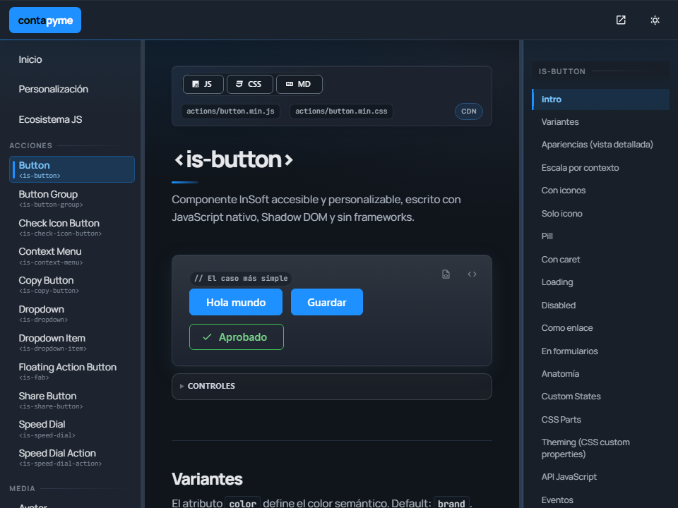

### ✅ is-button-group

- **Descripción**: Documentación y demos del componente is-button-group de InSoft.
- **Lede**: Agrupa botones relacionados en una sola unidad visual y, si se lo pides, gestiona cuál está activo. Sirve para controles segmentados, toolbars y split buttons.
- **Vista (DOM vivo)**: is-button-group — Agrupa botones relacionados en una sola unidad visual y, si se lo pides, gestiona cuál está activo. Sirve para controles segmentados, toolbars y split buttons.
- **Captura**: 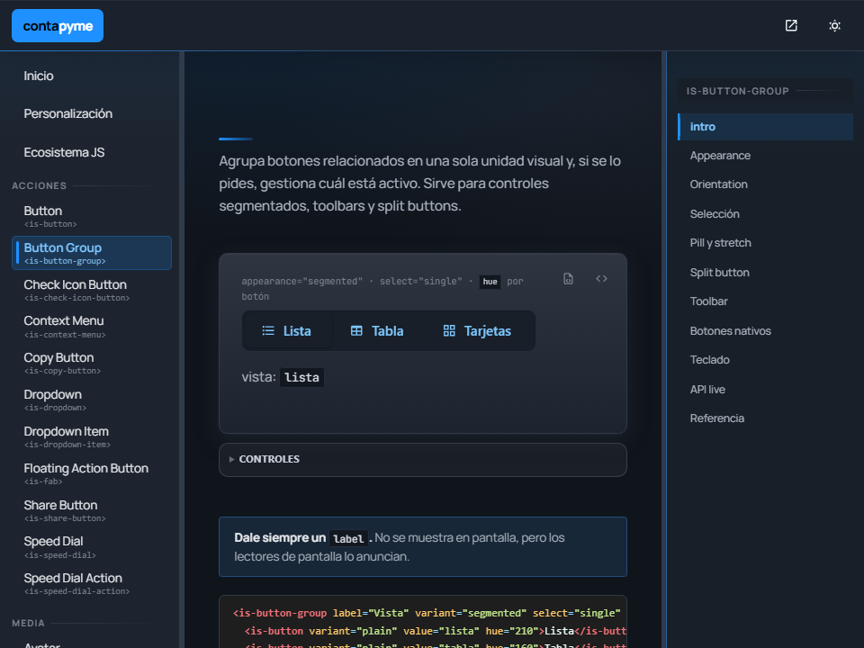

### ✅ is-check-icon-button

- **Descripción**: Documentación y demos del componente is-check-icon-button de InSoft.
- **Lede**: Botón icon-only con dos estados mutuamente excluyentes: muestra un solo icono según checked . Lo usan is-video (play/pausa, mute) e is-theme-toggle .
- **Vista (DOM vivo)**: is-check-icon-button — Botón icon-only con dos estados mutuamente excluyentes: muestra un solo icono
          según checked. Lo usan is-video
          (play/pausa, mute) e is-theme-toggle.
- **Captura**: 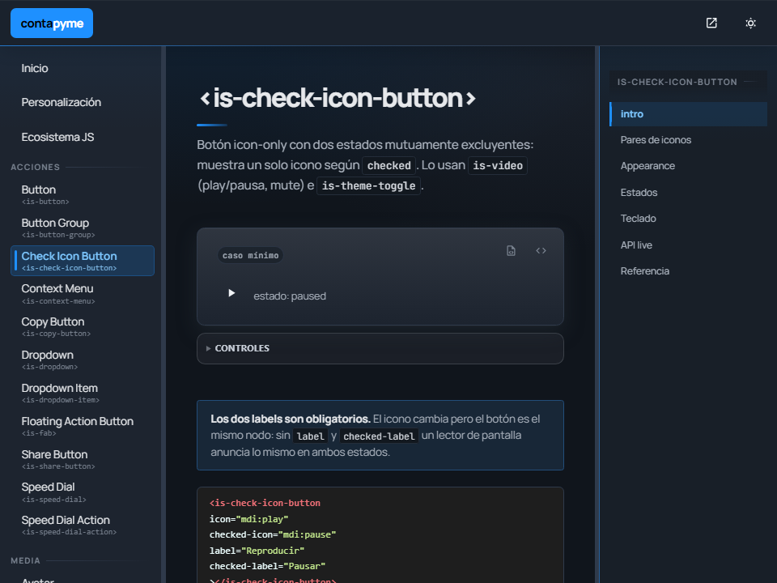

### ✅ is-context-menu

- **Lede**: Menú anclado al clic derecho sobre un elemento. Compatible con cualquier árbol DOM: target por selector.
- **Vista (DOM vivo)**: is-context-menu — Menú anclado al clic derecho sobre un elemento. Compatible con cualquier árbol DOM: target por selector.
- **Captura**: 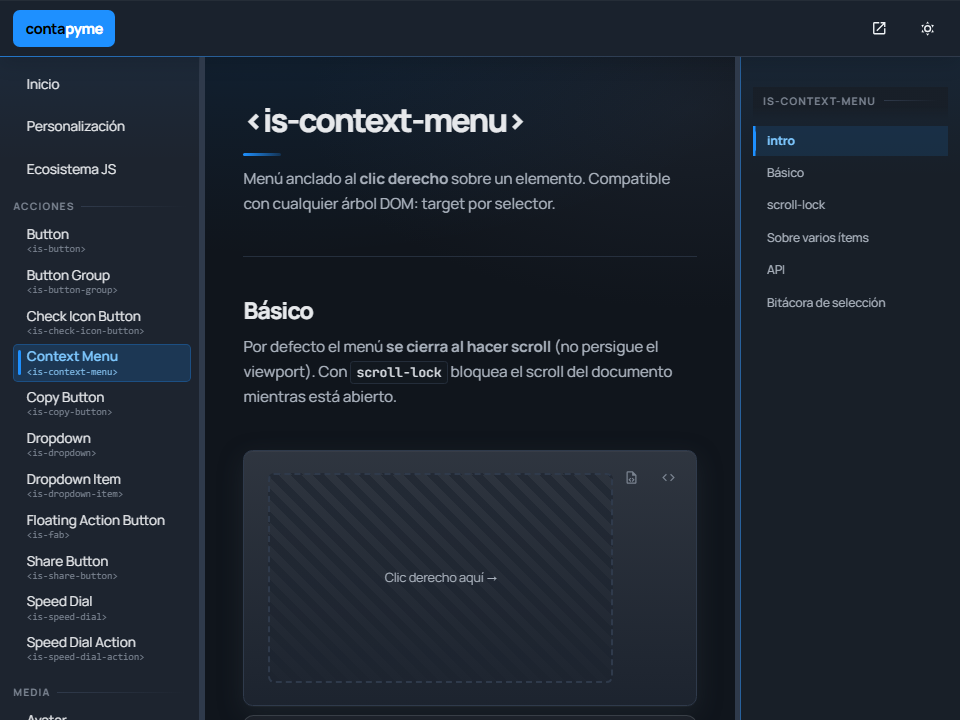

### ✅ is-copy-button

- **Descripción**: Documentación y demos del componente is-copy-button de InSoft.
- **Lede**: Copia texto al portapapeles con feedback de éxito/error.
- **Vista (DOM vivo)**: is-copy-button — Copia texto al portapapeles con feedback de éxito/error.
- **Captura**: 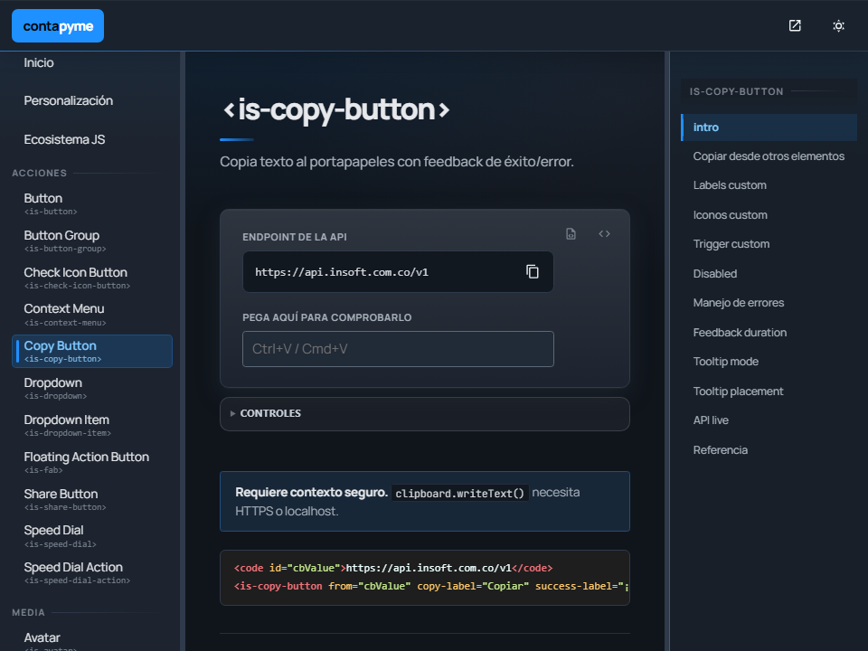

### ✅ is-dropdown

- **Lede**: Menú anclado a un trigger. Panel en &lt;dialog&gt; modal (top layer) para no quedar debajo de otras secciones. Items: is-dropdown-item , is-divider e iconos.
- **Vista (DOM vivo)**: is-dropdown — Menú anclado a un trigger. Panel en <dialog> modal
          (top layer) para no quedar debajo de otras secciones. Items:
          is-dropdown-item, is-divider e iconos.
- **Captura**: 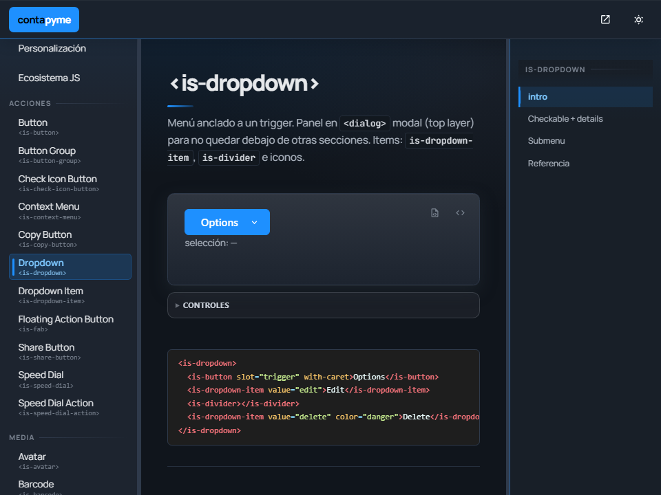

### ✅ is-dropdown-item

- **Descripción**: Documentación y demos de is-dropdown-item de InSoft.
- **Lede**: Item de un &lt;is-dropdown&gt; . Aporta el estado (activo, deshabilitado), el slot de icono y el valor que viaja en el evento de selección.
- **Vista (DOM vivo)**: is-dropdown-item — Item de un <is-dropdown>. Aporta el estado (activo, deshabilitado), el slot de icono y el valor que viaja en el evento de selección.
- **Captura**: 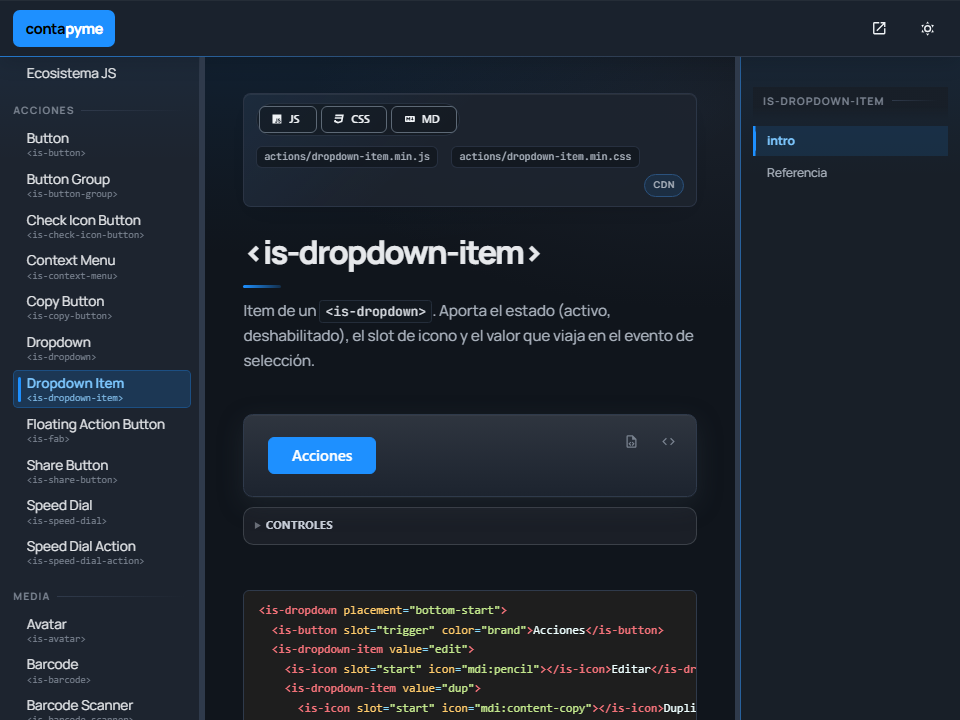

### ✅ is-fab

- **Descripción**: Documentación y demos de is-fab (Floating Action Button) de InSoft.
- **Lede**: Floating Action Button: botón circular principal que se posiciona de forma fija en la ventana. Soporta variantes, tamaños, etiquetas extendidas, pulso de atención y posicionamiento en cualquier esquina.
- **Vista (DOM vivo)**: is-fab — Floating Action Button: botón circular principal que se posiciona de
          forma fija en la ventana. Soporta variantes, tamaños, etiquetas
          extendidas, pulso de atención y posicionamiento en cualquier esquina.
- **Captura**: 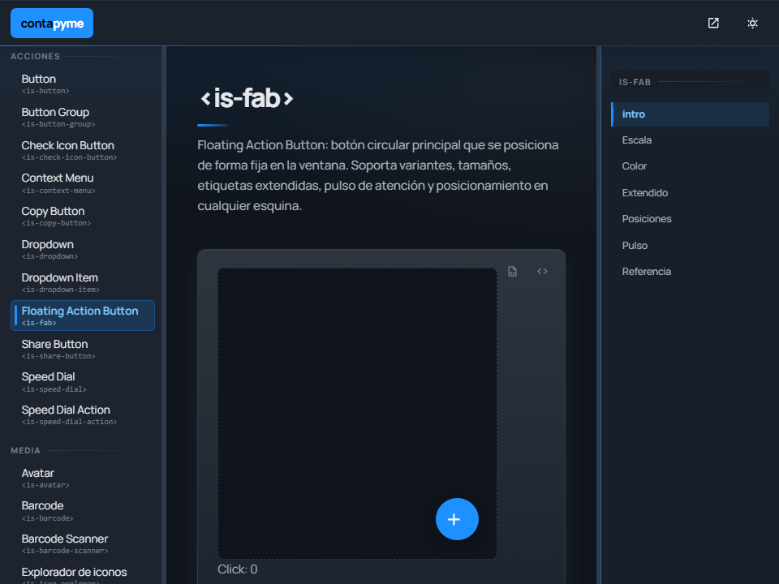

### ✅ is-share-button

- **Descripción**: Comparte título, texto y URL con las apps nativas (Web Share). Si no hay share, copia al portapapeles.
- **Lede**: Comparte título, texto y URL con las apps nativas (Web Share). Si no hay share, copia al portapapeles.
- **Vista (DOM vivo)**: is-share-button — Comparte título, texto y URL con las apps nativas (Web Share). Si no hay share, copia al portapapeles.
- **Captura**: 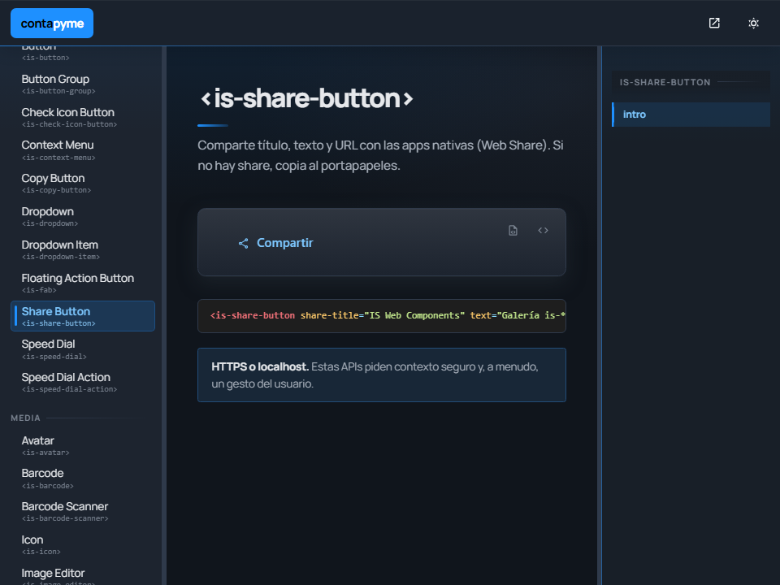

### ✅ is-speed-dial

- **Lede**: FAB que al clic despliega un puñado de acciones rápidas. Apunta arriba por defecto; cambiá la dirección con el atributo direction .
- **Vista (DOM vivo)**: is-speed-dial — FAB que al clic despliega un puñado de acciones rápidas. Apunta arriba por defecto; cambiá la dirección con el atributo direction.
- **Captura**: 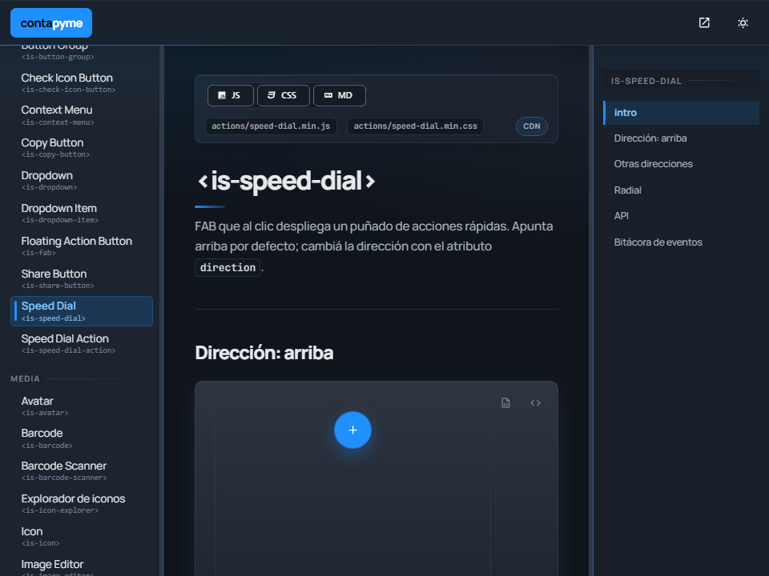

### ✅ is-speed-dial-action

- **Descripción**: Documentación y demos de is-speed-dial-action de InSoft.
- **Lede**: Cada acción que despliega un &lt;is-speed-dial&gt; , con su icono y su etiqueta.
- **Vista (DOM vivo)**: is-speed-dial-action — Cada acción que despliega un <is-speed-dial>, con su icono y su etiqueta.
- **Captura**: 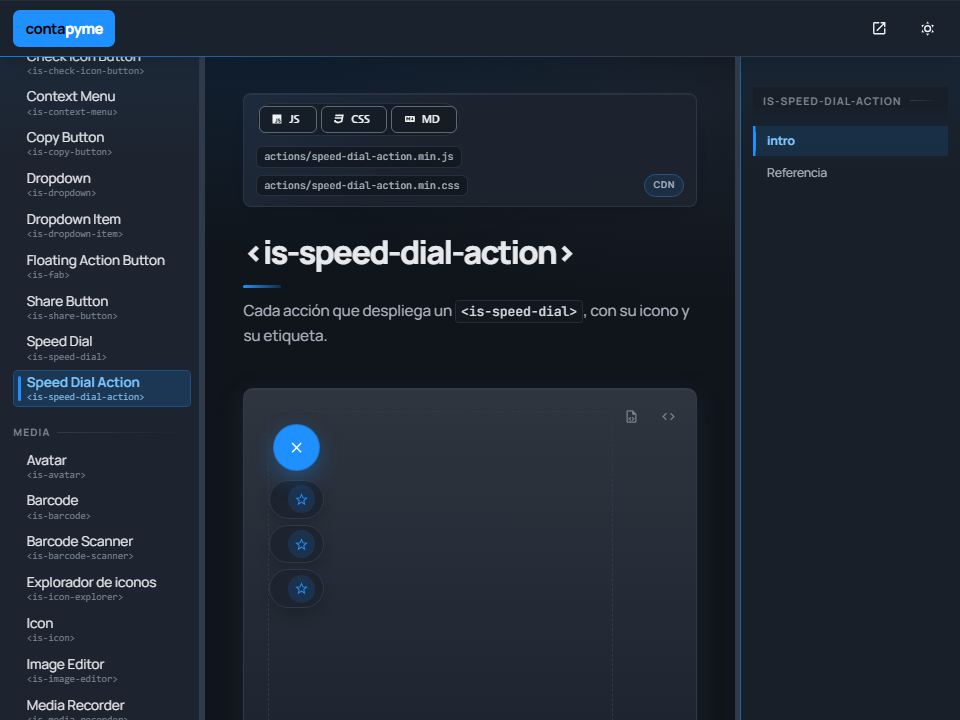

## code

### ✅ is-code

- **Lede**: Editor de código con motor NATIVO de resaltado y editor integrado (sin CodeMirror): lenguajes, temas JSON, formateo estilo Prettier, números de línea, word-wrap y anotaciones externas (highlight / tooltips). API texto ↔ JSON is-code-doc/v1 .
- **Vista (DOM vivo)**: is-code — Editor de código con motor NATIVO de resaltado y editor integrado (sin CodeMirror): lenguajes, temas JSON, formateo estilo Prettier, números de línea, word-wrap y anotaciones externas (highlight / tooltips). API texto ↔ JSON is-code-doc/v1.
- **Captura**: 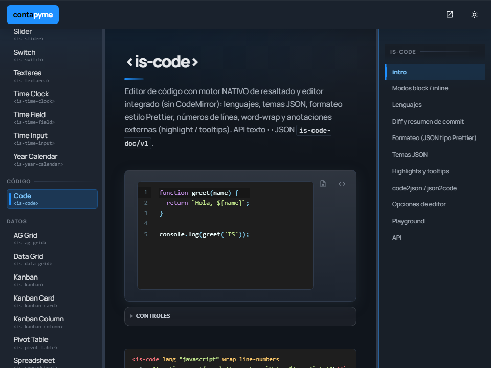

## data

### ✅ is-ag-grid

- **Lede**: Data grid estilo ag-grid.com pero vanilla web component: orden por columna, filtros, paginación, selección, edición y virtual scroll.
- **Vista (DOM vivo)**: is-ag-grid — Data grid estilo ag-grid.com pero vanilla web component: orden por columna, filtros, paginación, selección, edición y virtual scroll.
- **Captura**: 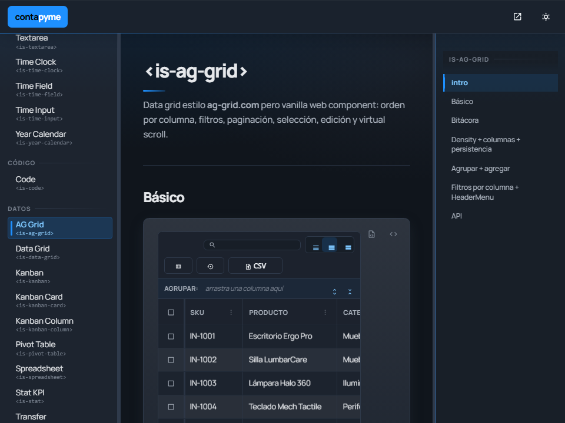

### ✅ is-data-grid

- **Lede**: Tabla de datos con la superficie de MUI X Data Grid: columnas tipadas, multi-orden, filtros con Y/O, quick filter, paginación, selección de filas y de rangos de celdas, edición por celda o por fila, agrupación con agregación, tree data, pivot, virtualización y exportación.
- **Vista (DOM vivo)**: is-data-grid — Tabla de datos con la superficie de MUI X Data Grid: columnas tipadas, multi-orden, filtros con Y/O,
          quick filter, paginación, selección de filas y de rangos de celdas, edición por celda o por fila,
          agrupación con agregación, tree data, pivot, virtualización y
- **Captura**: 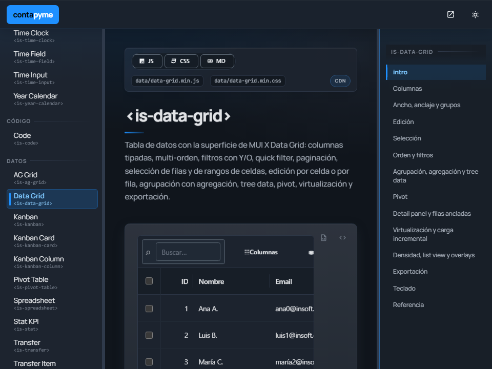

### ✅ is-kanban

- **Descripción**: Documentación y demos de is-kanban / is-kanban-column / is-kanban-card de InSoft.
- **Lede**: Tablero kanban con columnas y tarjetas. Cada columna tiene un accent color, badge automático con el conteo, slots de header-actions y cards con cover, heading, meta, tag y footer.
- **Vista (DOM vivo)**: is-kanban — Tablero kanban con columnas y tarjetas. Cada columna tiene un accent
          color, badge automático con el conteo, slots de header-actions y
          cards con cover, heading, meta, tag y footer.
- **Captura**: 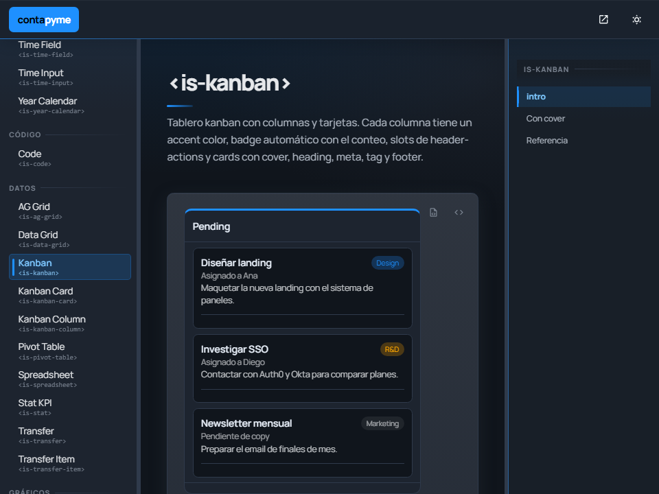

### ✅ is-kanban-card

- **Descripción**: Documentación y demos de is-kanban-card de InSoft.
- **Lede**: Tarjeta de un tablero. Es arrastrable entre columnas y admite encabezado, meta, etiqueta y pie.
- **Vista (DOM vivo)**: is-kanban-card — Tarjeta de un tablero. Es arrastrable entre columnas y admite encabezado, meta, etiqueta y pie.
- **Captura**: 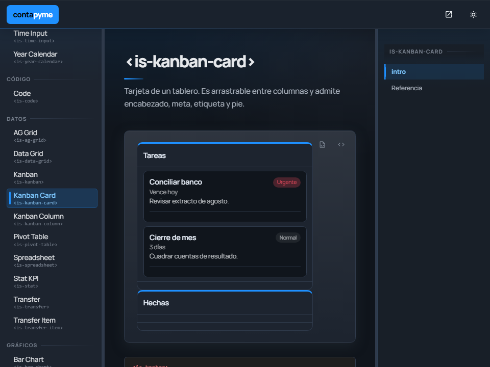

### ✅ is-kanban-column

- **Descripción**: Documentación y demos de is-kanban-column de InSoft.
- **Lede**: Columna de un tablero &lt;is-kanban&gt; : título, acento de color y contador de tarjetas.
- **Vista (DOM vivo)**: is-kanban-column — Columna de un tablero <is-kanban>: título, acento de color y contador de tarjetas.
- **Captura**: 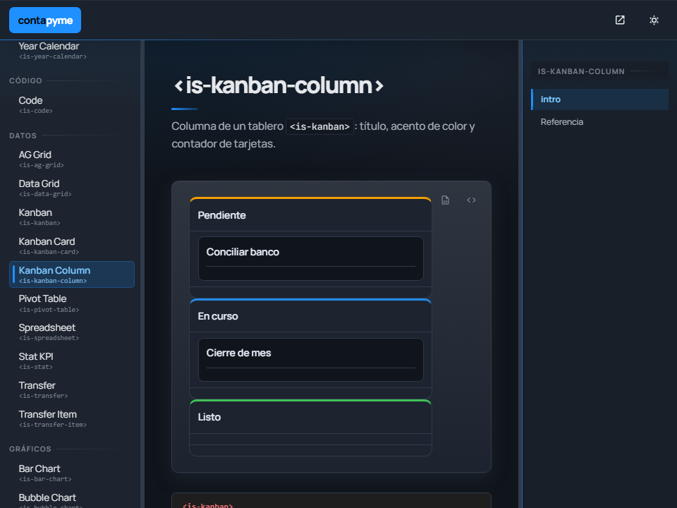

### ✅ is-pivot-table

- **Lede**: Tabla pivot: agrupa por filas y columnas, agrega una medida. Soporta sum , avg , count , min y max .
- **Vista (DOM vivo)**: is-pivot-table — Tabla pivot: agrupa por filas y columnas, agrega una medida. Soporta sum, avg, count, min y max.
- **Captura**: 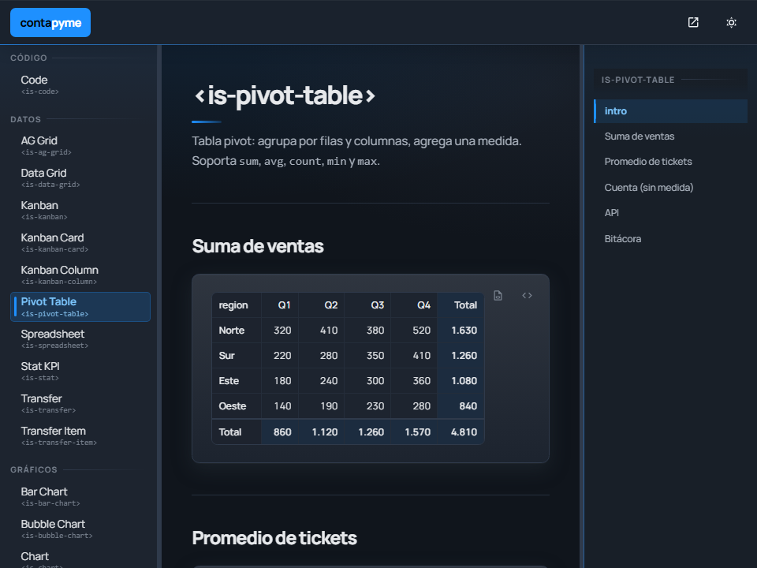

### ✅ is-spreadsheet

- **Lede**: Hoja de cálculo con edición por celda, fórmulas =SUM(A1:A5) y navegación con flechas + Tab.
- **Vista (DOM vivo)**: is-spreadsheet — Hoja de cálculo con edición por celda, fórmulas =SUM(A1:A5) y navegación con flechas + Tab.
- **Captura**: 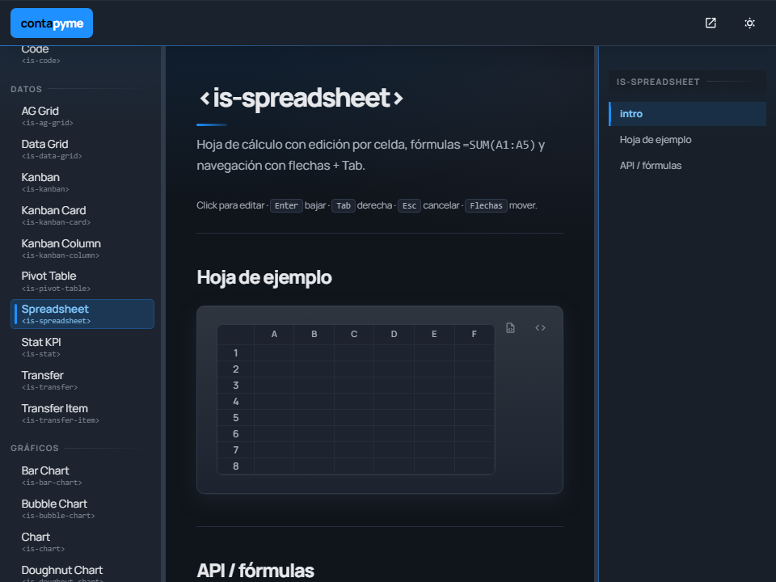

### ✅ is-stat

- **Descripción**: Documentación y demos de is-stat (KPI Card) de InSoft.
- **Lede**: Tarjeta KPI para dashboards: label, número principal, helper text, trend (subida/bajada) e icono. Detecta automáticamente la dirección del trend según el signo del valor.
- **Vista (DOM vivo)**: is-stat — Tarjeta KPI para dashboards: label, número principal, helper text,
          trend (subida/bajada) e icono. Detecta automáticamente la dirección
          del trend según el signo del valor.
- **Captura**: 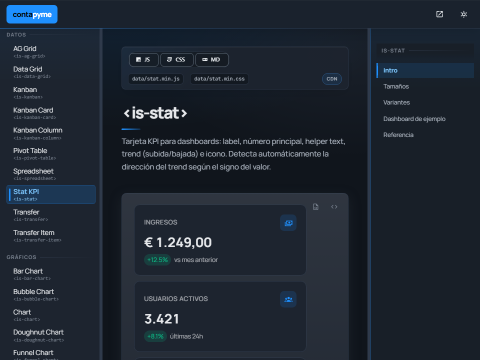

### ✅ is-transfer

- **Descripción**: Documentación y demos de is-transfer / is-transfer-item de InSoft.
- **Lede**: Doble lista de selección tipo Material/Ant. Mueve elementos entre origen y destino con botones, click individual, filtro de búsqueda y límite máximo configurable.
- **Vista (DOM vivo)**: is-transfer — Doble lista de selección tipo Material/Ant. Mueve elementos entre
          origen y destino con botones, click individual, filtro de búsqueda y
          límite máximo configurable.
- **Captura**: 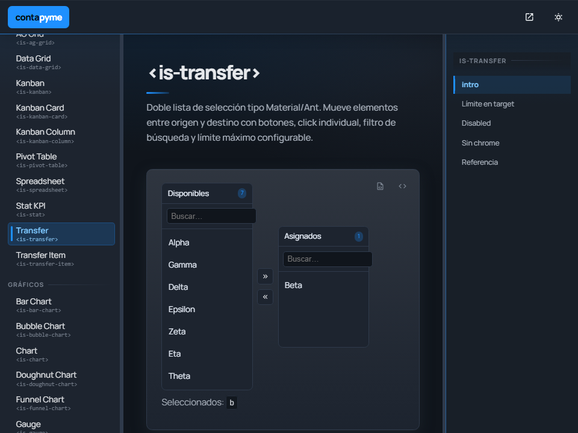

### ✅ is-transfer-item

- **Descripción**: Documentación y demos de is-transfer-item de InSoft.
- **Lede**: Elemento movible entre las dos listas de un &lt;is-transfer&gt; .
- **Vista (DOM vivo)**: is-transfer-item — Elemento movible entre las dos listas de un <is-transfer>.
- **Captura**: 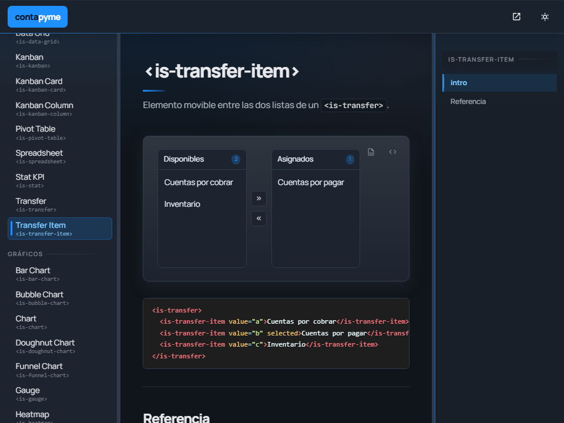

## data-viz

### ✅ is-bar-chart

- **Lede**: Barras para comparar cantidades entre categorías.
- **Vista (DOM vivo)**: is-bar-chart — Barras para comparar cantidades entre categorías.
- **Captura**: 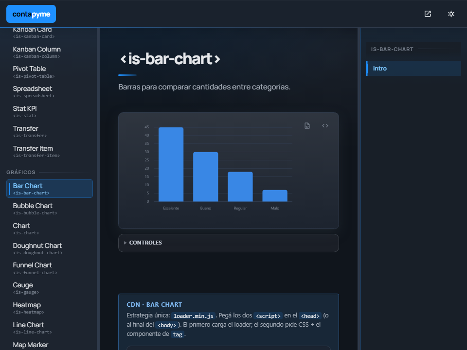

### ✅ is-bubble-chart

- **Lede**: Tercera dimensión por tamaño.
- **Vista (DOM vivo)**: is-bubble-chart — Tercera dimensión por tamaño.
- **Captura**: 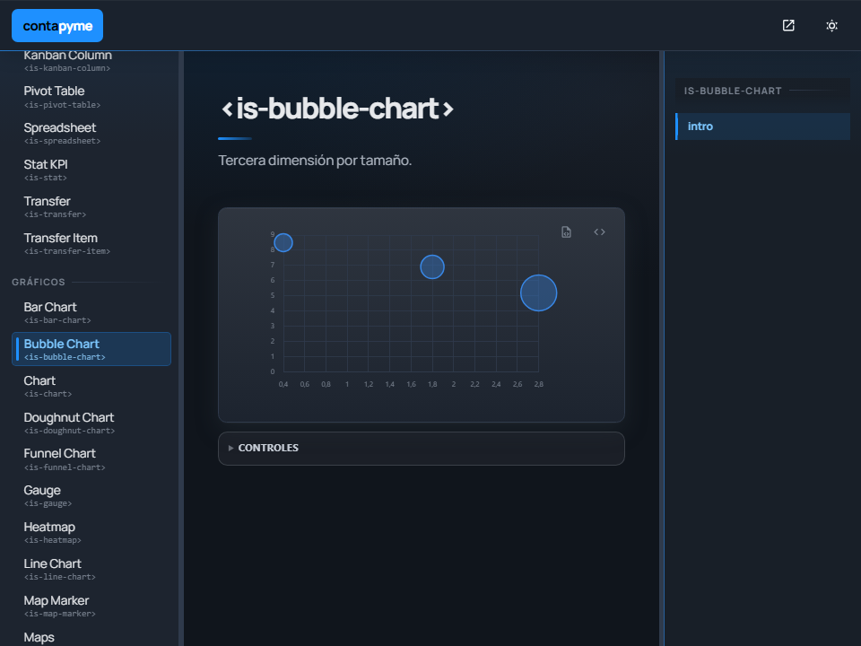

### ✅ is-chart

- **Título**: Charts
- **Lede**: Motor de gráficos en SVG, sin dependencias externas. La configuración usa el mismo esquema de Chart.js, así que un config existente funciona sin cambios.
- **Vista (DOM vivo)**: is-chart — Motor de gráficos en SVG, sin dependencias externas. La configuración usa el
          mismo esquema de Chart.js, así que un config existente funciona
          sin cambios.
- **Captura**: 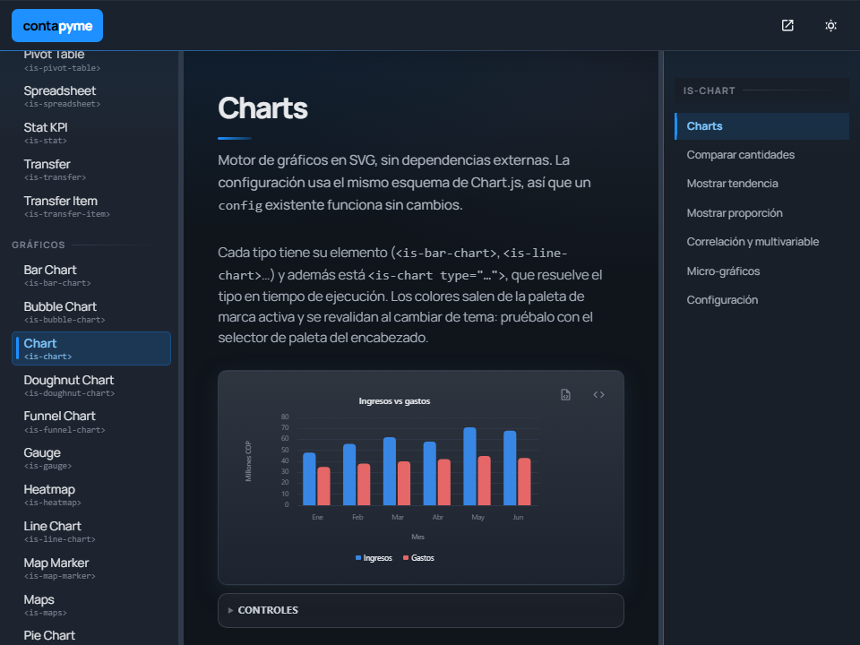

### ✅ is-doughnut-chart

- **Lede**: Proporciones con centro hueco.
- **Vista (DOM vivo)**: is-doughnut-chart — Proporciones con centro hueco.
- **Captura**: 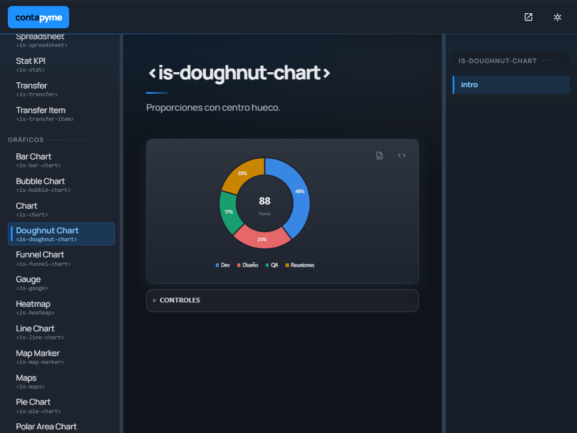

### ✅ is-funnel-chart

- **Lede**: Embudo para seguir la conversión entre etapas de un proceso.
- **Vista (DOM vivo)**: is-funnel-chart — Embudo para seguir la conversión entre etapas de un proceso.
- **Captura**: 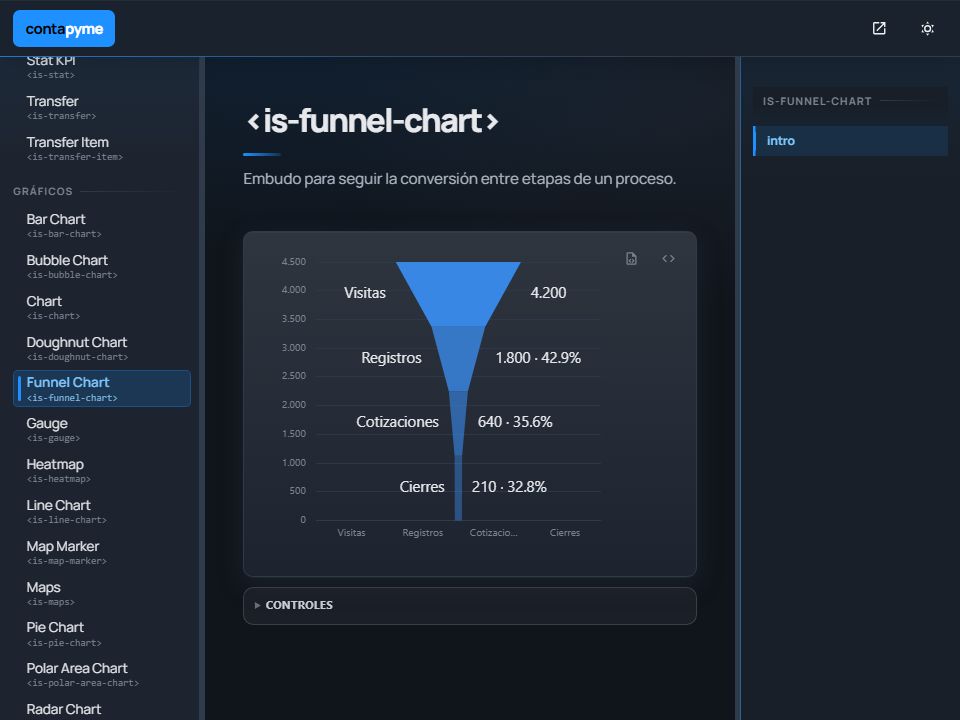

### ✅ is-gauge

- **Descripción**: Documentación y demos de is-gauge de InSoft.
- **Lede**: Medidor circular SVG de porcentaje. Soporta variantes, semicírculo, custom min/max, unidad, formato y tamaño.
- **Vista (DOM vivo)**: is-gauge — Medidor circular SVG de porcentaje. Soporta variantes, semicírculo,
          custom min/max, unidad, formato y tamaño.
- **Captura**: 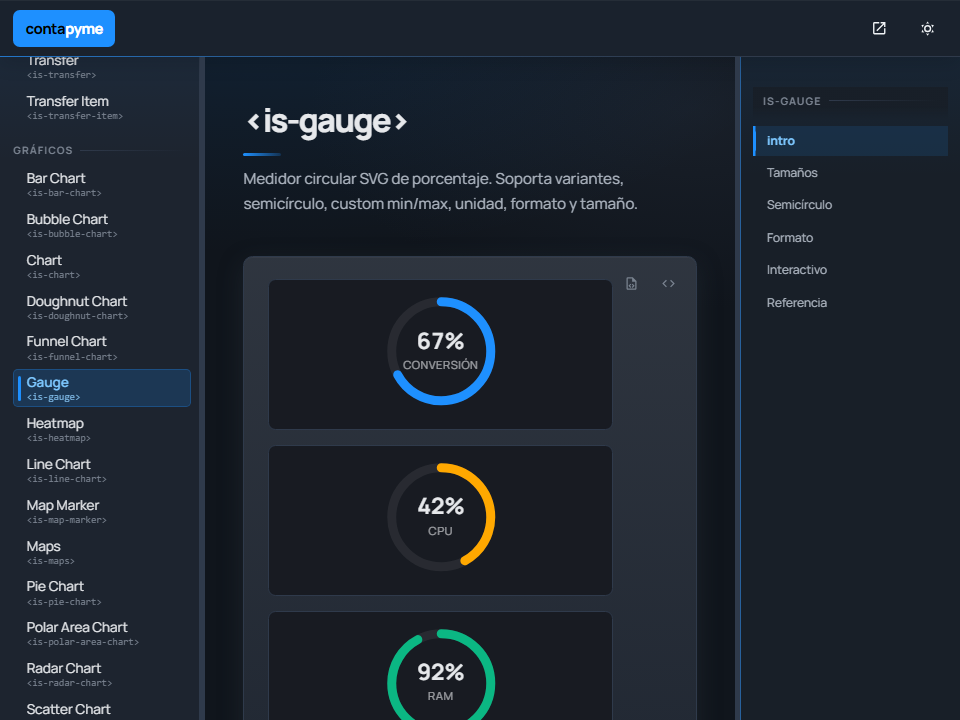

### ✅ is-heatmap

- **Lede**: Matriz coloreada por valor. Útil para visualizar correlaciones, frecuencias a lo largo de día × semana, o calor por hora × servidor.
- **Vista (DOM vivo)**: is-heatmap — Matriz coloreada por valor. Útil para visualizar correlaciones, frecuencias a lo largo de día × semana, o calor por hora × servidor.
- **Captura**: 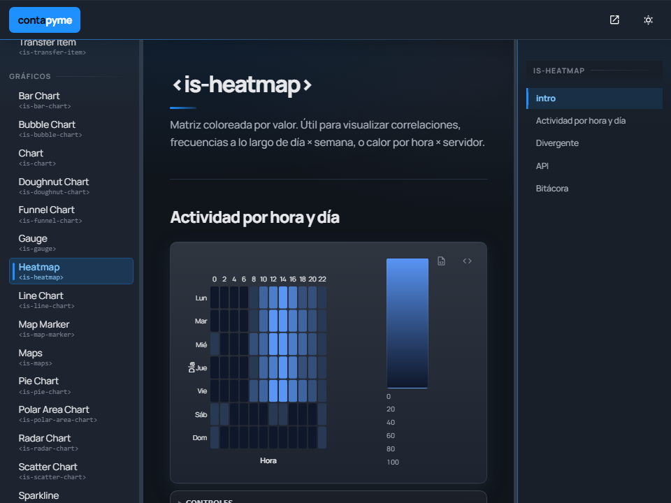

### ✅ is-line-chart

- **Lede**: Tendencias en el tiempo.
- **Vista (DOM vivo)**: is-line-chart — Tendencias en el tiempo.
- **Captura**: 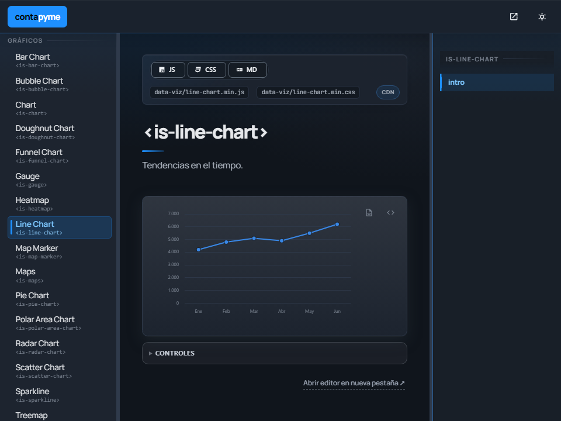

### ✅ is-map-marker

- **Descripción**: Documentación y demos de is-map-marker de InSoft.
- **Lede**: Marcador posicionado por longitud y latitud dentro de un &lt;is-maps&gt; .
- **Vista (DOM vivo)**: is-map-marker — Marcador posicionado por longitud y latitud dentro de un <is-maps>.
- **Captura**: 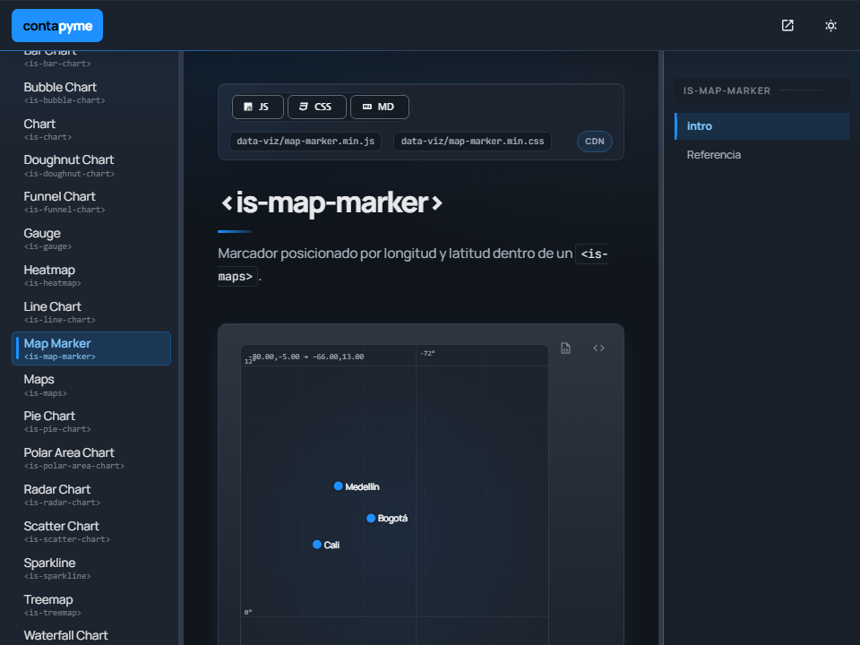

### ✅ is-maps

- **Lede**: Modo nativo (default): lienzo SVG con proyección equirectangular, sin dependencias externas. Modo engine="tile" : iframe al proveedor de tiles (OpenStreetMap, etc.).
- **Vista (DOM vivo)**: is-maps — Modo nativo (default): lienzo SVG con proyección equirectangular, sin dependencias externas. Modo engine="tile": iframe al proveedor de tiles (OpenStreetMap, etc.).
- **Captura**: 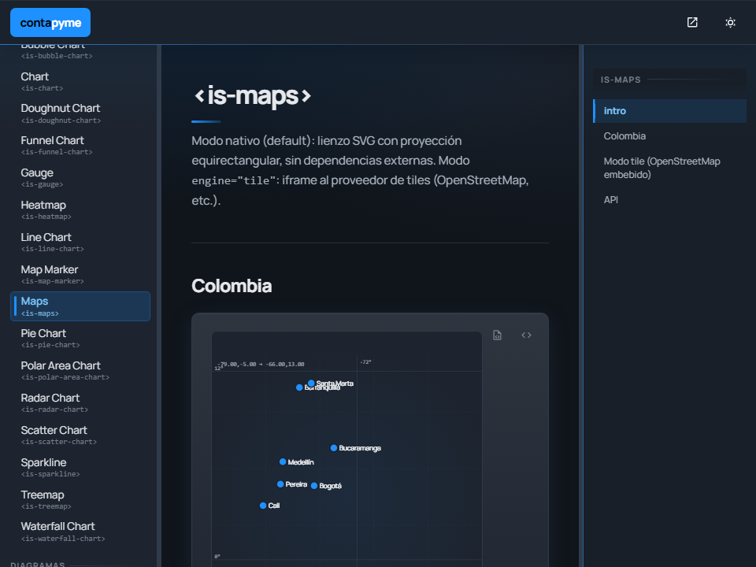

### ✅ is-pie-chart

- **Lede**: Composición proporcional.
- **Vista (DOM vivo)**: is-pie-chart — Composición proporcional.
- **Captura**: 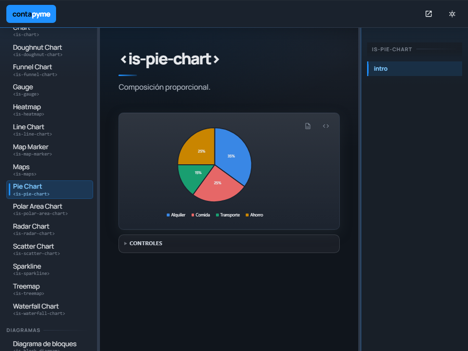

### ✅ is-polar-area-chart

- **Lede**: Chart.js polarArea themed. Ángulos iguales por categoría; el radio refleja la magnitud (a diferencia de un pie, donde el tamaño es el ángulo). Ideal para comparar escalas en el mismo “reloj”.
- **Vista (DOM vivo)**: is-polar-area-chart — Chart.js polarArea themed. Ángulos iguales por categoría;
          el radio refleja la magnitud (a diferencia de un pie, donde el tamaño
          es el ángulo). Ideal para comparar escalas en el mismo “reloj”.
- **Captura**: 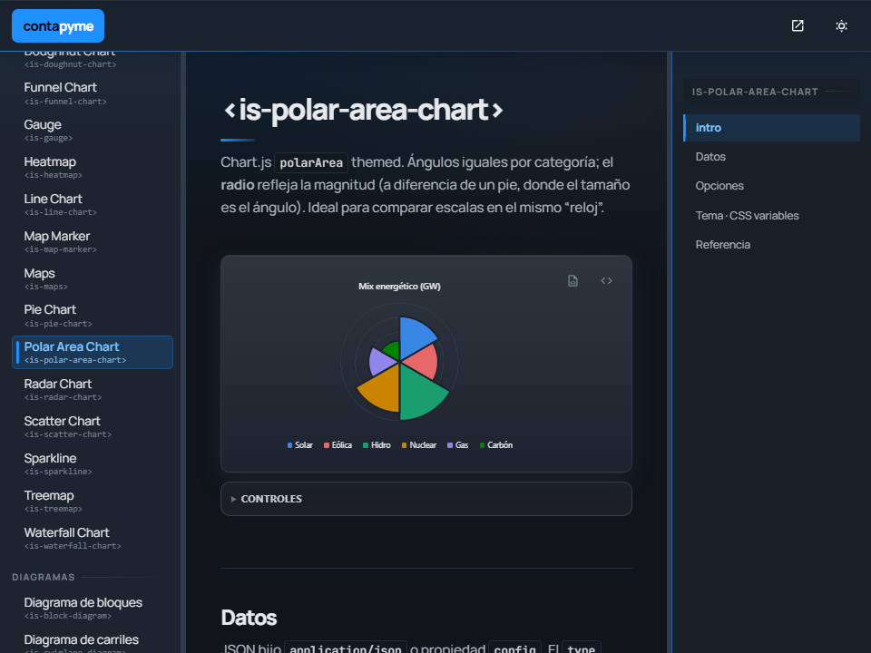

### ✅ is-radar-chart

- **Título**: Radar Chart
- **Lede**: &lt;is-radar-chart&gt;
- **Vista (DOM vivo)**: is-radar-chart — <is-radar-chart>
- **Captura**: 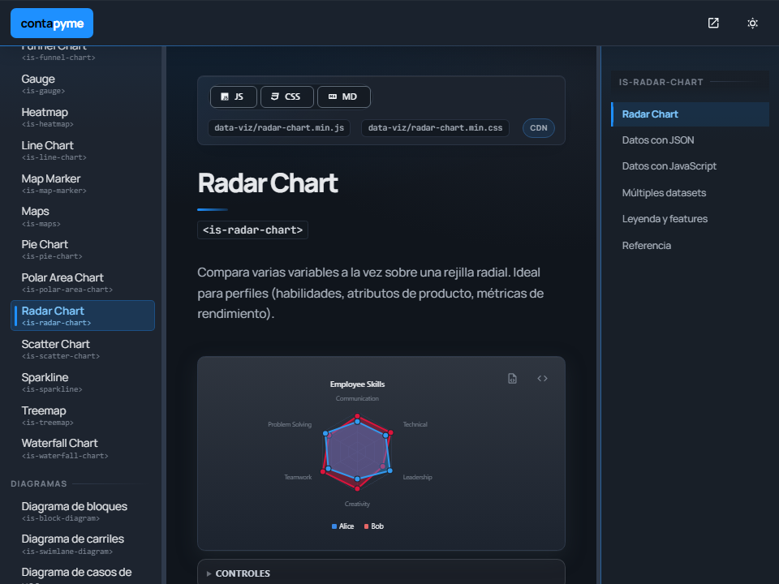

### ✅ is-scatter-chart

- **Título**: Scatter Chart
- **Lede**: &lt;is-scatter-chart&gt;
- **Vista (DOM vivo)**: is-scatter-chart — <is-scatter-chart>
- **Captura**: 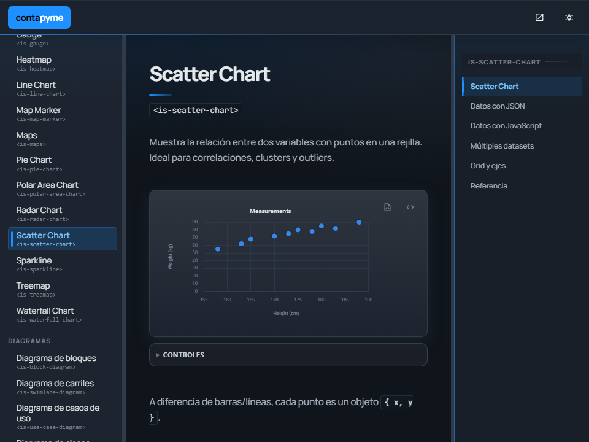

### ✅ is-sparkline

- **Título**: Sparkline
- **Lede**: &lt;is-sparkline&gt;
- **Vista (DOM vivo)**: is-sparkline — <is-sparkline>
- **Captura**: 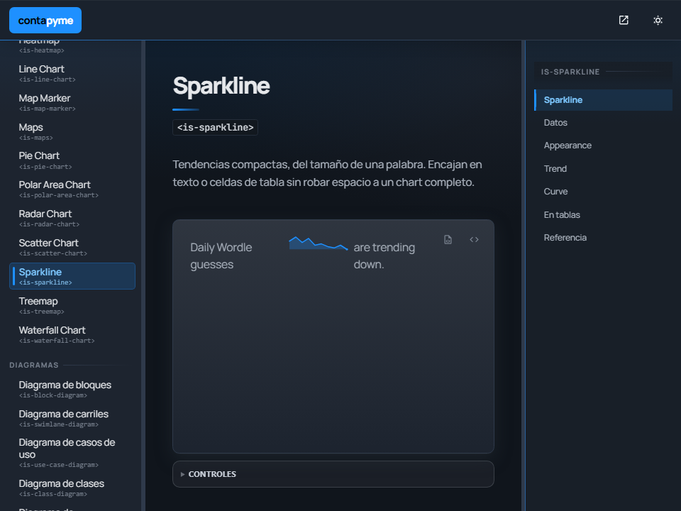

### ✅ is-treemap

- **Lede**: Treemap anidado en SVG, con el algoritmo squarified (Bruls/Huizing/ van Wijk): rectángulos con aspect-ratio cercano a 1, sin huecos ni solapes.
- **Vista (DOM vivo)**: is-treemap — Treemap anidado en SVG, con el algoritmo squarified (Bruls/Huizing/
          van Wijk): rectángulos con aspect-ratio cercano a 1, sin huecos ni
          solapes.
- **Captura**: 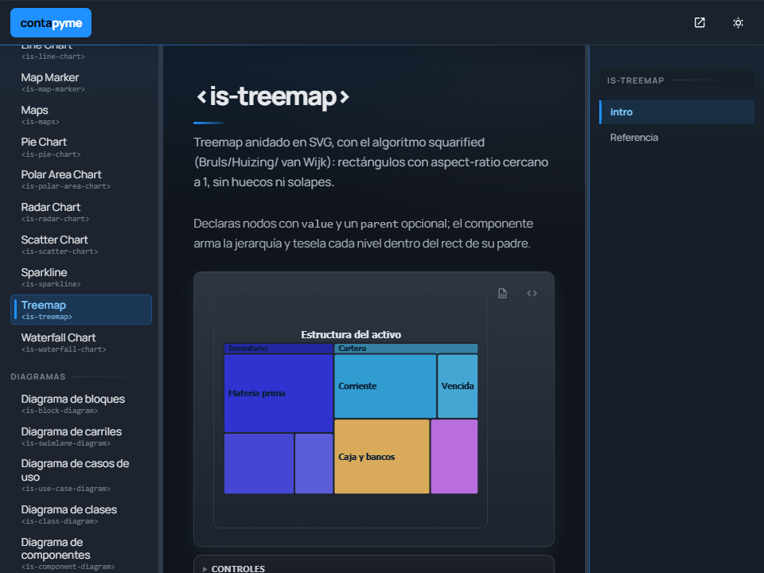

### ✅ is-waterfall-chart

- **Lede**: Cascada para explicar cómo un saldo inicial llega a un saldo final.
- **Vista (DOM vivo)**: is-waterfall-chart — Cascada para explicar cómo un saldo inicial llega a un saldo final.
- **Captura**: 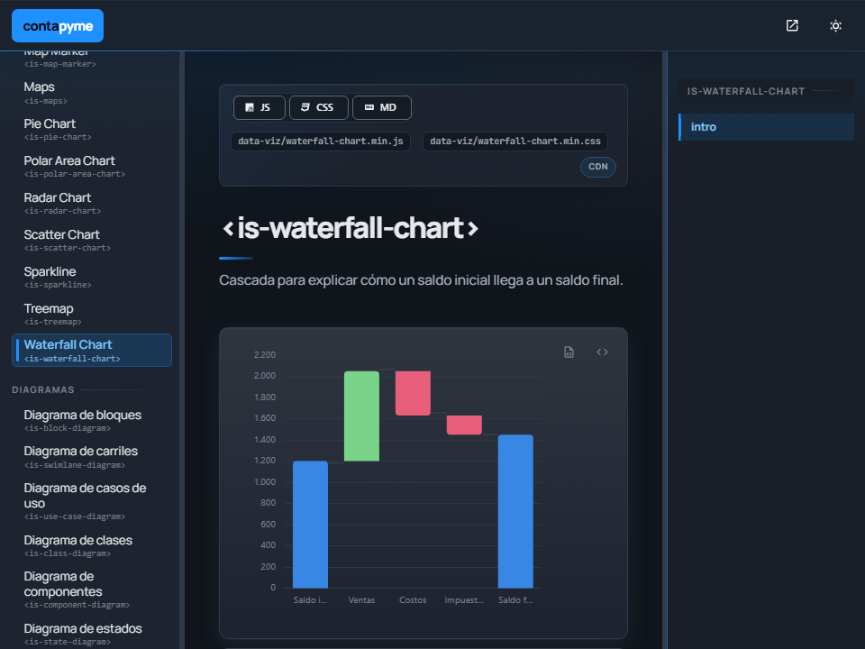

## diagrams

### ✅ is-block-diagram

- **Lede**: Diagrama de bloques en SVG, sin Mermaid. A diferencia de &lt;is-flowchart&gt; , los bloques no se organizan en capas: se ubican en una rejilla de columns columnas fijas, fluyendo de izquierda a derecha y bajando de fila cuando no caben.
- **Vista (DOM vivo)**: is-block-diagram — Diagrama de bloques en SVG, sin Mermaid. A diferencia de
          <is-flowchart>, los bloques no se organizan en capas: se
          ubican en una rejilla de columns columnas fijas, fluyendo de
          izquierda a derecha y bajando de fila cuando no caben.
- **Captura**: 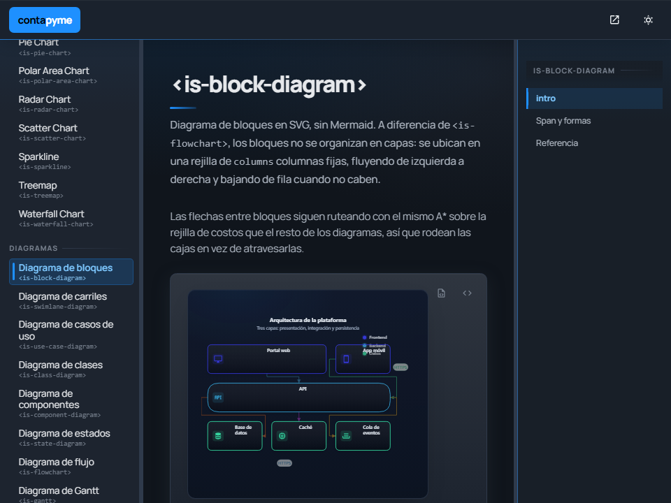

### ✅ is-class-diagram

- **Lede**: Diagrama de clases UML en SVG, sin Mermaid. Tú declaras clases y relaciones; el componente decide las capas, dibuja los tres compartimentos clásicos (nombre, atributos, métodos) y rutea las relaciones rodeando las cajas.
- **Vista (DOM vivo)**: is-class-diagram — Diagrama de clases UML en SVG, sin Mermaid. Tú declaras clases y
          relaciones; el componente decide las capas, dibuja los tres
          compartimentos clásicos (nombre, atributos, métodos) y rutea las
          relaciones rodeando las cajas.
- **Captura**: 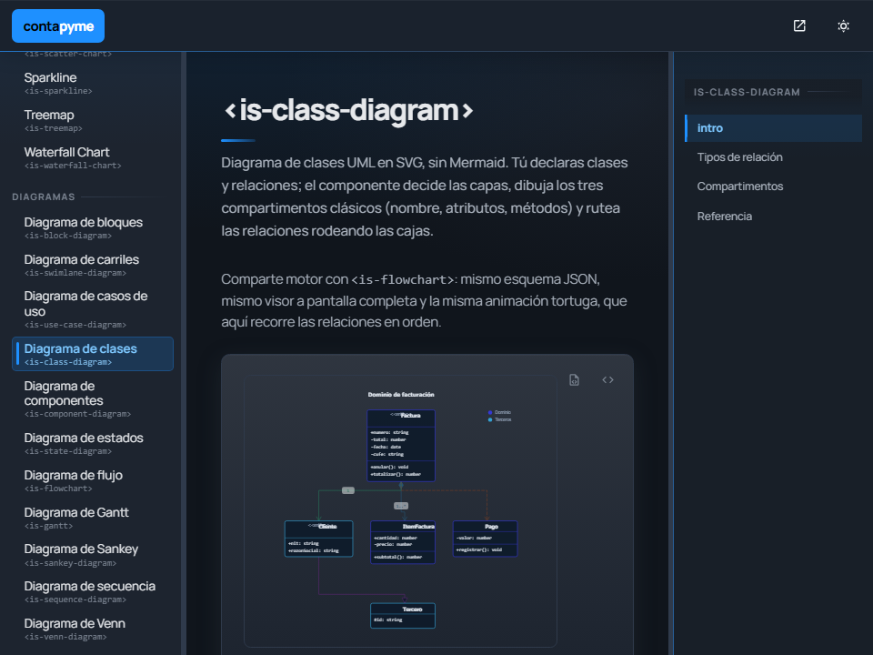

### ✅ is-component-diagram

- **Lede**: Diagrama de componentes UML en SVG, sin Mermaid: paquetes, componentes con estereotipo e interfaces provided/required.
- **Vista (DOM vivo)**: is-component-diagram — Diagrama de componentes UML en SVG, sin Mermaid: paquetes, componentes con estereotipo e interfaces provided/required.
- **Captura**: 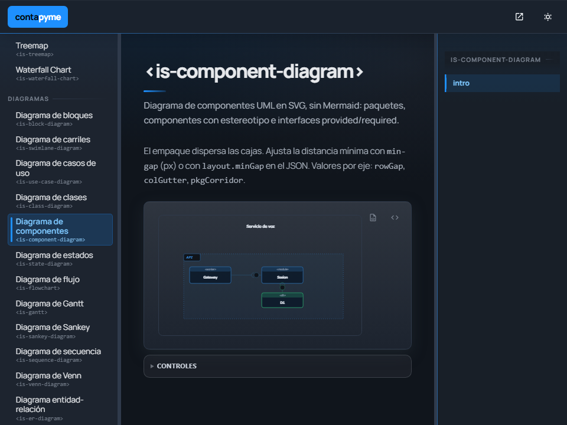

### ✅ is-diagram-lightbox

- **Lede**: Visor a pantalla completa pensado para diagramas: hereda del &lt;is-lightbox&gt; genérico el zoom anclado al cursor, el pan y el dialog top-layer, y le suma la barra de la animación tortuga (play / pause / prev / next), el anillo de auto-replay, el panel de código JSON y el enlace compartible con el payload en ?d= .
- **Vista (DOM vivo)**: is-diagram-lightbox — Visor a pantalla completa pensado para diagramas: hereda del
          <is-lightbox> genérico el zoom anclado al
          cursor, el pan y el dialog top-layer, y le suma la barra de la animación
          tortuga (play / pause / prev / next), el anillo de auto-replay, el panel
 
- **Captura**: 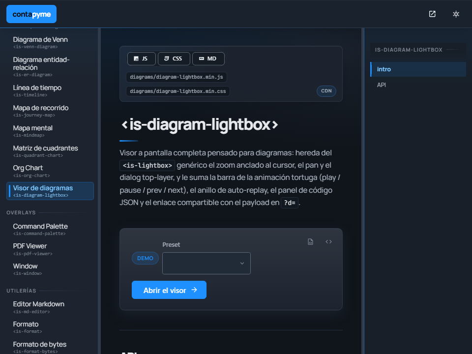

### ✅ is-er-diagram

- **Lede**: Diagrama entidad-relación en SVG, sin Mermaid. Declaras entidades con sus atributos y las relaciones entre ellas; el componente ubica las cajas, rutea las líneas con A* y dibuja la notación de pata de gallo en cada extremo.
- **Vista (DOM vivo)**: is-er-diagram — Diagrama entidad-relación en SVG, sin Mermaid. Declaras entidades con sus
          atributos y las relaciones entre ellas; el componente ubica las cajas,
          rutea las líneas con A* y dibuja la notación de pata de gallo en cada extremo.
- **Captura**: 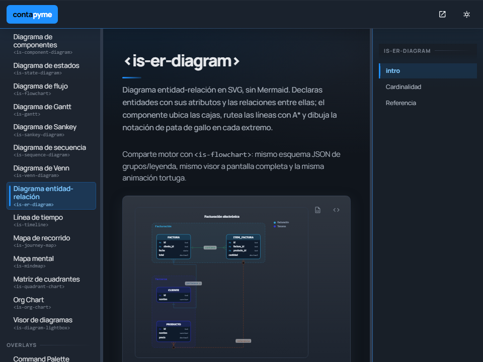

### ✅ is-flowchart

- **Lede**: Diagrama de flujo en SVG, sin Mermaid. Tú declaras nodos y aristas; el componente decide las capas, reduce los cruces y rutea las flechas rodeando las cajas.
- **Vista (DOM vivo)**: is-flowchart — Diagrama de flujo en SVG, sin Mermaid. Tú declaras nodos y aristas; el
          componente decide las capas, reduce los cruces y rutea las flechas
          rodeando las cajas.
- **Captura**: 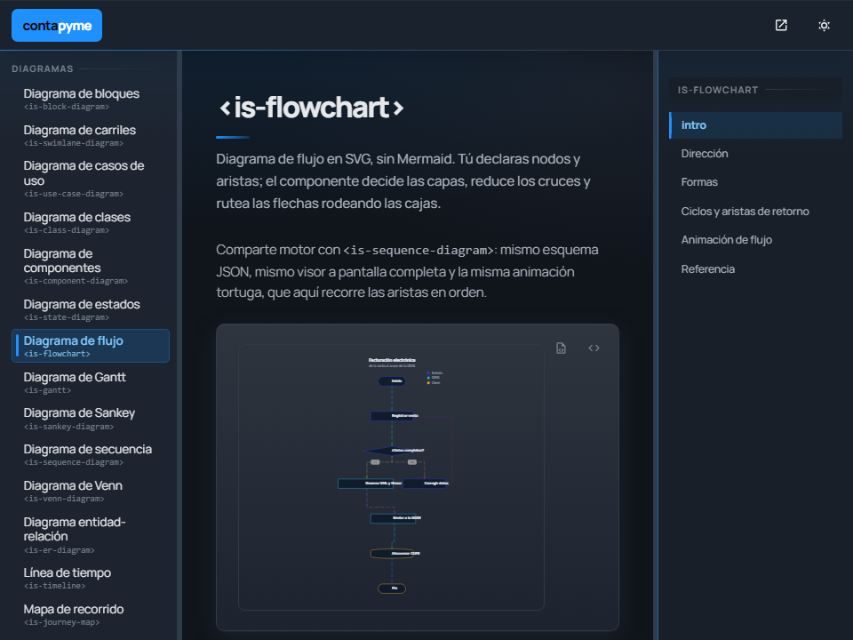

### ✅ is-gantt

- **Lede**: Diagrama de Gantt en SVG, sin Mermaid. Una fila por tarea, en el orden que la declares; el componente calcula la escala de tiempo, dibuja las barras y rutea las flechas de dependencia rodeando las demás barras.
- **Vista (DOM vivo)**: is-gantt — Diagrama de Gantt en SVG, sin Mermaid. Una fila por tarea, en el
          orden que la declares; el componente calcula la escala de tiempo,
          dibuja las barras y rutea las flechas de dependencia rodeando las
          demás barras.
- **Captura**: 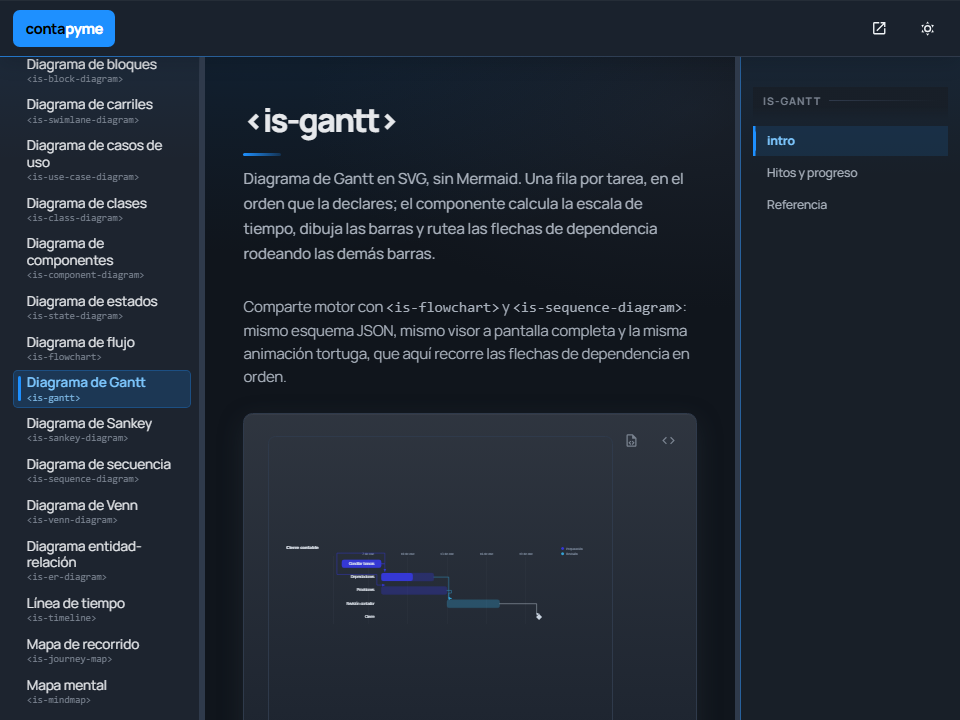

### ✅ is-journey-map

- **Lede**: Mapa de recorrido (user journey): fases, pasos y la curva de satisfacción que los atraviesa.
- **Vista (DOM vivo)**: is-journey-map — Mapa de recorrido (user journey): fases, pasos y la curva de satisfacción que los atraviesa.
- **Captura**: 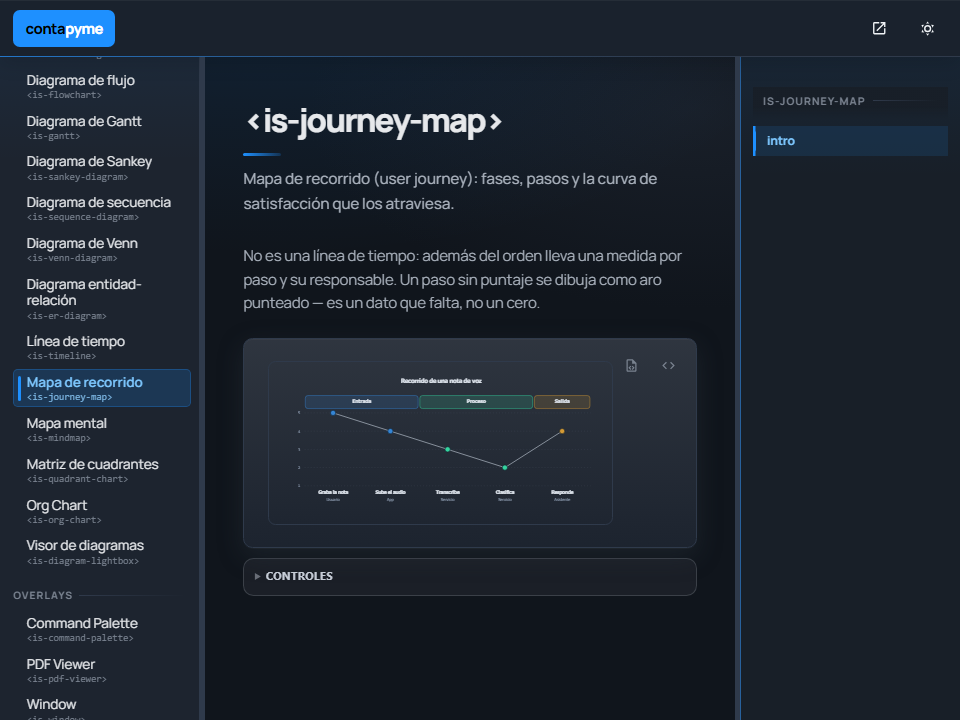

### ✅ is-mindmap

- **Lede**: Mapa mental en SVG, sin Mermaid. Declaras ideas con un `parent` opcional y el componente arma el árbol, reparte las ramas y las une con curvas suaves coloreadas por rama.
- **Vista (DOM vivo)**: is-mindmap — Mapa mental en SVG, sin Mermaid. Declaras ideas con un `parent`
          opcional y el componente arma el árbol, reparte las ramas y las une
          con curvas suaves coloreadas por rama.
- **Captura**: 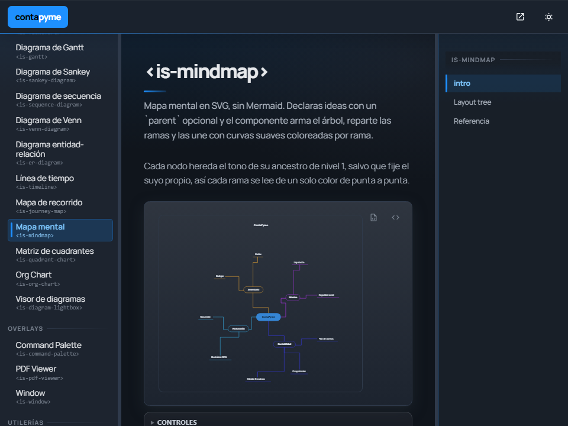

### ✅ is-org-chart

- **Lede**: Organigrama jerárquico a partir de un árbol JSON. Cada nodo tiene foto (o iniciales), nombre y cargo; los hijos se pliegan con el botón redondo con una animación suave, y un clic en el fondo abre el visor a pantalla completa.
- **Vista (DOM vivo)**: is-org-chart — Organigrama jerárquico a partir de un árbol JSON. Cada nodo tiene foto (o iniciales), nombre y cargo; los hijos se pliegan con el botón redondo con una animación suave, y un clic en el fondo abre el visor a pantalla completa.
- **Captura**: 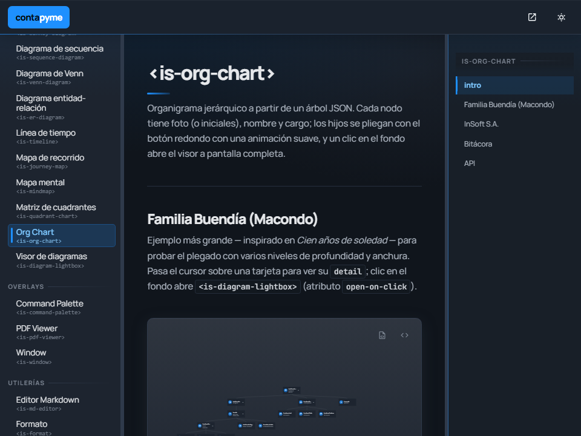

### ✅ is-quadrant-chart

- **Lede**: Matriz 2×2 en SVG: dos ejes continuos, cuatro cuadrantes nombrados y los puntos ubicados en 0..1.
- **Vista (DOM vivo)**: is-quadrant-chart — Matriz 2×2 en SVG: dos ejes continuos, cuatro cuadrantes nombrados y los puntos ubicados en 0..1.
- **Captura**: 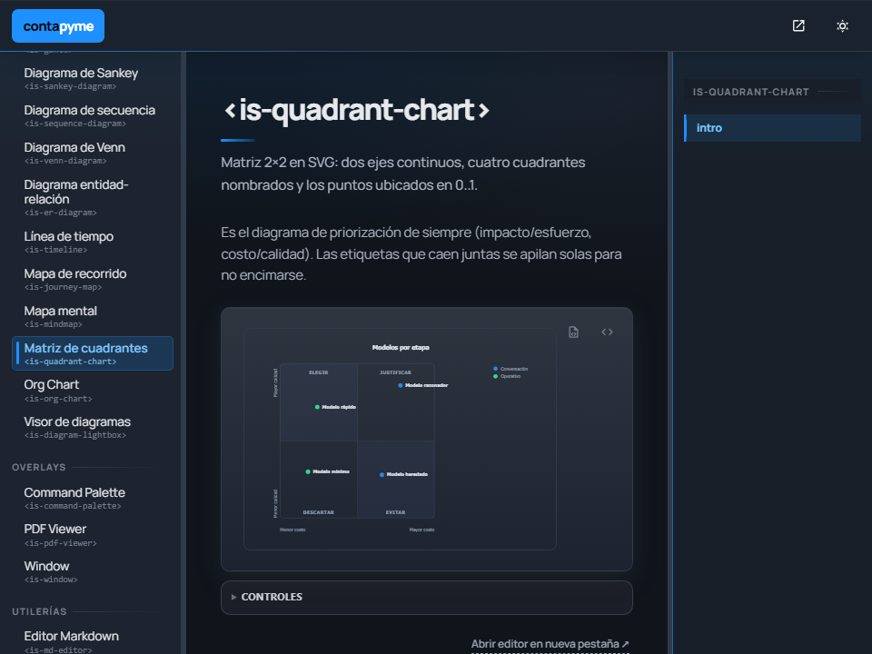

### ✅ is-sankey-diagram

- **Lede**: Diagrama de Sankey en SVG, sin Mermaid. El grosor de cada banda es el dato: los flujos se ven en proporción, no en anécdota.
- **Vista (DOM vivo)**: is-sankey-diagram — Diagrama de Sankey en SVG, sin Mermaid. El grosor de cada banda es el dato: los flujos se ven en proporción, no en anécdota.
- **Captura**: 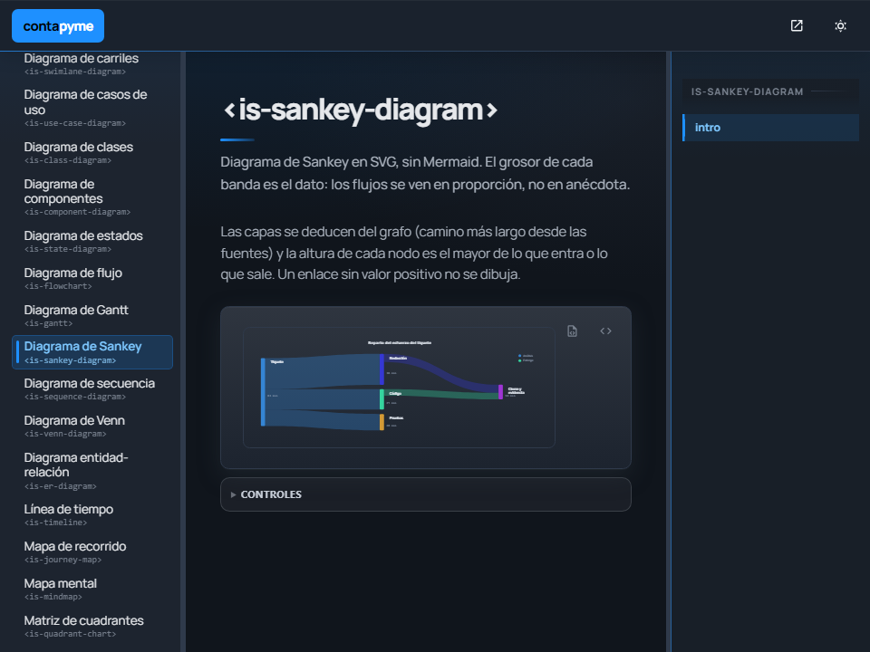

### ✅ is-sequence-diagram

- **Lede**: Diagrama de secuencia en SVG, sin Mermaid. La configuración es un JSON con actores, mensajes y grupos; el layout (posiciones, ruteo ortogonal de las flechas y colocación de etiquetas) se calcula solo.
- **Vista (DOM vivo)**: is-sequence-diagram — Diagrama de secuencia en SVG, sin Mermaid. La configuración es un JSON
          con actores, mensajes y grupos; el layout (posiciones, ruteo ortogonal
          de las flechas y colocación de etiquetas) se calcula solo.
- **Captura**: 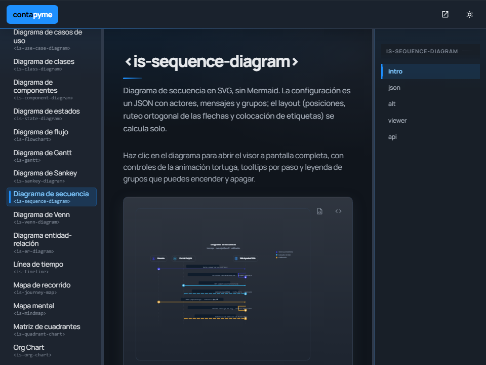

### ✅ is-state-diagram

- **Lede**: Diagrama de estados en SVG, sin Mermaid. Tú declaras estados y transiciones; el componente decide las capas, reduce los cruces y rutea las flechas rodeando los estados.
- **Vista (DOM vivo)**: is-state-diagram — Diagrama de estados en SVG, sin Mermaid. Tú declaras estados y
          transiciones; el componente decide las capas, reduce los cruces y
          rutea las flechas rodeando los estados.
- **Captura**: 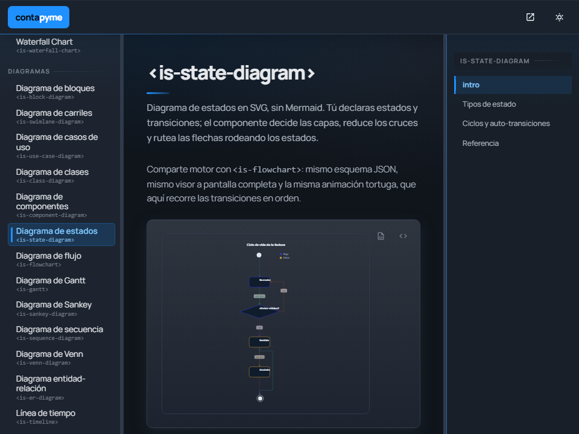

### ✅ is-swimlane-diagram

- **Lede**: Diagrama de actividad con carriles: cada fila es un responsable y cada columna un momento del proceso.
- **Vista (DOM vivo)**: is-swimlane-diagram — Diagrama de actividad con carriles: cada fila es un responsable y cada columna un momento del proceso.
- **Captura**: 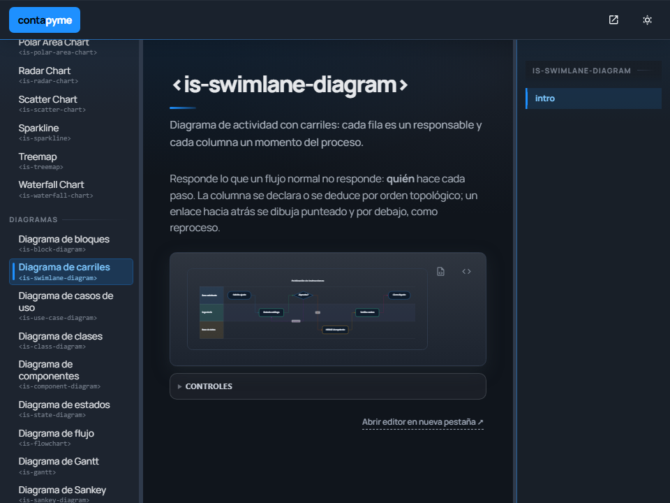

### ✅ is-timeline

- **Lede**: Línea de tiempo de hitos en SVG, sin Mermaid. Declaras eventos con fecha; el componente los reparte a lo largo de un eje y separa los que caen demasiado cerca en el tiempo para que no se encimen.
- **Vista (DOM vivo)**: is-timeline — Línea de tiempo de hitos en SVG, sin Mermaid. Declaras eventos con
          fecha; el componente los reparte a lo largo de un eje y separa los
          que caen demasiado cerca en el tiempo para que no se encimen.
- **Captura**: 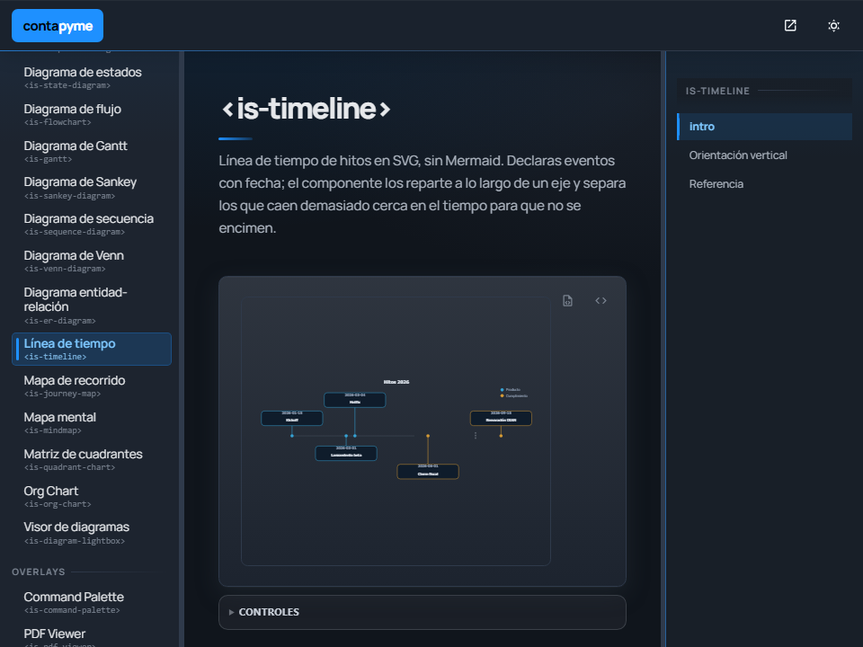

### ✅ is-use-case-diagram

- **Lede**: Diagrama de casos de uso UML: actores fuera del sistema, casos en elipses dentro del límite y relaciones con su estereotipo.
- **Vista (DOM vivo)**: is-use-case-diagram — Diagrama de casos de uso UML: actores fuera del sistema, casos en elipses dentro del límite y relaciones con su estereotipo.
- **Captura**: 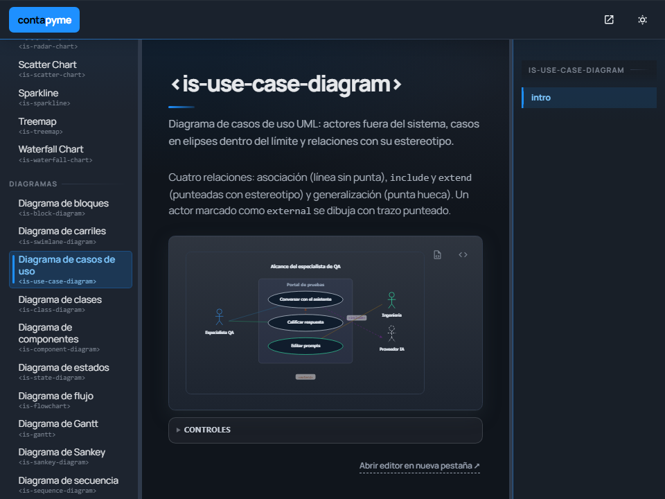

### ✅ is-venn-diagram

- **Lede**: Diagrama de Venn de dos o tres conjuntos, con las posiciones canónicas de cualquier libro de texto.
- **Vista (DOM vivo)**: is-venn-diagram — Diagrama de Venn de dos o tres conjuntos, con las posiciones canónicas de cualquier libro de texto.
- **Captura**: 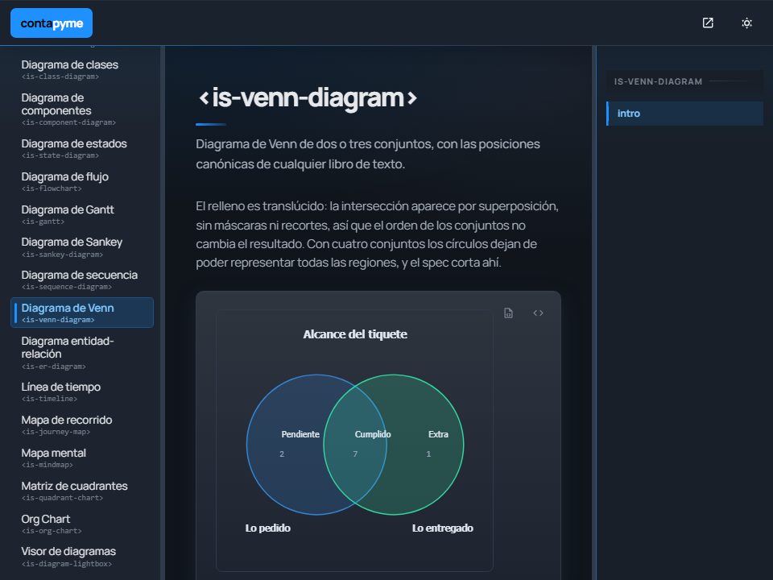

## feedback

### ✅ is-badge

- **Lede**: Etiqueta compacta con variantes semánticas y apariencias.
- **Vista (DOM vivo)**: is-badge — Etiqueta compacta con variantes semánticas y apariencias.
- **Captura**: 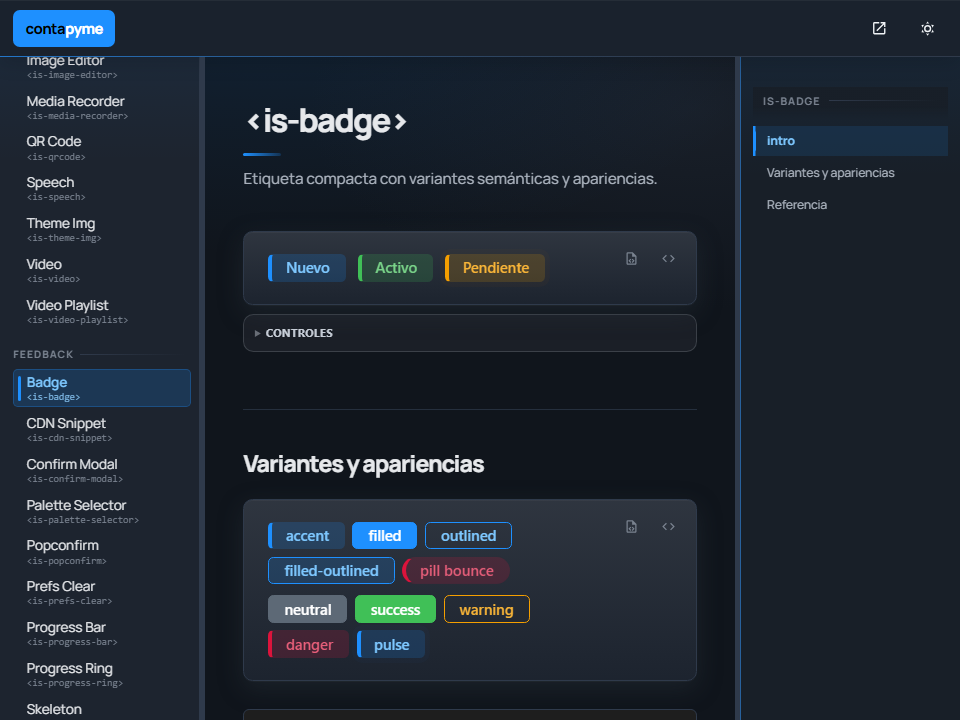

### ✅ is-cdn-snippet

- **Lede**: Panel copy-paste vía loader.min.js : un &lt;script type="module" src&gt; + un script que hace loadCSS* y load(tag\|categoría\|all) . Radio para elegir el alcance.
- **Vista (DOM vivo)**: is-cdn-snippet — Panel copy-paste vía loader.min.js: un
          <script type="module" src> + un script que hace
          loadCSS* y load(tag\|categoría\|all). Radio para elegir el alcance.
- **Captura**: 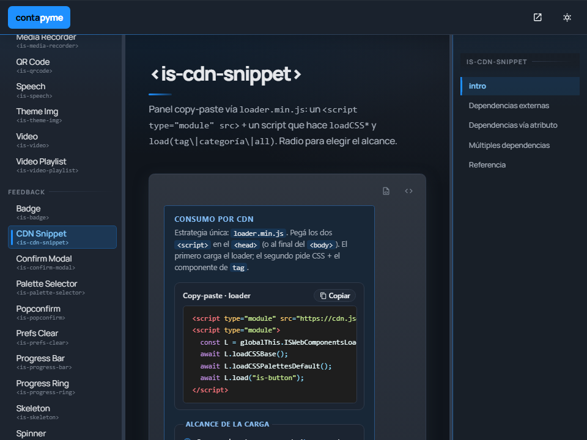

### ✅ is-confirm-modal

- **Descripción**: Documentación y demos de is-confirm-modal de InSoft.
- **Lede**: Confirmación en modal centrado con backdrop. Para decisiones que merecen foco total. Si prefieres confirmar en línea sin tapar la pantalla, usa &lt;is-popconfirm&gt; .
- **Vista (DOM vivo)**: is-confirm-modal — Confirmación en modal centrado con backdrop. Para decisiones que
          merecen foco total. Si prefieres confirmar en línea sin tapar la
          pantalla, usa <is-popconfirm>.
- **Captura**: 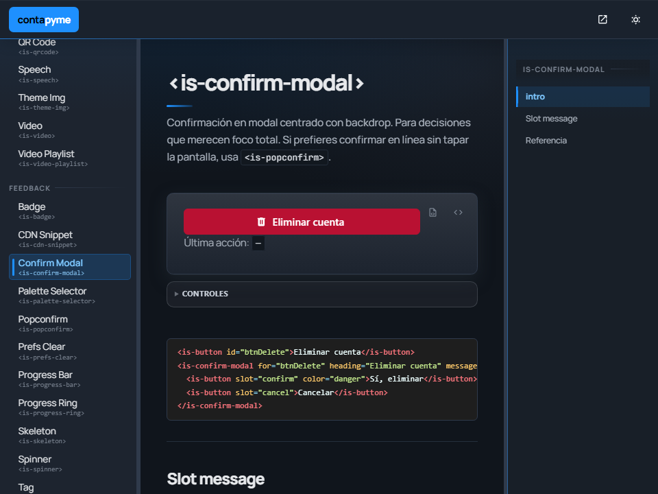

### ✅ is-palette-selector

- **Lede**: Selector visual de paletas de marca. Por defecto expone las 3 paletas de styles/palettes.css ; el consumidor puede pasar su propio array JSON para usar SU marca y SU CSS, y opcionalmente inyectar un trigger personalizado en el slot trigger .
- **Vista (DOM vivo)**: is-palette-selector — Selector visual de paletas de marca. Por defecto expone las 3 paletas de styles/palettes.css; el consumidor puede pasar su propio array JSON para usar SU marca y SU CSS, y opcionalmente inyectar un trigger personalizado en el slot trigger.
- **Captura**: 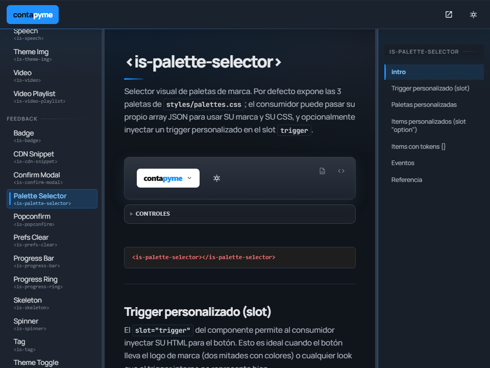

### ✅ is-popconfirm

- **Descripción**: Documentación y demos de is-popconfirm de InSoft.
- **Lede**: Cuadro de confirmación rápido anclado a un botón. Sin modal, sin tapar la pantalla. Perfecto para "¿Seguro que quieres borrar?" en línea.
- **Vista (DOM vivo)**: is-popconfirm — Cuadro de confirmación rápido anclado a un botón. Sin modal, sin tapar
          la pantalla. Perfecto para "¿Seguro que quieres borrar?" en línea.
- **Captura**: 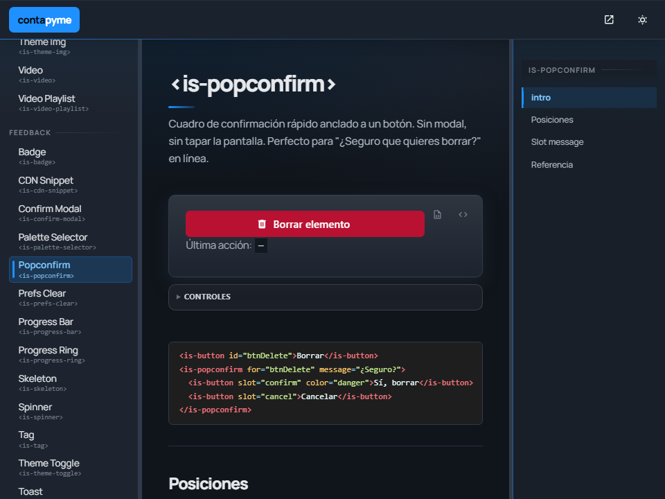

### ✅ is-prefs-clear

- **Lede**: Borra localStorage['is-webcomponents'] (splits, scrolls, grids) para auditar la carga inicial limpia.
- **Vista (DOM vivo)**: is-prefs-clear — Borra localStorage['is-webcomponents'] (splits, scrolls, grids) para auditar la carga inicial limpia.
- **Captura**: 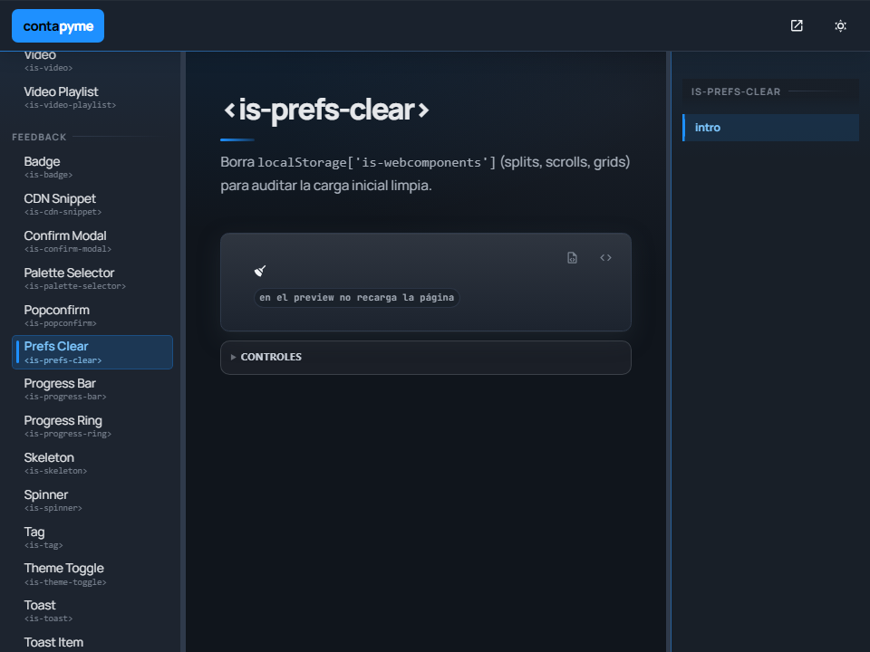

### ✅ is-progress-bar

- **Título**: Progress Bar
- **Lede**: &lt;is-progress-bar&gt;
- **Vista (DOM vivo)**: is-progress-bar — <is-progress-bar>
- **Captura**: 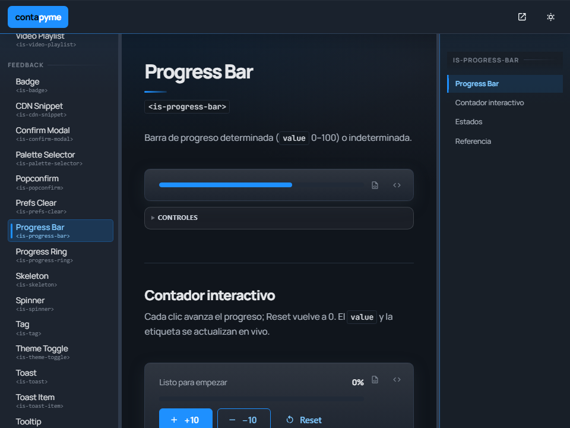

### ✅ is-progress-ring

- **Título**: Progress Ring
- **Lede**: &lt;is-progress-ring&gt;
- **Vista (DOM vivo)**: is-progress-ring — <is-progress-ring>
- **Captura**: 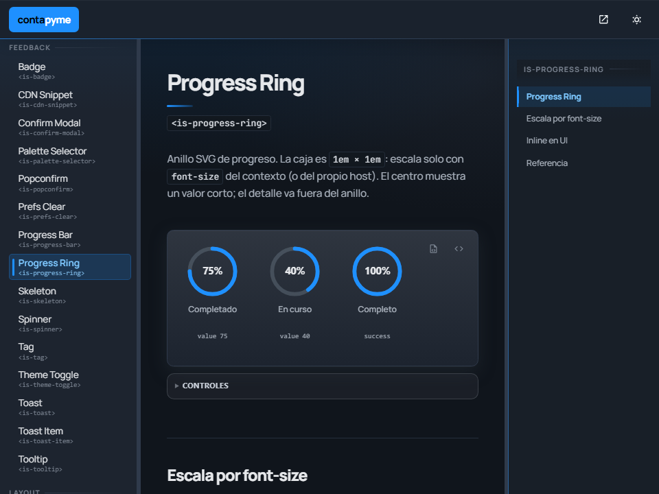

### ✅ is-skeleton

- **Título**: Skeleton
- **Lede**: &lt;is-skeleton&gt;
- **Vista (DOM vivo)**: is-skeleton — <is-skeleton>
- **Captura**: 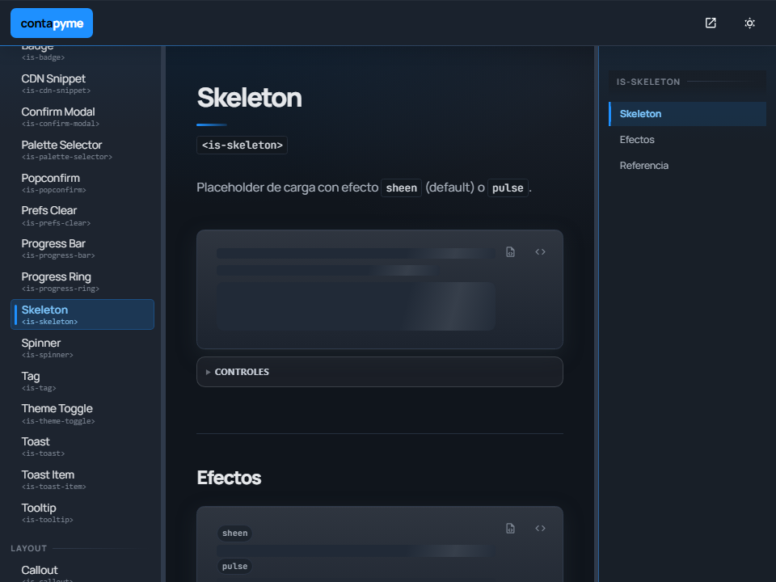

### ✅ is-spinner

- **Lede**: Indicador de carga animado. Sin atributos; personalizable vía CSS vars.
- **Vista (DOM vivo)**: is-spinner — Indicador de carga animado. Sin atributos; personalizable vía CSS vars.
- **Captura**: 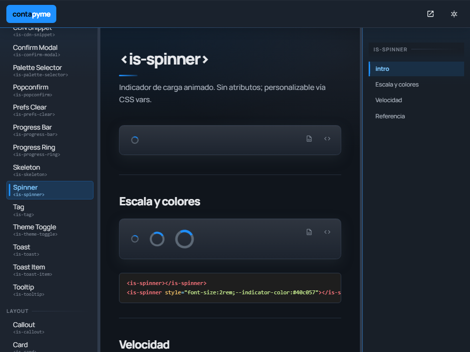

### ✅ is-tag

- **Lede**: Etiqueta interactiva con variantes y botón de quitar opcional. Escala con font-size del contexto.
- **Vista (DOM vivo)**: is-tag — Etiqueta interactiva con variantes y botón de quitar opcional. Escala con font-size del contexto.
- **Captura**: 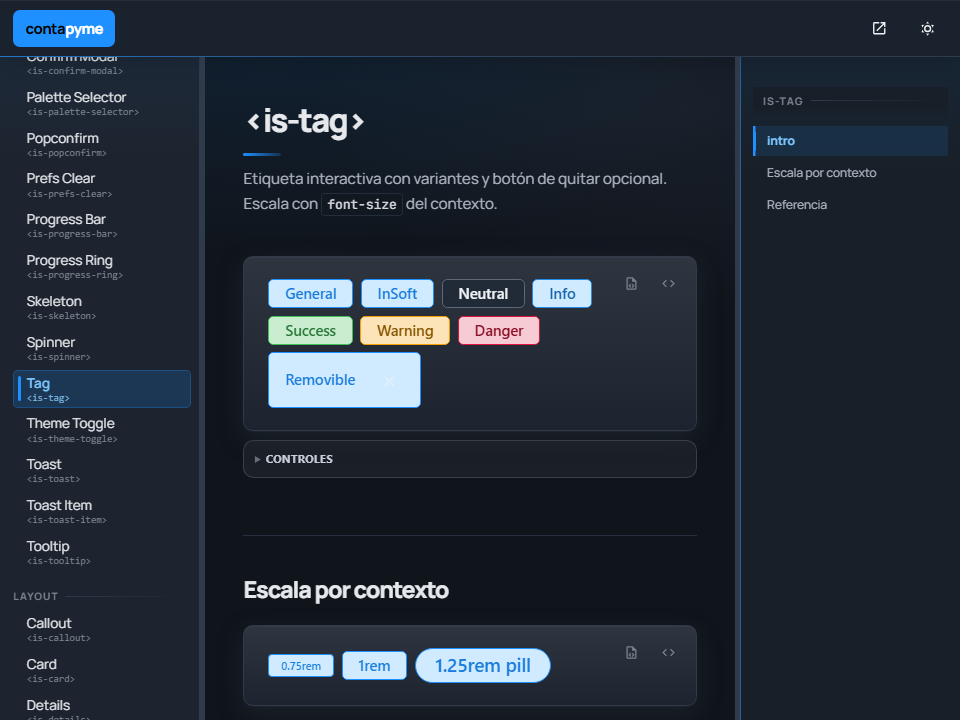

### ✅ is-theme-toggle

- **Lede**: Alterna el tema del contenedor más cercano ( [container-theme] / .container-theme / .theme-dark|.theme-light / [data-theme] ; si no hay, &lt;html&gt; ). Compone is-check-icon-button (noche ↔ sol). Emite theme-toggle con detail.theme y detail.container .
- **Vista (DOM vivo)**: is-theme-toggle — Alterna el tema del contenedor más cercano
          ([container-theme] / .container-theme
          / .theme-dark|.theme-light / [data-theme];
          si no hay, <html>).
          Compone is-check-icon-button (noche ↔ sol).
          Emite theme-toggle con detail.theme y
    
- **Captura**: 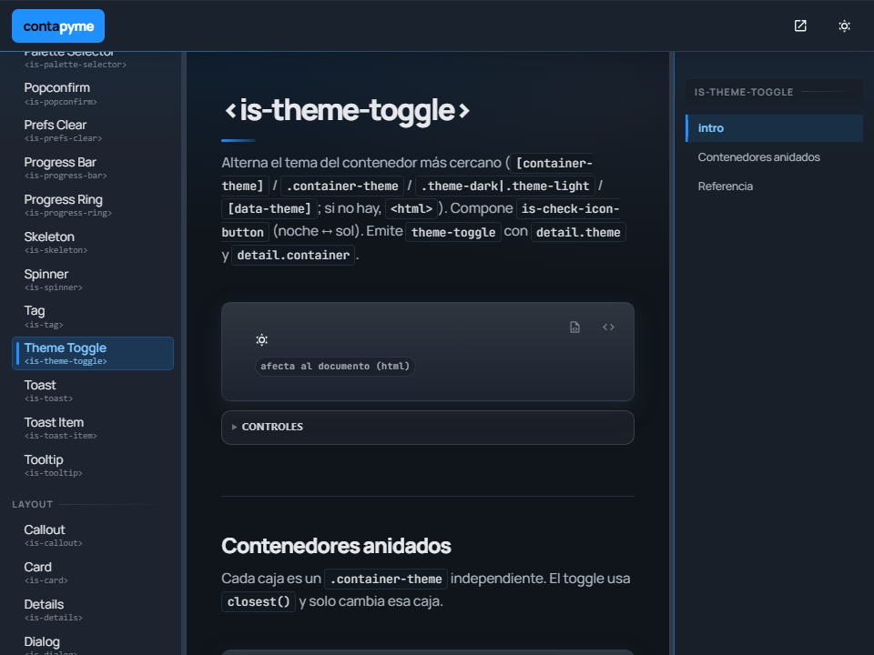

### ✅ is-toast

- **Lede**: Contenedor fijo de notificaciones. Crea ítems con create() o declara &lt;is-toast-item&gt; .
- **Vista (DOM vivo)**: is-toast — Contenedor fijo de notificaciones. Crea ítems con create() o declara <is-toast-item>.
- **Captura**: 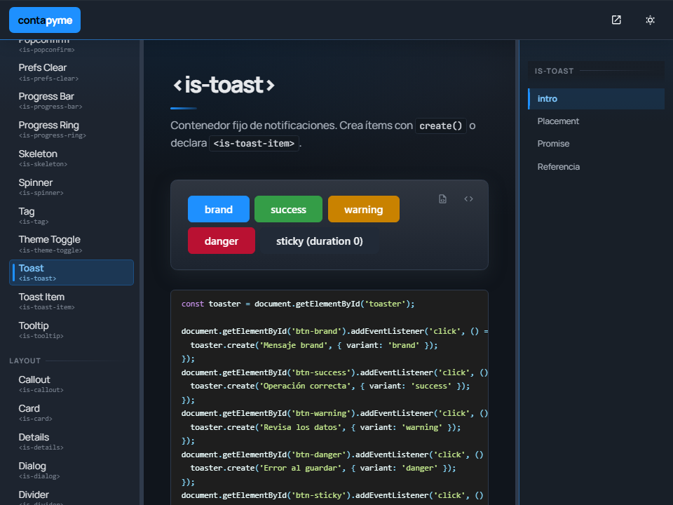

### ✅ is-toast-item

- **Descripción**: Documentación y demos de is-toast-item de InSoft.
- **Lede**: Ítem individual de notificación. Se crea normalmente con toaster.create() , pero también se puede declarar suelto para controlar su ciclo de vida a mano.
- **Vista (DOM vivo)**: is-toast-item — Ítem individual de notificación. Se crea normalmente con toaster.create(), pero también se puede declarar suelto para controlar su ciclo de vida a mano.
- **Captura**: 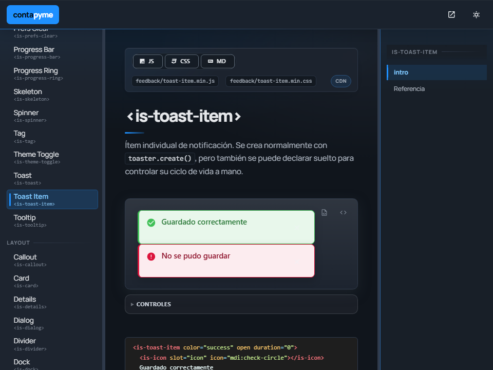

### ✅ is-tooltip

- **Lede**: Tip breve anclado con for . Depende de is-popover .
- **Vista (DOM vivo)**: is-tooltip — Tip breve anclado con for. Depende de is-popover.
- **Captura**: 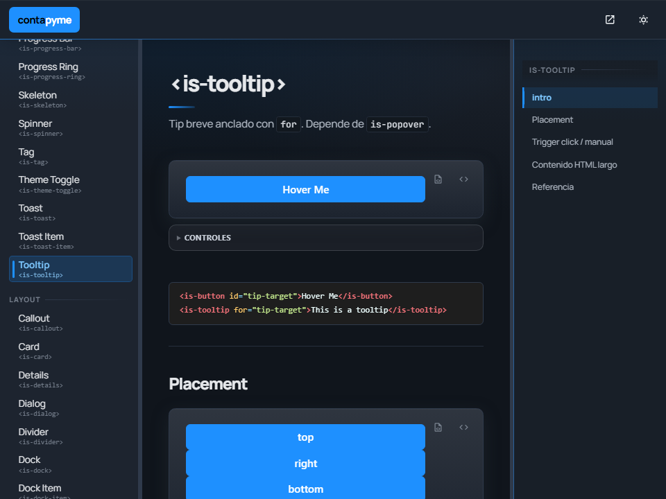

## forms

### ✅ is-checkbox

- **Lede**: Casilla form-associated con paridad funcional con el Checkbox de MUI : entra en FormData y en la validación nativa del &lt;form&gt; sin input oculto, con color por variant , posición de etiqueta, iconos propios y estado de error.
- **Vista (DOM vivo)**: is-checkbox — Casilla form-associated con paridad funcional con el
          Checkbox de MUI:
          entra en FormData y en la validación nativa del <form>
          sin input oculto, con color por variant, posición de etiqueta, iconos propios y
          estado de error.
- **Captura**: 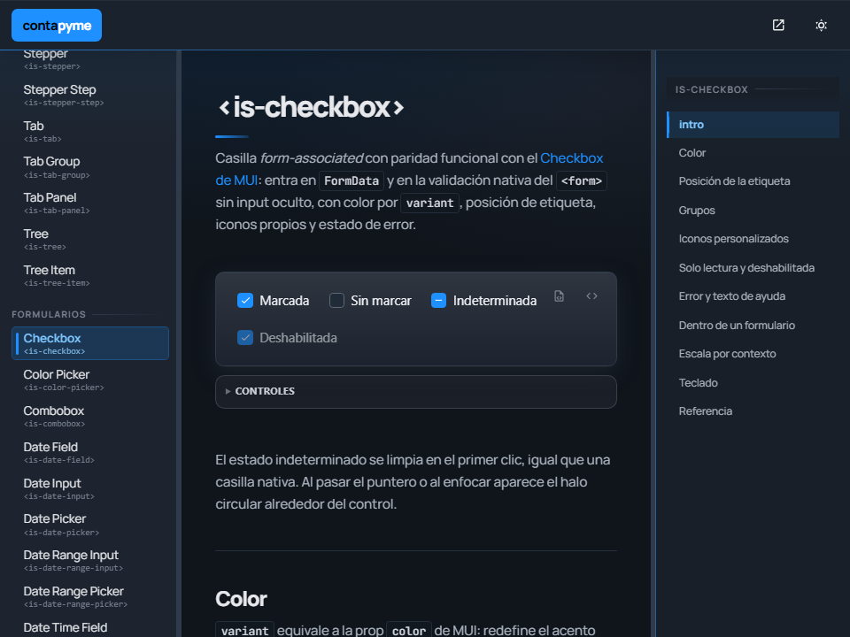

### ✅ is-color-picker

- **Lede**: Trigger con muestra + hex. El panel ( input type="color" , campo hex y paleta) vive en un &lt;dialog&gt; en el top layer.
- **Vista (DOM vivo)**: is-color-picker — Trigger con muestra + hex. El panel (input type="color", campo hex y paleta) vive en un <dialog> en el top layer.
- **Captura**: 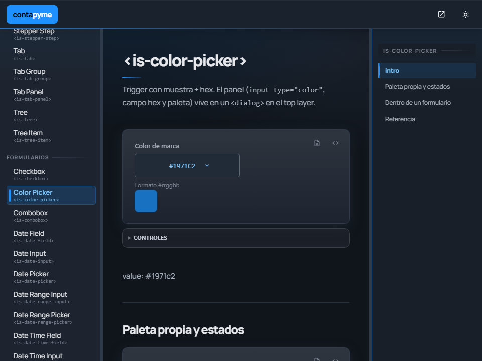

### ✅ is-combobox

- **Lede**: Input + listbox filtrable con teclado y opciones is-option .
- **Vista (DOM vivo)**: is-combobox — Input + listbox filtrable con teclado y opciones is-option.
- **Captura**: 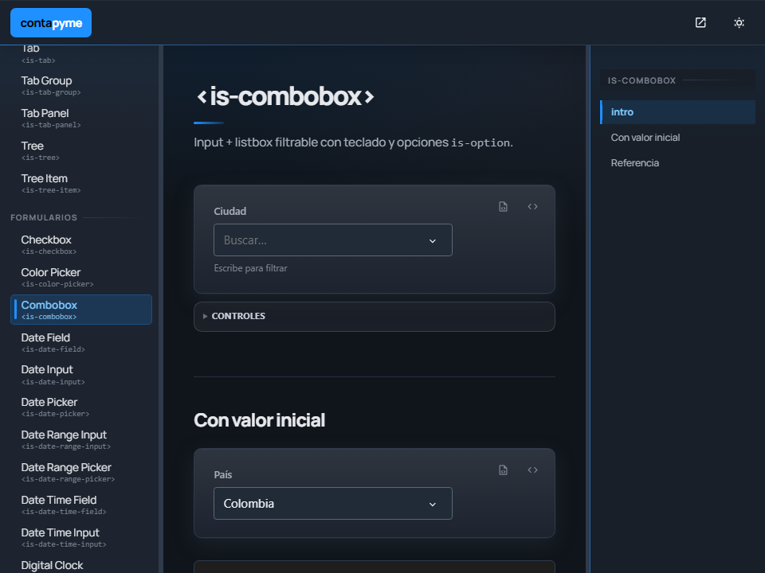

### ✅ is-date-field

- **Lede**: Campo editable por secciones (DateField de MUI X). Cada sección es un spinbutton: flechas, dígitos, izquierda/derecha, Retroceso. El orden lo decide el locale.
- **Vista (DOM vivo)**: is-date-field — Campo editable por secciones (DateField de MUI X). Cada sección es un spinbutton: flechas, dígitos, izquierda/derecha, Retroceso. El orden lo decide el locale.
- **Captura**: 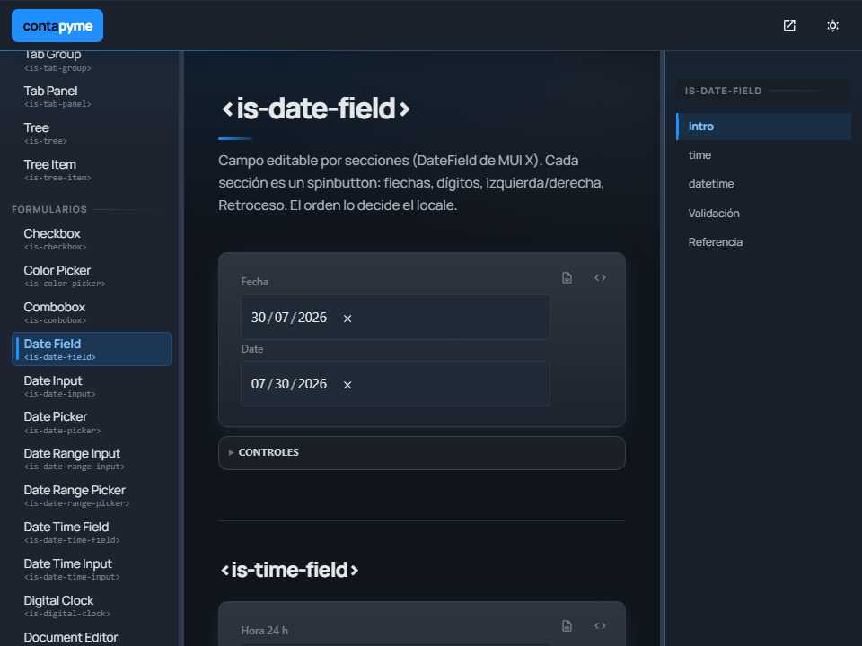

### ✅ is-date-input

- **Lede**: Campo + calendario en un panel del top layer (DatePicker de MUI X). Edita por secciones o abre el calendario. Alt+↓ abre el panel.
- **Vista (DOM vivo)**: is-date-input — Campo + calendario en un panel del top layer (DatePicker de MUI X). Edita por secciones o abre el calendario. Alt+↓ abre el panel.
- **Captura**: 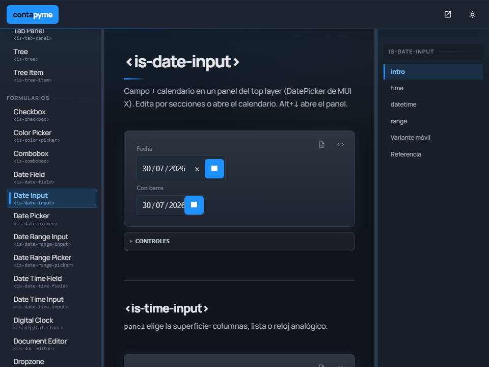

### ✅ is-date-picker

- **Lede**: Calendario inline (DateCalendar de MUI X ). Tres vistas (día, mes, año), teclado, números de semana y reglas de deshabilitado. El mes y el año del encabezado abren un is-dropdown .
- **Vista (DOM vivo)**: is-date-picker — Calendario inline (DateCalendar de MUI X). Tres vistas (día, mes, año), teclado, números de semana y reglas de deshabilitado. El mes y el año del encabezado abren un is-dropdown.
- **Captura**: 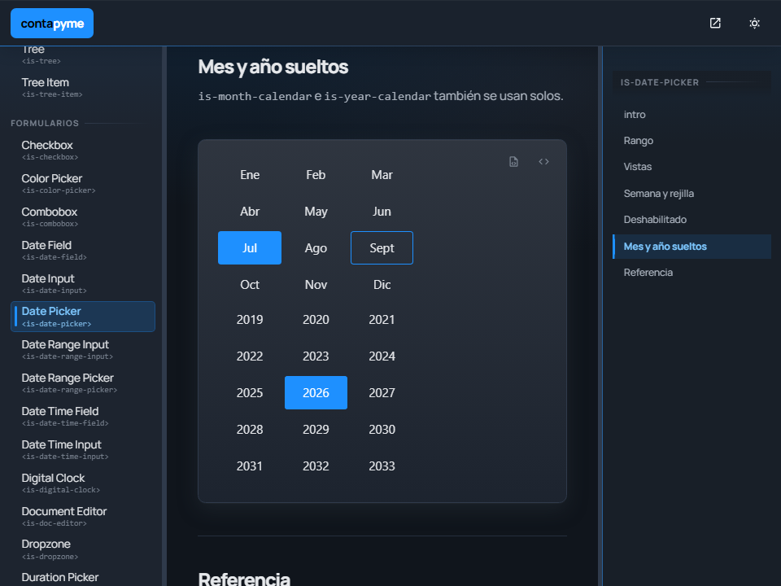

### ✅ is-date-range-input

- **Descripción**: Documentación y demos de is-date-range-input de InSoft.
- **Lede**: Entrada de rango de fechas: una sola caja para inicio y fin.
- **Vista (DOM vivo)**: is-date-range-input — Entrada de rango de fechas: una sola caja para inicio y fin.
- **Captura**: 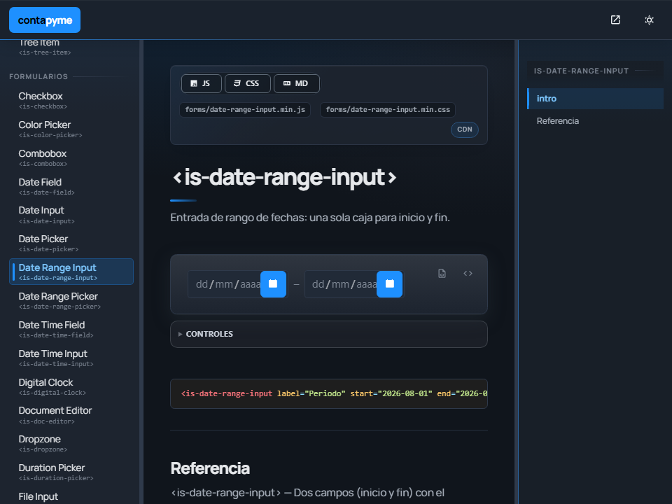

### ✅ is-date-range-picker

- **Lede**: Rango de fechas con varios meses a la vista y panel de atajos (DateRangeCalendar de MUI X). El hover en un mes pinta la banda tentativa en todos.
- **Vista (DOM vivo)**: is-date-range-picker — Rango de fechas con varios meses a la vista y panel de atajos (DateRangeCalendar de MUI X). El hover en un mes pinta la banda tentativa en todos.
- **Captura**: 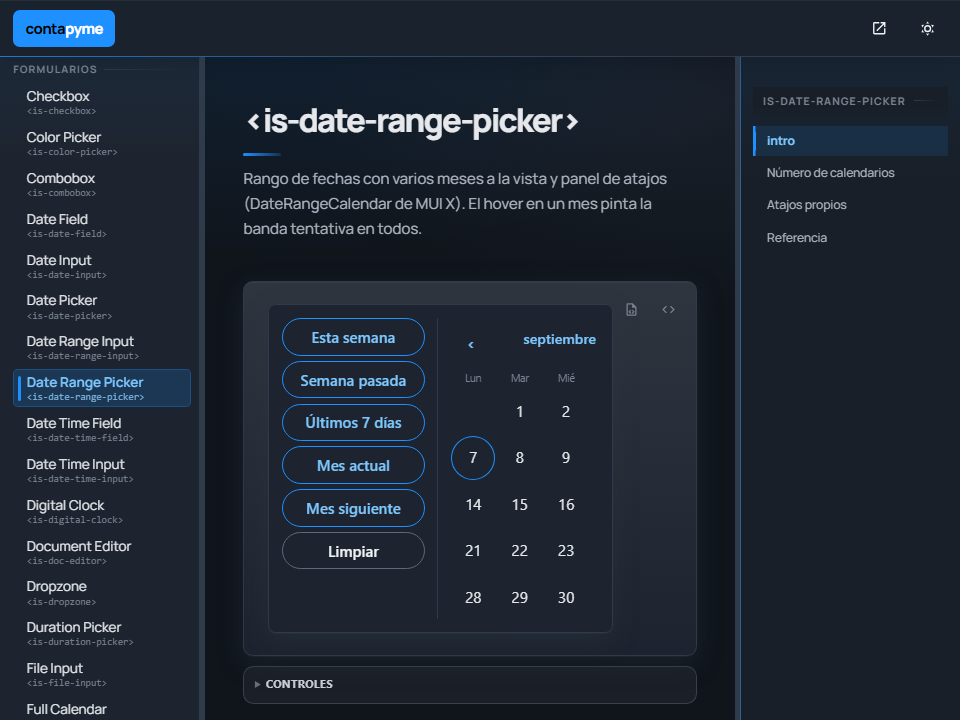

### ✅ is-date-time-field

- **Descripción**: Documentación y demos de is-date-time-field de InSoft.
- **Lede**: Campo combinado de fecha y hora en un solo control.
- **Vista (DOM vivo)**: is-date-time-field — Campo combinado de fecha y hora en un solo control.
- **Captura**: 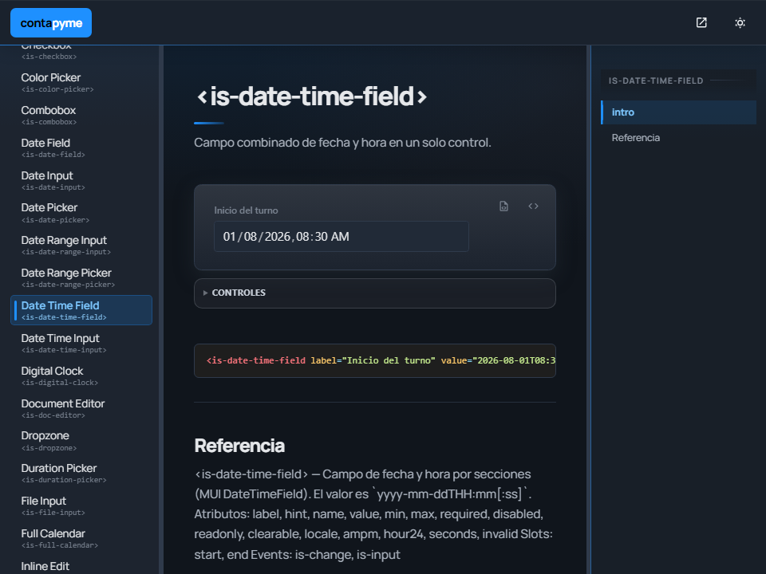

### ✅ is-date-time-input

- **Descripción**: Documentación y demos de is-date-time-input de InSoft.
- **Lede**: Entrada de fecha y hora con calendario y reloj en el mismo desplegable.
- **Vista (DOM vivo)**: is-date-time-input — Entrada de fecha y hora con calendario y reloj en el mismo desplegable.
- **Captura**: 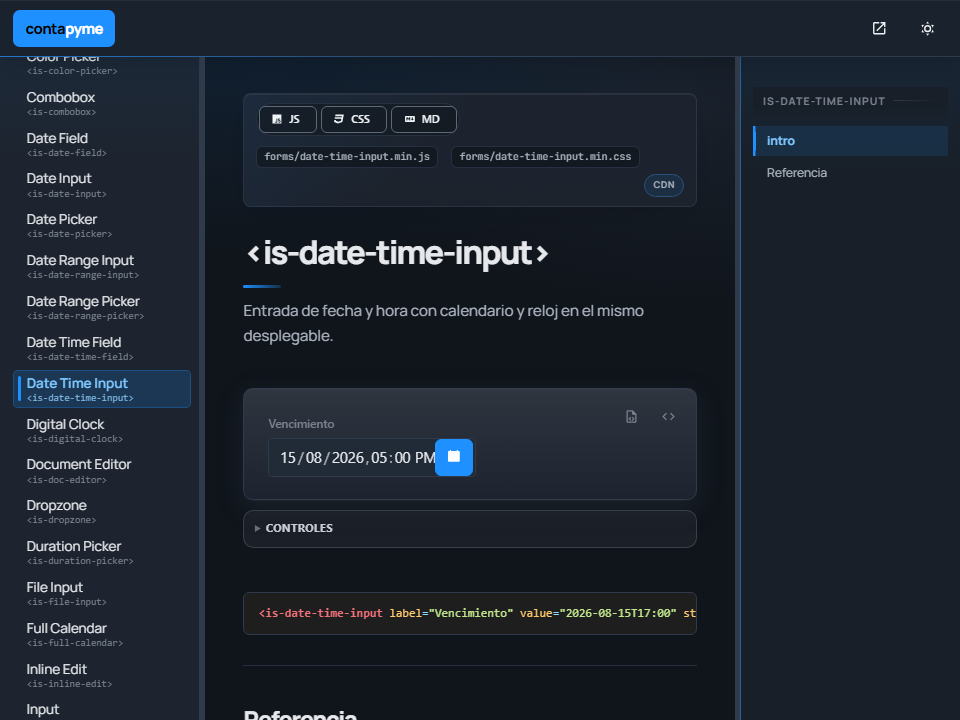

### ✅ is-digital-clock

- **Descripción**: Documentación y demos de is-digital-clock de InSoft.
- **Lede**: Reloj digital: muestra la hora en formato numérico y admite selección por teclado.
- **Vista (DOM vivo)**: is-digital-clock — Reloj digital: muestra la hora en formato numérico y admite selección por teclado.
- **Captura**: 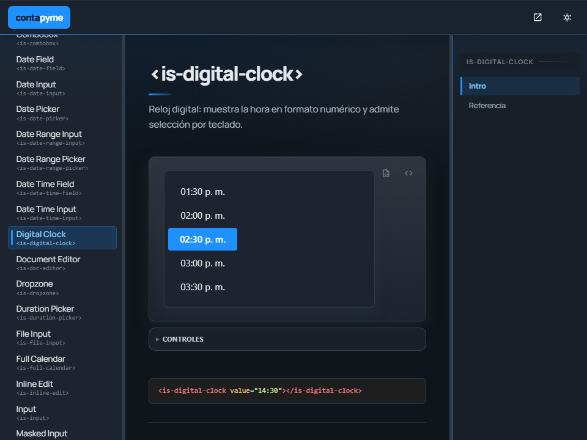

### ✅ is-doc-editor

- **Lede**: Editor por bloques tipo Notion. Escribe / al inicio de una línea para cambiar el tipo. Enter crea otro bloque, Backspace sobre texto vacío elimina.
- **Vista (DOM vivo)**: is-doc-editor — Editor por bloques tipo Notion. Escribe / al inicio de una línea para cambiar el tipo. Enter crea otro bloque, Backspace sobre texto vacío elimina.
- **Captura**: 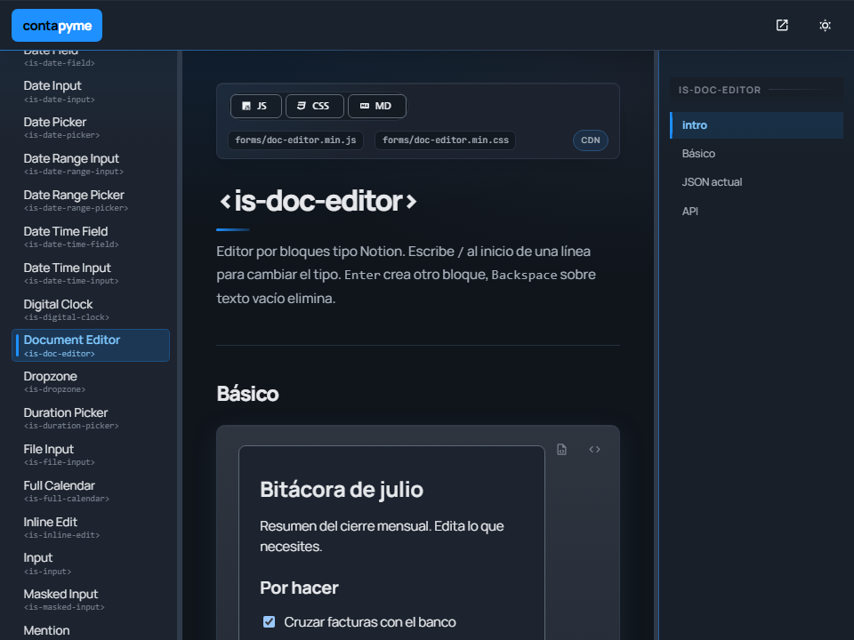

### ✅ is-dropzone

- **Lede**: Zona de arrastre con cola de archivos, preview de imagen, límite de tamaño y simulación de progreso chunked.
- **Vista (DOM vivo)**: is-dropzone — Zona de arrastre con cola de archivos, preview de imagen, límite de tamaño y simulación de progreso chunked.
- **Captura**: 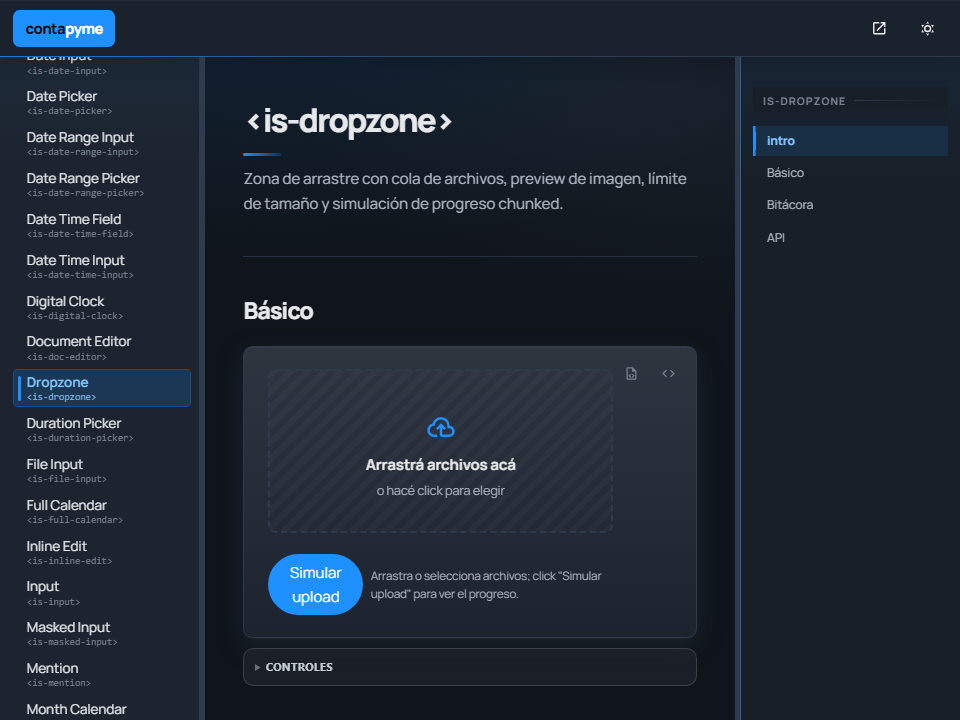

### ✅ is-duration-picker

- **Lede**: Duración HH:MM:SS. Tres columnas con botones ±, inputs numéricos y saltos con : o Tab .
- **Vista (DOM vivo)**: is-duration-picker — Duración HH:MM:SS. Tres columnas con botones ±, inputs numéricos y saltos con : o Tab.
- **Captura**: 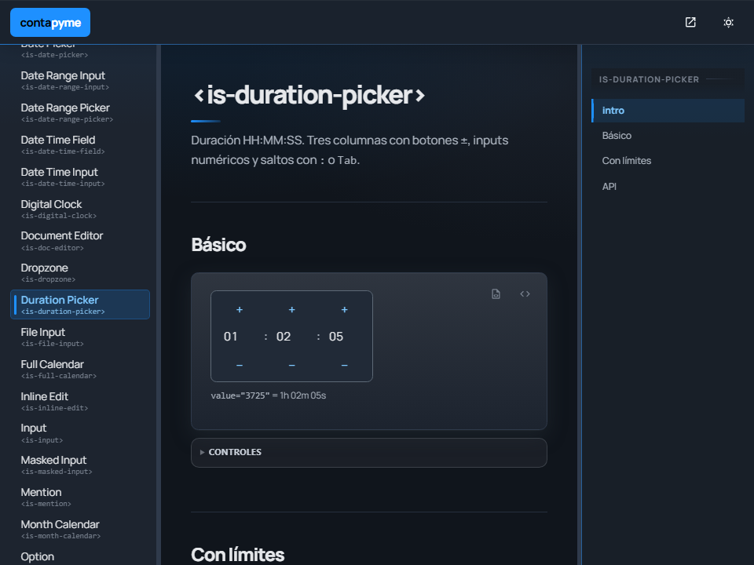

### ✅ is-file-input

- **Lede**: Dropzone con input nativo oculto, lista de archivos y estados blank / dragging .
- **Vista (DOM vivo)**: is-file-input — Dropzone con input nativo oculto, lista de archivos y estados blank / dragging.
- **Captura**: 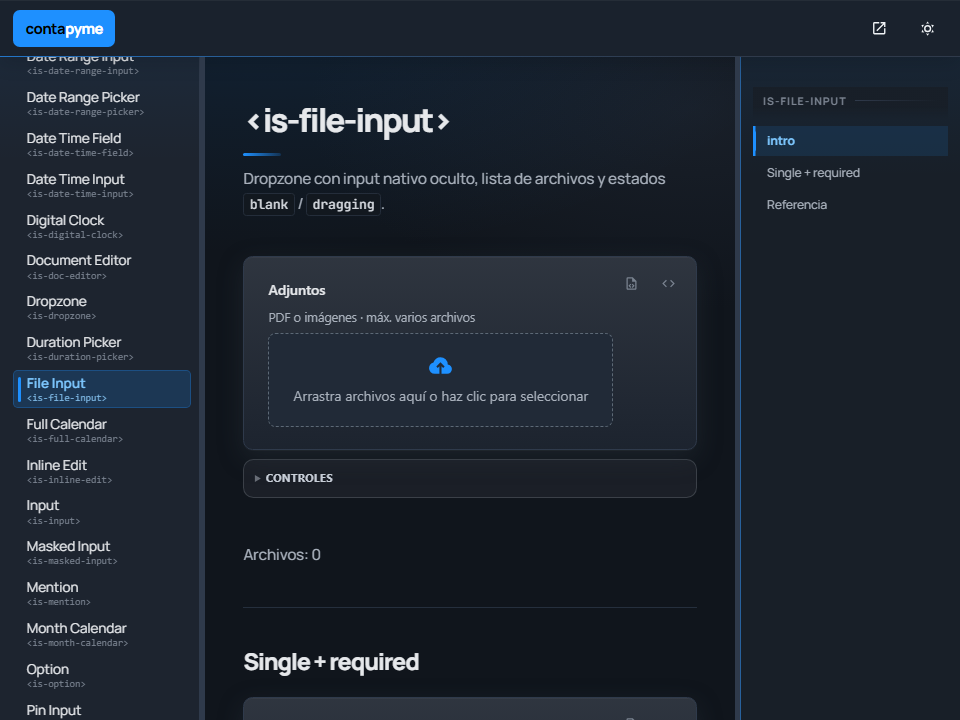

### ✅ is-full-calendar

- **Lede**: Vista mes / semana / día con eventos por día y franjas horarias en week/day.
- **Vista (DOM vivo)**: is-full-calendar — Vista mes / semana / día con eventos por día y franjas horarias en week/day.
- **Captura**: 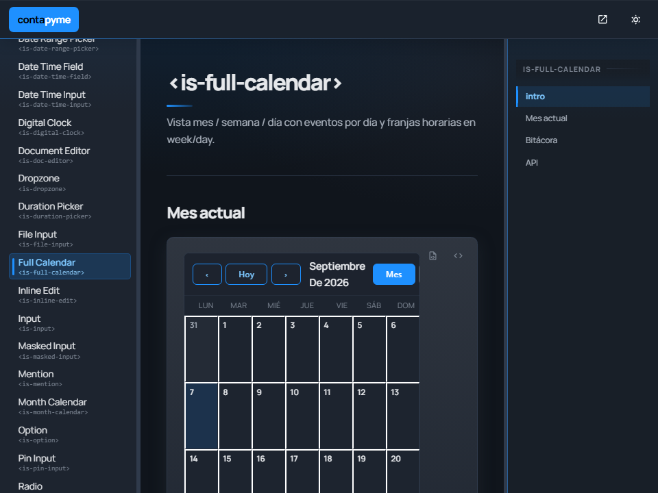

### ✅ is-inline-edit

- **Lede**: Texto plano que se vuelve editable al clic. Enter guarda y sale. Esc cancela y revierte. Blur guarda por defecto; usá cancel-on-blur para invertirlo.
- **Vista (DOM vivo)**: is-inline-edit — Texto plano que se vuelve editable al clic. Enter guarda y sale. Esc cancela y revierte. Blur guarda por defecto; usá cancel-on-blur para invertirlo.
- **Captura**: 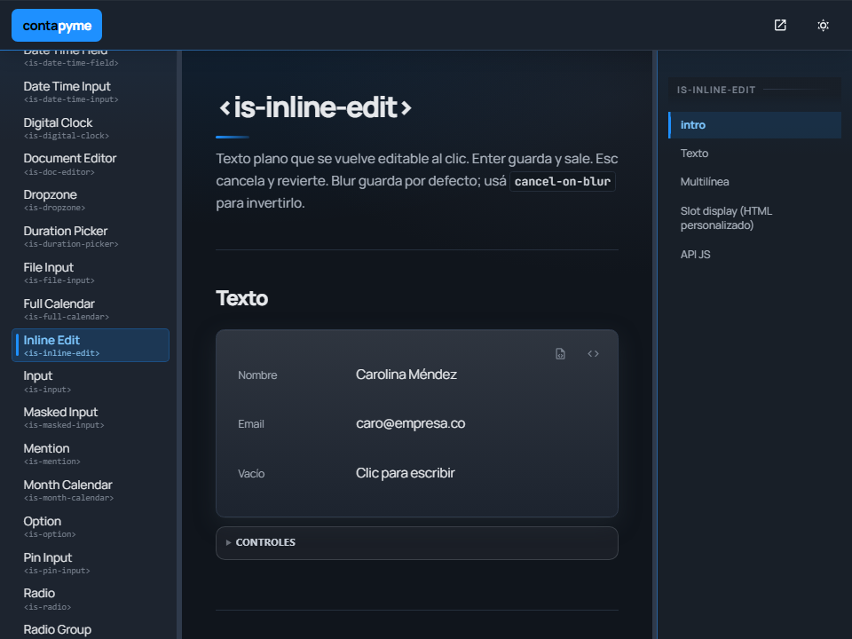

### ✅ is-input

- **Lede**: Campo de texto form-associated con paridad funcional con el TextField de MUI : tres appearances , estado de error ligado a la validación nativa, adornos, contador de caracteres y ancho controlable. Participa en &lt;form&gt; vía ElementInternals .
- **Vista (DOM vivo)**: is-input — Campo de texto form-associated con paridad funcional con el
          TextField de MUI:
          tres appearances, estado de error ligado a la validación nativa, adornos, contador de
          caracteres y ancho controlable. Participa en <form> vía
          ElementInternals.
- **Captura**: 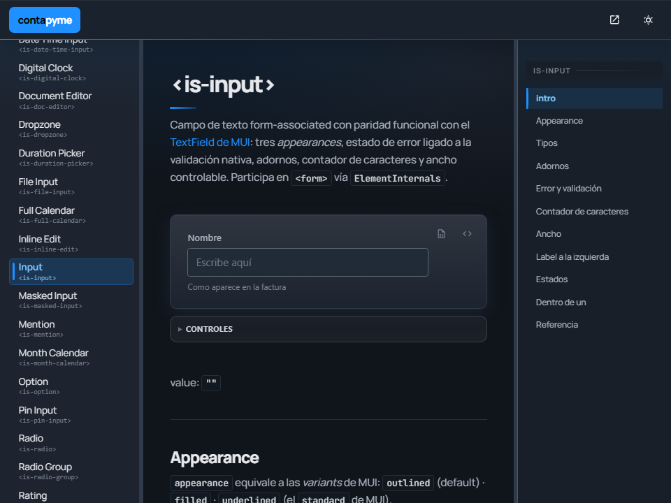

### ✅ is-masked-input

- **Lede**: Campo de texto que aplica un patrón mientras el usuario tipea. Útil para tarjetas, fechas, teléfonos y todo formato con estructura fija.
- **Vista (DOM vivo)**: is-masked-input — Campo de texto que aplica un patrón mientras el usuario tipea. Útil para tarjetas, fechas, teléfonos y todo formato con estructura fija.
- **Captura**: 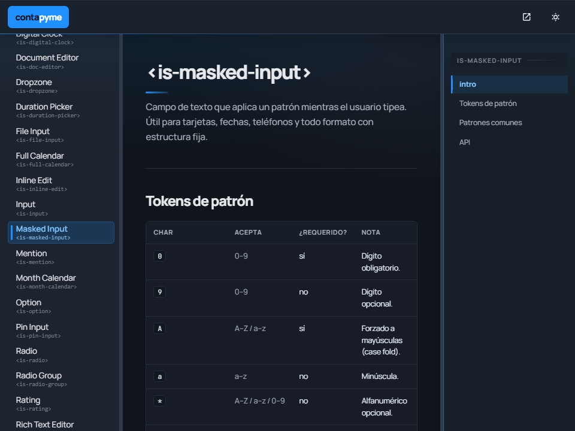

### ✅ is-mention

- **Lede**: Input con autocompletado al tipear @ (usuario) o # (etiqueta). Popup se posiciona y se navega con flechas + Enter.
- **Vista (DOM vivo)**: is-mention — Input con autocompletado al tipear @ (usuario) o # (etiqueta). Popup se posiciona y se navega con flechas + Enter.
- **Captura**: 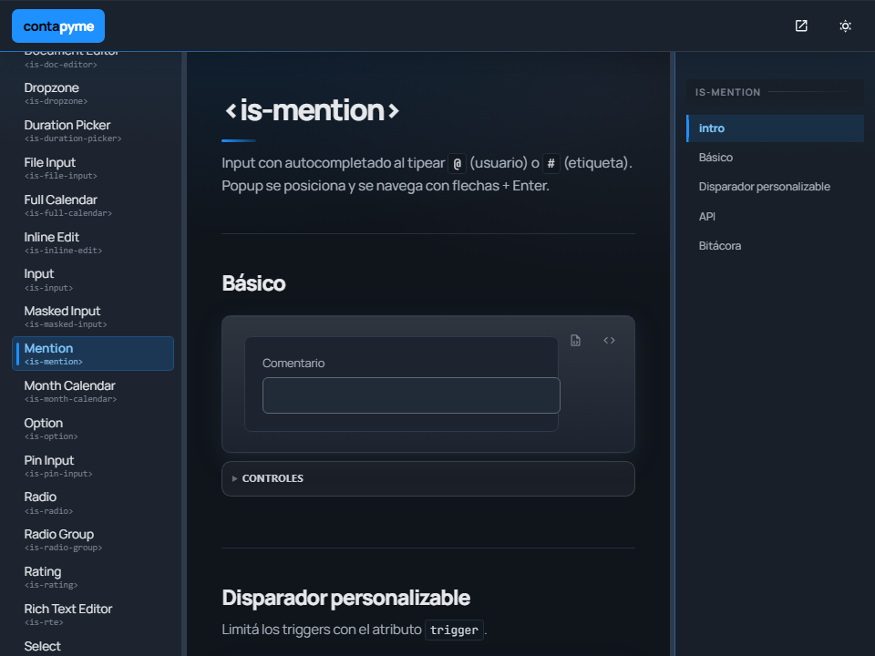

### ✅ is-month-calendar

- **Descripción**: Documentación y demos de is-month-calendar de InSoft.
- **Lede**: Calendario de un mes, suelto. Es la pieza que &lt;is-date-picker&gt; usa por dentro, y sirve por sí sola para vistas de agenda.
- **Vista (DOM vivo)**: is-month-calendar — Calendario de un mes, suelto. Es la pieza que <is-date-picker> usa por dentro, y sirve por sí sola para vistas de agenda.
- **Captura**: 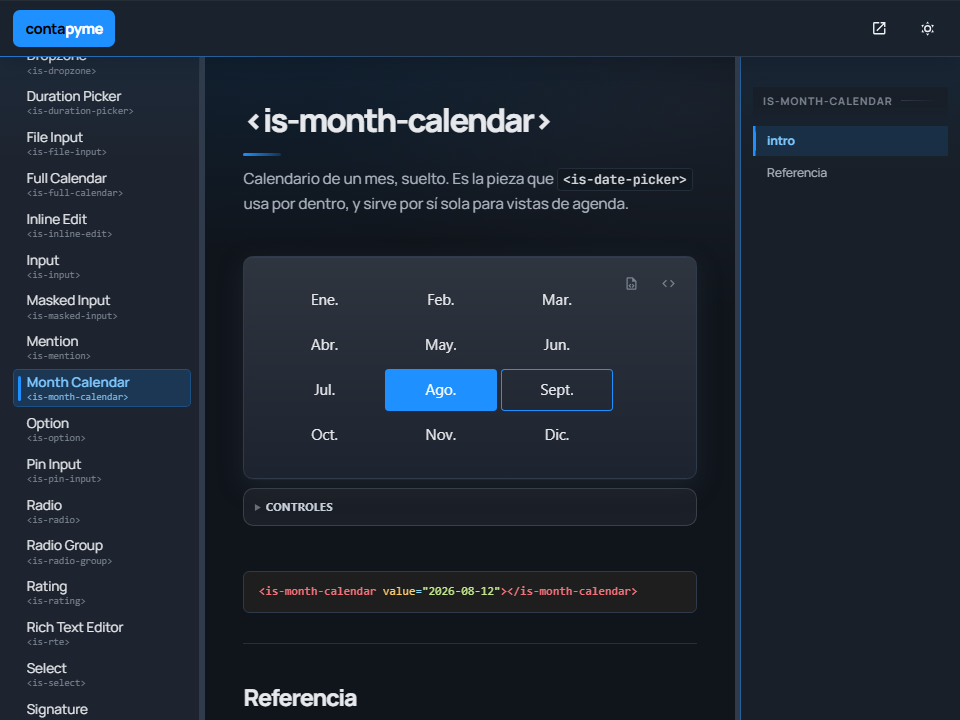

### ✅ is-option

- **Descripción**: Documentación y demos de is-option de InSoft.
- **Lede**: Opción de un &lt;is-combobox&gt; o &lt;is-select&gt; . El value es lo que expone el control; el contenido es lo que ve el usuario.
- **Vista (DOM vivo)**: is-option — Opción de un <is-combobox> o <is-select>. El value es lo que expone el control; el contenido es lo que ve el usuario.
- **Captura**: 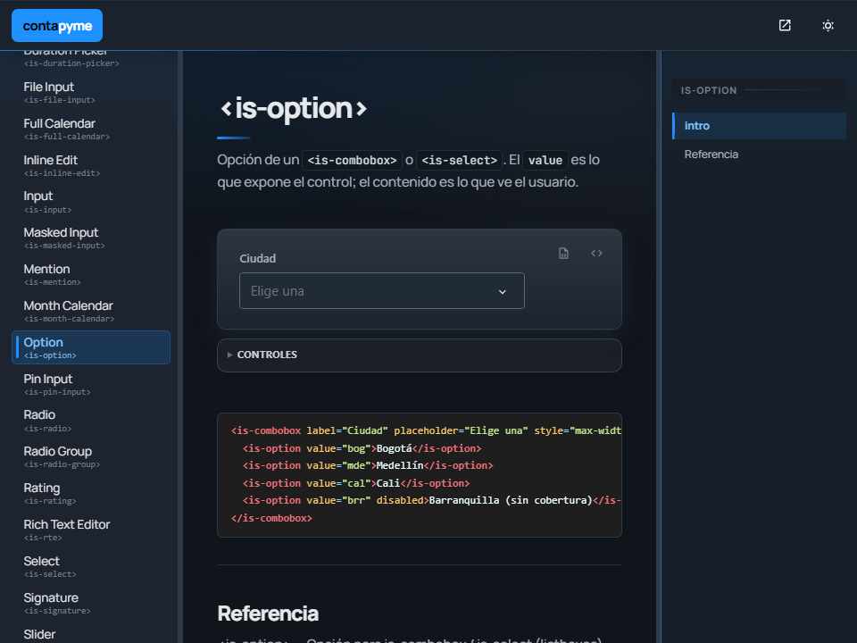

### ✅ is-pin-input

- **Descripción**: Documentación y demos de is-pin-input de InSoft.
- **Lede**: Casillas para OTP / PIN de 3 a 8 dígitos. Auto-avance al escribir, Backspace retrocede, pegar reparte todos los dígitos, navegación con flechas y soporte para enmascarar el contenido.
- **Vista (DOM vivo)**: is-pin-input — Casillas para OTP / PIN de 3 a 8 dígitos. Auto-avance al escribir,
          Backspace retrocede, pegar reparte todos los dígitos, navegación con
          flechas y soporte para enmascarar el contenido.
- **Captura**: 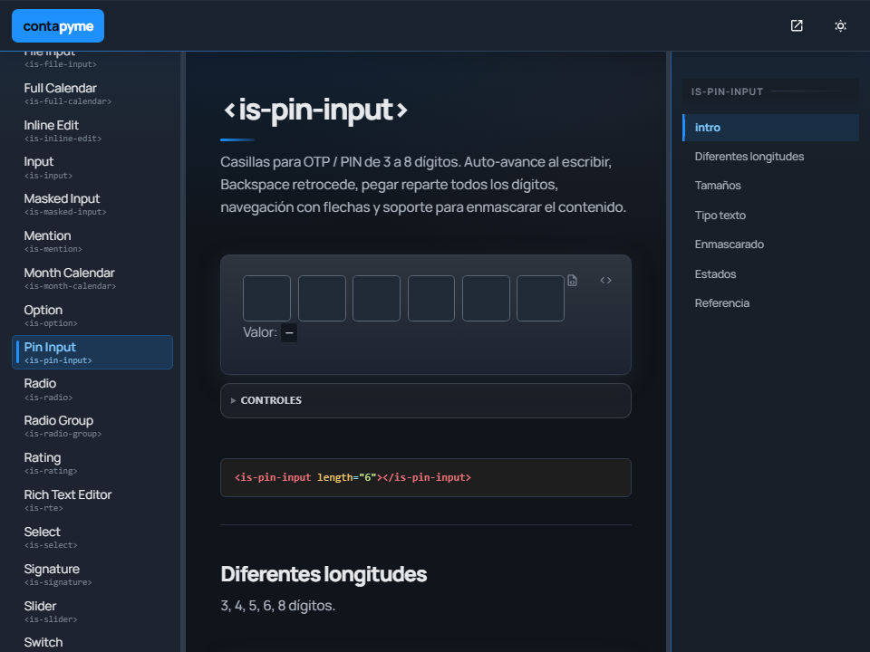

### ✅ is-radio

- **Título**: +
- **Lede**: Paridad funcional con el Radio Group de MUI : color por variant , posición de etiqueta, estado de error, solo lectura y navegación por teclado según el patrón ARIA radiogroup . El grupo es el elemento form-associated : publica el valor, valida y gobierna el teclado. Los is-radio son las opciones y solo avisan al grupo cuando se eligen.
- **Vista (DOM vivo)**: is-radio — Paridad funcional con el
          Radio Group de MUI:
          color por variant, posición de etiqueta, estado de error, solo lectura y
          navegación por teclado según el patrón ARIA radiogroup.
          El grupo es el elemento form-associated: publica el valor, valida 
- **Captura**: 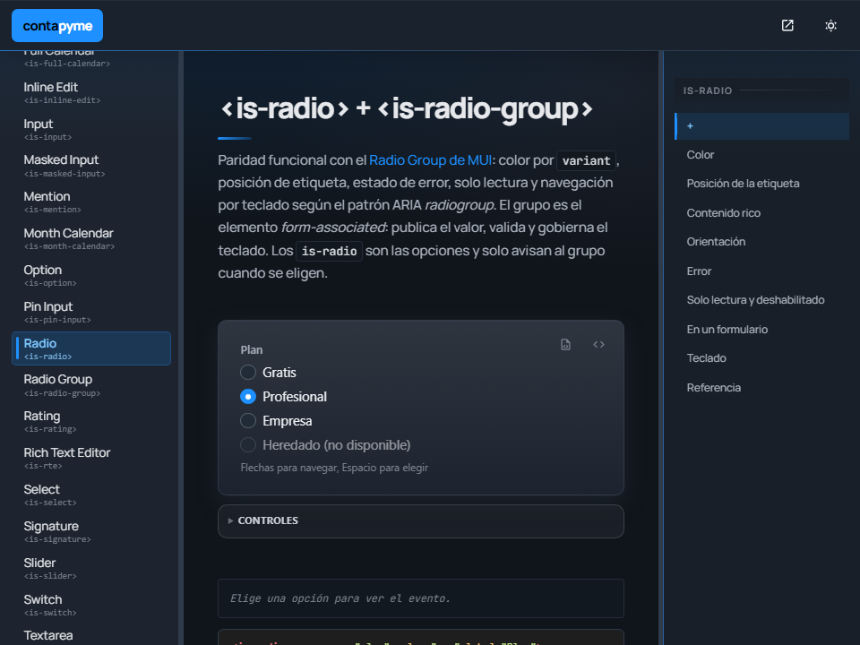

### ✅ is-radio-group

- **Descripción**: Documentación y demos de is-radio-group de InSoft.
- **Lede**: Agrupa varios &lt;is-radio&gt; bajo un mismo nombre y expone el valor seleccionado como un único control de formulario.
- **Vista (DOM vivo)**: is-radio-group — Agrupa varios <is-radio> bajo un mismo nombre y expone el valor seleccionado como un único control de formulario.
- **Captura**: 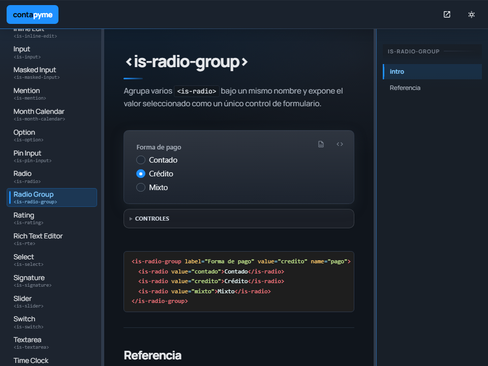

### ✅ is-rating

- **Lede**: Valoración form-associated con paridad funcional con el Rating de MUI : precisión arbitraria, iconos propios, textos de hover, variantes de color y reset.
- **Vista (DOM vivo)**: is-rating — Valoración form-associated con paridad funcional con el
          Rating de MUI:
          precisión arbitraria, iconos propios, textos de hover, variantes de color y reset.
- **Captura**: 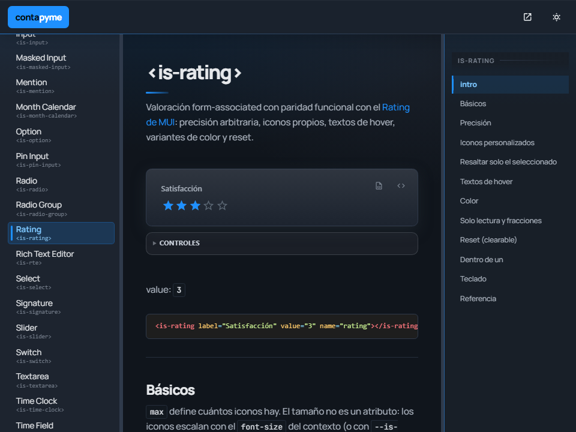

### ✅ is-rte

- **Lede**: Editor de texto enriquecido mínimo sobre contentEditable . Toolbar configurable; salida en HTML.
- **Vista (DOM vivo)**: is-rte — Editor de texto enriquecido mínimo sobre contentEditable. Toolbar configurable; salida en HTML.
- **Captura**: 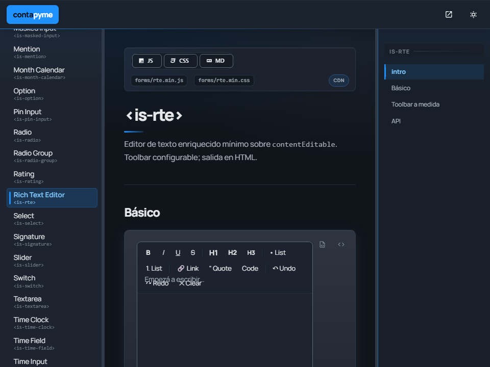

### ✅ is-select

- **Lede**: Select form-associated con paridad funcional con el Select de MUI : variants, error, selección múltiple con chips o checkmarks, agrupación, opciones ricas y typeahead. El listbox vive en un &lt;dialog&gt; del top layer, así que nunca lo recorta el overflow de un ancestro.
- **Vista (DOM vivo)**: is-select — Select form-associated con paridad funcional con el
          Select de MUI:
          variants, error, selección múltiple con chips o checkmarks, agrupación, opciones ricas y typeahead.
          El listbox vive en un <dialog> del top layer, así que nunca lo recorta
          el
- **Captura**: 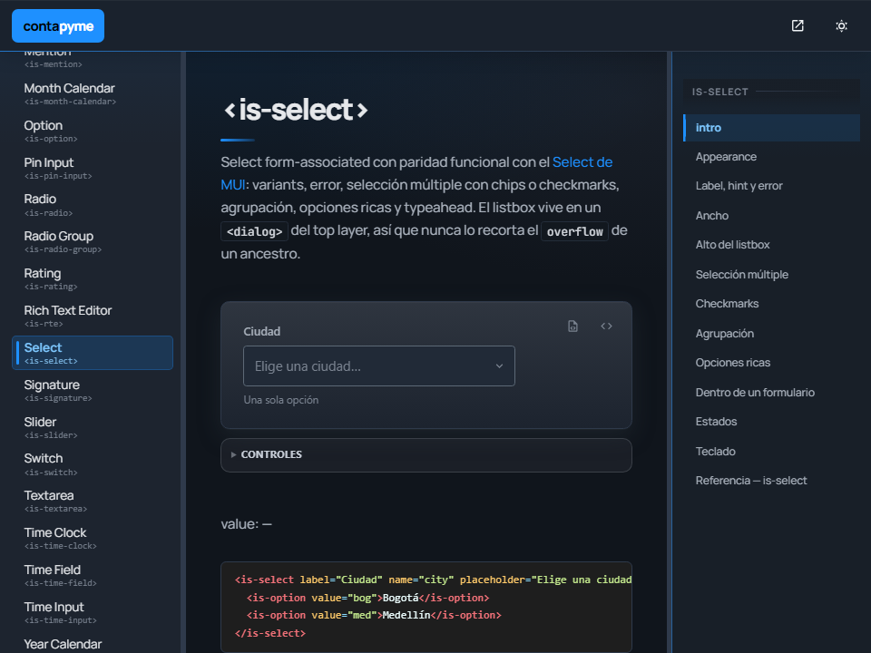

### ✅ is-signature

- **Lede**: Pad de firma manuscrita. Funciona con ratón, táctil y stylus. Exporta a PNG y SVG.
- **Vista (DOM vivo)**: is-signature — Pad de firma manuscrita. Funciona con ratón, táctil y stylus. Exporta a PNG y SVG.
- **Captura**: 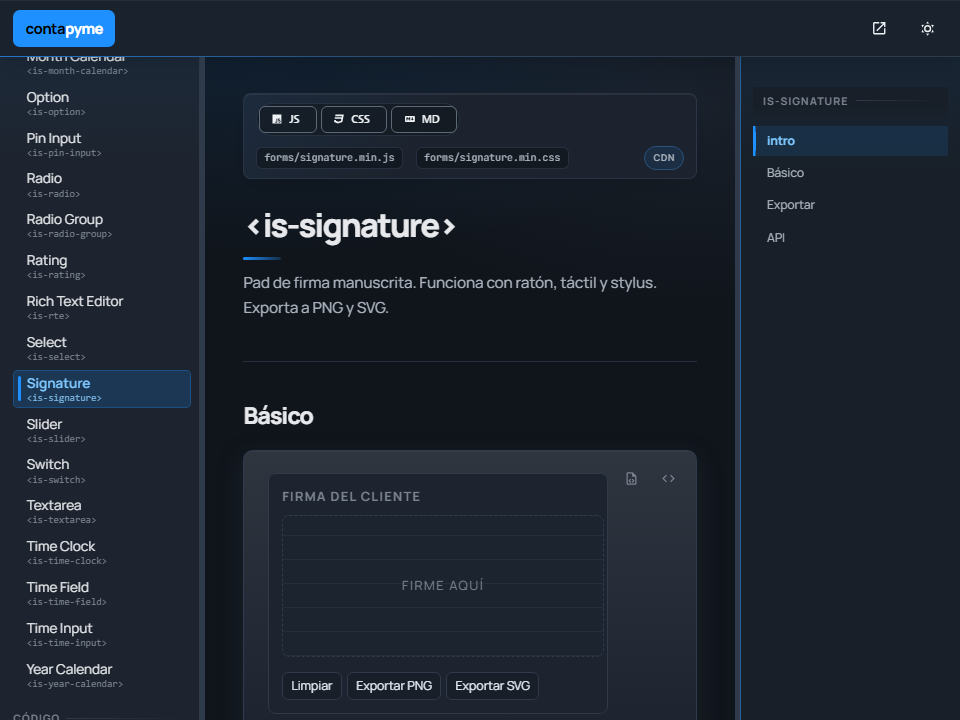

### ✅ is-slider

- **Lede**: Control de rango form-associated con paridad funcional con el Slider de MUI : rango de dos thumbs, marks, escala no lineal, orientación vertical y track invertido.
- **Vista (DOM vivo)**: is-slider — Control de rango form-associated con paridad funcional con el
          Slider de MUI:
          rango de dos thumbs, marks, escala no lineal, orientación vertical y track invertido.
- **Captura**: 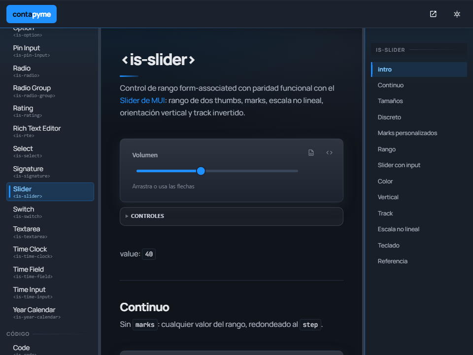

### ✅ is-switch

- **Lede**: Interruptor form-associated con paridad funcional con el Switch de MUI : mismo contrato de formulario que is-checkbox , con carril y perilla deslizante, color por variant , iconos en la perilla y rótulos dentro del carril.
- **Vista (DOM vivo)**: is-switch — Interruptor form-associated con paridad funcional con el
          Switch de MUI:
          mismo contrato de formulario que is-checkbox, con carril y perilla deslizante,
          color por variant, iconos en la perilla y rótulos dentro del carril.
- **Captura**: 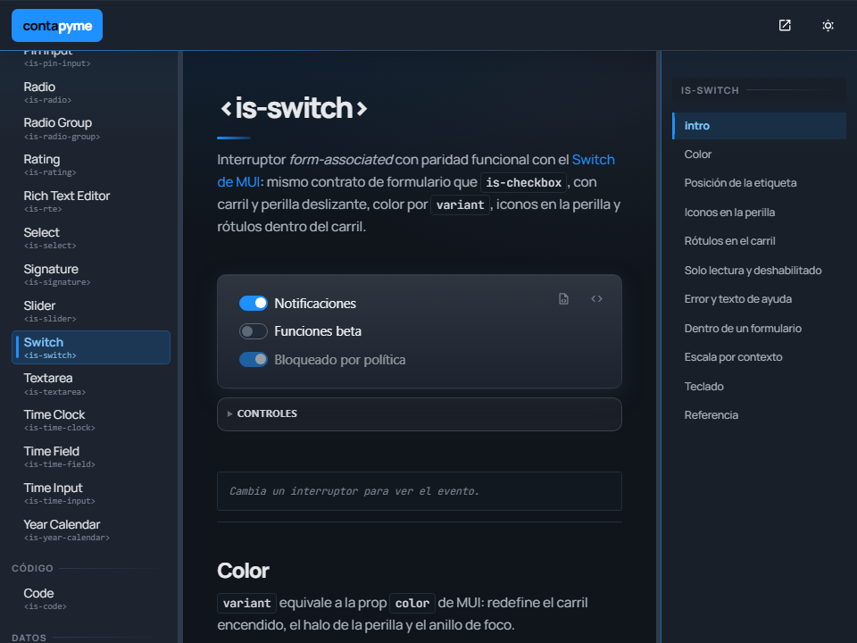

### ✅ is-textarea

- **Lede**: Área de texto form-associated con las mismas piezas que TextField en modo multiline y el crecimiento automático de TextareaAutosize : appearances, error, contador y autosize con min-rows / max-rows .
- **Vista (DOM vivo)**: is-textarea — Área de texto form-associated con las mismas piezas que
          TextField
          en modo multiline y el crecimiento automático de
          TextareaAutosize:
          appearances, error, contador y autosize con
          min-rows / max-rows.
- **Captura**: 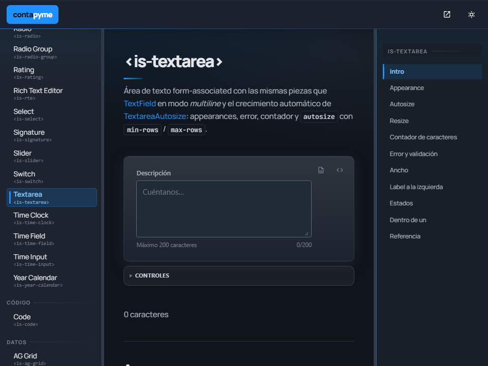

### ✅ is-time-clock

- **Lede**: Reloj analógico (TimeClock de MUI X). Arrastra la manecilla, haz clic o usa el teclado. Al soltar avanza de horas a minutos.
- **Vista (DOM vivo)**: is-time-clock — Reloj analógico (TimeClock de MUI X). Arrastra la manecilla, haz clic o usa el teclado. Al soltar avanza de horas a minutos.
- **Captura**: 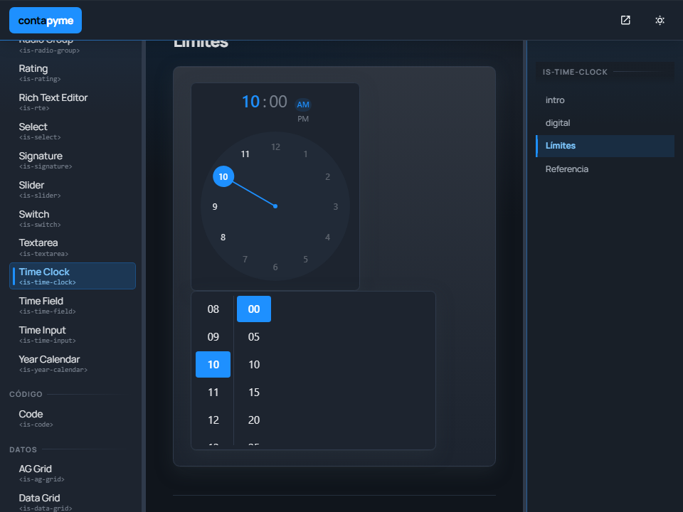

### ✅ is-time-field

- **Descripción**: Documentación y demos de is-time-field de InSoft.
- **Lede**: Campo de hora con máscara y validación, asociable a formularios.
- **Vista (DOM vivo)**: is-time-field — Campo de hora con máscara y validación, asociable a formularios.
- **Captura**: 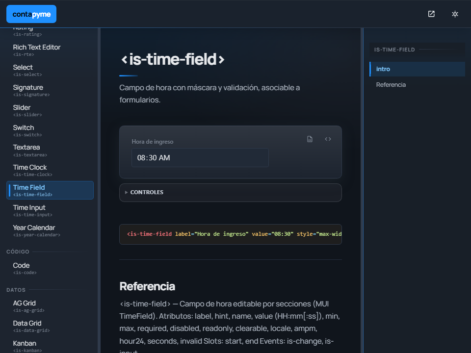

### ✅ is-time-input

- **Descripción**: Documentación y demos de is-time-input de InSoft.
- **Lede**: Entrada de hora con selector desplegable.
- **Vista (DOM vivo)**: is-time-input — Entrada de hora con selector desplegable.
- **Captura**: 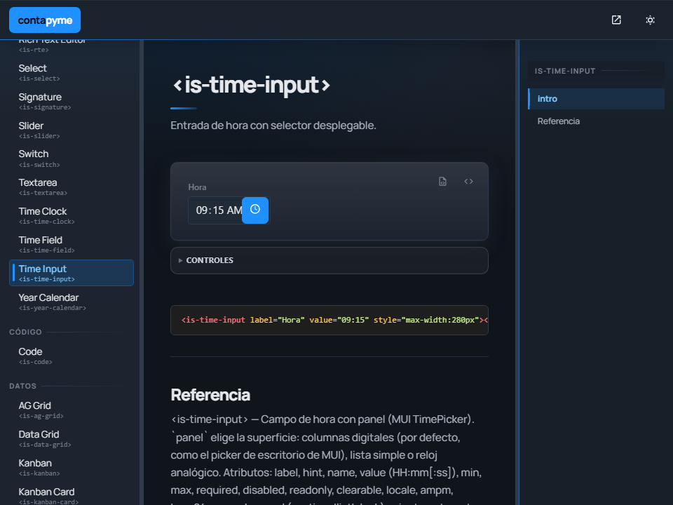

### ✅ is-year-calendar

- **Descripción**: Documentación y demos de is-year-calendar de InSoft.
- **Lede**: Vista de los 12 meses de un año para saltar rápido de periodo.
- **Vista (DOM vivo)**: is-year-calendar — Vista de los 12 meses de un año para saltar rápido de periodo.
- **Captura**: 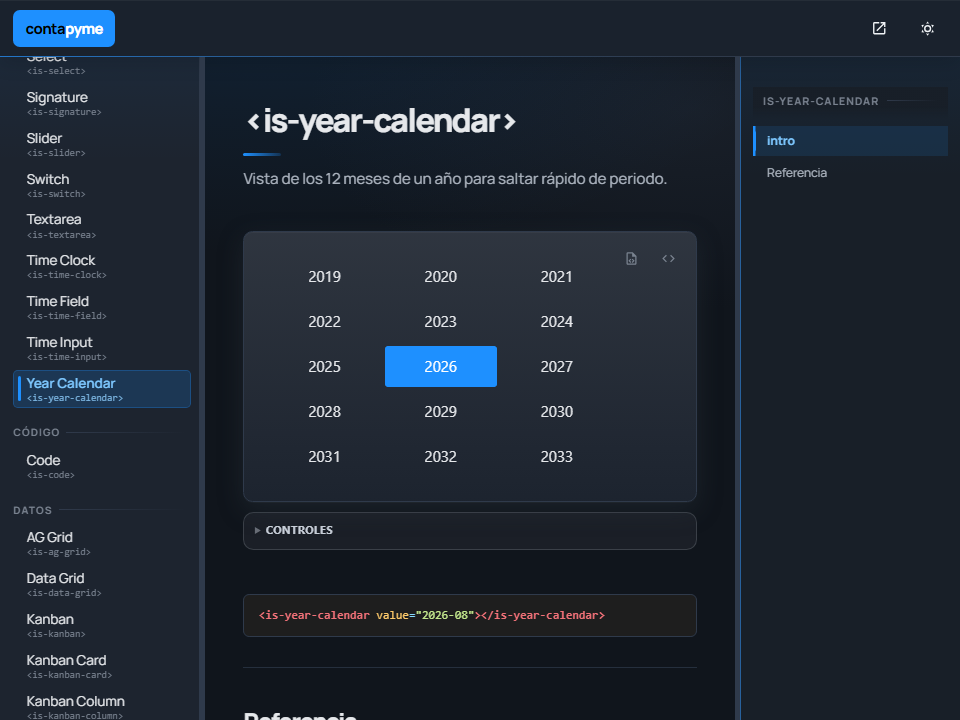

## helpers

### ✅ is-format

- **Lede**: Formateo con Intl y presets estilo Excel vía pattern . Un solo elemento cubre número, fecha/hora, texto, bytes y tiempo relativo.
- **Vista (DOM vivo)**: is-format — Formateo con Intl y presets estilo Excel vía pattern. Un solo elemento cubre número, fecha/hora, texto, bytes y tiempo relativo.
- **Captura**: 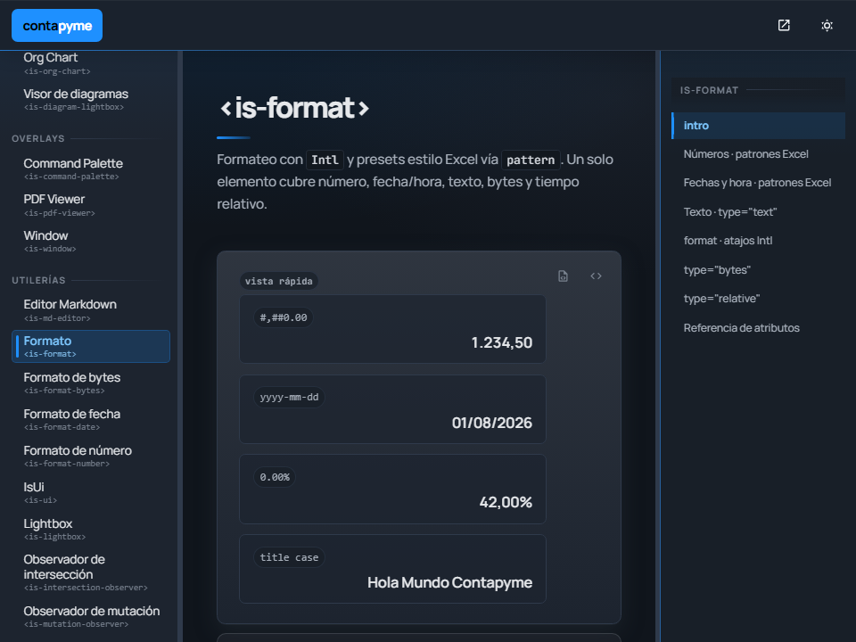

### ✅ is-format-bytes

- **Lede**: Tamaños de archivo legibles. value se interpreta según unit (default byte).
- **Vista (DOM vivo)**: is-format-bytes — Tamaños de archivo legibles. value se interpreta según unit (default byte).
- **Captura**: 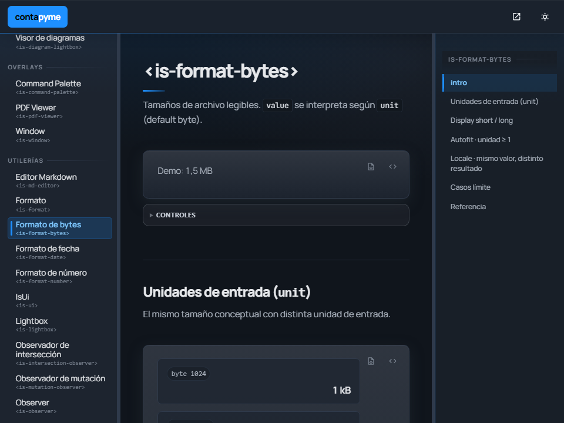

### ✅ is-format-date

- **Lede**: Formatea fechas con Intl.DateTimeFormat . En esta página todos los ejemplos usan la hora actual y se actualizan cada 1&nbsp;s.
- **Vista (DOM vivo)**: is-format-date — Formatea fechas con Intl.DateTimeFormat. En esta página todos los ejemplos usan la hora actual y se actualizan cada 1 s.
- **Captura**: 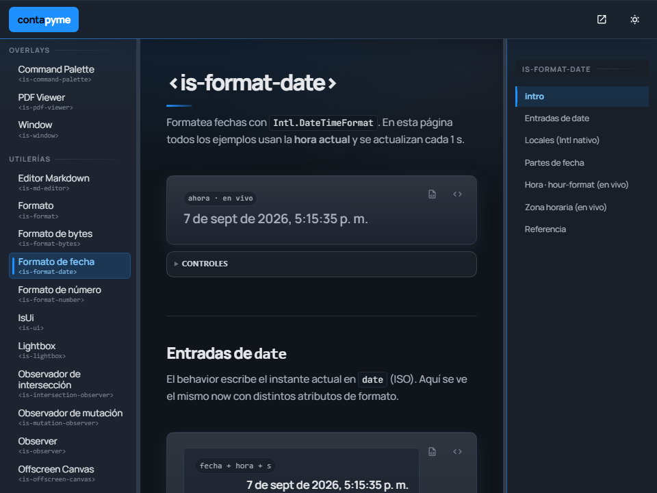

### ✅ is-format-number

- **Lede**: Números con Intl.NumberFormat . Locale = lang del documento.
- **Vista (DOM vivo)**: is-format-number — Números con Intl.NumberFormat. Locale = lang del documento.
- **Captura**: 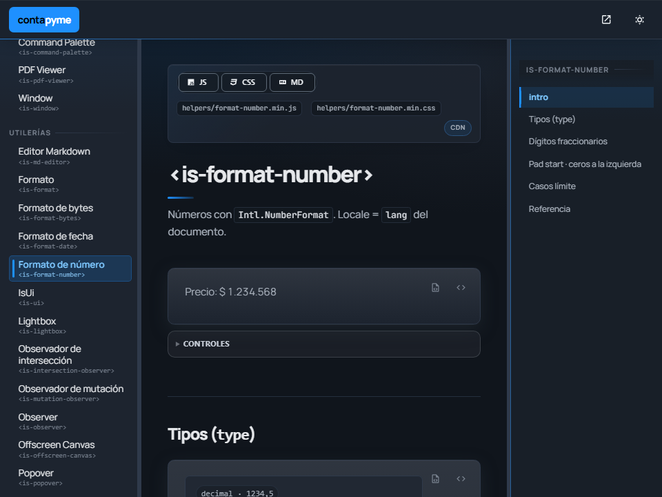

### ✅ is-intersection-observer

- **Lede**: Responde a una pregunta simple: ¿este elemento está (parcialmente) visible dentro de un contenedor? Si sí, aplica una clase y/o dispara el evento is-intersect .
- **Vista (DOM vivo)**: is-intersection-observer — Responde a una pregunta simple: ¿este elemento está (parcialmente) visible
          dentro de un contenedor? Si sí, aplica una clase y/o dispara el evento
          is-intersect.
- **Captura**: 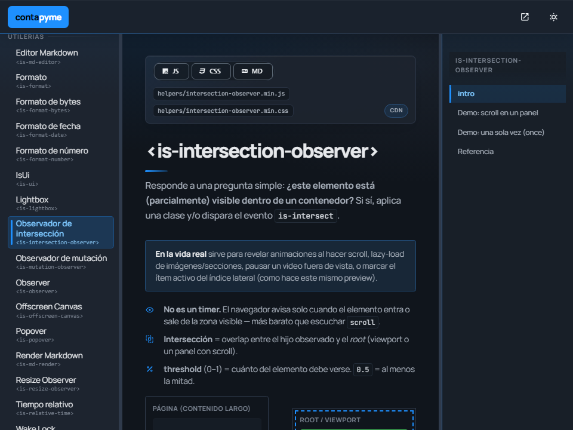

### ✅ is-lightbox

- **Lede**: Visor a pantalla completa, genérico: lo que metas en el slot default se monta dentro de un &lt;dialog&gt; top-layer con zoom anclado al cursor y pan. Por defecto usa variant="backdrop" (20% oscuro + blur 2px). La barra por defecto trae cerrar, reset de zoom y compartir enlace; usa el slot toolbar para añadir tus propios controles sin tocar el componente.
- **Vista (DOM vivo)**: is-lightbox — Visor a pantalla completa, genérico: lo que metas en el slot default se
          monta dentro de un <dialog> top-layer
          con zoom anclado al cursor y pan. Por defecto usa variant="backdrop"
          (20% oscuro + blur 2px). La barra por defecto trae cerrar,
          re
- **Captura**: 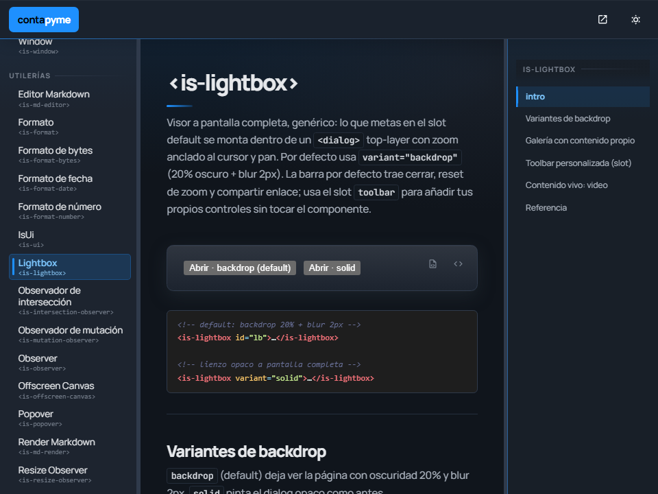

### ✅ is-md-editor

- **Lede**: Vista previa MD/HTML + chips {{variable}} . Clic abre diálogo fullscreen. Toolbar completa (disabled en solo lectura). Footer: meta + Descargar (siempre).
- **Vista (DOM vivo)**: is-md-editor — Vista previa MD/HTML + chips {{variable}}. Clic abre diálogo fullscreen.
          Toolbar completa (disabled en solo lectura). Footer: meta + Descargar (siempre).
- **Captura**: 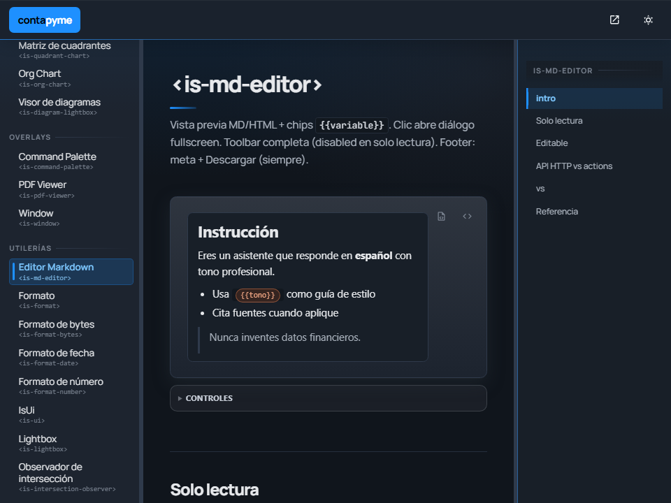

### ✅ is-md-render

- **Lede**: Render inline de MD/HTML + chips {{variable}} . Sin toolbar ni diálogo.
- **Vista (DOM vivo)**: is-md-render — Render inline de MD/HTML + chips {{variable}}. Sin toolbar ni diálogo.
- **Captura**: 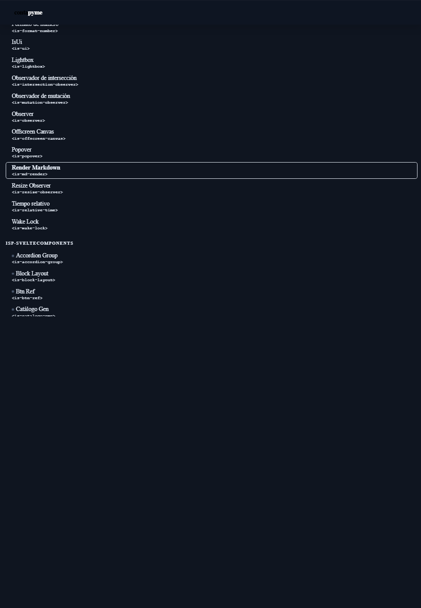

### ✅ is-mutation-observer

- **Lede**: Responde a: ¿cambió el HTML de este nodo? Cuando alguien añade/quita hijos, cambia un atributo o el texto, emite is-mutate con el detalle de qué pasó.
- **Vista (DOM vivo)**: is-mutation-observer — Responde a: ¿cambió el HTML de este nodo?
          Cuando alguien añade/quita hijos, cambia un atributo o el texto, emite
          is-mutate con el detalle de qué pasó.
- **Captura**: 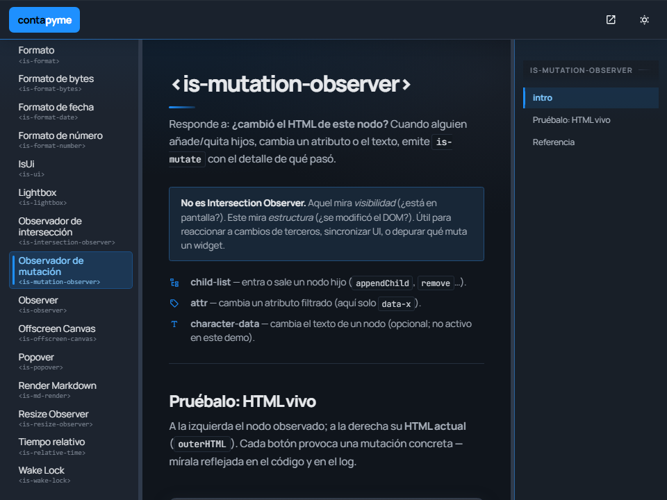

### ✅ is-observer

- **Lede**: Un solo componente para IntersectionObserver , MutationObserver y ResizeObserver vía type . Los alias históricos ( &lt;is-intersection-observer&gt; , etc.) siguen válidos.
- **Vista (DOM vivo)**: is-observer — Un solo componente para IntersectionObserver,
          MutationObserver y ResizeObserver
          vía type. Los alias históricos
          (<is-intersection-observer>, etc.) siguen válidos.
- **Captura**: 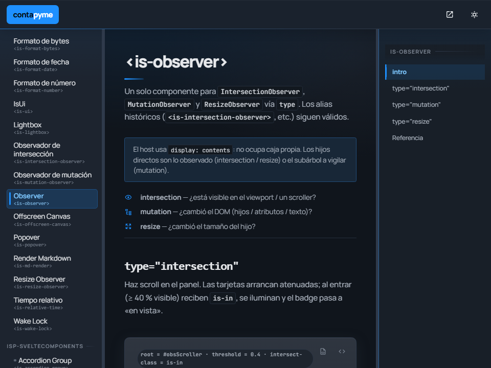

### ✅ is-offscreen-canvas

- **Descripción**: Lienzo que transfiere el control a OffscreenCanvas (y opcionalmente a un Worker).
- **Lede**: Lienzo que transfiere el control a OffscreenCanvas (y opcionalmente a un Worker).
- **Vista (DOM vivo)**: is-offscreen-canvas — Lienzo que transfiere el control a OffscreenCanvas (y opcionalmente a un Worker).
- **Captura**: 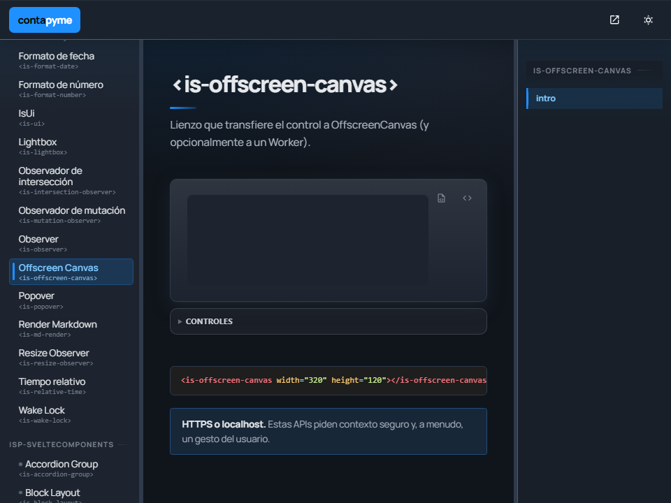

### ✅ is-popover

- **Lede**: Panel flotante con contenido interactivo. Ancla con for . Cierra con Escape, click fuera o data-popover="close" . El posicionamiento (flip, shift, auto-size, arrow) lo hace un &lt;is-floating&gt; interno — el wrapper sólo aporta ancla declarativa, ciclo de vida y accesibilidad.
- **Vista (DOM vivo)**: is-popover — Panel flotante con contenido interactivo. Ancla con for.
          Cierra con Escape, click fuera o data-popover="close".
          El posicionamiento (flip, shift, auto-size, arrow) lo hace un
          <is-floating> interno — el wrapper sólo
          aporta ancla declarativa, 
- **Captura**: 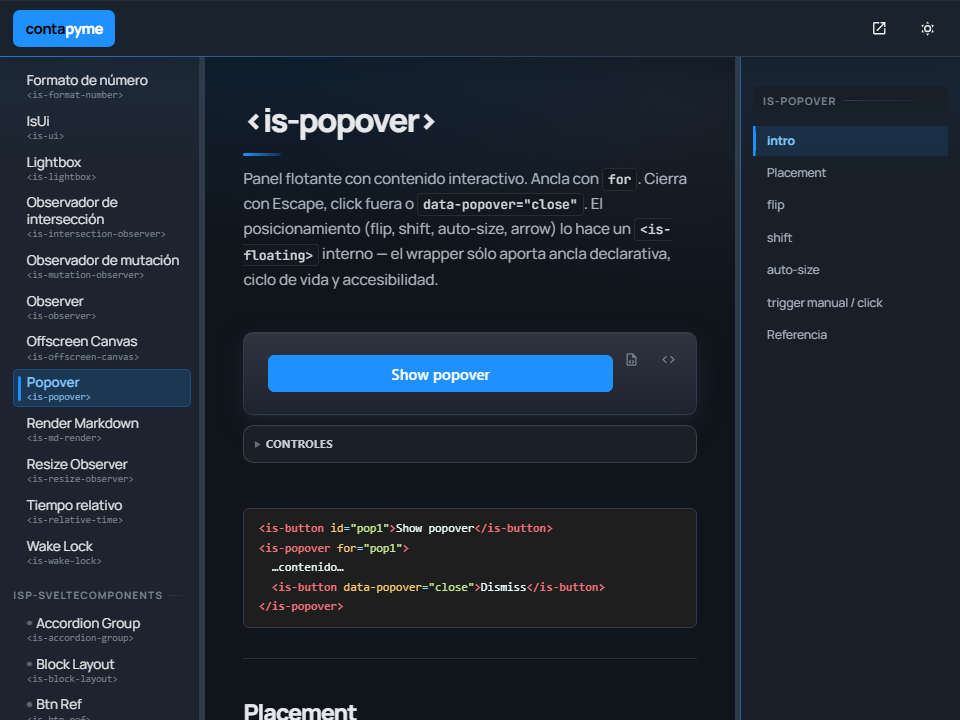

### ✅ is-relative-time

- **Lede**: Fechas relativas con Intl.RelativeTimeFormat (nativo). Locale por defecto: html lang (sistema al boot) → es . Alias de &lt;is-format type="relative"&gt; .
- **Vista (DOM vivo)**: is-relative-time — Fechas relativas con Intl.RelativeTimeFormat (nativo).
          Locale por defecto: html lang (sistema al boot) → es.
          Alias de <is-format type="relative">.
- **Captura**: 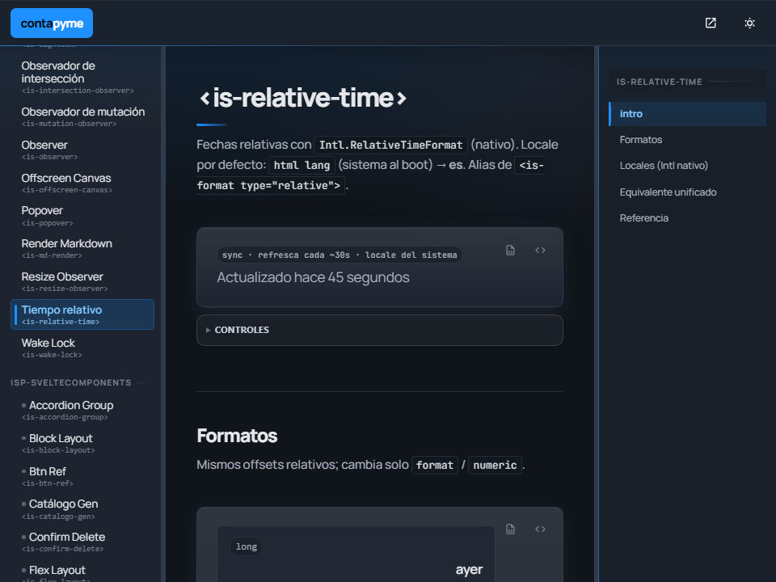

### ✅ is-resize-observer

- **Lede**: Observa hijos directos y emite is-resize con las ResizeObserverEntry . Alias de &lt;is-observer type="resize"&gt; .
- **Vista (DOM vivo)**: is-resize-observer — Observa hijos directos y emite is-resize con las
          ResizeObserverEntry. Alias de
          <is-observer type="resize">.
- **Captura**: 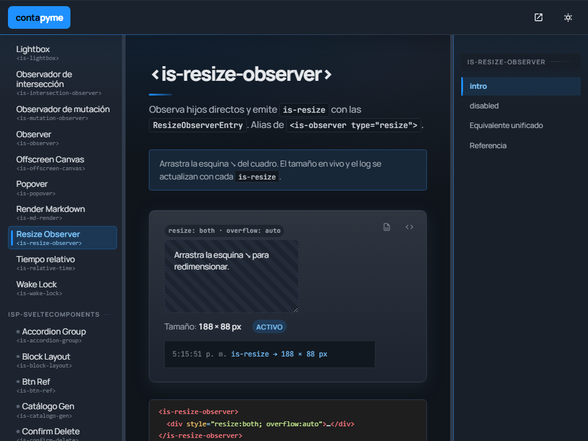

### ✅ is-ui

- **Título**: IsUi (módulo · no es un tag)
- **Descripción**: Utilidad IsUi: html, adoptCss y define para apps consumidoras del kit.
- **Lede**: Utilidad de render para apps consumidoras. Tras cargar el CDN queda en globalThis.IsUi (alias Ui ). No reinventes botones ni tablas: monta is-* con html + CSS hermano vía adoptCss .
- **Captura**: 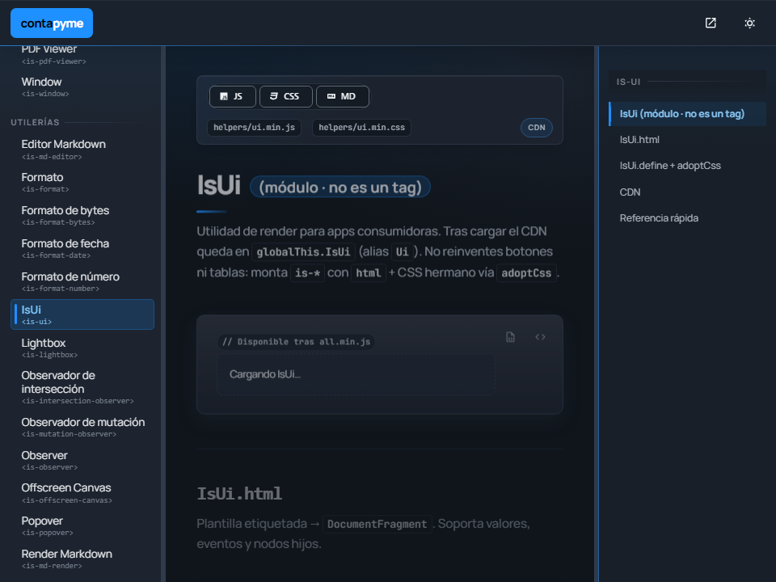

### ✅ is-wake-lock

- **Descripción**: Mantiene la pantalla encendida con Screen Wake Lock mientras `active` está puesto.
- **Lede**: Mantiene la pantalla encendida con Screen Wake Lock mientras `active` está puesto.
- **Vista (DOM vivo)**: is-wake-lock — Mantiene la pantalla encendida con Screen Wake Lock mientras `active` está puesto.
- **Captura**: 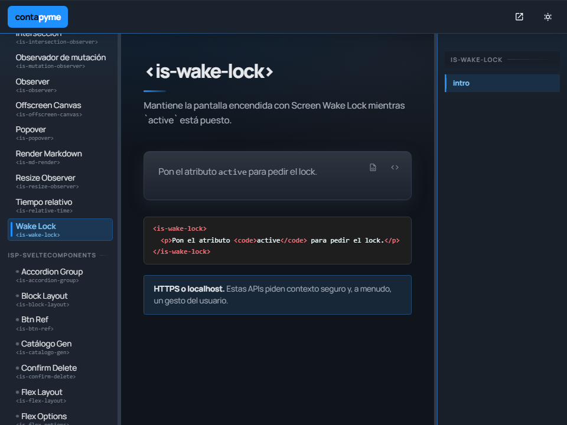

## isp

### ✅ is-accordion-group

- **Descripción**: Documentación y demos de is-accordion-group de InSoft.
- **Lede**: Coordina varios &lt;is-details&gt; : por defecto solo uno queda abierto. No reimplementa el disclosure, solo lo orquesta.
- **Vista (DOM vivo)**: is-accordion-group — Coordina varios <is-details>: por defecto solo uno
          queda abierto. No reimplementa el disclosure, solo lo orquesta.
- **Captura**: 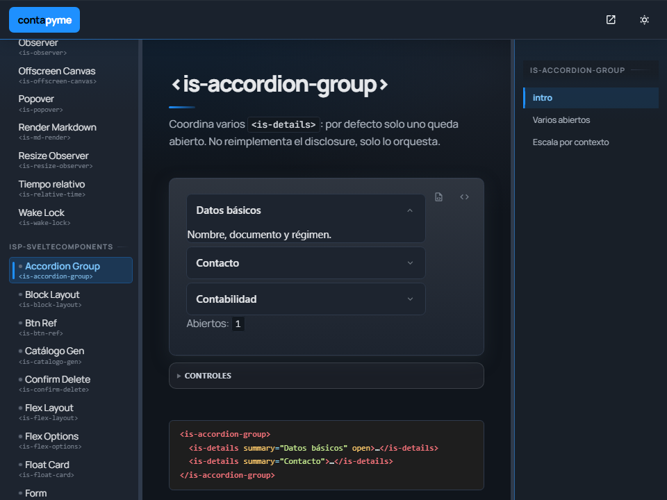

### ✅ is-block-layout

- **Lede**: Caja de bloque que mide su propio ancho y publica el breakpoint como data-sizew , banderas data-szw-* y las custom properties --clientw / --lerpw . Port del BlockLayout.svelte de ISP.
- **Vista (DOM vivo)**: is-block-layout — Caja de bloque que mide su propio ancho y publica el breakpoint como
          data-sizew, banderas data-szw-* y las custom properties
          --clientw / --lerpw. Port del BlockLayout.svelte de ISP.
- **Captura**: 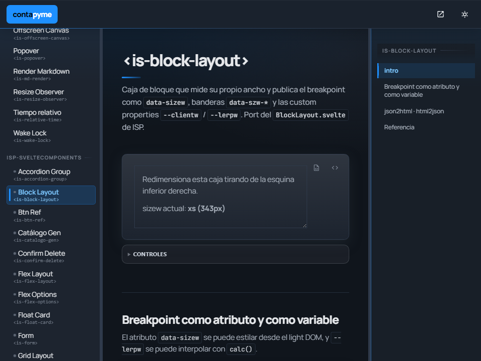

### ✅ is-btn-ref

- **Descripción**: Campo + modal de selección ISP (BtnRef).
- **Lede**: Campo con selector modal (port BtnRef ). El modal usa &lt;is-catalogo-gen select-mode&gt; centrado. Controller vía createBtnRefController — sin acciones CRUD , solo listado y selección.
- **Vista (DOM vivo)**: is-btn-ref — Campo con selector modal (port BtnRef). El modal usa
          <is-catalogo-gen select-mode> centrado. Controller vía
          createBtnRefController — sin acciones CRUD, solo listado y selección.
- **Captura**: 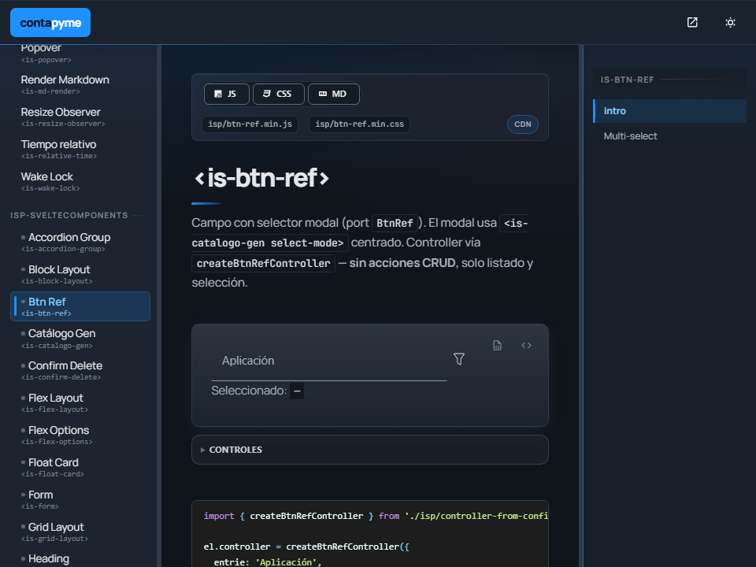

### ✅ is-catalogo-gen

- **Descripción**: Catálogo CRUD genérico ISP con controller JSON.
- **Lede**: Catálogo CRUD (port ISP CatalogoGen ). El controller se genera con createCatalogController(json) : listado, columnas y acciones (crear / modificar / visualizar / verificar / duplicar / recodificar / eliminar / consolidar).
- **Vista (DOM vivo)**: is-catalogo-gen — Catálogo CRUD (port ISP CatalogoGen). El controller
          se genera con createCatalogController(json): listado, columnas y
          acciones (crear / modificar / visualizar / verificar / duplicar / recodificar / eliminar / consolidar).
- **Captura**: 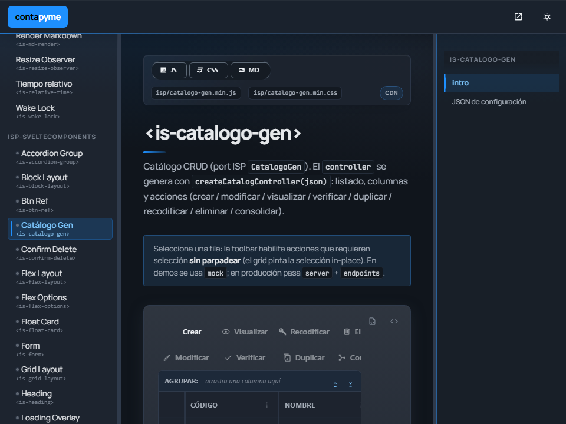

### ✅ is-confirm-delete

- **Descripción**: Documentación y demos de is-confirm-delete de InSoft.
- **Lede**: Confirmación destructiva "escribe para confirmar": el botón Eliminar sigue bloqueado hasta que el usuario re-escribe la clave del registro. En la demo, el NIT es 900123456 .
- **Vista (DOM vivo)**: is-confirm-delete — Confirmación destructiva "escribe para confirmar": el botón Eliminar
          sigue bloqueado hasta que el usuario re-escribe la clave del registro.
          En la demo, el NIT es 900123456.
- **Captura**: 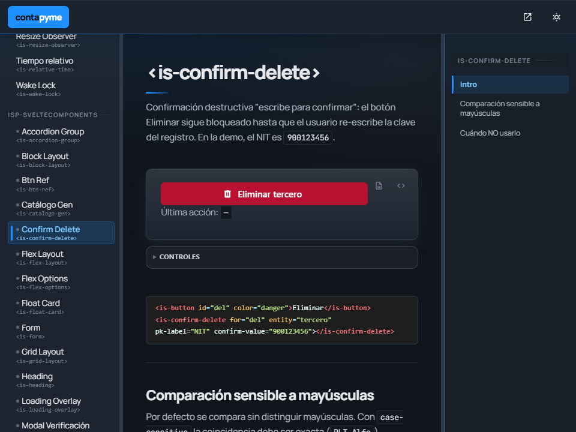

### ✅ is-flex-layout

- **Lede**: Contenedor flex declarativo (port ISP). Arrastra la esquina ↘ del escenario para redimensionar; los switches activan/desactivan props booleanas ( wrap , grow , inline ).
- **Vista (DOM vivo)**: is-flex-layout — Contenedor flex declarativo (port ISP). Arrastra la esquina ↘ del escenario
          para redimensionar; los switches activan/desactivan props booleanas
          (wrap, grow, inline).
- **Captura**: 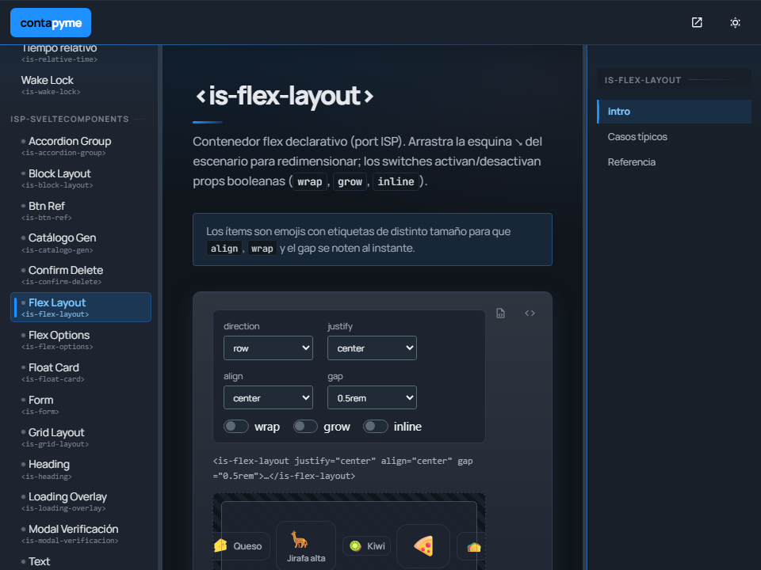

### ✅ is-flex-options

- **Descripción**: Toolbar de acciones ISP pintada con is-button / is-dropdown.
- **Lede**: Port de FlexOptions . El consumidor pasa actions / more ; el tag pinta el kit.
- **Vista (DOM vivo)**: is-flex-options — Port de FlexOptions. El consumidor pasa actions / more; el tag pinta el kit.
- **Captura**: 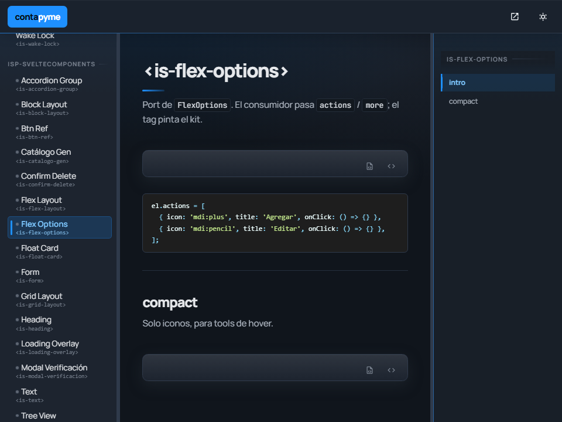

### ✅ is-float-card

- **Descripción**: Panel flotante anclado (port FloatingComponent). Hover muestra tools ya montadas.
- **Lede**: Port de FloatingComponent . El slot float no se desmonta: open solo cambia opacidad. Pasá el mouse por la fila.
- **Vista (DOM vivo)**: is-float-card — Port de FloatingComponent. El slot float no se desmonta: open solo cambia opacidad. Pasá el mouse por la fila.
- **Captura**: 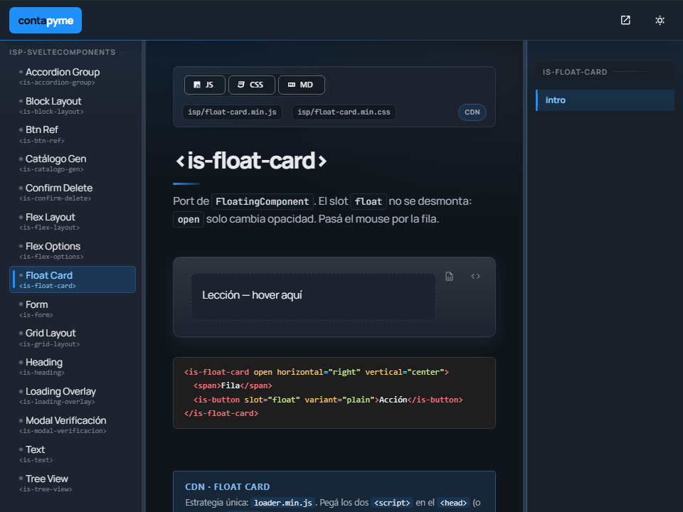

### ✅ is-form

- **Descripción**: Ficha ISP — cuerpo en JSON compacto (json2html / html2json).
- **Lede**: Ficha con Aceptar / Cancelar. El cuerpo se define en JSON compacto ( [tag, attrs?, …hijos] ) vía json2html / html2json .
- **Vista (DOM vivo)**: is-form — Ficha con Aceptar / Cancelar. El cuerpo se define en JSON compacto
          ([tag, attrs?, …hijos]) vía
          json2html / html2json.
- **Captura**: 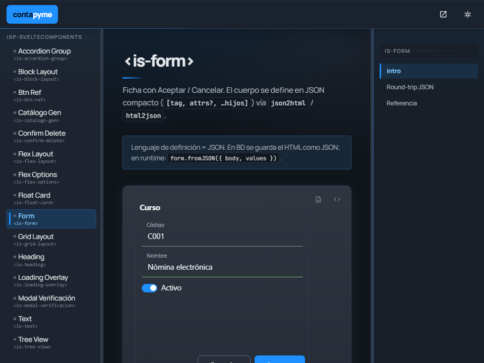

### ✅ is-grid-layout

- **Lede**: Grid declarativo. Port del GridLayout.svelte de ISP: cells acepta un número o una track list CSS cruda.
- **Vista (DOM vivo)**: is-grid-layout — Grid declarativo. Port del GridLayout.svelte de ISP:
          cells acepta un número o una track list CSS cruda.
- **Captura**: 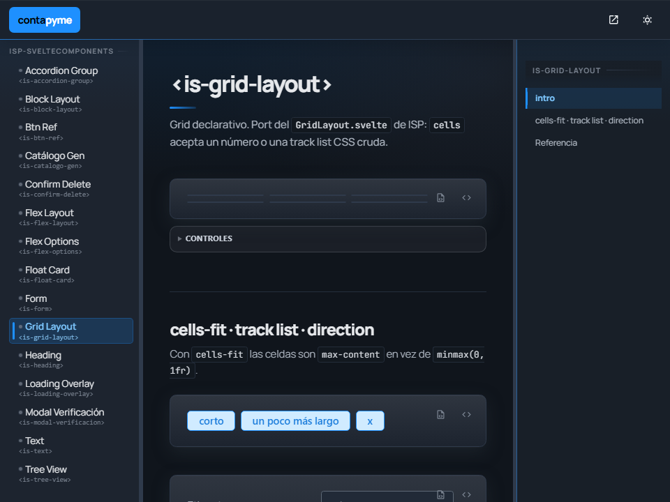

### ✅ is-heading

- **Lede**: Niveles tipográficos con color semántico, CSS libre o current . mix / mix-with atenúan hacia texto, transparente, blanco o negro.
- **Vista (DOM vivo)**: is-heading — Niveles tipográficos con color semántico, CSS libre o current. mix / mix-with atenúan hacia texto, transparente, blanco o negro.
- **Captura**: 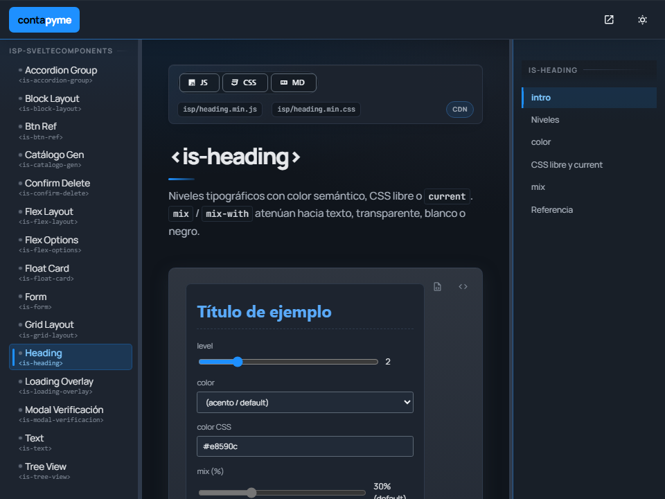

### ✅ is-loading-overlay

- **Descripción**: Documentación y demos de is-loading-overlay de InSoft.
- **Lede**: Capa de bloqueo a pantalla completa con spinner y mensaje. No se cierra con Escape ni con clic fuera: solo el código que la abrió la cierra.
- **Vista (DOM vivo)**: is-loading-overlay — Capa de bloqueo a pantalla completa con spinner y mensaje. No se cierra
          con Escape ni con clic fuera: solo el código que la abrió la cierra.
- **Captura**: 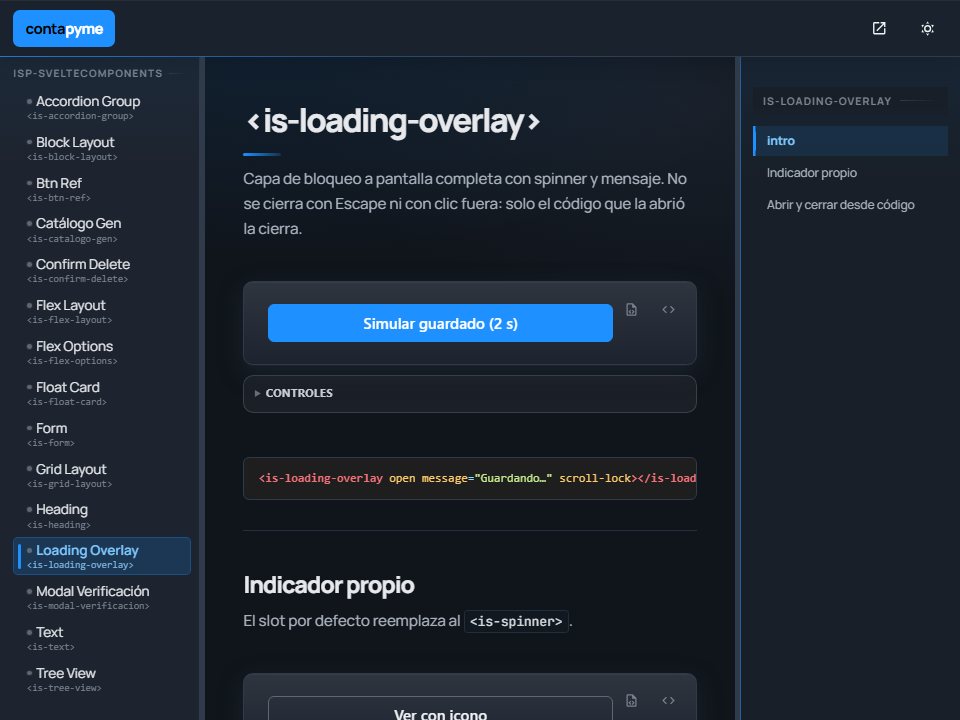

### ✅ is-modal-verificacion

- **Descripción**: Documentación y demos de is-modal-verificacion de InSoft.
- **Lede**: Al abrirse ejecuta controller.actVerificar(record) y pinta los mensajes devueltos coloreados por severidad, con contadores de infos, warnings y errores.
- **Vista (DOM vivo)**: is-modal-verificacion — Al abrirse ejecuta controller.actVerificar(record)
          y pinta los mensajes devueltos coloreados por severidad, con contadores
          de infos, warnings y errores.
- **Captura**: 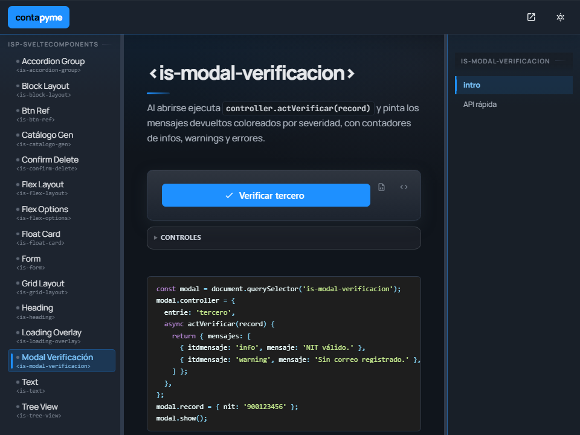

### ✅ is-text

- **Lede**: Color semántico, current , CSS libre y mix . Playground abajo.
- **Vista (DOM vivo)**: is-text — Color semántico, current, CSS libre y mix. Playground abajo.
- **Captura**: 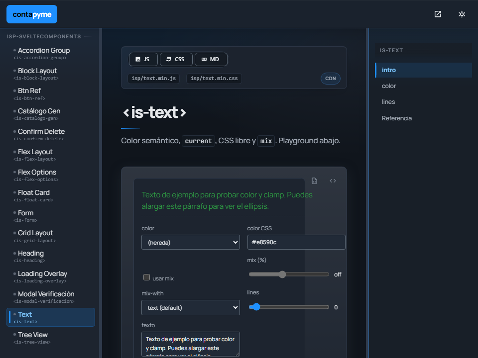

### ✅ is-tree-view

- **Descripción**: Árbol editable ISP (port TreeRowView): drag, historial y ficha.
- **Lede**: Port de TreeRowView (ClientesIS). No es &lt;is-tree&gt; : este sí muta, arrastra y guarda historial. El consumidor pasa list + customs (mapeo iplan ↔ flatPath ).
- **Vista (DOM vivo)**: is-tree-view — Port de TreeRowView (ClientesIS). No es <is-tree>:
          este sí muta, arrastra y guarda historial. El consumidor pasa list +
          customs (mapeo iplan ↔ flatPath).
- **Captura**: 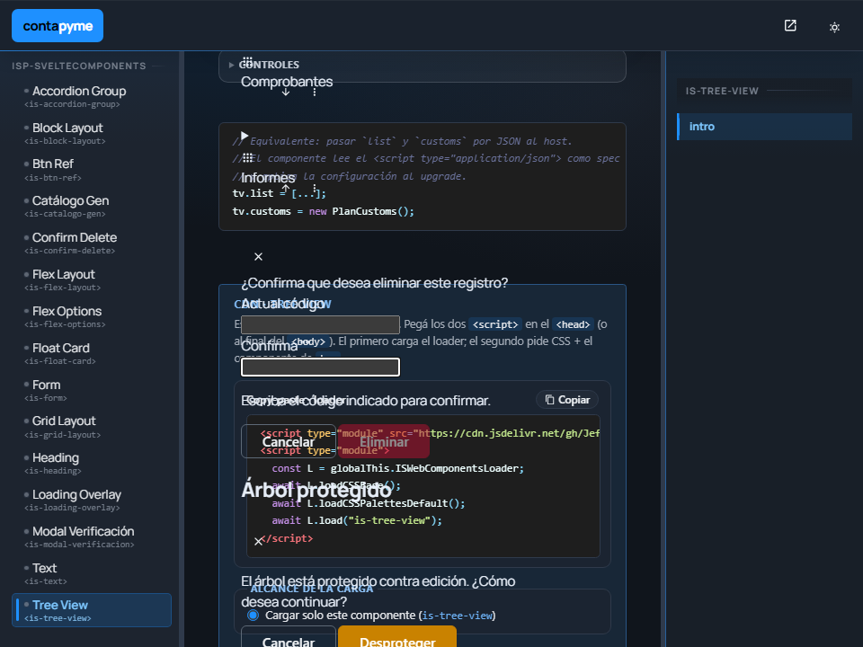

## layout

### ✅ is-callout

- **Descripción**: Documentación y demos del componente is-callout de InSoft.
- **Lede**: Mensaje en línea con borde y fondo suaves. Pensado para tips, info, warnings y errores que el usuario no debe pasar por alto. Cinco variantes y cinco apariencias, con icono automático según la variante (sobrescribible vía icon o slot icon ).
- **Vista (DOM vivo)**: is-callout — Mensaje en línea con borde y fondo suaves. Pensado para tips, info, warnings y
          errores que el usuario no debe pasar por alto. Cinco variantes y cinco apariencias,
          con icono automático según la variante (sobrescribible vía icon
          o slot icon).
- **Captura**: 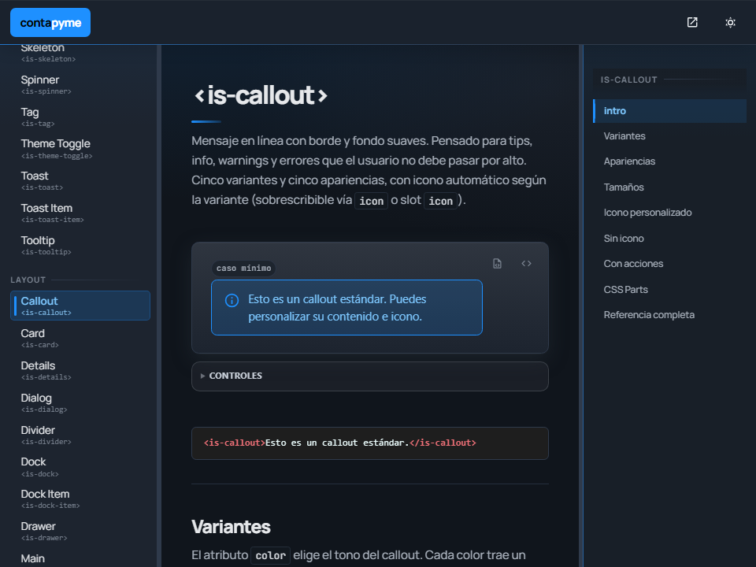

### ✅ is-card

- **Descripción**: Documentación y demos del componente is-card de InSoft.
- **Lede**: Contenedor flexible con slots para media , header , body , footer y actions . Cinco apariencias y dos orientaciones. JavaScript nativo, Shadow DOM, sin frameworks.
- **Vista (DOM vivo)**: is-card — Contenedor flexible con slots para media, header,
          body, footer y actions.
          Cinco apariencias y dos orientaciones. JavaScript nativo, Shadow DOM, sin frameworks.
- **Captura**: 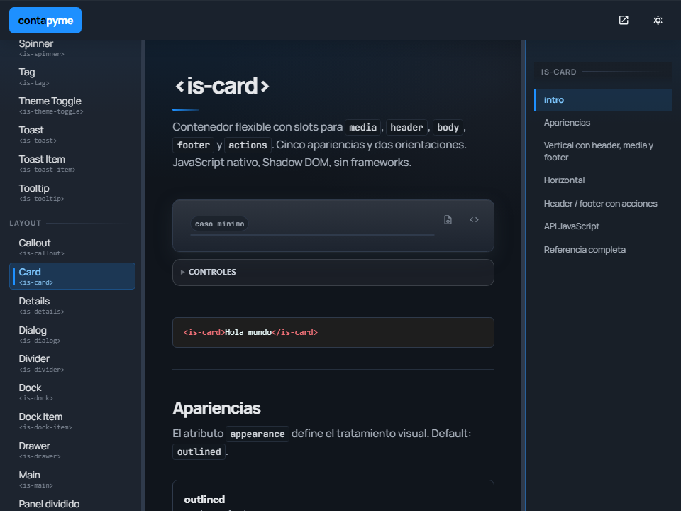

### ✅ is-details

- **Descripción**: Documentación y demos del componente is-details de InSoft.
- **Lede**: Disclosure colapsable: muestra un resumen y, al expandir, el contenido. Equivalente accesible al &lt;details&gt; nativo, con apariencias, iconos, animaciones y comportamiento de accordion opcional.
- **Vista (DOM vivo)**: is-details — Disclosure colapsable: muestra un resumen y, al expandir, el contenido. Equivalente
          accesible al 
 nativo, con apariencias,
          iconos, animaciones y comportamiento de accordion opcional.
- **Captura**: 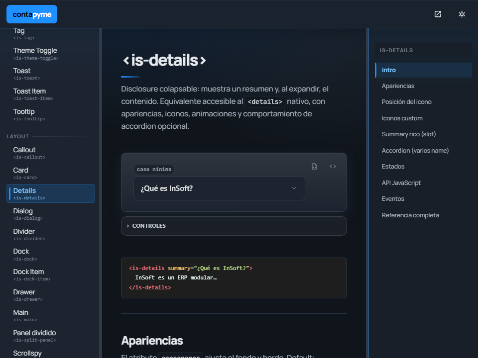

### ✅ is-dialog

- **Descripción**: Documentación y demos del componente is-dialog de InSoft.
- **Lede**: Modal accesible que requiere la atención inmediata del usuario. Equivalente a &lt;dialog&gt; nativo, con header, footer, animaciones, light-dismiss y API declarativa data-dialog="close" .
- **Vista (DOM vivo)**: is-dialog — Modal accesible que requiere la atención inmediata del usuario. Equivalente
          a <dialog> nativo, con header, footer, animaciones,
          light-dismiss y API declarativa data-dialog="close".
- **Captura**: 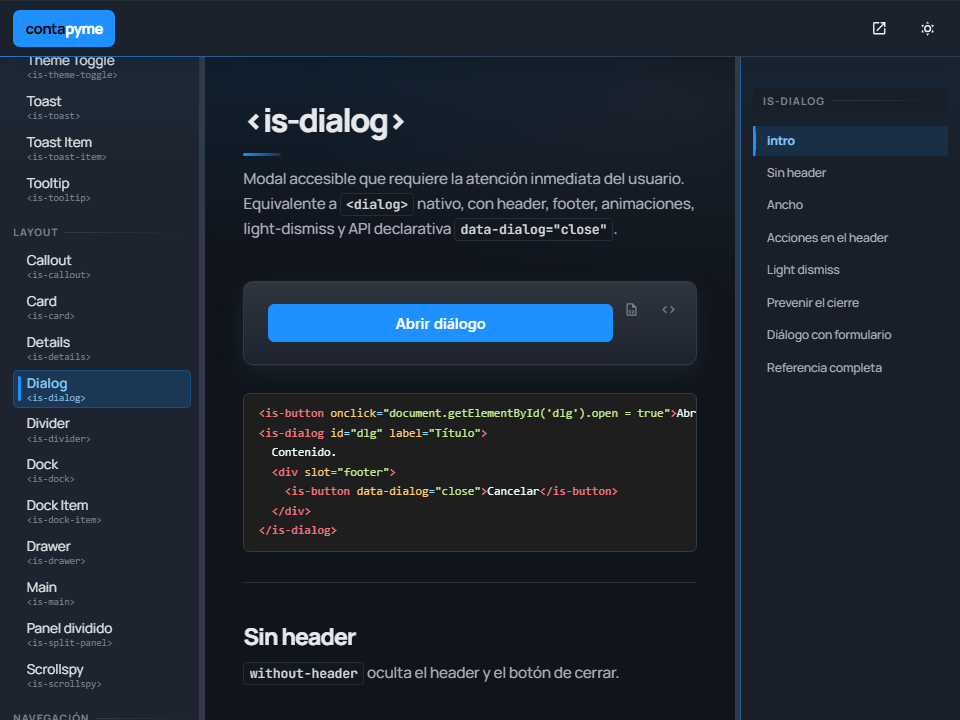

### ✅ is-divider

- **Lede**: Separador horizontal o vertical. Opacidad default 20 ; color vía tokens del theme.
- **Vista (DOM vivo)**: is-divider — Separador horizontal o vertical. Opacidad default 20; color vía tokens del theme.
- **Captura**: 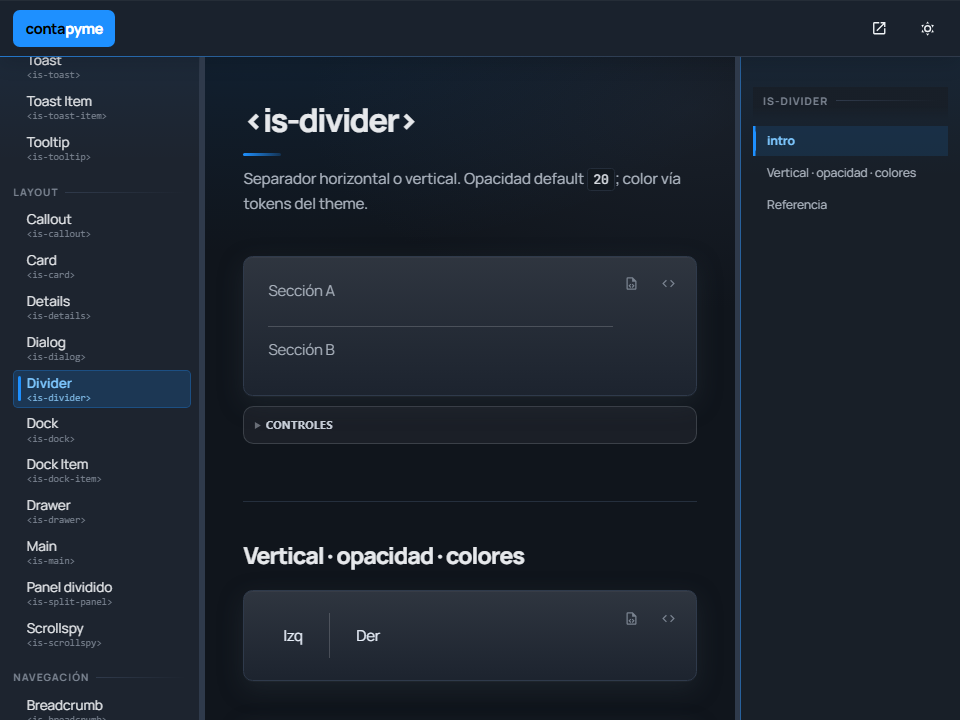

### ✅ is-dock

- **Lede**: Barra tipo macOS: los íconos se magnifican al acercar el cursor. Anclada abajo por defecto; podés moverla con el atributo position .
- **Vista (DOM vivo)**: is-dock — Barra tipo macOS: los íconos se magnifican al acercar el cursor. Anclada abajo por defecto; podés moverla con el atributo position.
- **Captura**: 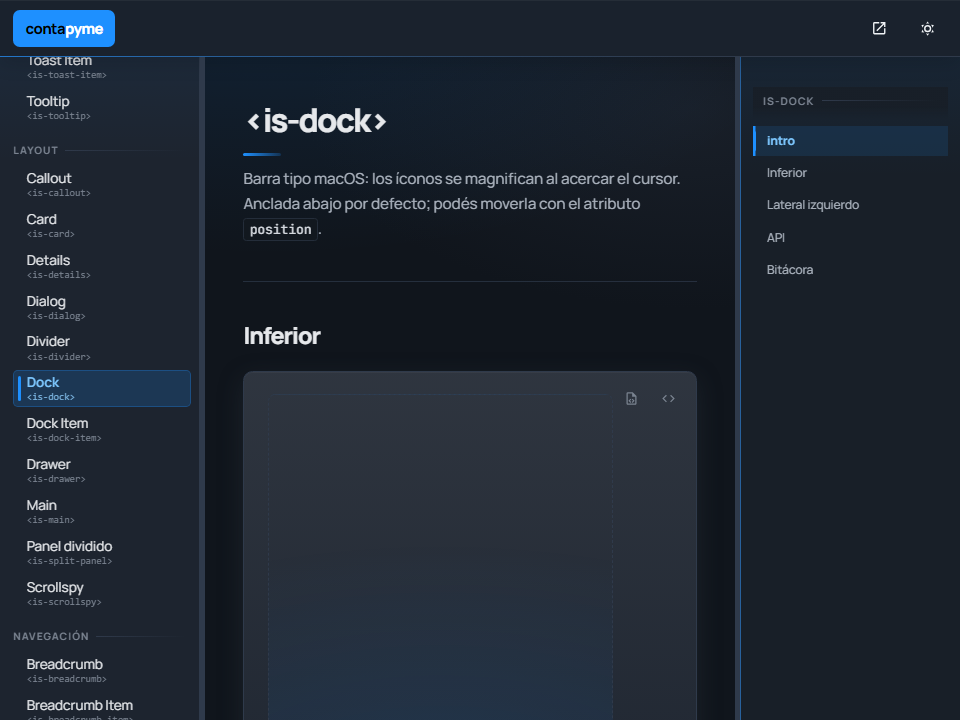

### ✅ is-dock-item

- **Descripción**: Documentación y demos de is-dock-item de InSoft.
- **Lede**: Icono de un &lt;is-dock&gt; , con su etiqueta y estado activo.
- **Vista (DOM vivo)**: is-dock-item — Icono de un <is-dock>, con su etiqueta y estado activo.
- **Captura**: 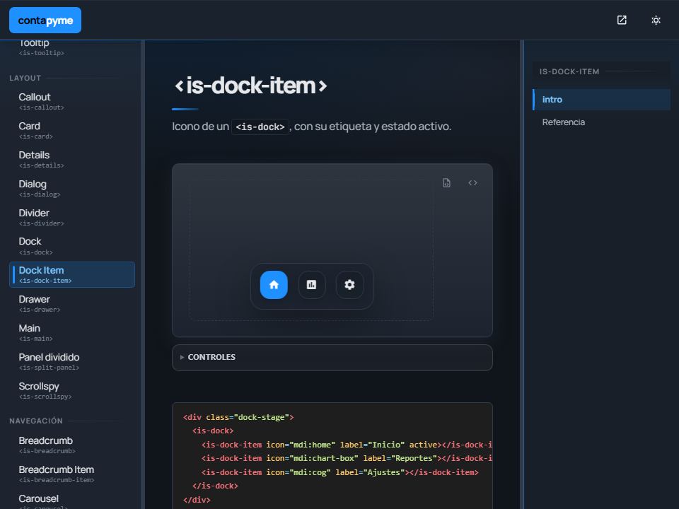

### ✅ is-drawer

- **Descripción**: Documentación y demos del componente is-drawer de InSoft.
- **Lede**: Panel que se desliza desde un borde del viewport (derecha, izquierda, arriba o abajo). Ideal para menús, filtros y contenido secundario.
- **Vista (DOM vivo)**: is-drawer — Panel que se desliza desde un borde del viewport (derecha, izquierda, arriba o abajo).
          Ideal para menús, filtros y contenido secundario.
- **Captura**: 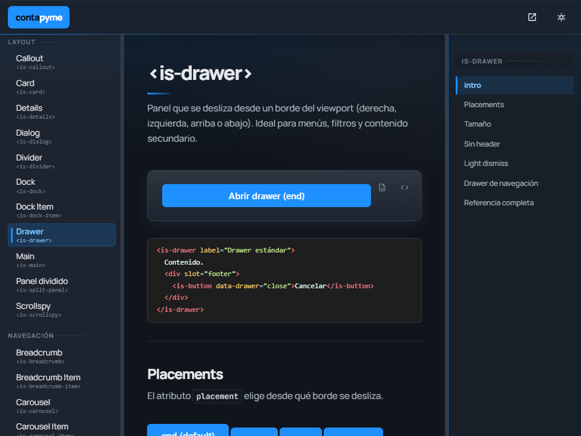

### ✅ is-main

- **Lede**: Contenedor scrollable equivalente a &lt;main&gt; . La persistencia de scroll es opt-in estricta : requiere remember-scroll y storage-key .
- **Vista (DOM vivo)**: is-main — Contenedor scrollable equivalente a <main>.
          La persistencia de scroll es opt-in estricta: requiere
          remember-scroll y storage-key.
- **Captura**: 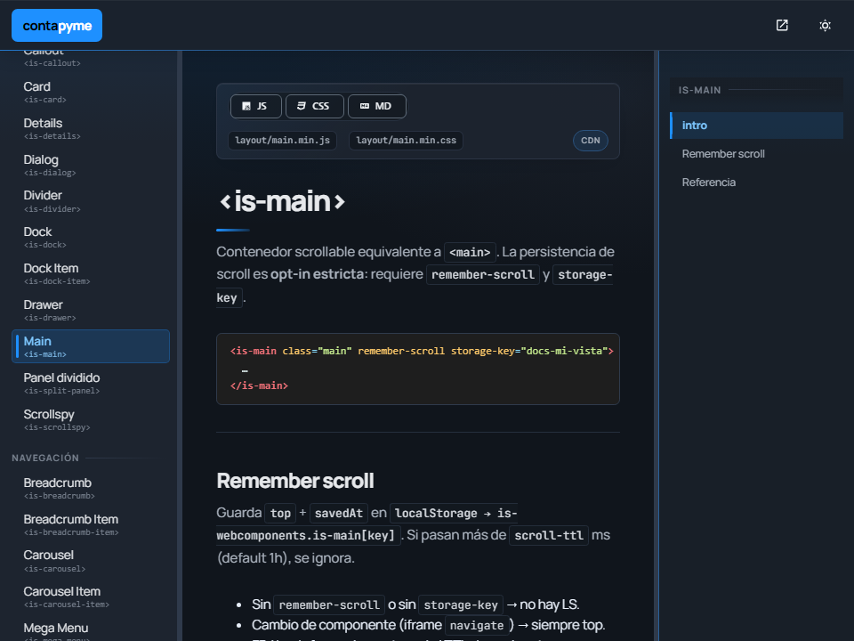

### ✅ is-scrollspy

- **Lede**: Observa la intersección de las secciones de un contenedor scrollable y va marcando el enlace correspondiente. Pensado para la navegación lateral de los previews de docs, pero sirve para cualquier nav largo.
- **Vista (DOM vivo)**: is-scrollspy — Observa la intersección de las secciones de un contenedor scrollable y
          va marcando el enlace correspondiente. Pensado para la navegación
          lateral de los previews de docs, pero sirve para cualquier nav largo.
- **Captura**: 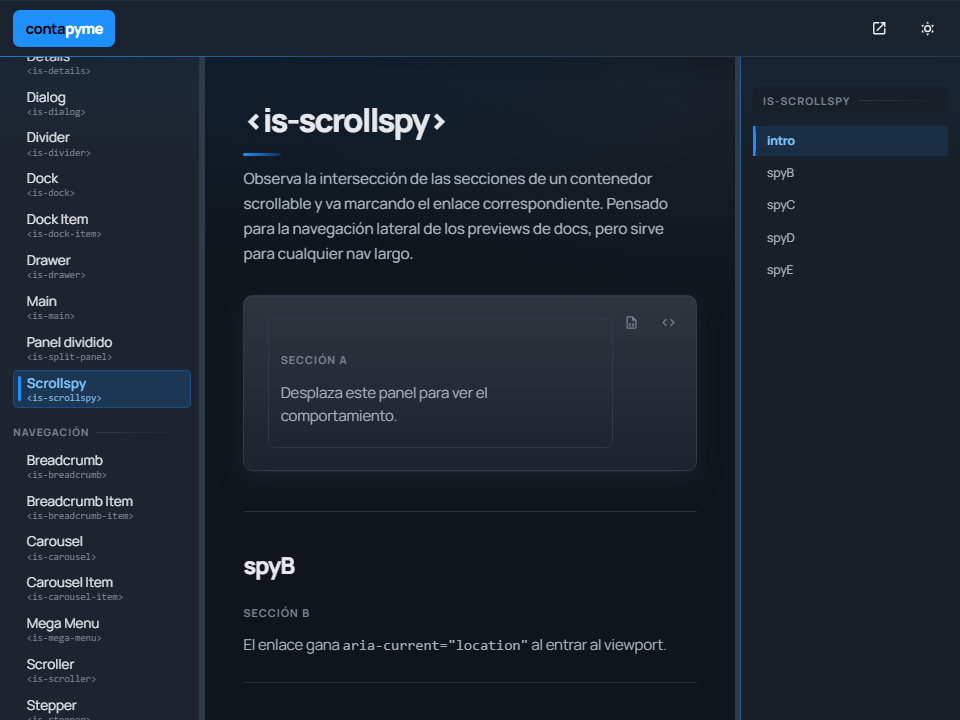

### ✅ is-split-panel

- **Descripción**: Documentación y demos del componente is-split-panel de InSoft.
- **Lede**: Dos paneles adyacentes separados por un divisor arrastrable. Componente InSoft accesible, escrito en JavaScript nativo con Shadow DOM, sin frameworks.
- **Vista (DOM vivo)**: is-split-panel — Dos paneles adyacentes separados por un divisor arrastrable.
          Componente InSoft accesible, escrito en JavaScript nativo con Shadow DOM, sin frameworks.
- **Captura**: 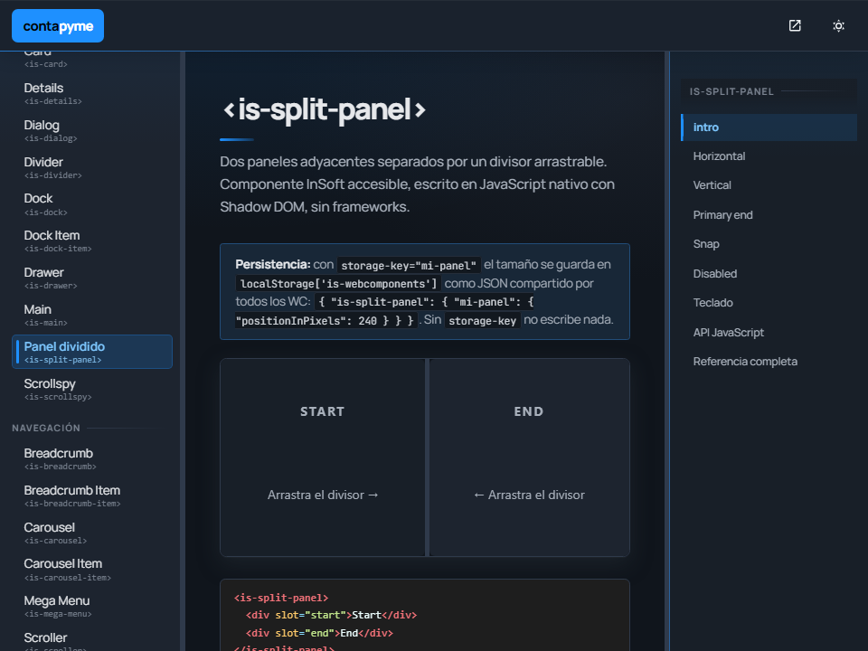

## media

### ✅ icon-explorer

- **Título**: Explorador de iconos
- **Descripción**: Explorador offline de familias e iconos del CDN.
- **Vista (DOM vivo)**: Construye más rápido
          con UI nativa y tokens de marca — IS Web Components
- **Captura**: 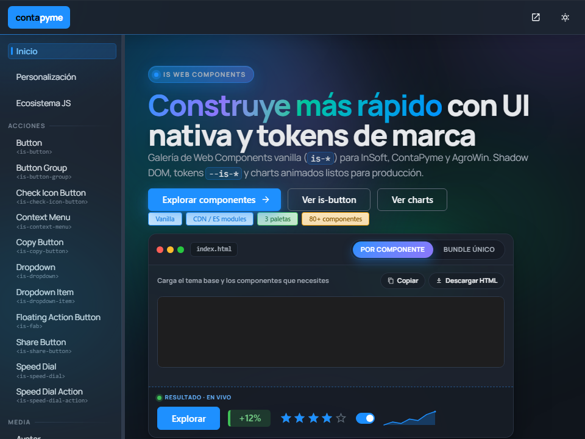

### ✅ is-avatar

- **Lede**: Avatar con imagen, iniciales o icono fallback. Caja = 1em × 1em ; escala con font-size .
- **Vista (DOM vivo)**: is-avatar — Avatar con imagen, iniciales o icono fallback. Caja = 1em × 1em; escala con font-size.
- **Captura**: 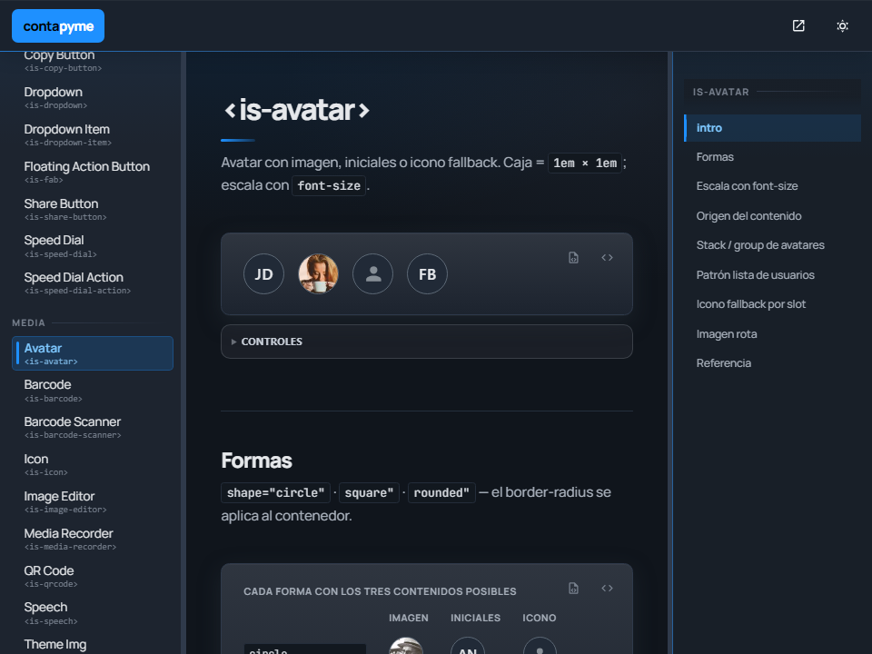

### ✅ is-barcode

- **Lede**: Genera códigos de barras en SVG puro. Soporta EAN-13 (productos) y Code 128 (alfanumérico). QR queda como siguiente paso vía lib externa.
- **Vista (DOM vivo)**: is-barcode — Genera códigos de barras en SVG puro. Soporta EAN-13 (productos) y Code 128 (alfanumérico). QR queda como siguiente paso vía lib externa.
- **Captura**: 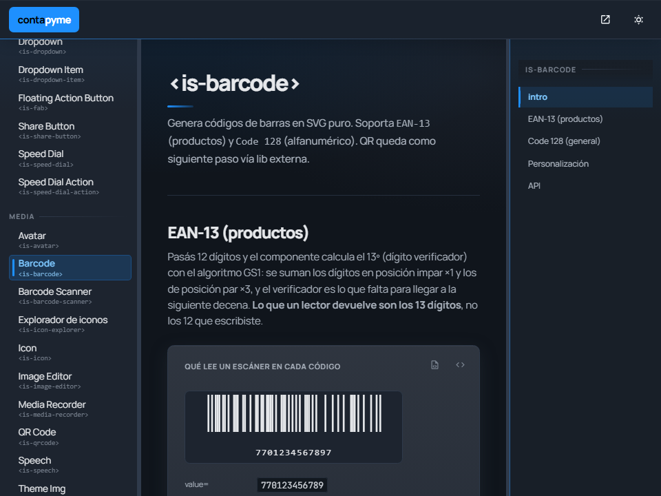

### ✅ is-barcode-scanner

- **Descripción**: Decodifica QR/EAN con `BarcodeDetector` sobre la cámara. No genera códigos: eso es `is-barcode` / `is-qrcode`.
- **Lede**: Decodifica QR/EAN con `BarcodeDetector` sobre la cámara. No genera códigos: eso es `is-barcode` / `is-qrcode`.
- **Vista (DOM vivo)**: is-barcode-scanner — Decodifica QR/EAN con `BarcodeDetector` sobre la cámara. No genera códigos: eso es `is-barcode` / `is-qrcode`.
- **Captura**: 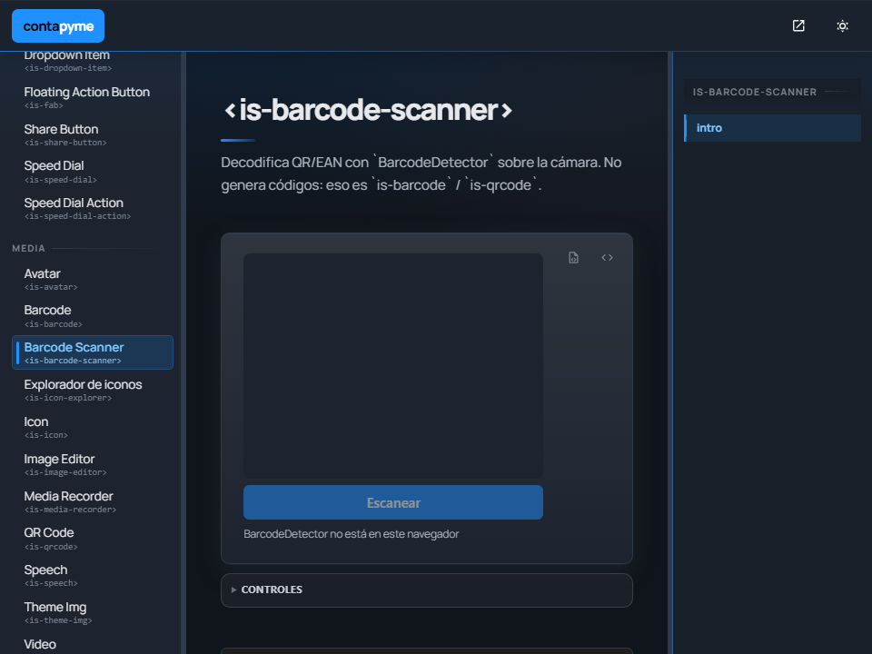

### ✅ is-icon

- **Lede**: API única de iconos del kit. Usa icon="grupo:nombre" (ids Iconify) o src para un SVG/imagen. Escala con font-size . Iconify se carga solo como dependencia interna.
- **Vista (DOM vivo)**: is-icon — API única de iconos del kit. Usa icon="grupo:nombre" (ids Iconify)
          o src para un SVG/imagen. Escala con font-size.
          Iconify se carga solo como dependencia interna.
- **Captura**: 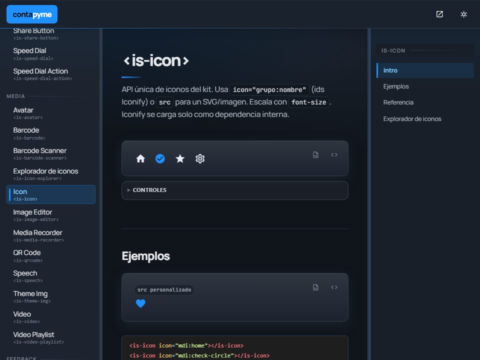

### ✅ is-image-editor

- **Lede**: Canvas de edición con crop, zoom y rotación. Clic y arrastra el rectángulo para moverlo; las esquinas redimensionan.
- **Vista (DOM vivo)**: is-image-editor — Canvas de edición con crop, zoom y rotación. Clic y arrastra el rectángulo para moverlo; las esquinas redimensionan.
- **Captura**: 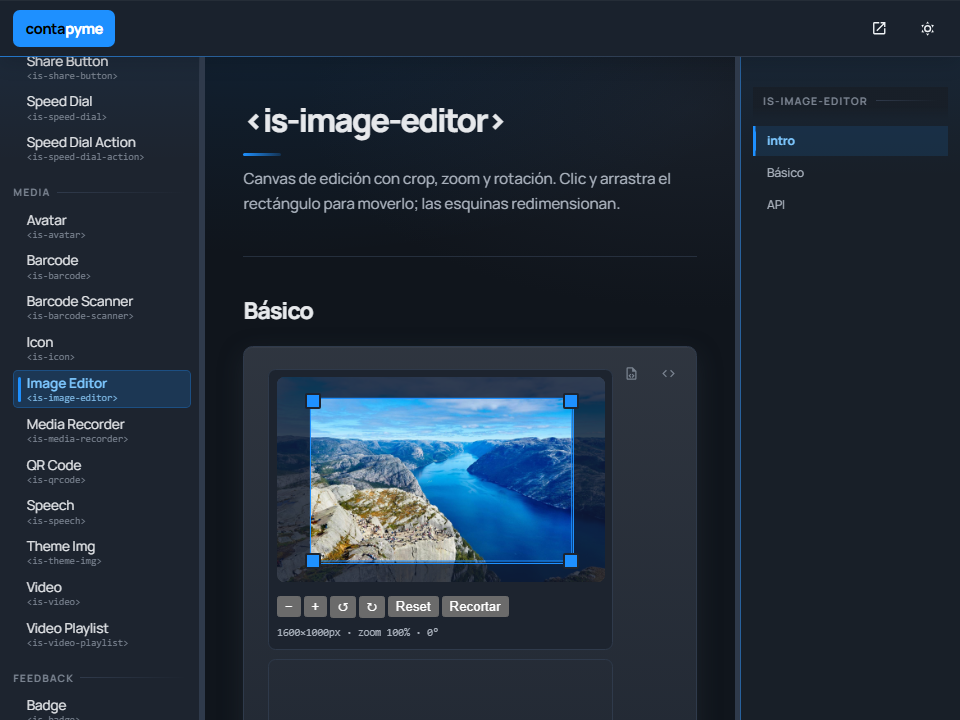

### ✅ is-media-recorder

- **Descripción**: Graba cámara, micrófono o pantalla (`getDisplayMedia`) con `MediaRecorder` y entrega un Blob.
- **Lede**: Graba cámara, micrófono o pantalla (`getDisplayMedia`) con `MediaRecorder` y entrega un Blob.
- **Vista (DOM vivo)**: is-media-recorder — Graba cámara, micrófono o pantalla (`getDisplayMedia`) con `MediaRecorder` y entrega un Blob.
- **Captura**: 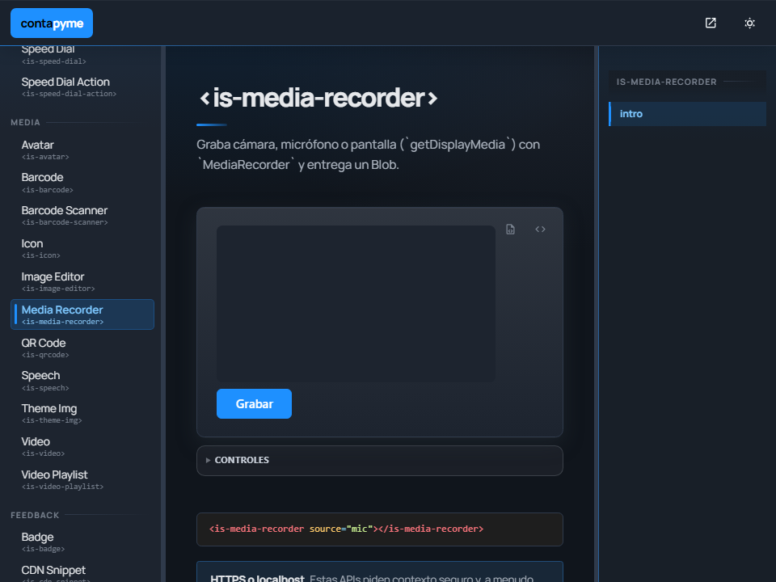

### ✅ is-qrcode

- **Lede**: QR en SVG. Carga bajo demanda la lib qrcode-generator (MIT, esm.sh) — sin esa red no funciona.
- **Vista (DOM vivo)**: is-qrcode — QR en SVG. Carga bajo demanda la lib qrcode-generator (MIT, esm.sh) — sin esa red no funciona.
- **Captura**: 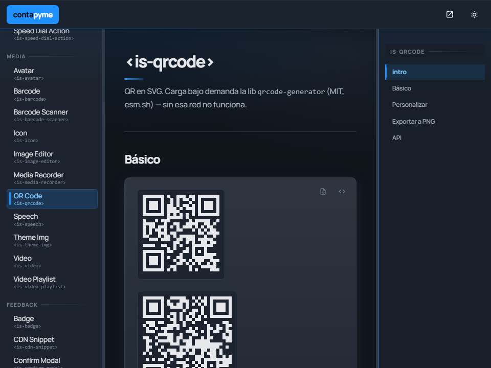

### ✅ is-speech

- **Descripción**: Dictado (`SpeechRecognition`) y lectura (`SpeechSynthesis`) con `lang` del documento.
- **Lede**: Dictado (`SpeechRecognition`) y lectura (`SpeechSynthesis`) con `lang` del documento.
- **Vista (DOM vivo)**: is-speech — Dictado (`SpeechRecognition`) y lectura (`SpeechSynthesis`) con `lang` del documento.
- **Captura**: 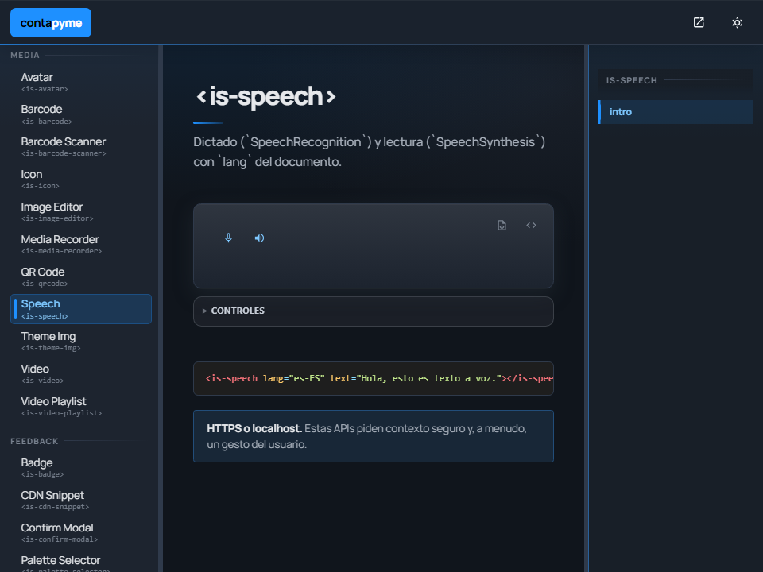

### ✅ is-theme-img

- **Lede**: Una sola imagen dark↔light según el tema del contenedor. Caja 1em × 1em ; escala con font-size .
- **Vista (DOM vivo)**: is-theme-img — Una sola imagen dark↔light según el tema del contenedor. Caja 1em × 1em; escala con font-size.
- **Captura**: 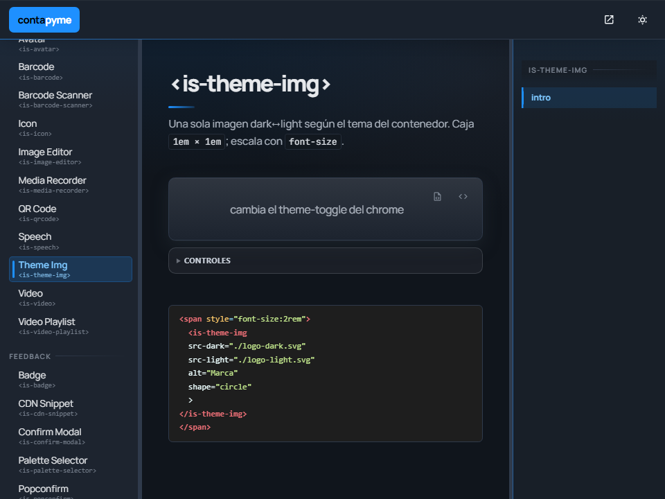

### ✅ is-video

- **Lede**: Reproductor con chrome propio al estilo YouTube: barra de progreso con buffer y scrubber, fila de controles con volumen desplegable, velocidad, picture-in-picture y pantalla completa. Los controles se ocultan solos mientras reproduce.
- **Vista (DOM vivo)**: is-video — Reproductor con chrome propio al estilo YouTube: barra de progreso con buffer y
          scrubber, fila de controles con volumen desplegable, velocidad, picture-in-picture
          y pantalla completa. Los controles se ocultan solos mientras reproduce.
- **Captura**: 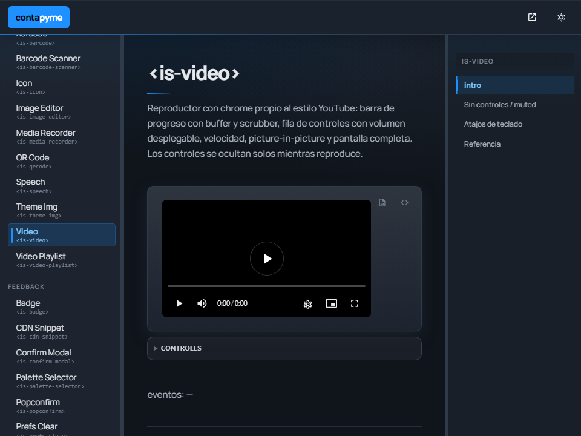

### ✅ is-video-playlist

- **Lede**: Reproductor de playlist con look YouTube: cabecera con título y canal, barra inferior overlay con play / seek / vol, lista colapsable debajo. Las herramientas adicionales (prev / next / autoplay) se proyectan automáticamente en los slots tools-left y tools-right del reproductor.
- **Vista (DOM vivo)**: is-video-playlist — Reproductor de playlist con look YouTube: cabecera con título y canal,
          barra inferior overlay con play / seek / vol, lista colapsable debajo.
          Las herramientas adicionales (prev / next / autoplay) se proyectan
          automáticamente en los slots tools-left
 
- **Captura**: 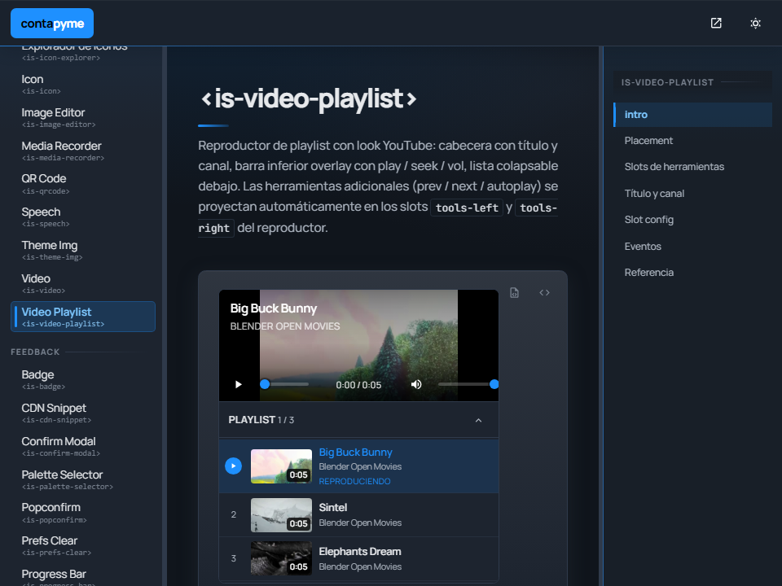

## navigation

### ✅ is-breadcrumb

- **Descripción**: Documentación y demos de is-breadcrumb e is-breadcrumb-item de InSoft.
- **Lede**: Migas de pan accesibles con marcado &lt;nav&gt; , ARIA roles y separador automático entre items.
- **Vista (DOM vivo)**: is-breadcrumb — Migas de pan accesibles con marcado <nav>,
          ARIA roles y separador automático entre items.
- **Captura**: 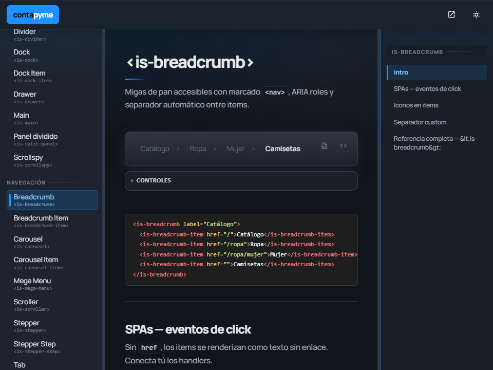

### ✅ is-breadcrumb-item

- **Descripción**: Documentación y demos de is-breadcrumb-item de InSoft.
- **Lede**: Cada eslabón de un &lt;is-breadcrumb&gt; . Puede ser enlace ( href ) o texto plano cuando es la página actual.
- **Vista (DOM vivo)**: is-breadcrumb-item — Cada eslabón de un <is-breadcrumb>. Puede ser enlace (href) o texto plano cuando es la página actual.
- **Captura**: 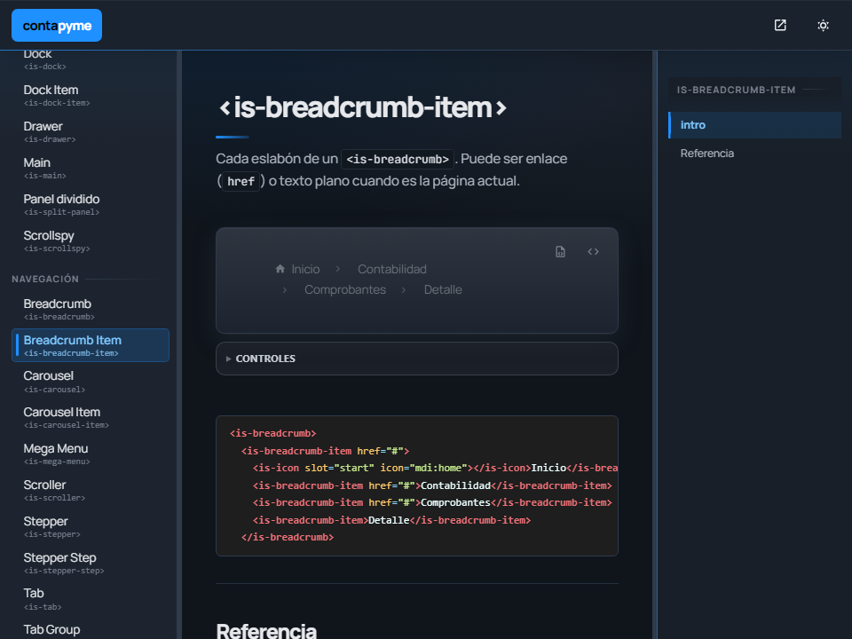

### ✅ is-carousel

- **Descripción**: Documentación y demos de is-carousel / is-carousel-item de InSoft.
- **Lede**: Carrusel tipo slides con paginación, autoplay, loop, navegación prev/next, indicadores, scroll-snap y soporte para swipe en touch.
- **Vista (DOM vivo)**: is-carousel — Carrusel tipo slides con paginación, autoplay, loop, navegación prev/next,
          indicadores, scroll-snap y soporte para swipe en touch.
- **Captura**: 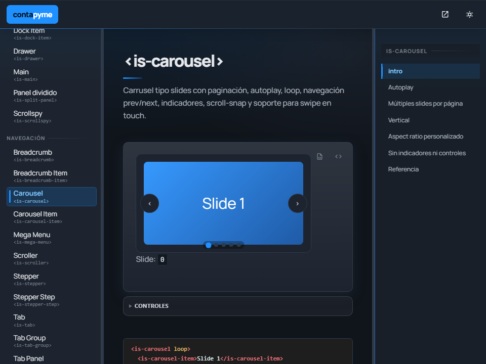

### ✅ is-carousel-item

- **Descripción**: Documentación y demos de is-carousel-item de InSoft.
- **Lede**: Cada diapositiva de un &lt;is-carousel&gt; .
- **Vista (DOM vivo)**: is-carousel-item — Cada diapositiva de un <is-carousel>.
- **Captura**: 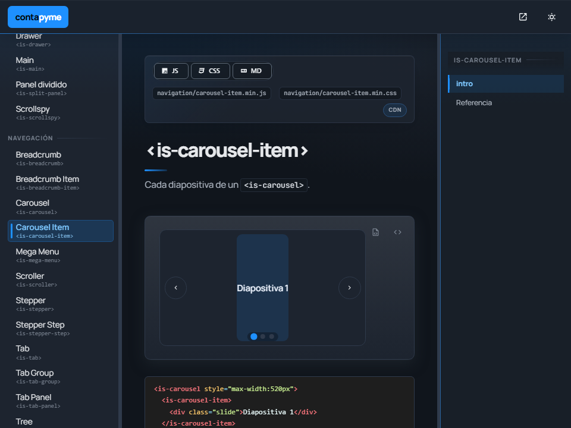

### ✅ is-mega-menu

- **Lede**: Mega-menú con varias columnas y un bloque destacado opcional. Útil para e-commerce, portales masivos o headers corporativos.
- **Vista (DOM vivo)**: is-mega-menu — Mega-menú con varias columnas y un bloque destacado opcional. Útil para e-commerce, portales masivos o headers corporativos.
- **Captura**: 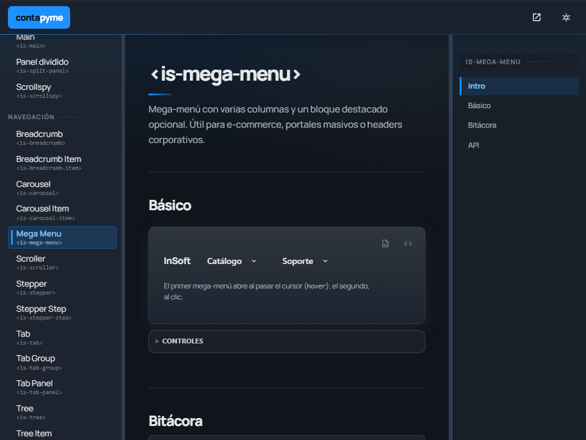

### ✅ is-scroller

- **Descripción**: Documentación y demos de is-scroller de InSoft.
- **Lede**: Wrapper que añade scroll horizontal (o vertical) con botones prev/next automáticos cuando el contenido del slot desborda. Ideal para listas de pills, carruseles de chips, drawers inline, etc.
- **Vista (DOM vivo)**: is-scroller — Wrapper que añade scroll horizontal (o vertical) con botones prev/next
          automáticos cuando el contenido del slot desborda. Ideal para
          listas de pills, carruseles de chips, drawers inline, etc.
- **Captura**: 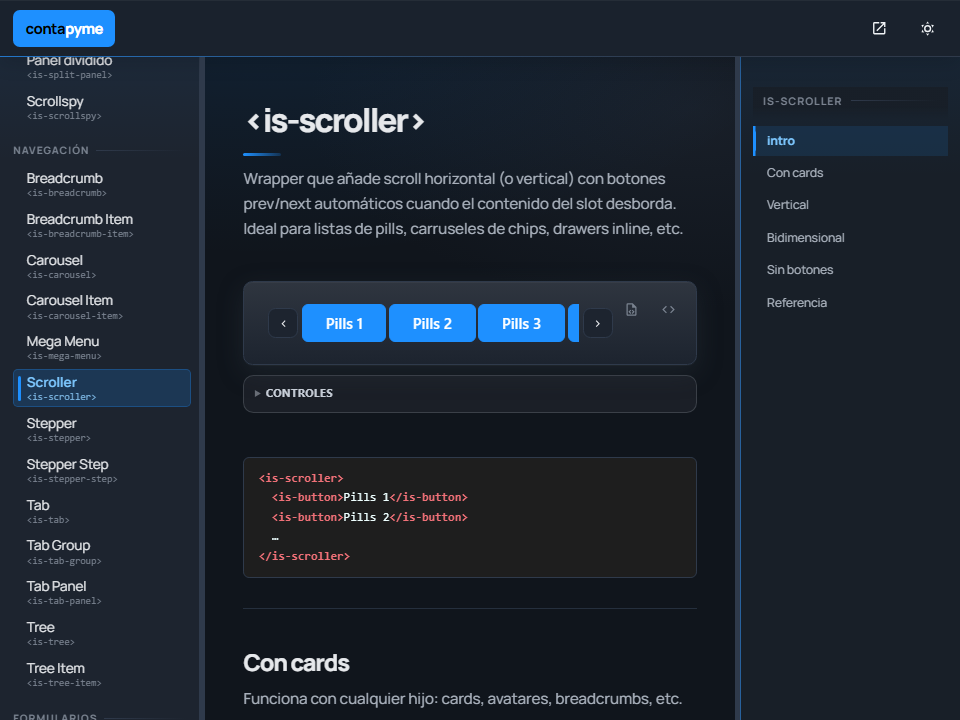

### ✅ is-stepper

- **Descripción**: Documentación y demos de is-stepper / is-stepper-step de InSoft.
- **Lede**: Indicador de flujo por pasos. Ideal para wizards y formularios multipaso. Soporta orientación horizontal y vertical, variantes visualmente distintas, iconos por slot, descripción y manejo de errores.
- **Vista (DOM vivo)**: is-stepper — Indicador de flujo por pasos. Ideal para wizards y formularios multipaso.
          Soporta orientación horizontal y vertical, variantes visualmente
          distintas, iconos por slot, descripción y manejo de errores.
- **Captura**: 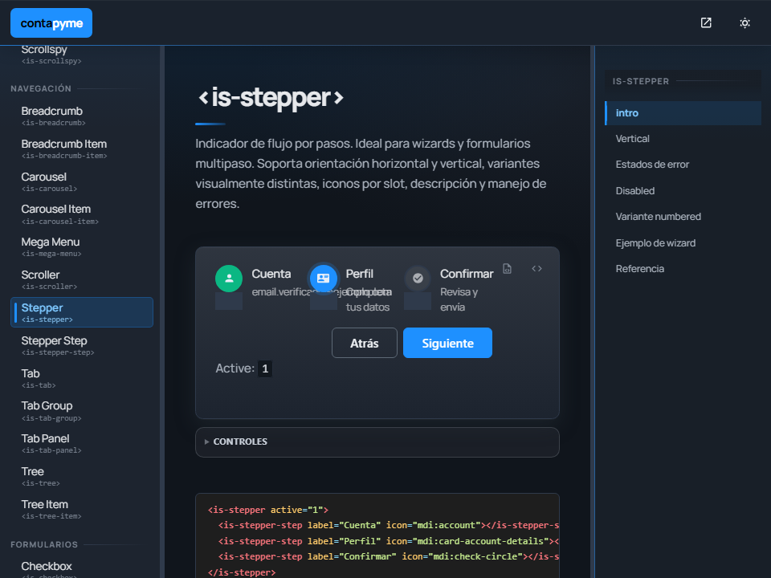

### ✅ is-stepper-step

- **Descripción**: Documentación y demos de is-stepper-step de InSoft.
- **Lede**: Paso de un &lt;is-stepper&gt; , con su título, descripción y estado.
- **Vista (DOM vivo)**: is-stepper-step — Paso de un <is-stepper>, con su título, descripción y estado.
- **Captura**: 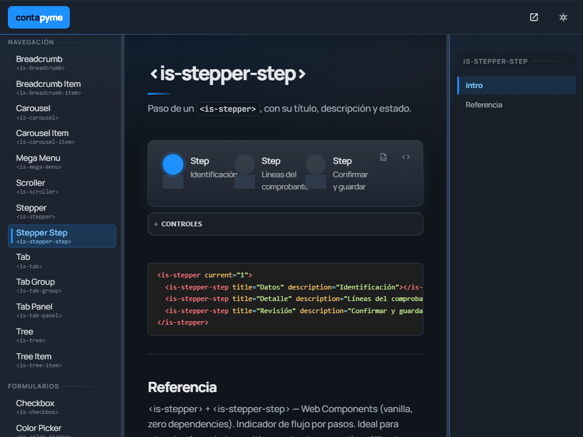

### ✅ is-tab

- **Descripción**: Documentación y demos de is-tab de InSoft.
- **Lede**: Pestaña de un &lt;is-tab-group&gt; . El atributo panel la enlaza con su &lt;is-tab-panel&gt; .
- **Vista (DOM vivo)**: is-tab — Pestaña de un <is-tab-group>. El atributo panel la enlaza con su <is-tab-panel>.
- **Captura**: 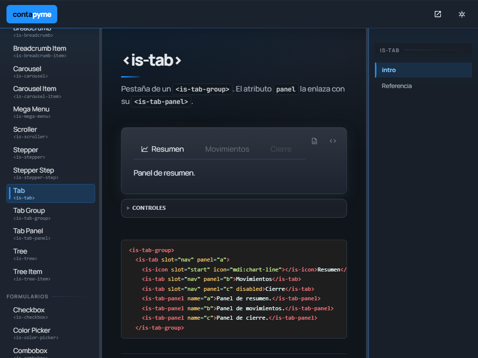

### ✅ is-tab-group

- **Descripción**: Documentación y demos de is-tab-group / is-tab / is-tab-panel de InSoft.
- **Lede**: Tabs accesibles con navegación por teclado (←/→), activación automática o manual, indicator animado, placements (top/bottom/start/end), scroll horizontal automático y soporte para tabs cerrables.
- **Vista (DOM vivo)**: is-tab-group — Tabs accesibles con navegación por teclado (←/→), activación automática o
          manual, indicator animado, placements (top/bottom/start/end), scroll horizontal
          automático y soporte para tabs cerrables.
- **Captura**: 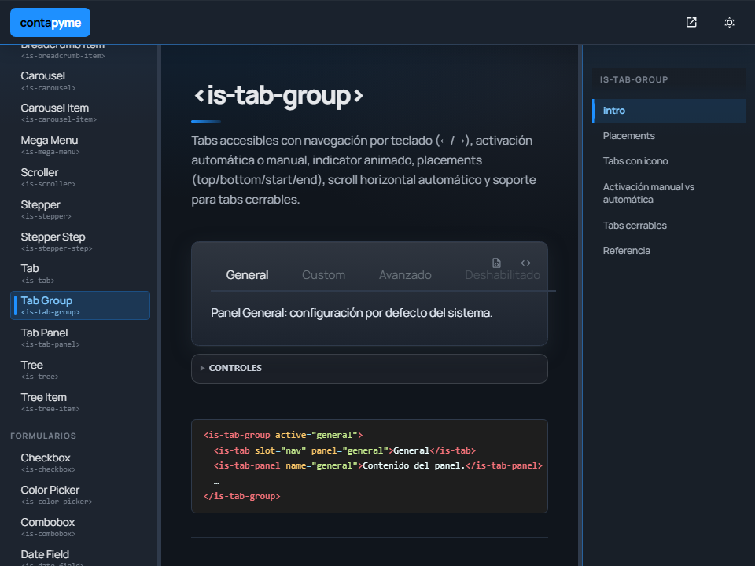

### ✅ is-tab-panel

- **Descripción**: Documentación y demos de is-tab-panel de InSoft.
- **Lede**: Contenido asociado a una &lt;is-tab&gt; . Solo se muestra el panel cuyo name coincide con el panel de la pestaña activa.
- **Vista (DOM vivo)**: is-tab-panel — Contenido asociado a una <is-tab>. Solo se muestra el panel cuyo name coincide con el panel de la pestaña activa.
- **Captura**: 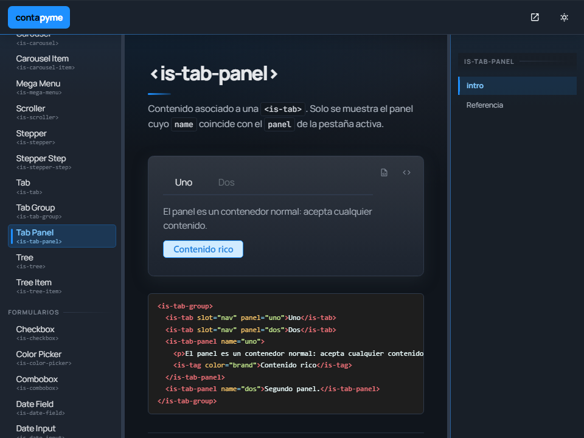

### ✅ is-tree

- **Descripción**: Documentación y demos de is-tree / is-tree-item de InSoft.
- **Lede**: Árbol jerárquico accesible: expansión, selección, navegación por teclado (↑/↓/←/→/Home/End/Enter/Space), iconos por slot y selección single | leaf | multiple | none .
- **Vista (DOM vivo)**: is-tree — Árbol jerárquico accesible: expansión, selección, navegación por teclado
          (↑/↓/←/→/Home/End/Enter/Space), iconos por slot y selección
          single | leaf | multiple | none.
- **Captura**: 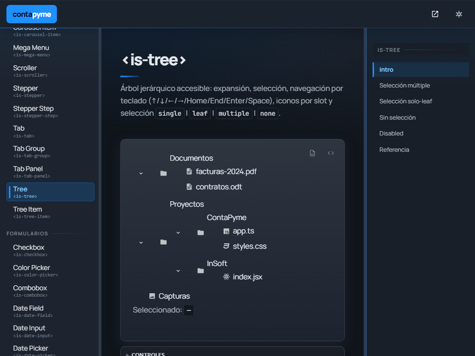

### ✅ is-tree-item

- **Descripción**: Documentación y demos de is-tree-item de InSoft.
- **Lede**: Nodo de un &lt;is-tree&gt; . Anidando items se construye la jerarquía; expanded controla el pliegue.
- **Vista (DOM vivo)**: is-tree-item — Nodo de un <is-tree>. Anidando items se construye la jerarquía; expanded controla el pliegue.
- **Captura**: 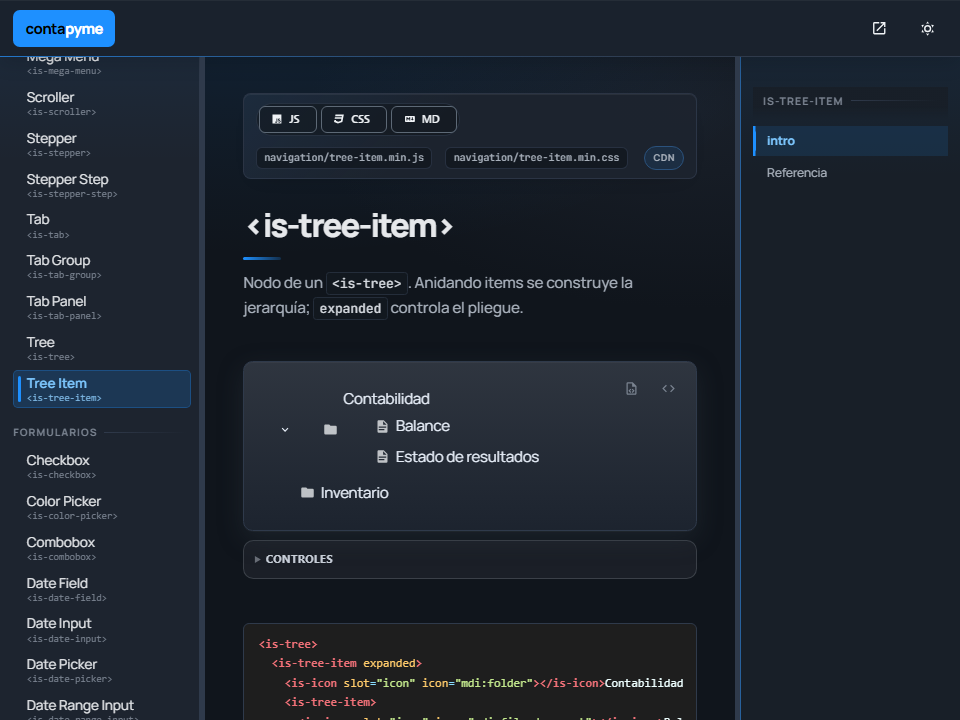

## overlays

### ✅ is-command-palette

- **Lede**: Paleta modal al estilo ⌘K / Ctrl + K . Búsqueda difusa sobre una lista de comandos configurada vía JSON.
- **Vista (DOM vivo)**: is-command-palette — Paleta modal al estilo ⌘K / Ctrl+K. Búsqueda difusa sobre una lista de comandos configurada vía JSON.
- **Captura**: 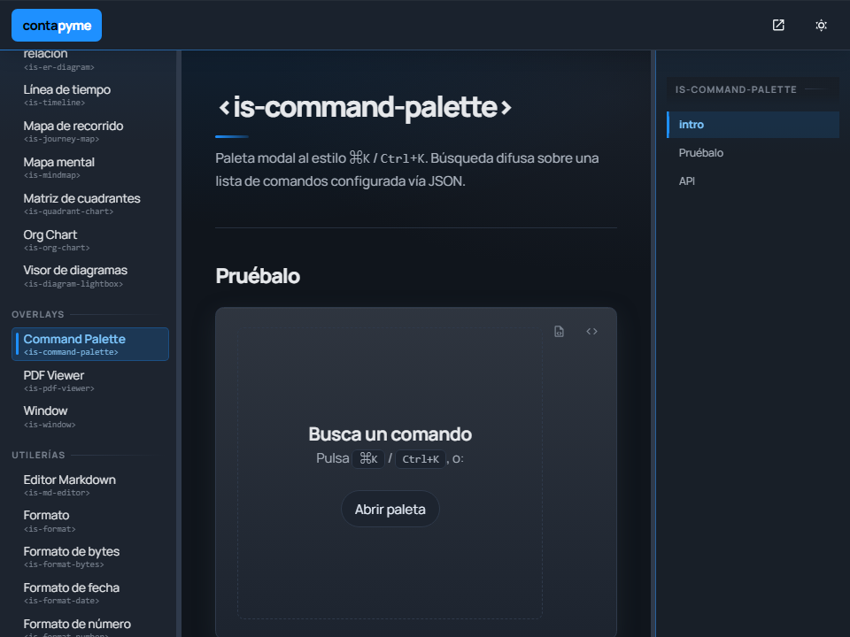

### ✅ is-pdf-viewer

- **Lede**: Visor de PDF. Por defecto delega en el visor nativo del navegador ( &lt;iframe type="application/pdf"&gt; ) — sin dependencias, sin peso adicional.
- **Vista (DOM vivo)**: is-pdf-viewer — Visor de PDF. Por defecto delega en el visor nativo del navegador (<iframe type="application/pdf">) — sin dependencias, sin peso adicional.
- **Captura**: 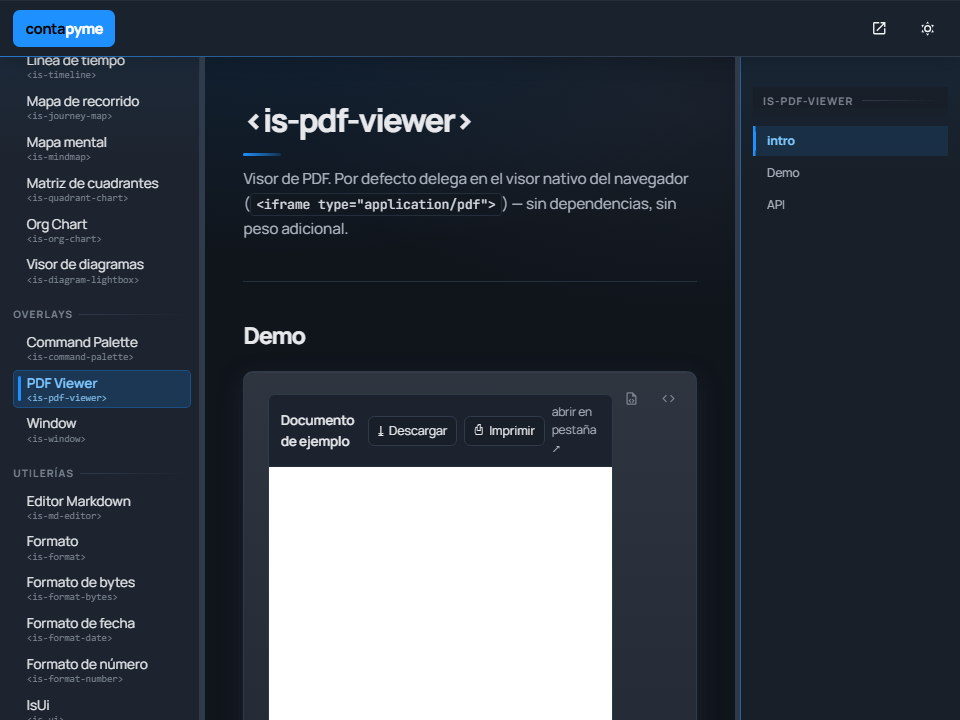

### ✅ is-window

- **Lede**: Ventana flotante con botones minimizar/maximizar/cerrar y drag del header. La esquina inferior derecha redimensiona cuando tiene el atributo resizable .
- **Vista (DOM vivo)**: is-window — Ventana flotante con botones minimizar/maximizar/cerrar y drag del header. La esquina inferior derecha redimensiona cuando tiene el atributo resizable.
- **Captura**: 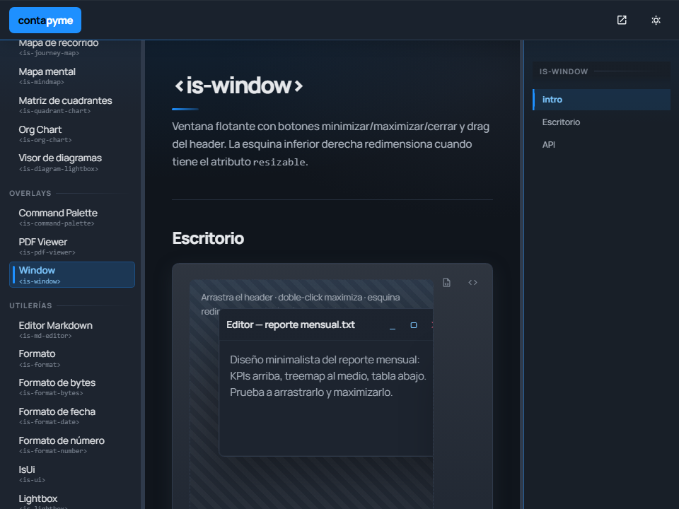

## pages

### ✅ ecosystem

- **Título**: Ecosistema JS
- **Lede**: Un solo entry liviano ( loader.min.js ) carga CSS de documento y solo los módulos que pedís. Evitá all.min.js (~1.8&nbsp;MB resuelto) salvo demos locales.
- **Vista (DOM vivo)**: ecosystem — Un solo entry liviano (loader.min.js) carga CSS de documento y solo los módulos que pedís. Evitá all.min.js (~1.8 MB resuelto) salvo demos locales.
- **Captura**: 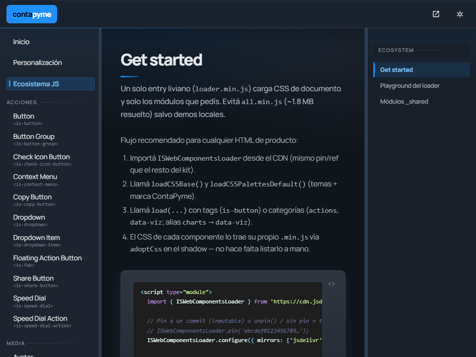

### ✅ home

- **Título**: IS Web Components
- **Vista (DOM vivo)**: Construye más rápido
          con UI nativa y tokens de marca — IS Web Components
- **Captura**: 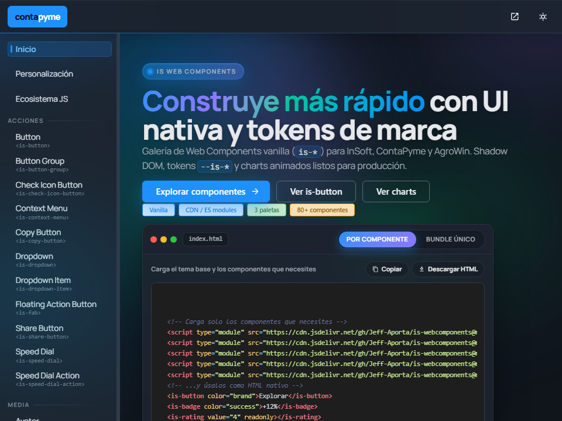

### ✅ phase7

- **Título**: Fase 7 — Composiciones
- **Descripción**: Composiciones reales integrando múltiples componentes IS: dialogs con forms, cards con acciones, drawers con tabs, selects múltiples y listas con avatares.
- **Lede**: Aquí se demuestra la integración real de los componentes: dialogs con forms, cards con header-actions, drawers con tabs, selects múltiples y listas con avatares. Cada demo es una composición viva, no un mockup.
- **Vista (DOM vivo)**: Construye más rápido
          con UI nativa y tokens de marca — IS Web Components
- **Captura**: 

### ✅ theming

- **Título**: Personalización
- **Lede**: Taller de temas: elige unos pocos colores semilla, míralos aplicados en vivo sobre componentes reales —en oscuro y claro a la vez — y llévate el CSS listo para pegar en tu proyecto junto a is-base.css .
- **Vista (DOM vivo)**: theming — Taller de temas: elige unos pocos colores semilla, míralos aplicados
          en vivo sobre componentes reales —en oscuro y claro a la
          vez— y llévate el CSS listo para pegar en tu proyecto junto a
          is-base.css.
- **Captura**: 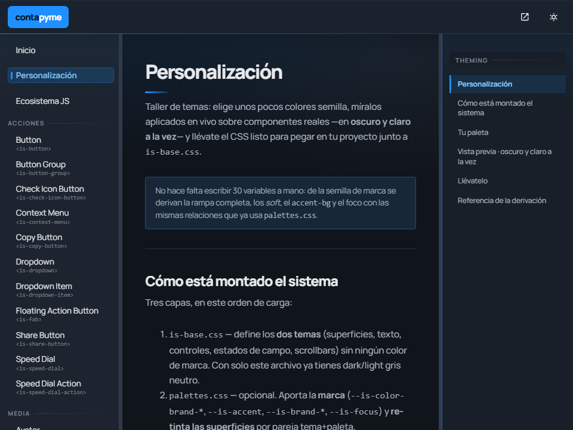
